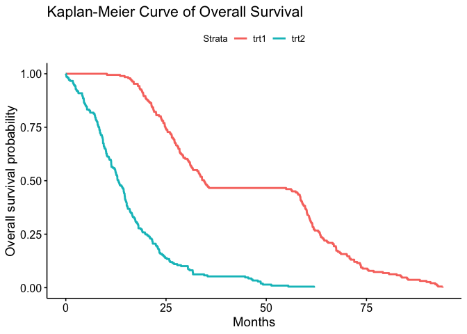

# snSMART

<!-- badges: start -->

[](https://www.gnu.org/licenses/old-licenses/gpl-2.0.en.html)
[](https://www.repostatus.org/)
[](https://github.com/sidiwang/osbma/actions/workflows/R-CMD-check.yaml)
<!-- badges: end -->

The aim of the **osbma** R package is to predict overall survival in
solid tumor oncology studies using joint models combined through
Bayesian model averaging.

In solid tumor oncology studies, overall survival (OS) is the definitive
endpoint for accessing patient benefit. Reliable OS predictions are very
valuable for both drug development and patients’ end-of-life medical
care. Existing methods often ignore the underlying process of tumor
burden measurements and incur “information loss”. Motivated by an
advanced renal cell carcinoma (RCC) clinical trial, in this paper, we
propose a multivariate joint modeling approach to assess the underlying
dynamics of the progression-free survival (PFS) components to forecast
the death times of trial participants. Through Bayesian model averaging,
our proposed method improves the accuracy of the OS forecast by
combining joint models developed based on each granular component of
PFS. A case study of the RCC trial is conducted, and our method provides
the most accurate predictions across all tested scenarios. The
reliability of our proposed method is also verified through extensive
simulation studies, which include the scenario where OS is completely
independent of PFS. Overall, the proposed methodology provides a
promising candidate for reliable OS prediction in solid tumor oncology
studies.

## Installation

Install the development version from GitHub:

``` r
# Install devtools first if you haven't done so
library(devtools)
# install osbma
devtools::install_github("sidiwang/osbma")
library(osbma)
```

## **osbma** functions covered in this package

- The main function that generates posterior samples based on user input
  trial dataset - `osbma`
- Overall survival prediction based on posterior samples generated
  through MCMC - `predict.osbma`
- Plots generated based on predicted overall survival -
  `plot.predict.data`

## Example

`osbma`: We call the `osbma` function using data from an oncology trial
with 400 total individuals.

``` r
data <- osbma::data
result <- osbma::osbma(data = data, covariate = "trt", method = "rjags", MCMC.sample = 100)
```

    ## Loading required namespace: rjags

    ## Compiling rjags model...
    ## Calling the simulation using the rjags method...
    ## Adapting the model for 8000 iterations...
    ## Burning in the model for 1000 iterations...
    ## Running the model for 1000 iterations...
    ## Simulation complete
    ## Note: Summary statistics were not produced as there are >50 monitored
    ## variables
    ## [To override this behaviour see ?add.summary and ?runjags.options]
    ## FALSEFinished running the simulation
    ## Calculating summary statistics...
    ## Calculating the Gelman-Rubin statistic for 1629 variables....
    ## Note: Unable to calculate the multivariate psrf
    ## Compiling rjags model...
    ## Calling the simulation using the rjags method...
    ## Adapting the model for 8000 iterations...
    ## Burning in the model for 1000 iterations...
    ## Running the model for 1000 iterations...
    ## Simulation complete
    ## Note: Summary statistics were not produced as there are >50 monitored
    ## variables
    ## [To override this behaviour see ?add.summary and ?runjags.options]
    ## FALSEFinished running the simulation

``` r
summary(result)
```

    ## 
    ## Iterations = 9001:9991
    ## Thinning interval = 10 
    ## Number of chains = 2 
    ## Sample size per chain = 100 
    ## 
    ## 1. Empirical mean and standard deviation for each variable,
    ##    plus standard error of the mean:
    ## 
    ##                         Mean        SD  Naive SE Time-series SE
    ## beta_0[1]          4.451e+01 7.608e-01 5.380e-02      1.962e-01
    ## beta_0[2]         -3.054e-01 8.167e-02 5.775e-03      2.295e-02
    ## beta_1[1]          4.672e+00 1.438e-01 1.017e-02      5.321e-02
    ## beta_1[2]         -1.181e+00 8.430e-02 5.961e-03      2.649e-02
    ## lambda             5.787e-03 6.850e-04 4.844e-05      9.822e-05
    ## alpha_os.1         2.624e+00 1.993e-01 1.409e-02      3.666e-02
    ## eta_2              2.108e-01 7.518e-05 5.316e-06      0.000e+00
    ## alpha_2            1.628e-01 4.769e-02 3.372e-03      0.000e+00
    ## beta_2[1]         -4.818e-02 4.690e-02 3.317e-03      0.000e+00
    ## beta_2[2]         -9.417e-02 6.601e-02 4.668e-03      0.000e+00
    ## alpha_os.2         1.054e-01 1.513e-05 1.070e-06      0.000e+00
    ## beta_os.2[1]      -3.373e-04 2.475e-04 1.750e-05      0.000e+00
    ## beta_os.2[2]      -1.171e-02 1.169e-02 8.269e-04      0.000e+00
    ## eta_3              2.256e-01 1.038e-02 7.339e-04      0.000e+00
    ## alpha_3            1.504e-01 3.408e-02 2.410e-03      0.000e+00
    ## beta_3[1]         -3.378e-03 1.898e-03 1.342e-04      0.000e+00
    ## beta_3[2]         -2.339e-02 1.827e-02 1.292e-03      0.000e+00
    ## alpha_os.3         1.093e-01 2.392e-03 1.691e-04      0.000e+00
    ## beta_os.3[1]      -1.373e-02 2.672e-03 1.889e-04      0.000e+00
    ## beta_os.3[2]      -3.020e-03 1.316e-03 9.303e-05      0.000e+00
    ## alpha_os.4         1.607e+00 7.375e-02 5.215e-03      6.369e-03
    ## beta_os.4[1]       5.226e+00 1.258e-01 8.893e-03      2.635e-02
    ## beta_os.4[2]      -1.144e+00 7.404e-02 5.235e-03      1.264e-02
    ## Y.os.t_rep[1]      1.667e+01 9.137e+00 6.461e-01      8.414e-01
    ## Y.os.t_rep[2]      2.140e+01 1.116e+01 7.888e-01      8.266e-01
    ## Y.os.t_rep[3]      6.532e+01 2.923e+01 2.067e+00      2.069e+00
    ## Y.os.t_rep[4]      2.458e+01 1.277e+01 9.030e-01      9.022e-01
    ## Y.os.t_rep[5]      1.480e+01 8.052e+00 5.694e-01      5.273e-01
    ## Y.os.t_rep[6]      3.272e+01 1.753e+01 1.239e+00      1.255e+00
    ## Y.os.t_rep[7]      6.173e+01 2.411e+01 1.705e+00      1.995e+00
    ## Y.os.t_rep[8]      1.182e+01 7.568e+00 5.351e-01      6.950e-01
    ## Y.os.t_rep[9]      6.471e+01 2.483e+01 1.756e+00      1.759e+00
    ## Y.os.t_rep[10]     7.357e+01 3.234e+01 2.287e+00      2.336e+00
    ## Y.os.t_rep[11]     1.102e+01 5.574e+00 3.941e-01      3.674e-01
    ## Y.os.t_rep[12]     1.071e+02 4.941e+01 3.494e+00      3.924e+00
    ## Y.os.t_rep[13]     1.132e+01 6.561e+00 4.639e-01      3.979e-01
    ## Y.os.t_rep[14]     1.010e+01 5.383e+00 3.807e-01      3.807e-01
    ## Y.os.t_rep[15]     1.518e+01 8.487e+00 6.001e-01      5.535e-01
    ## Y.os.t_rep[16]     7.242e+01 3.457e+01 2.444e+00      2.446e+00
    ## Y.os.t_rep[17]     1.558e+01 7.208e+00 5.097e-01      5.102e-01
    ## Y.os.t_rep[18]     3.452e+01 1.966e+01 1.390e+00      1.107e+00
    ## Y.os.t_rep[19]     1.445e+01 8.414e+00 5.949e-01      5.958e-01
    ## Y.os.t_rep[20]     1.527e+01 8.043e+00 5.687e-01      5.696e-01
    ## Y.os.t_rep[21]     3.817e+01 2.199e+01 1.555e+00      1.505e+00
    ## Y.os.t_rep[22]     2.187e+01 1.081e+01 7.643e-01      7.658e-01
    ## Y.os.t_rep[23]     6.652e+01 3.059e+01 2.163e+00      2.168e+00
    ## Y.os.t_rep[24]     7.735e+01 3.632e+01 2.569e+00      2.480e+00
    ## Y.os.t_rep[25]     6.829e+01 2.908e+01 2.057e+00      2.209e+00
    ## Y.os.t_rep[26]     7.042e+01 3.156e+01 2.232e+00      2.969e+00
    ## Y.os.t_rep[27]     7.658e+01 3.333e+01 2.357e+00      2.357e+00
    ## Y.os.t_rep[28]     2.275e+01 1.230e+01 8.701e-01      8.622e-01
    ## Y.os.t_rep[29]     7.647e+01 3.610e+01 2.553e+00      2.897e+00
    ## Y.os.t_rep[30]     6.655e+01 3.173e+01 2.244e+00      2.241e+00
    ## Y.os.t_rep[31]     2.669e+01 1.421e+01 1.005e+00      1.001e+00
    ## Y.os.t_rep[32]     1.303e+01 6.821e+00 4.823e-01      4.826e-01
    ## Y.os.t_rep[33]     7.721e+01 3.522e+01 2.490e+00      2.217e+00
    ## Y.os.t_rep[34]     6.653e+01 2.697e+01 1.907e+00      2.278e+00
    ## Y.os.t_rep[35]     1.322e+01 5.989e+00 4.235e-01      4.245e-01
    ## Y.os.t_rep[36]     5.040e+01 1.396e+01 9.871e-01      9.248e-01
    ## Y.os.t_rep[37]     1.965e+01 1.159e+01 8.194e-01      7.887e-01
    ## Y.os.t_rep[38]     1.209e+01 6.598e+00 4.665e-01      4.674e-01
    ## Y.os.t_rep[39]     1.667e+01 8.528e+00 6.030e-01      6.044e-01
    ## Y.os.t_rep[40]     1.300e+01 6.278e+00 4.439e-01      3.518e-01
    ## Y.os.t_rep[41]     7.201e+01 3.302e+01 2.335e+00      2.293e+00
    ## Y.os.t_rep[42]     3.539e+01 1.816e+01 1.284e+00      1.212e+00
    ## Y.os.t_rep[43]     3.892e+01 2.330e+01 1.648e+00      1.544e+00
    ## Y.os.t_rep[44]     1.514e+01 8.141e+00 5.756e-01      5.363e-01
    ## Y.os.t_rep[45]     4.691e+01 2.804e+01 1.983e+00      2.229e+00
    ## Y.os.t_rep[46]     3.668e+01 1.940e+01 1.371e+00      1.508e+00
    ## Y.os.t_rep[47]     1.457e+01 6.947e+00 4.912e-01      4.921e-01
    ## Y.os.t_rep[48]     7.981e+01 3.725e+01 2.634e+00      2.353e+00
    ## Y.os.t_rep[49]     7.032e+01 3.186e+01 2.253e+00      2.283e+00
    ## Y.os.t_rep[50]     7.651e+01 3.469e+01 2.453e+00      2.456e+00
    ## Y.os.t_rep[51]     6.257e+01 2.275e+01 1.608e+00      1.612e+00
    ## Y.os.t_rep[52]     3.521e+01 1.941e+01 1.372e+00      1.366e+00
    ## Y.os.t_rep[53]     3.833e+01 2.359e+01 1.668e+00      1.262e+00
    ## Y.os.t_rep[54]     6.253e+01 2.422e+01 1.713e+00      1.714e+00
    ## Y.os.t_rep[55]     8.795e+01 4.227e+01 2.989e+00      2.715e+00
    ## Y.os.t_rep[56]     3.377e+01 1.763e+01 1.246e+00      1.386e+00
    ## Y.os.t_rep[57]     1.209e+01 8.755e+00 6.191e-01      6.201e-01
    ## Y.os.t_rep[58]     1.619e+01 7.449e+00 5.267e-01      6.056e-01
    ## Y.os.t_rep[59]     3.240e+01 1.751e+01 1.238e+00      1.113e+00
    ## Y.os.t_rep[60]     3.136e+01 1.829e+01 1.293e+00      1.276e+00
    ## Y.os.t_rep[61]     1.297e+01 7.633e+00 5.397e-01      5.787e-01
    ## Y.os.t_rep[62]     1.059e+02 4.451e+01 3.148e+00      2.972e+00
    ## Y.os.t_rep[63]     1.689e+01 8.811e+00 6.231e-01      6.891e-01
    ## Y.os.t_rep[64]     3.114e+01 1.613e+01 1.140e+00      1.143e+00
    ## Y.os.t_rep[65]     7.331e+01 3.415e+01 2.415e+00      2.414e+00
    ## Y.os.t_rep[66]     1.699e+01 9.771e+00 6.909e-01      8.041e-01
    ## Y.os.t_rep[67]     8.592e+00 4.810e+00 3.401e-01      3.402e-01
    ## Y.os.t_rep[68]     7.187e+01 3.297e+01 2.331e+00      2.154e+00
    ## Y.os.t_rep[69]     1.237e+01 6.326e+00 4.473e-01      4.482e-01
    ## Y.os.t_rep[70]     8.134e+01 3.921e+01 2.773e+00      2.779e+00
    ## Y.os.t_rep[71]     1.677e+01 9.165e+00 6.481e-01      7.056e-01
    ## Y.os.t_rep[72]     2.044e+01 1.050e+01 7.425e-01      7.441e-01
    ## Y.os.t_rep[73]     6.386e+01 2.740e+01 1.937e+00      1.667e+00
    ## Y.os.t_rep[74]     1.568e+01 8.214e+00 5.809e-01      5.616e-01
    ## Y.os.t_rep[75]     1.482e+01 7.540e+00 5.331e-01      4.845e-01
    ## Y.os.t_rep[76]     6.435e+01 2.626e+01 1.857e+00      1.847e+00
    ## Y.os.t_rep[77]     3.405e+01 2.004e+01 1.417e+00      1.500e+00
    ## Y.os.t_rep[78]     1.149e+01 6.086e+00 4.304e-01      5.139e-01
    ## Y.os.t_rep[79]     1.087e+01 6.686e+00 4.728e-01      4.497e-01
    ## Y.os.t_rep[80]     3.703e+01 2.160e+01 1.527e+00      1.376e+00
    ## Y.os.t_rep[81]     1.222e+01 5.990e+00 4.235e-01      4.234e-01
    ## Y.os.t_rep[82]     1.147e+01 6.406e+00 4.530e-01      4.513e-01
    ## Y.os.t_rep[83]     2.874e+01 1.558e+01 1.102e+00      1.435e+00
    ## Y.os.t_rep[84]     3.040e+01 1.702e+01 1.204e+00      1.628e+00
    ## Y.os.t_rep[85]     5.345e+01 1.975e+01 1.396e+00      1.393e+00
    ## Y.os.t_rep[86]     6.087e+01 2.284e+01 1.615e+00      1.605e+00
    ## Y.os.t_rep[87]     1.744e+01 9.624e+00 6.805e-01      6.446e-01
    ## Y.os.t_rep[88]     8.978e+01 4.300e+01 3.041e+00      4.163e+00
    ## Y.os.t_rep[89]     2.188e+01 1.286e+01 9.093e-01      1.102e+00
    ## Y.os.t_rep[90]     3.682e+01 1.729e+01 1.223e+00      1.226e+00
    ## Y.os.t_rep[91]     1.056e+02 4.876e+01 3.448e+00      4.510e+00
    ## Y.os.t_rep[92]     9.585e+01 4.256e+01 3.010e+00      3.017e+00
    ## Y.os.t_rep[93]     1.007e+01 5.929e+00 4.193e-01      4.974e-01
    ## Y.os.t_rep[94]     1.626e+01 8.941e+00 6.322e-01      6.885e-01
    ## Y.os.t_rep[95]     1.186e+01 5.800e+00 4.101e-01      4.096e-01
    ## Y.os.t_rep[96]     2.492e+01 1.562e+01 1.105e+00      1.107e+00
    ## Y.os.t_rep[97]     3.401e+01 1.905e+01 1.347e+00      1.350e+00
    ## Y.os.t_rep[98]     1.772e+01 9.471e+00 6.697e-01      7.450e-01
    ## Y.os.t_rep[99]     3.323e+01 1.882e+01 1.331e+00      1.372e+00
    ## Y.os.t_rep[100]    1.394e+01 8.031e+00 5.679e-01      5.685e-01
    ## Y.os.t_rep[101]    1.507e+01 8.030e+00 5.678e-01      5.692e-01
    ## Y.os.t_rep[102]    1.868e+01 1.301e+01 9.201e-01      9.216e-01
    ## Y.os.t_rep[103]    3.248e+01 1.788e+01 1.265e+00      1.267e+00
    ## Y.os.t_rep[104]    1.856e+01 1.028e+01 7.271e-01      7.252e-01
    ## Y.os.t_rep[105]    2.006e+01 1.316e+01 9.306e-01      9.310e-01
    ## Y.os.t_rep[106]    9.271e+00 5.104e+00 3.609e-01      3.234e-01
    ## Y.os.t_rep[107]    1.400e+01 8.206e+00 5.803e-01      5.760e-01
    ## Y.os.t_rep[108]    7.274e+01 2.966e+01 2.098e+00      2.102e+00
    ## Y.os.t_rep[109]    4.769e+01 1.310e+01 9.262e-01      9.146e-01
    ## Y.os.t_rep[110]    3.510e+01 1.869e+01 1.322e+00      1.323e+00
    ## Y.os.t_rep[111]    7.906e+01 3.674e+01 2.598e+00      3.028e+00
    ## Y.os.t_rep[112]    1.094e+01 6.029e+00 4.263e-01      4.270e-01
    ## Y.os.t_rep[113]    1.585e+01 8.425e+00 5.958e-01      5.971e-01
    ## Y.os.t_rep[114]    2.598e+01 1.194e+01 8.443e-01      7.234e-01
    ## Y.os.t_rep[115]    1.061e+02 5.108e+01 3.612e+00      4.065e+00
    ## Y.os.t_rep[116]    3.783e+01 2.050e+01 1.449e+00      1.408e+00
    ## Y.os.t_rep[117]    8.778e+00 4.921e+00 3.480e-01      3.234e-01
    ## Y.os.t_rep[118]    2.916e+01 1.864e+01 1.318e+00      1.500e+00
    ## Y.os.t_rep[119]    1.326e+01 7.154e+00 5.059e-01      5.014e-01
    ## Y.os.t_rep[120]    3.107e+01 1.771e+01 1.252e+00      1.183e+00
    ## Y.os.t_rep[121]    1.174e+01 7.259e+00 5.133e-01      5.145e-01
    ## Y.os.t_rep[122]    4.259e+01 2.424e+01 1.714e+00      1.881e+00
    ## Y.os.t_rep[123]    6.739e+01 2.843e+01 2.010e+00      1.821e+00
    ## Y.os.t_rep[124]    1.027e+01 6.487e+00 4.587e-01      4.597e-01
    ## Y.os.t_rep[125]    1.200e+01 6.440e+00 4.554e-01      4.561e-01
    ## Y.os.t_rep[126]    4.383e+01 2.268e+01 1.603e+00      1.607e+00
    ## Y.os.t_rep[127]    1.133e+01 5.723e+00 4.047e-01      4.746e-01
    ## Y.os.t_rep[128]    1.932e+01 9.626e+00 6.806e-01      6.824e-01
    ## Y.os.t_rep[129]    1.067e+01 6.440e+00 4.554e-01      4.275e-01
    ## Y.os.t_rep[130]    1.080e+01 5.472e+00 3.869e-01      3.553e-01
    ## Y.os.t_rep[131]    3.488e+01 1.691e+01 1.195e+00      1.189e+00
    ## Y.os.t_rep[132]    6.194e+01 2.488e+01 1.759e+00      1.447e+00
    ## Y.os.t_rep[133]    7.610e+01 3.509e+01 2.482e+00      2.715e+00
    ## Y.os.t_rep[134]    9.152e+01 4.024e+01 2.845e+00      3.166e+00
    ## Y.os.t_rep[135]    3.603e+01 2.129e+01 1.505e+00      1.845e+00
    ## Y.os.t_rep[136]    7.921e+01 3.336e+01 2.359e+00      2.903e+00
    ## Y.os.t_rep[137]    1.357e+01 8.427e+00 5.958e-01      5.965e-01
    ## Y.os.t_rep[138]    6.756e+01 2.975e+01 2.104e+00      1.786e+00
    ## Y.os.t_rep[139]    3.542e+01 1.908e+01 1.349e+00      1.353e+00
    ## Y.os.t_rep[140]    1.018e+02 4.527e+01 3.201e+00      5.113e+00
    ## Y.os.t_rep[141]    4.145e+01 2.278e+01 1.610e+00      1.611e+00
    ## Y.os.t_rep[142]    4.100e+01 2.434e+01 1.721e+00      1.556e+00
    ## Y.os.t_rep[143]    3.257e+01 1.989e+01 1.406e+00      1.402e+00
    ## Y.os.t_rep[144]    2.337e+01 1.173e+01 8.292e-01      7.527e-01
    ## Y.os.t_rep[145]    2.412e+01 1.100e+01 7.779e-01      7.793e-01
    ## Y.os.t_rep[146]    1.020e+01 5.589e+00 3.952e-01      3.959e-01
    ## Y.os.t_rep[147]    1.487e+01 7.647e+00 5.407e-01      5.403e-01
    ## Y.os.t_rep[148]    7.069e+00 4.584e+00 3.242e-01      4.204e-01
    ## Y.os.t_rep[149]    1.044e+01 6.057e+00 4.283e-01      3.677e-01
    ## Y.os.t_rep[150]    1.470e+01 7.137e+00 5.047e-01      5.713e-01
    ## Y.os.t_rep[151]    3.205e+01 1.779e+01 1.258e+00      1.143e+00
    ## Y.os.t_rep[152]    3.261e+01 1.752e+01 1.239e+00      1.241e+00
    ## Y.os.t_rep[153]    3.069e+01 1.963e+01 1.388e+00      1.501e+00
    ## Y.os.t_rep[154]    4.123e+01 2.492e+01 1.762e+00      1.543e+00
    ## Y.os.t_rep[155]    8.378e+00 4.794e+00 3.390e-01      3.782e-01
    ## Y.os.t_rep[156]    3.904e+01 2.803e+01 1.982e+00      2.292e+00
    ## Y.os.t_rep[157]    7.746e+01 3.638e+01 2.573e+00      2.334e+00
    ## Y.os.t_rep[158]    3.221e+01 1.840e+01 1.301e+00      1.301e+00
    ## Y.os.t_rep[159]    3.296e+01 1.608e+01 1.137e+00      1.140e+00
    ## Y.os.t_rep[160]    1.323e+01 8.147e+00 5.761e-01      5.629e-01
    ## Y.os.t_rep[161]    1.112e+01 5.510e+00 3.896e-01      3.903e-01
    ## Y.os.t_rep[162]    2.110e+01 1.162e+01 8.219e-01      8.210e-01
    ## Y.os.t_rep[163]    9.526e+00 5.259e+00 3.719e-01      3.728e-01
    ## Y.os.t_rep[164]    1.108e+01 8.306e+00 5.873e-01      6.815e-01
    ## Y.os.t_rep[165]    7.730e+01 3.542e+01 2.504e+00      2.849e+00
    ## Y.os.t_rep[166]    2.320e+01 1.252e+01 8.852e-01      7.387e-01
    ## Y.os.t_rep[167]    1.575e+01 7.923e+00 5.602e-01      5.616e-01
    ## Y.os.t_rep[168]    3.075e+01 1.691e+01 1.196e+00      1.199e+00
    ## Y.os.t_rep[169]    6.641e+01 2.773e+01 1.961e+00      1.949e+00
    ## Y.os.t_rep[170]    1.652e+01 9.093e+00 6.430e-01      6.434e-01
    ## Y.os.t_rep[171]    3.060e+01 1.632e+01 1.154e+00      1.093e+00
    ## Y.os.t_rep[172]    3.050e+01 1.410e+01 9.971e-01      9.985e-01
    ## Y.os.t_rep[173]    3.900e+01 2.431e+01 1.719e+00      1.722e+00
    ## Y.os.t_rep[174]    9.955e+01 4.901e+01 3.465e+00      3.952e+00
    ## Y.os.t_rep[175]    7.165e+01 3.523e+01 2.491e+00      2.484e+00
    ## Y.os.t_rep[176]    1.818e+01 9.429e+00 6.667e-01      5.806e-01
    ## Y.os.t_rep[177]    1.170e+01 5.955e+00 4.211e-01      5.626e-01
    ## Y.os.t_rep[178]    3.801e+01 2.328e+01 1.646e+00      1.646e+00
    ## Y.os.t_rep[179]    3.665e+01 2.201e+01 1.556e+00      1.560e+00
    ## Y.os.t_rep[180]    9.171e+00 5.271e+00 3.727e-01      3.734e-01
    ## Y.os.t_rep[181]    1.422e+01 7.865e+00 5.561e-01      6.126e-01
    ## Y.os.t_rep[182]    5.001e+01 3.444e+01 2.435e+00      2.437e+00
    ## Y.os.t_rep[183]    3.358e+01 2.028e+01 1.434e+00      1.618e+00
    ## Y.os.t_rep[184]    1.354e+01 7.426e+00 5.251e-01      5.184e-01
    ## Y.os.t_rep[185]    1.013e+01 5.676e+00 4.014e-01      4.288e-01
    ## Y.os.t_rep[186]    7.466e+00 4.197e+00 2.967e-01      2.958e-01
    ## Y.os.t_rep[187]    7.086e+01 3.315e+01 2.344e+00      2.554e+00
    ## Y.os.t_rep[188]    2.065e+01 1.045e+01 7.392e-01      1.012e+00
    ## Y.os.t_rep[189]    3.142e+01 2.038e+01 1.441e+00      1.444e+00
    ## Y.os.t_rep[190]    3.153e+01 1.667e+01 1.179e+00      1.181e+00
    ## Y.os.t_rep[191]    2.277e+01 1.296e+01 9.162e-01      9.143e-01
    ## Y.os.t_rep[192]    6.503e+01 2.384e+01 1.686e+00      1.854e+00
    ## Y.os.t_rep[193]    3.686e+01 2.012e+01 1.423e+00      1.596e+00
    ## Y.os.t_rep[194]    1.374e+01 7.258e+00 5.132e-01      6.490e-01
    ## Y.os.t_rep[195]    4.051e+01 2.322e+01 1.642e+00      1.495e+00
    ## Y.os.t_rep[196]    7.570e+01 3.302e+01 2.335e+00      2.080e+00
    ## Y.os.t_rep[197]    9.072e+00 5.599e+00 3.959e-01      3.917e-01
    ## Y.os.t_rep[198]    1.861e+01 1.071e+01 7.571e-01      7.587e-01
    ## Y.os.t_rep[199]    1.019e+01 6.801e+00 4.809e-01      4.444e-01
    ## Y.os.t_rep[200]    8.572e+01 3.859e+01 2.729e+00      2.612e+00
    ## Y.os.t_rep[201]    4.030e+01 2.036e+01 1.439e+00      1.781e+00
    ## Y.os.t_rep[202]    1.055e+01 6.245e+00 4.416e-01      4.312e-01
    ## Y.os.t_rep[203]    1.182e+01 6.496e+00 4.594e-01      5.026e-01
    ## Y.os.t_rep[204]    1.181e+01 6.892e+00 4.873e-01      4.885e-01
    ## Y.os.t_rep[205]    1.547e+01 9.788e+00 6.921e-01      6.936e-01
    ## Y.os.t_rep[206]    1.626e+01 9.589e+00 6.781e-01      6.014e-01
    ## Y.os.t_rep[207]    1.022e+02 5.211e+01 3.685e+00      4.194e+00
    ## Y.os.t_rep[208]    6.919e+01 3.035e+01 2.146e+00      2.117e+00
    ## Y.os.t_rep[209]    2.190e+01 1.142e+01 8.072e-01      8.080e-01
    ## Y.os.t_rep[210]    3.823e+01 2.233e+01 1.579e+00      1.573e+00
    ## Y.os.t_rep[211]    3.372e+01 1.725e+01 1.220e+00      1.288e+00
    ## Y.os.t_rep[212]    3.075e+01 1.533e+01 1.084e+00      1.084e+00
    ## Y.os.t_rep[213]    1.837e+01 8.994e+00 6.360e-01      5.982e-01
    ## Y.os.t_rep[214]    1.183e+01 6.791e+00 4.802e-01      4.788e-01
    ## Y.os.t_rep[215]    2.449e+01 1.245e+01 8.805e-01      1.093e+00
    ## Y.os.t_rep[216]    1.829e+01 8.988e+00 6.356e-01      7.128e-01
    ## Y.os.t_rep[217]    1.172e+01 5.909e+00 4.178e-01      4.170e-01
    ## Y.os.t_rep[218]    4.203e+01 2.491e+01 1.761e+00      1.746e+00
    ## Y.os.t_rep[219]    8.848e+01 4.465e+01 3.158e+00      3.517e+00
    ## Y.os.t_rep[220]    9.442e+00 5.044e+00 3.567e-01      4.182e-01
    ## Y.os.t_rep[221]    1.204e+01 6.947e+00 4.913e-01      4.905e-01
    ## Y.os.t_rep[222]    2.197e+01 1.026e+01 7.254e-01      8.071e-01
    ## Y.os.t_rep[223]    1.180e+01 6.648e+00 4.701e-01      4.674e-01
    ## Y.os.t_rep[224]    3.908e+01 2.143e+01 1.515e+00      1.433e+00
    ## Y.os.t_rep[225]    3.579e+01 2.045e+01 1.446e+00      1.581e+00
    ## Y.os.t_rep[226]    2.147e+01 1.086e+01 7.678e-01      7.256e-01
    ## Y.os.t_rep[227]    2.842e+01 1.553e+01 1.098e+00      1.101e+00
    ## Y.os.t_rep[228]    3.125e+01 1.840e+01 1.301e+00      1.295e+00
    ## Y.os.t_rep[229]    6.621e+01 2.540e+01 1.796e+00      1.352e+00
    ## Y.os.t_rep[230]    7.754e+00 4.994e+00 3.531e-01      3.480e-01
    ## Y.os.t_rep[231]    7.270e+01 3.107e+01 2.197e+00      2.199e+00
    ## Y.os.t_rep[232]    1.072e+01 6.710e+00 4.745e-01      4.716e-01
    ## Y.os.t_rep[233]    3.122e+01 2.203e+01 1.557e+00      1.561e+00
    ## Y.os.t_rep[234]    2.031e+01 1.007e+01 7.117e-01      7.468e-01
    ## Y.os.t_rep[235]    3.177e+01 2.051e+01 1.450e+00      1.295e+00
    ## Y.os.t_rep[236]    8.176e+00 4.704e+00 3.326e-01      4.202e-01
    ## Y.os.t_rep[237]    8.790e+01 4.320e+01 3.055e+00      3.058e+00
    ## Y.os.t_rep[238]    1.468e+01 7.633e+00 5.397e-01      5.309e-01
    ## Y.os.t_rep[239]    2.037e+01 9.733e+00 6.882e-01      5.850e-01
    ## Y.os.t_rep[240]    2.454e+01 1.342e+01 9.487e-01      9.504e-01
    ## Y.os.t_rep[241]    7.544e+00 4.635e+00 3.278e-01      3.309e-01
    ## Y.os.t_rep[242]    3.627e+01 2.035e+01 1.439e+00      1.633e+00
    ## Y.os.t_rep[243]    1.047e+01 6.568e+00 4.644e-01      4.651e-01
    ## Y.os.t_rep[244]    8.188e+01 3.714e+01 2.626e+00      2.955e+00
    ## Y.os.t_rep[245]    3.787e+01 2.014e+01 1.424e+00      1.593e+00
    ## Y.os.t_rep[246]    6.960e+01 2.795e+01 1.977e+00      1.981e+00
    ## Y.os.t_rep[247]    3.558e+01 2.105e+01 1.488e+00      1.483e+00
    ## Y.os.t_rep[248]    2.680e+01 1.445e+01 1.022e+00      1.480e+00
    ## Y.os.t_rep[249]    3.194e+01 1.843e+01 1.304e+00      1.151e+00
    ## Y.os.t_rep[250]    1.050e+01 6.037e+00 4.269e-01      4.301e-01
    ## Y.os.t_rep[251]    5.089e+01 1.506e+01 1.065e+00      1.067e+00
    ## Y.os.t_rep[252]    4.022e+01 2.461e+01 1.740e+00      1.744e+00
    ## Y.os.t_rep[253]    2.669e+01 1.512e+01 1.069e+00      9.737e-01
    ## Y.os.t_rep[254]    4.196e+01 2.672e+01 1.889e+00      1.894e+00
    ## Y.os.t_rep[255]    3.280e+01 1.728e+01 1.222e+00      1.303e+00
    ## Y.os.t_rep[256]    1.617e+01 9.599e+00 6.788e-01      9.785e-01
    ## Y.os.t_rep[257]    1.614e+01 7.623e+00 5.390e-01      5.403e-01
    ## Y.os.t_rep[258]    1.810e+01 8.742e+00 6.182e-01      6.153e-01
    ## Y.os.t_rep[259]    1.610e+01 9.244e+00 6.537e-01      6.471e-01
    ## Y.os.t_rep[260]    1.520e+01 8.334e+00 5.893e-01      5.893e-01
    ## Y.os.t_rep[261]    8.791e+00 5.516e+00 3.900e-01      3.860e-01
    ## Y.os.t_rep[262]    4.279e+01 2.597e+01 1.836e+00      2.369e+00
    ## Y.os.t_rep[263]    8.027e+00 5.105e+00 3.610e-01      3.853e-01
    ## Y.os.t_rep[264]    4.524e+01 2.930e+01 2.072e+00      2.338e+00
    ## Y.os.t_rep[265]    9.838e+01 4.765e+01 3.370e+00      3.363e+00
    ## Y.os.t_rep[266]    7.800e+00 6.106e+00 4.318e-01      6.379e-01
    ## Y.os.t_rep[267]    5.641e+01 1.891e+01 1.337e+00      9.192e-01
    ## Y.os.t_rep[268]    8.320e+01 3.342e+01 2.363e+00      2.616e+00
    ## Y.os.t_rep[269]    9.004e+01 4.181e+01 2.957e+00      3.151e+00
    ## Y.os.t_rep[270]    3.120e+01 1.507e+01 1.065e+00      1.182e+00
    ## Y.os.t_rep[271]    6.448e+01 2.558e+01 1.809e+00      1.913e+00
    ## Y.os.t_rep[272]    3.460e+01 2.153e+01 1.523e+00      1.536e+00
    ## Y.os.t_rep[273]    9.315e+00 5.498e+00 3.888e-01      4.208e-01
    ## Y.os.t_rep[274]    3.104e+01 1.914e+01 1.353e+00      1.267e+00
    ## Y.os.t_rep[275]    1.006e+02 4.591e+01 3.246e+00      3.242e+00
    ## Y.os.t_rep[276]    6.802e+01 2.869e+01 2.028e+00      1.710e+00
    ## Y.os.t_rep[277]    9.542e+01 4.508e+01 3.187e+00      3.970e+00
    ## Y.os.t_rep[278]    6.709e+01 2.692e+01 1.903e+00      1.908e+00
    ## Y.os.t_rep[279]    6.879e+01 3.111e+01 2.200e+00      2.198e+00
    ## Y.os.t_rep[280]    1.415e+01 7.500e+00 5.303e-01      5.289e-01
    ## Y.os.t_rep[281]    7.094e+00 4.321e+00 3.056e-01      3.062e-01
    ## Y.os.t_rep[282]    1.522e+01 9.421e+00 6.662e-01      5.703e-01
    ## Y.os.t_rep[283]    5.311e+01 1.634e+01 1.155e+00      1.270e+00
    ## Y.os.t_rep[284]    8.239e+00 5.481e+00 3.876e-01      4.192e-01
    ## Y.os.t_rep[285]    5.083e+01 1.573e+01 1.112e+00      1.037e+00
    ## Y.os.t_rep[286]    9.755e+00 5.323e+00 3.764e-01      2.989e-01
    ## Y.os.t_rep[287]    1.204e+01 7.806e+00 5.520e-01      6.429e-01
    ## Y.os.t_rep[288]    3.550e+01 2.130e+01 1.506e+00      2.185e+00
    ## Y.os.t_rep[289]    1.930e+01 1.066e+01 7.536e-01      6.894e-01
    ## Y.os.t_rep[290]    1.227e+01 6.326e+00 4.473e-01      4.211e-01
    ## Y.os.t_rep[291]    9.012e+00 5.606e+00 3.964e-01      3.744e-01
    ## Y.os.t_rep[292]    1.111e+02 5.029e+01 3.556e+00      3.554e+00
    ## Y.os.t_rep[293]    6.461e+01 2.704e+01 1.912e+00      1.814e+00
    ## Y.os.t_rep[294]    1.175e+01 6.413e+00 4.535e-01      4.543e-01
    ## Y.os.t_rep[295]    1.696e+01 1.060e+01 7.499e-01      7.515e-01
    ## Y.os.t_rep[296]    1.406e+01 7.314e+00 5.172e-01      5.174e-01
    ## Y.os.t_rep[297]    1.577e+01 8.145e+00 5.759e-01      5.773e-01
    ## Y.os.t_rep[298]    2.392e+01 1.474e+01 1.043e+00      1.040e+00
    ## Y.os.t_rep[299]    1.484e+01 8.059e+00 5.698e-01      7.544e-01
    ## Y.os.t_rep[300]    3.784e+01 2.233e+01 1.579e+00      1.582e+00
    ## Y.os.t_rep[301]    3.973e+01 2.460e+01 1.739e+00      1.703e+00
    ## Y.os.t_rep[302]    2.891e+01 1.757e+01 1.243e+00      1.244e+00
    ## Y.os.t_rep[303]    8.709e+00 4.997e+00 3.534e-01      3.536e-01
    ## Y.os.t_rep[304]    1.989e+01 9.215e+00 6.516e-01      6.532e-01
    ## Y.os.t_rep[305]    1.395e+01 7.913e+00 5.595e-01      5.644e-01
    ## Y.os.t_rep[306]    2.582e+01 1.563e+01 1.105e+00      1.247e+00
    ## Y.os.t_rep[307]    1.507e+01 8.298e+00 5.868e-01      7.372e-01
    ## Y.os.t_rep[308]    1.377e+01 8.955e+00 6.332e-01      6.318e-01
    ## Y.os.t_rep[309]    2.553e+01 1.511e+01 1.068e+00      1.070e+00
    ## Y.os.t_rep[310]    2.885e+01 1.553e+01 1.098e+00      9.577e-01
    ## Y.os.t_rep[311]    2.812e+01 1.607e+01 1.136e+00      1.138e+00
    ## Y.os.t_rep[312]    7.046e+00 4.337e+00 3.067e-01      3.359e-01
    ## Y.os.t_rep[313]    1.024e+01 5.121e+00 3.621e-01      3.630e-01
    ## Y.os.t_rep[314]    7.285e+01 3.121e+01 2.207e+00      2.208e+00
    ## Y.os.t_rep[315]    5.566e+01 3.538e+01 2.502e+00      2.555e+00
    ## Y.os.t_rep[316]    3.058e+01 1.627e+01 1.150e+00      1.284e+00
    ## Y.os.t_rep[317]    1.379e+01 9.730e+00 6.880e-01      6.886e-01
    ## Y.os.t_rep[318]    8.380e+01 4.256e+01 3.009e+00      4.024e+00
    ## Y.os.t_rep[319]    1.295e+01 7.339e+00 5.189e-01      4.518e-01
    ## Y.os.t_rep[320]    3.280e+01 2.050e+01 1.449e+00      1.859e+00
    ## Y.os.t_rep[321]    1.046e+01 5.909e+00 4.178e-01      4.185e-01
    ## Y.os.t_rep[322]    6.623e+01 2.986e+01 2.112e+00      2.345e+00
    ## Y.os.t_rep[323]    1.084e+01 6.945e+00 4.911e-01      4.898e-01
    ## Y.os.t_rep[324]    7.516e+01 3.605e+01 2.549e+00      2.548e+00
    ## Y.os.t_rep[325]    6.688e+00 4.428e+00 3.131e-01      2.825e-01
    ## Y.os.t_rep[326]    1.228e+01 6.434e+00 4.549e-01      5.094e-01
    ## Y.os.t_rep[327]    7.624e+01 3.269e+01 2.312e+00      2.674e+00
    ## Y.os.t_rep[328]    2.752e+01 1.579e+01 1.116e+00      1.073e+00
    ## Y.os.t_rep[329]    4.213e+01 2.350e+01 1.661e+00      1.664e+00
    ## Y.os.t_rep[330]    3.932e+01 2.631e+01 1.861e+00      1.864e+00
    ## Y.os.t_rep[331]    7.099e+01 3.111e+01 2.200e+00      2.197e+00
    ## Y.os.t_rep[332]    1.337e+01 6.918e+00 4.892e-01      4.899e-01
    ## Y.os.t_rep[333]    1.257e+01 6.583e+00 4.655e-01      4.666e-01
    ## Y.os.t_rep[334]    1.587e+01 8.954e+00 6.332e-01      6.460e-01
    ## Y.os.t_rep[335]    9.270e+01 4.444e+01 3.142e+00      3.149e+00
    ## Y.os.t_rep[336]    1.422e+01 7.247e+00 5.124e-01      4.806e-01
    ## Y.os.t_rep[337]    7.583e+01 3.601e+01 2.546e+00      2.226e+00
    ## Y.os.t_rep[338]    4.854e+01 1.152e+01 8.146e-01      8.161e-01
    ## Y.os.t_rep[339]    1.710e+01 9.840e+00 6.958e-01      6.973e-01
    ## Y.os.t_rep[340]    2.828e+01 1.523e+01 1.077e+00      1.163e+00
    ## Y.os.t_rep[341]    2.816e+01 1.768e+01 1.250e+00      1.417e+00
    ## Y.os.t_rep[342]    7.199e+01 3.255e+01 2.302e+00      2.306e+00
    ## Y.os.t_rep[343]    1.236e+01 6.510e+00 4.603e-01      4.614e-01
    ## Y.os.t_rep[344]    2.991e+01 1.719e+01 1.215e+00      1.214e+00
    ## Y.os.t_rep[345]    1.083e+01 6.122e+00 4.329e-01      3.899e-01
    ## Y.os.t_rep[346]    3.100e+01 1.621e+01 1.147e+00      1.228e+00
    ## Y.os.t_rep[347]    9.008e+00 6.495e+00 4.593e-01      4.603e-01
    ## Y.os.t_rep[348]    7.521e+00 4.746e+00 3.356e-01      3.363e-01
    ## Y.os.t_rep[349]    1.310e+01 6.934e+00 4.903e-01      4.269e-01
    ## Y.os.t_rep[350]    3.586e+01 2.149e+01 1.520e+00      1.322e+00
    ## Y.os.t_rep[351]    7.151e+01 3.438e+01 2.431e+00      2.492e+00
    ## Y.os.t_rep[352]    7.664e+01 3.461e+01 2.447e+00      3.122e+00
    ## Y.os.t_rep[353]    6.901e+01 4.188e+01 2.961e+00      3.431e+00
    ## Y.os.t_rep[354]    9.486e+00 6.300e+00 4.455e-01      4.444e-01
    ## Y.os.t_rep[355]    1.129e+01 6.108e+00 4.319e-01      4.309e-01
    ## Y.os.t_rep[356]    1.370e+01 8.516e+00 6.021e-01      6.036e-01
    ## Y.os.t_rep[357]    6.411e+01 2.592e+01 1.833e+00      1.837e+00
    ## Y.os.t_rep[358]    2.651e+01 1.511e+01 1.068e+00      1.115e+00
    ## Y.os.t_rep[359]    2.563e+01 1.559e+01 1.103e+00      1.105e+00
    ## Y.os.t_rep[360]    7.886e+01 3.485e+01 2.464e+00      1.989e+00
    ## Y.os.t_rep[361]    6.140e+01 2.212e+01 1.564e+00      1.462e+00
    ## Y.os.t_rep[362]    1.216e+01 7.401e+00 5.234e-01      5.246e-01
    ## Y.os.t_rep[363]    2.214e+01 1.135e+01 8.028e-01      8.049e-01
    ## Y.os.t_rep[364]    7.297e+00 4.623e+00 3.269e-01      3.274e-01
    ## Y.os.t_rep[365]    2.736e+01 1.494e+01 1.056e+00      1.175e+00
    ## Y.os.t_rep[366]    1.915e+01 1.052e+01 7.435e-01      7.447e-01
    ## Y.os.t_rep[367]    6.205e+01 2.303e+01 1.628e+00      1.628e+00
    ## Y.os.t_rep[368]    8.116e+01 3.750e+01 2.652e+00      2.488e+00
    ## Y.os.t_rep[369]    6.410e+00 3.883e+00 2.746e-01      2.946e-01
    ## Y.os.t_rep[370]    8.258e+01 4.128e+01 2.919e+00      2.886e+00
    ## Y.os.t_rep[371]    6.380e+01 2.477e+01 1.751e+00      1.944e+00
    ## Y.os.t_rep[372]    2.131e+01 1.291e+01 9.132e-01      9.718e-01
    ## Y.os.t_rep[373]    8.243e+00 5.442e+00 3.848e-01      4.097e-01
    ## Y.os.t_rep[374]    1.395e+01 7.610e+00 5.381e-01      5.360e-01
    ## Y.os.t_rep[375]    1.795e+01 1.282e+01 9.063e-01      9.058e-01
    ## Y.os.t_rep[376]    1.413e+01 8.986e+00 6.354e-01      6.367e-01
    ## Y.os.t_rep[377]    2.439e+01 1.449e+01 1.024e+00      1.026e+00
    ## Y.os.t_rep[378]    1.156e+01 6.286e+00 4.445e-01      4.765e-01
    ## Y.os.t_rep[379]    2.548e+01 1.280e+01 9.053e-01      9.050e-01
    ## Y.os.t_rep[380]    7.137e+00 4.681e+00 3.310e-01      3.316e-01
    ## Y.os.t_rep[381]    3.208e+01 1.924e+01 1.360e+00      1.364e+00
    ## Y.os.t_rep[382]    1.165e+01 6.086e+00 4.303e-01      4.020e-01
    ## Y.os.t_rep[383]    1.253e+01 8.137e+00 5.754e-01      5.734e-01
    ## Y.os.t_rep[384]    1.350e+01 7.418e+00 5.245e-01      5.249e-01
    ## Y.os.t_rep[385]    1.358e+01 8.238e+00 5.825e-01      5.839e-01
    ## Y.os.t_rep[386]    6.946e+01 2.678e+01 1.894e+00      1.980e+00
    ## Y.os.t_rep[387]    7.643e+00 4.375e+00 3.093e-01      3.093e-01
    ## Y.os.t_rep[388]    6.240e+01 2.420e+01 1.711e+00      1.907e+00
    ## Y.os.t_rep[389]    1.229e+01 6.439e+00 4.553e-01      7.053e-01
    ## Y.os.t_rep[390]    5.267e+01 1.847e+01 1.306e+00      1.309e+00
    ## Y.os.t_rep[391]    2.622e+01 1.733e+01 1.225e+00      1.227e+00
    ## Y.os.t_rep[392]    3.714e+01 2.808e+01 1.986e+00      2.482e+00
    ## Y.os.t_rep[393]    1.341e+01 7.130e+00 5.042e-01      5.047e-01
    ## Y.os.t_rep[394]    6.844e+00 4.734e+00 3.347e-01      2.940e-01
    ## Y.os.t_rep[395]    7.045e+01 3.199e+01 2.262e+00      2.268e+00
    ## Y.os.t_rep[396]    3.653e+01 2.192e+01 1.550e+00      1.712e+00
    ## Y.os.t_rep[397]    7.100e+00 4.232e+00 2.993e-01      3.393e-01
    ## Y.os.t_rep[398]    3.033e+01 1.827e+01 1.292e+00      1.448e+00
    ## Y.os.t_rep[399]    3.319e+01 1.889e+01 1.335e+00      1.443e+00
    ## Y.os.t_rep[400]    1.016e+01 6.696e+00 4.735e-01      6.265e-01
    ## Y.os.nl_rep[1]     8.968e-01 2.254e-01 1.594e-02      1.504e-02
    ## Y.os.nl_rep[2]     6.843e+00 2.549e+01 1.803e+00      1.803e+00
    ## Y.os.nl_rep[3]     1.060e+02 5.998e+01 4.241e+00      4.249e+00
    ## Y.os.nl_rep[4]     8.873e-01 1.927e-01 1.363e-02      1.366e-02
    ## Y.os.nl_rep[5]     7.258e+00 2.339e+01 1.654e+00      1.653e+00
    ## Y.os.nl_rep[6]     8.927e-01 1.961e-01 1.387e-02      1.080e-02
    ## Y.os.nl_rep[7]     1.067e+02 5.892e+01 4.166e+00      4.540e+00
    ## Y.os.nl_rep[8]     1.032e+01 3.598e+01 2.544e+00      2.536e+00
    ## Y.os.nl_rep[9]     1.007e+02 5.629e+01 3.980e+00      3.660e+00
    ## Y.os.nl_rep[10]    1.080e+02 5.894e+01 4.168e+00      4.163e+00
    ## Y.os.nl_rep[11]    9.330e+00 2.576e+01 1.822e+00      1.818e+00
    ## Y.os.nl_rep[12]    1.050e+02 5.847e+01 4.134e+00      3.857e+00
    ## Y.os.nl_rep[13]    8.398e+00 2.540e+01 1.796e+00      1.800e+00
    ## Y.os.nl_rep[14]    9.093e-01 1.606e-01 1.136e-02      1.136e-02
    ## Y.os.nl_rep[15]    9.068e-01 1.703e-01 1.204e-02      1.204e-02
    ## Y.os.nl_rep[16]    1.063e+02 6.054e+01 4.281e+00      4.287e+00
    ## Y.os.nl_rep[17]    7.491e+00 2.704e+01 1.912e+00      1.912e+00
    ## Y.os.nl_rep[18]    8.849e-01 3.075e-01 2.174e-02      2.100e-02
    ## Y.os.nl_rep[19]    8.958e-01 1.702e-01 1.203e-02      1.148e-02
    ## Y.os.nl_rep[20]    1.079e+01 3.523e+01 2.491e+00      2.753e+00
    ## Y.os.nl_rep[21]    7.404e+00 2.591e+01 1.832e+00      1.835e+00
    ## Y.os.nl_rep[22]    1.015e+01 3.629e+01 2.566e+00      2.570e+00
    ## Y.os.nl_rep[23]    1.030e+02 5.761e+01 4.074e+00      3.762e+00
    ## Y.os.nl_rep[24]    9.560e+01 5.168e+01 3.654e+00      3.826e+00
    ## Y.os.nl_rep[25]    1.023e+02 5.849e+01 4.136e+00      3.090e+00
    ## Y.os.nl_rep[26]    1.044e+02 5.508e+01 3.895e+00      3.325e+00
    ## Y.os.nl_rep[27]    1.034e+02 5.786e+01 4.091e+00      3.954e+00
    ## Y.os.nl_rep[28]    8.764e-01 2.503e-01 1.770e-02      1.752e-02
    ## Y.os.nl_rep[29]    9.912e+01 5.525e+01 3.907e+00      3.532e+00
    ## Y.os.nl_rep[30]    1.037e+02 5.702e+01 4.032e+00      4.037e+00
    ## Y.os.nl_rep[31]    8.432e+00 2.539e+01 1.795e+00      1.791e+00
    ## Y.os.nl_rep[32]    9.767e+00 3.506e+01 2.479e+00      2.481e+00
    ## Y.os.nl_rep[33]    1.071e+02 5.949e+01 4.207e+00      4.205e+00
    ## Y.os.nl_rep[34]    1.045e+02 5.847e+01 4.134e+00      4.145e+00
    ## Y.os.nl_rep[35]    7.599e+00 2.832e+01 2.003e+00      2.169e+00
    ## Y.os.nl_rep[36]    9.902e+01 5.645e+01 3.992e+00      3.985e+00
    ## Y.os.nl_rep[37]    8.839e-01 1.846e-01 1.305e-02      1.307e-02
    ## Y.os.nl_rep[38]    9.277e+00 3.096e+01 2.189e+00      3.710e+00
    ## Y.os.nl_rep[39]    9.024e-01 1.965e-01 1.390e-02      1.223e-02
    ## Y.os.nl_rep[40]    8.489e+00 2.895e+01 2.047e+00      2.901e+00
    ## Y.os.nl_rep[41]    1.085e+02 5.802e+01 4.103e+00      4.112e+00
    ## Y.os.nl_rep[42]    9.969e+00 3.156e+01 2.232e+00      2.217e+00
    ## Y.os.nl_rep[43]    1.350e+01 3.886e+01 2.747e+00      2.742e+00
    ## Y.os.nl_rep[44]    1.445e+01 4.383e+01 3.099e+00      3.105e+00
    ## Y.os.nl_rep[45]    3.917e+00 2.031e+01 1.436e+00      2.133e+00
    ## Y.os.nl_rep[46]    1.437e+01 4.140e+01 2.927e+00      2.932e+00
    ## Y.os.nl_rep[47]    8.860e-01 2.288e-01 1.618e-02      1.336e-02
    ## Y.os.nl_rep[48]    1.063e+02 5.594e+01 3.956e+00      3.955e+00
    ## Y.os.nl_rep[49]    1.064e+02 5.745e+01 4.062e+00      4.039e+00
    ## Y.os.nl_rep[50]    9.922e+01 5.766e+01 4.077e+00      4.590e+00
    ## Y.os.nl_rep[51]    1.037e+02 5.462e+01 3.862e+00      4.029e+00
    ## Y.os.nl_rep[52]    8.966e-01 2.102e-01 1.486e-02      1.490e-02
    ## Y.os.nl_rep[53]    8.833e-01 2.195e-01 1.552e-02      1.420e-02
    ## Y.os.nl_rep[54]    1.053e+02 6.069e+01 4.292e+00      3.832e+00
    ## Y.os.nl_rep[55]    1.090e+02 6.031e+01 4.265e+00      4.274e+00
    ## Y.os.nl_rep[56]    9.314e-01 2.213e-01 1.565e-02      1.566e-02
    ## Y.os.nl_rep[57]    1.227e+01 3.419e+01 2.418e+00      2.422e+00
    ## Y.os.nl_rep[58]    9.307e-01 2.031e-01 1.436e-02      1.440e-02
    ## Y.os.nl_rep[59]    1.741e+01 4.266e+01 3.017e+00      2.736e+00
    ## Y.os.nl_rep[60]    8.831e-01 2.245e-01 1.587e-02      1.619e-02
    ## Y.os.nl_rep[61]    1.068e+01 3.179e+01 2.248e+00      2.250e+00
    ## Y.os.nl_rep[62]    1.046e+02 5.568e+01 3.937e+00      3.906e+00
    ## Y.os.nl_rep[63]    9.099e-01 2.428e-01 1.717e-02      1.634e-02
    ## Y.os.nl_rep[64]    9.279e-01 2.068e-01 1.462e-02      1.485e-02
    ## Y.os.nl_rep[65]    1.058e+02 6.052e+01 4.279e+00      3.622e+00
    ## Y.os.nl_rep[66]    7.935e+00 2.915e+01 2.062e+00      2.067e+00
    ## Y.os.nl_rep[67]    1.127e+01 3.682e+01 2.604e+00      2.609e+00
    ## Y.os.nl_rep[68]    9.657e+01 5.522e+01 3.905e+00      4.191e+00
    ## Y.os.nl_rep[69]    9.280e-01 2.025e-01 1.432e-02      1.435e-02
    ## Y.os.nl_rep[70]    9.853e+01 5.633e+01 3.983e+00      3.989e+00
    ## Y.os.nl_rep[71]    1.349e+01 3.786e+01 2.677e+00      2.182e+00
    ## Y.os.nl_rep[72]    9.552e+00 3.159e+01 2.234e+00      2.649e+00
    ## Y.os.nl_rep[73]    1.042e+02 5.940e+01 4.200e+00      4.207e+00
    ## Y.os.nl_rep[74]    1.513e+01 4.480e+01 3.168e+00      3.696e+00
    ## Y.os.nl_rep[75]    7.841e+00 2.573e+01 1.819e+00      1.824e+00
    ## Y.os.nl_rep[76]    1.106e+02 5.950e+01 4.207e+00      4.216e+00
    ## Y.os.nl_rep[77]    7.624e+00 2.343e+01 1.657e+00      1.657e+00
    ## Y.os.nl_rep[78]    9.880e+00 3.205e+01 2.267e+00      2.265e+00
    ## Y.os.nl_rep[79]    9.226e+00 2.747e+01 1.943e+00      1.946e+00
    ## Y.os.nl_rep[80]    8.977e-01 1.935e-01 1.368e-02      1.364e-02
    ## Y.os.nl_rep[81]    1.286e+01 3.978e+01 2.813e+00      3.575e+00
    ## Y.os.nl_rep[82]    7.818e+00 2.846e+01 2.013e+00      2.010e+00
    ## Y.os.nl_rep[83]    8.830e+00 2.860e+01 2.023e+00      2.026e+00
    ## Y.os.nl_rep[84]    1.113e+01 3.723e+01 2.633e+00      2.633e+00
    ## Y.os.nl_rep[85]    1.010e+02 5.663e+01 4.004e+00      4.304e+00
    ## Y.os.nl_rep[86]    1.034e+02 5.216e+01 3.689e+00      3.698e+00
    ## Y.os.nl_rep[87]    7.030e+00 2.444e+01 1.728e+00      1.730e+00
    ## Y.os.nl_rep[88]    1.025e+02 5.601e+01 3.961e+00      3.947e+00
    ## Y.os.nl_rep[89]    8.992e-01 2.525e-01 1.785e-02      1.696e-02
    ## Y.os.nl_rep[90]    8.950e-01 2.157e-01 1.525e-02      1.647e-02
    ## Y.os.nl_rep[91]    1.054e+02 5.635e+01 3.985e+00      3.991e+00
    ## Y.os.nl_rep[92]    9.856e+01 5.543e+01 3.920e+00      3.911e+00
    ## Y.os.nl_rep[93]    9.759e+00 3.295e+01 2.330e+00      3.865e+00
    ## Y.os.nl_rep[94]    3.526e+00 1.648e+01 1.165e+00      1.153e+00
    ## Y.os.nl_rep[95]    8.954e-01 1.716e-01 1.213e-02      1.214e-02
    ## Y.os.nl_rep[96]    8.913e-01 1.968e-01 1.392e-02      1.222e-02
    ## Y.os.nl_rep[97]    9.242e-01 1.629e-01 1.152e-02      1.153e-02
    ## Y.os.nl_rep[98]    9.180e-01 1.806e-01 1.277e-02      1.102e-02
    ## Y.os.nl_rep[99]    9.138e-01 2.490e-01 1.761e-02      1.765e-02
    ## Y.os.nl_rep[100]   8.914e-01 1.784e-01 1.261e-02      1.264e-02
    ## Y.os.nl_rep[101]   7.085e+00 2.746e+01 1.942e+00      1.947e+00
    ## Y.os.nl_rep[102]   9.744e+00 3.289e+01 2.326e+00      2.610e+00
    ## Y.os.nl_rep[103]   9.026e-01 1.804e-01 1.276e-02      1.272e-02
    ## Y.os.nl_rep[104]   4.890e+00 2.055e+01 1.453e+00      1.452e+00
    ## Y.os.nl_rep[105]   1.515e+01 4.252e+01 3.006e+00      3.194e+00
    ## Y.os.nl_rep[106]   9.287e-01 1.318e-01 9.318e-03      9.318e-03
    ## Y.os.nl_rep[107]   9.210e-01 1.649e-01 1.166e-02      1.168e-02
    ## Y.os.nl_rep[108]   1.096e+02 5.954e+01 4.210e+00      4.324e+00
    ## Y.os.nl_rep[109]   1.024e+02 5.609e+01 3.966e+00      3.971e+00
    ## Y.os.nl_rep[110]   8.981e-01 2.276e-01 1.609e-02      1.744e-02
    ## Y.os.nl_rep[111]   1.071e+02 5.805e+01 4.105e+00      4.112e+00
    ## Y.os.nl_rep[112]   1.111e+01 3.009e+01 2.128e+00      2.133e+00
    ## Y.os.nl_rep[113]   9.015e-01 1.905e-01 1.347e-02      1.675e-02
    ## Y.os.nl_rep[114]   8.659e-01 2.487e-01 1.758e-02      1.210e-02
    ## Y.os.nl_rep[115]   9.976e+01 5.170e+01 3.656e+00      3.041e+00
    ## Y.os.nl_rep[116]   9.029e-01 2.174e-01 1.537e-02      1.399e-02
    ## Y.os.nl_rep[117]   9.994e+00 3.177e+01 2.246e+00      2.252e+00
    ## Y.os.nl_rep[118]   8.852e-01 2.000e-01 1.415e-02      1.418e-02
    ## Y.os.nl_rep[119]   9.019e-01 1.763e-01 1.246e-02      1.247e-02
    ## Y.os.nl_rep[120]   9.148e-01 1.941e-01 1.373e-02      1.375e-02
    ## Y.os.nl_rep[121]   1.069e+01 3.551e+01 2.511e+00      2.702e+00
    ## Y.os.nl_rep[122]   8.754e+00 3.087e+01 2.183e+00      3.451e+00
    ## Y.os.nl_rep[123]   9.978e+01 5.777e+01 4.085e+00      4.090e+00
    ## Y.os.nl_rep[124]   6.828e+00 2.466e+01 1.744e+00      1.748e+00
    ## Y.os.nl_rep[125]   9.381e+00 3.031e+01 2.143e+00      2.148e+00
    ## Y.os.nl_rep[126]   9.051e-01 3.109e-01 2.198e-02      2.204e-02
    ## Y.os.nl_rep[127]   1.040e+01 3.337e+01 2.360e+00      2.831e+00
    ## Y.os.nl_rep[128]   1.303e+01 4.078e+01 2.883e+00      2.888e+00
    ## Y.os.nl_rep[129]   6.677e+00 2.416e+01 1.708e+00      1.710e+00
    ## Y.os.nl_rep[130]   1.365e+01 3.925e+01 2.775e+00      2.782e+00
    ## Y.os.nl_rep[131]   9.012e-01 2.181e-01 1.542e-02      1.573e-02
    ## Y.os.nl_rep[132]   1.013e+02 5.400e+01 3.818e+00      3.827e+00
    ## Y.os.nl_rep[133]   1.042e+02 5.715e+01 4.041e+00      4.109e+00
    ## Y.os.nl_rep[134]   1.019e+02 5.437e+01 3.844e+00      3.848e+00
    ## Y.os.nl_rep[135]   8.950e-01 2.198e-01 1.554e-02      7.571e-03
    ## Y.os.nl_rep[136]   1.043e+02 5.622e+01 3.975e+00      3.974e+00
    ## Y.os.nl_rep[137]   1.343e+01 4.369e+01 3.089e+00      3.095e+00
    ## Y.os.nl_rep[138]   1.023e+02 5.743e+01 4.061e+00      4.070e+00
    ## Y.os.nl_rep[139]   9.037e-01 2.147e-01 1.518e-02      1.515e-02
    ## Y.os.nl_rep[140]   1.018e+02 5.486e+01 3.879e+00      3.876e+00
    ## Y.os.nl_rep[141]   1.311e+01 3.870e+01 2.737e+00      2.743e+00
    ## Y.os.nl_rep[142]   8.915e-01 2.110e-01 1.492e-02      1.323e-02
    ## Y.os.nl_rep[143]   9.037e-01 1.990e-01 1.407e-02      1.776e-02
    ## Y.os.nl_rep[144]   9.325e+00 2.887e+01 2.042e+00      2.045e+00
    ## Y.os.nl_rep[145]   6.896e+00 2.456e+01 1.737e+00      2.281e+00
    ## Y.os.nl_rep[146]   1.158e+01 3.511e+01 2.482e+00      2.474e+00
    ## Y.os.nl_rep[147]   8.607e+00 3.136e+01 2.218e+00      2.220e+00
    ## Y.os.nl_rep[148]   6.493e+00 2.550e+01 1.803e+00      1.807e+00
    ## Y.os.nl_rep[149]   7.725e+00 2.333e+01 1.650e+00      1.648e+00
    ## Y.os.nl_rep[150]   8.787e+00 2.931e+01 2.072e+00      2.065e+00
    ## Y.os.nl_rep[151]   8.640e-01 2.150e-01 1.520e-02      1.515e-02
    ## Y.os.nl_rep[152]   1.184e+01 3.473e+01 2.456e+00      2.461e+00
    ## Y.os.nl_rep[153]   7.389e+00 2.683e+01 1.897e+00      1.894e+00
    ## Y.os.nl_rep[154]   9.035e-01 2.099e-01 1.485e-02      1.306e-02
    ## Y.os.nl_rep[155]   8.796e+00 2.974e+01 2.103e+00      2.257e+00
    ## Y.os.nl_rep[156]   9.819e+00 3.305e+01 2.337e+00      2.583e+00
    ## Y.os.nl_rep[157]   1.056e+02 5.811e+01 4.109e+00      4.512e+00
    ## Y.os.nl_rep[158]   1.116e+01 3.408e+01 2.410e+00      2.413e+00
    ## Y.os.nl_rep[159]   8.783e+00 2.853e+01 2.017e+00      2.238e+00
    ## Y.os.nl_rep[160]   9.131e-01 1.462e-01 1.034e-02      1.096e-02
    ## Y.os.nl_rep[161]   1.130e+01 3.522e+01 2.490e+00      2.496e+00
    ## Y.os.nl_rep[162]   8.988e-01 1.863e-01 1.317e-02      1.282e-02
    ## Y.os.nl_rep[163]   9.420e+00 2.883e+01 2.039e+00      2.043e+00
    ## Y.os.nl_rep[164]   6.286e+00 1.975e+01 1.396e+00      1.400e+00
    ## Y.os.nl_rep[165]   9.617e+01 5.452e+01 3.855e+00      3.852e+00
    ## Y.os.nl_rep[166]   8.575e-01 2.671e-01 1.889e-02      1.884e-02
    ## Y.os.nl_rep[167]   9.055e-01 1.707e-01 1.207e-02      1.193e-02
    ## Y.os.nl_rep[168]   8.900e-01 2.119e-01 1.499e-02      1.499e-02
    ## Y.os.nl_rep[169]   1.004e+02 5.387e+01 3.809e+00      3.802e+00
    ## Y.os.nl_rep[170]   1.353e+01 3.663e+01 2.590e+00      2.591e+00
    ## Y.os.nl_rep[171]   8.970e-01 1.966e-01 1.390e-02      1.392e-02
    ## Y.os.nl_rep[172]   9.216e-01 1.990e-01 1.407e-02      1.387e-02
    ## Y.os.nl_rep[173]   9.184e-01 2.162e-01 1.529e-02      1.527e-02
    ## Y.os.nl_rep[174]   1.100e+02 5.897e+01 4.170e+00      2.969e+00
    ## Y.os.nl_rep[175]   1.084e+02 5.611e+01 3.967e+00      3.961e+00
    ## Y.os.nl_rep[176]   8.873e-01 3.211e-01 2.271e-02      2.275e-02
    ## Y.os.nl_rep[177]   1.274e+01 3.691e+01 2.610e+00      2.910e+00
    ## Y.os.nl_rep[178]   9.045e-01 2.288e-01 1.618e-02      1.622e-02
    ## Y.os.nl_rep[179]   8.274e+00 2.918e+01 2.063e+00      2.056e+00
    ## Y.os.nl_rep[180]   9.623e+00 3.484e+01 2.463e+00      2.469e+00
    ## Y.os.nl_rep[181]   1.092e+01 3.074e+01 2.173e+00      2.174e+00
    ## Y.os.nl_rep[182]   9.254e-01 2.163e-01 1.529e-02      1.532e-02
    ## Y.os.nl_rep[183]   9.117e-01 2.007e-01 1.419e-02      9.889e-03
    ## Y.os.nl_rep[184]   1.112e+01 3.347e+01 2.367e+00      2.360e+00
    ## Y.os.nl_rep[185]   9.372e-01 1.294e-01 9.149e-03      1.054e-02
    ## Y.os.nl_rep[186]   9.409e+00 2.898e+01 2.050e+00      2.908e+00
    ## Y.os.nl_rep[187]   1.040e+02 5.527e+01 3.908e+00      3.466e+00
    ## Y.os.nl_rep[188]   9.923e+00 3.132e+01 2.214e+00      2.188e+00
    ## Y.os.nl_rep[189]   1.253e+01 3.948e+01 2.792e+00      3.007e+00
    ## Y.os.nl_rep[190]   1.121e+01 3.828e+01 2.707e+00      2.704e+00
    ## Y.os.nl_rep[191]   9.086e-01 1.730e-01 1.223e-02      1.325e-02
    ## Y.os.nl_rep[192]   1.033e+02 5.553e+01 3.927e+00      3.936e+00
    ## Y.os.nl_rep[193]   9.110e-01 1.964e-01 1.389e-02      1.392e-02
    ## Y.os.nl_rep[194]   1.299e+01 3.165e+01 2.238e+00      2.214e+00
    ## Y.os.nl_rep[195]   8.955e+00 3.105e+01 2.196e+00      2.195e+00
    ## Y.os.nl_rep[196]   1.066e+02 6.058e+01 4.284e+00      4.242e+00
    ## Y.os.nl_rep[197]   6.472e+00 2.368e+01 1.675e+00      1.677e+00
    ## Y.os.nl_rep[198]   8.939e-01 2.807e-01 1.985e-02      1.922e-02
    ## Y.os.nl_rep[199]   6.840e+00 2.470e+01 1.746e+00      1.894e+00
    ## Y.os.nl_rep[200]   1.059e+02 5.766e+01 4.077e+00      4.087e+00
    ## Y.os.nl_rep[201]   1.149e+01 3.519e+01 2.488e+00      2.865e+00
    ## Y.os.nl_rep[202]   8.933e+00 2.959e+01 2.093e+00      2.098e+00
    ## Y.os.nl_rep[203]   1.170e+01 3.512e+01 2.484e+00      3.054e+00
    ## Y.os.nl_rep[204]   7.552e+00 2.510e+01 1.775e+00      1.773e+00
    ## Y.os.nl_rep[205]   8.910e-01 1.889e-01 1.336e-02      1.333e-02
    ## Y.os.nl_rep[206]   9.178e-01 2.662e-01 1.882e-02      1.884e-02
    ## Y.os.nl_rep[207]   1.052e+02 5.379e+01 3.803e+00      3.794e+00
    ## Y.os.nl_rep[208]   1.036e+02 5.921e+01 4.187e+00      4.196e+00
    ## Y.os.nl_rep[209]   9.045e-01 2.048e-01 1.448e-02      1.452e-02
    ## Y.os.nl_rep[210]   9.031e-01 2.015e-01 1.425e-02      1.428e-02
    ## Y.os.nl_rep[211]   9.228e-01 1.954e-01 1.382e-02      1.544e-02
    ## Y.os.nl_rep[212]   8.928e-01 1.838e-01 1.299e-02      1.772e-02
    ## Y.os.nl_rep[213]   8.876e-01 2.134e-01 1.509e-02      1.647e-02
    ## Y.os.nl_rep[214]   8.765e+00 3.014e+01 2.132e+00      2.137e+00
    ## Y.os.nl_rep[215]   1.069e+01 3.343e+01 2.364e+00      2.367e+00
    ## Y.os.nl_rep[216]   1.140e+01 4.036e+01 2.854e+00      2.861e+00
    ## Y.os.nl_rep[217]   3.287e+00 1.304e+01 9.223e-01      9.091e-01
    ## Y.os.nl_rep[218]   9.070e-01 2.114e-01 1.495e-02      1.496e-02
    ## Y.os.nl_rep[219]   1.034e+02 6.077e+01 4.297e+00      4.305e+00
    ## Y.os.nl_rep[220]   8.170e+00 2.845e+01 2.011e+00      2.011e+00
    ## Y.os.nl_rep[221]   9.402e-01 1.498e-01 1.059e-02      9.083e-03
    ## Y.os.nl_rep[222]   7.744e+00 3.084e+01 2.181e+00      2.177e+00
    ## Y.os.nl_rep[223]   9.288e+00 3.074e+01 2.173e+00      2.138e+00
    ## Y.os.nl_rep[224]   9.018e-01 1.918e-01 1.356e-02      1.466e-02
    ## Y.os.nl_rep[225]   9.735e+00 3.509e+01 2.481e+00      2.486e+00
    ## Y.os.nl_rep[226]   9.324e-01 1.841e-01 1.301e-02      1.437e-02
    ## Y.os.nl_rep[227]   8.992e-01 1.873e-01 1.324e-02      1.323e-02
    ## Y.os.nl_rep[228]   6.392e+00 1.905e+01 1.347e+00      1.490e+00
    ## Y.os.nl_rep[229]   9.981e+01 5.448e+01 3.852e+00      3.642e+00
    ## Y.os.nl_rep[230]   7.556e+00 2.639e+01 1.866e+00      1.871e+00
    ## Y.os.nl_rep[231]   1.093e+02 5.896e+01 4.169e+00      3.920e+00
    ## Y.os.nl_rep[232]   1.130e+01 3.555e+01 2.514e+00      3.600e+00
    ## Y.os.nl_rep[233]   9.138e-01 1.839e-01 1.300e-02      1.138e-02
    ## Y.os.nl_rep[234]   8.979e-01 1.884e-01 1.333e-02      1.142e-02
    ## Y.os.nl_rep[235]   1.172e+01 3.396e+01 2.401e+00      2.386e+00
    ## Y.os.nl_rep[236]   1.051e+01 3.351e+01 2.370e+00      2.375e+00
    ## Y.os.nl_rep[237]   1.084e+02 5.775e+01 4.084e+00      3.817e+00
    ## Y.os.nl_rep[238]   8.909e-01 1.577e-01 1.115e-02      9.644e-03
    ## Y.os.nl_rep[239]   6.306e+00 2.422e+01 1.712e+00      1.750e+00
    ## Y.os.nl_rep[240]   8.958e-01 2.067e-01 1.462e-02      1.462e-02
    ## Y.os.nl_rep[241]   7.348e+00 2.334e+01 1.650e+00      1.652e+00
    ## Y.os.nl_rep[242]   9.219e-01 1.993e-01 1.409e-02      1.408e-02
    ## Y.os.nl_rep[243]   1.141e+01 3.392e+01 2.399e+00      2.399e+00
    ## Y.os.nl_rep[244]   1.010e+02 5.401e+01 3.819e+00      3.824e+00
    ## Y.os.nl_rep[245]   8.979e-01 2.201e-01 1.556e-02      1.698e-02
    ## Y.os.nl_rep[246]   9.660e+01 5.158e+01 3.647e+00      3.643e+00
    ## Y.os.nl_rep[247]   5.001e+00 2.547e+01 1.801e+00      1.782e+00
    ## Y.os.nl_rep[248]   1.037e+01 3.484e+01 2.464e+00      2.446e+00
    ## Y.os.nl_rep[249]   1.066e+01 3.490e+01 2.468e+00      3.550e+00
    ## Y.os.nl_rep[250]   6.147e+00 2.237e+01 1.582e+00      1.680e+00
    ## Y.os.nl_rep[251]   1.069e+02 5.802e+01 4.103e+00      4.113e+00
    ## Y.os.nl_rep[252]   8.963e-01 2.206e-01 1.560e-02      1.384e-02
    ## Y.os.nl_rep[253]   1.079e+01 3.294e+01 2.329e+00      2.333e+00
    ## Y.os.nl_rep[254]   1.384e+01 4.237e+01 2.996e+00      4.985e+00
    ## Y.os.nl_rep[255]   2.543e+00 8.519e+00 6.024e-01      1.038e+00
    ## Y.os.nl_rep[256]   5.328e+00 2.068e+01 1.462e+00      1.746e+00
    ## Y.os.nl_rep[257]   8.891e-01 1.947e-01 1.377e-02      1.379e-02
    ## Y.os.nl_rep[258]   8.942e-01 1.771e-01 1.252e-02      1.285e-02
    ## Y.os.nl_rep[259]   1.324e+01 3.562e+01 2.519e+00      3.444e+00
    ## Y.os.nl_rep[260]   9.039e+00 3.204e+01 2.266e+00      2.560e+00
    ## Y.os.nl_rep[261]   9.480e+00 2.787e+01 1.971e+00      1.974e+00
    ## Y.os.nl_rep[262]   1.147e+01 3.591e+01 2.539e+00      3.045e+00
    ## Y.os.nl_rep[263]   7.639e+00 2.569e+01 1.817e+00      1.820e+00
    ## Y.os.nl_rep[264]   4.705e+00 2.115e+01 1.495e+00      2.305e+00
    ## Y.os.nl_rep[265]   1.032e+02 5.853e+01 4.139e+00      4.146e+00
    ## Y.os.nl_rep[266]   3.816e+00 1.558e+01 1.102e+00      1.101e+00
    ## Y.os.nl_rep[267]   1.138e+02 6.112e+01 4.322e+00      4.331e+00
    ## Y.os.nl_rep[268]   1.046e+02 5.765e+01 4.077e+00      4.174e+00
    ## Y.os.nl_rep[269]   1.022e+02 5.584e+01 3.948e+00      3.956e+00
    ## Y.os.nl_rep[270]   9.037e-01 1.965e-01 1.389e-02      1.630e-02
    ## Y.os.nl_rep[271]   1.036e+02 6.109e+01 4.319e+00      4.327e+00
    ## Y.os.nl_rep[272]   8.852e+00 2.814e+01 1.990e+00      2.210e+00
    ## Y.os.nl_rep[273]   1.387e+01 4.152e+01 2.936e+00      2.940e+00
    ## Y.os.nl_rep[274]   9.183e-01 1.824e-01 1.290e-02      1.622e-02
    ## Y.os.nl_rep[275]   1.035e+02 5.054e+01 3.573e+00      2.953e+00
    ## Y.os.nl_rep[276]   1.056e+02 5.848e+01 4.135e+00      3.752e+00
    ## Y.os.nl_rep[277]   1.015e+02 5.958e+01 4.213e+00      4.199e+00
    ## Y.os.nl_rep[278]   1.001e+02 5.708e+01 4.036e+00      3.445e+00
    ## Y.os.nl_rep[279]   1.034e+02 5.714e+01 4.040e+00      3.423e+00
    ## Y.os.nl_rep[280]   1.043e+01 3.283e+01 2.322e+00      2.325e+00
    ## Y.os.nl_rep[281]   1.073e+01 3.465e+01 2.450e+00      2.444e+00
    ## Y.os.nl_rep[282]   8.960e-01 1.993e-01 1.409e-02      9.890e-03
    ## Y.os.nl_rep[283]   1.049e+02 5.701e+01 4.031e+00      3.373e+00
    ## Y.os.nl_rep[284]   4.283e+00 1.754e+01 1.240e+00      1.266e+00
    ## Y.os.nl_rep[285]   1.032e+02 5.177e+01 3.661e+00      3.666e+00
    ## Y.os.nl_rep[286]   1.022e+01 3.377e+01 2.388e+00      2.394e+00
    ## Y.os.nl_rep[287]   1.176e+01 4.091e+01 2.893e+00      2.897e+00
    ## Y.os.nl_rep[288]   8.851e-01 2.127e-01 1.504e-02      1.492e-02
    ## Y.os.nl_rep[289]   1.055e+01 3.474e+01 2.457e+00      2.451e+00
    ## Y.os.nl_rep[290]   9.010e+00 2.840e+01 2.008e+00      2.013e+00
    ## Y.os.nl_rep[291]   6.100e+00 1.954e+01 1.382e+00      1.383e+00
    ## Y.os.nl_rep[292]   9.943e+01 5.406e+01 3.823e+00      3.832e+00
    ## Y.os.nl_rep[293]   1.036e+02 5.488e+01 3.880e+00      3.884e+00
    ## Y.os.nl_rep[294]   6.520e+00 1.926e+01 1.362e+00      1.365e+00
    ## Y.os.nl_rep[295]   7.102e+00 2.641e+01 1.868e+00      1.872e+00
    ## Y.os.nl_rep[296]   1.013e+01 3.328e+01 2.353e+00      2.357e+00
    ## Y.os.nl_rep[297]   9.206e-01 1.505e-01 1.064e-02      1.064e-02
    ## Y.os.nl_rep[298]   8.917e+00 3.263e+01 2.307e+00      2.674e+00
    ## Y.os.nl_rep[299]   1.300e+01 4.255e+01 3.009e+00      3.380e+00
    ## Y.os.nl_rep[300]   1.856e+00 9.016e+00 6.375e-01      6.358e-01
    ## Y.os.nl_rep[301]   8.809e-01 1.963e-01 1.388e-02      1.390e-02
    ## Y.os.nl_rep[302]   1.271e+01 4.095e+01 2.896e+00      2.898e+00
    ## Y.os.nl_rep[303]   1.025e+01 3.366e+01 2.380e+00      2.381e+00
    ## Y.os.nl_rep[304]   1.505e+01 4.578e+01 3.237e+00      3.224e+00
    ## Y.os.nl_rep[305]   1.098e+01 3.474e+01 2.456e+00      3.247e+00
    ## Y.os.nl_rep[306]   1.016e+01 3.396e+01 2.401e+00      3.058e+00
    ## Y.os.nl_rep[307]   1.047e+01 3.185e+01 2.252e+00      3.040e+00
    ## Y.os.nl_rep[308]   1.384e+01 3.709e+01 2.623e+00      2.622e+00
    ## Y.os.nl_rep[309]   9.088e-01 1.829e-01 1.293e-02      1.140e-02
    ## Y.os.nl_rep[310]   1.096e+01 2.991e+01 2.115e+00      2.108e+00
    ## Y.os.nl_rep[311]   9.193e-01 1.861e-01 1.316e-02      1.319e-02
    ## Y.os.nl_rep[312]   9.586e+00 2.969e+01 2.099e+00      2.095e+00
    ## Y.os.nl_rep[313]   9.084e-01 2.129e-01 1.505e-02      1.575e-02
    ## Y.os.nl_rep[314]   9.507e+01 5.569e+01 3.938e+00      3.924e+00
    ## Y.os.nl_rep[315]   8.952e-01 2.167e-01 1.533e-02      1.534e-02
    ## Y.os.nl_rep[316]   9.000e-01 1.860e-01 1.315e-02      1.554e-02
    ## Y.os.nl_rep[317]   8.936e+00 2.934e+01 2.075e+00      2.079e+00
    ## Y.os.nl_rep[318]   1.096e+02 5.907e+01 4.177e+00      3.892e+00
    ## Y.os.nl_rep[319]   8.842e-01 1.781e-01 1.260e-02      1.197e-02
    ## Y.os.nl_rep[320]   9.006e-01 2.050e-01 1.449e-02      1.335e-02
    ## Y.os.nl_rep[321]   9.500e+00 3.066e+01 2.168e+00      2.168e+00
    ## Y.os.nl_rep[322]   1.030e+02 5.375e+01 3.801e+00      3.557e+00
    ## Y.os.nl_rep[323]   6.574e+00 2.449e+01 1.732e+00      1.730e+00
    ## Y.os.nl_rep[324]   1.010e+02 5.486e+01 3.879e+00      3.860e+00
    ## Y.os.nl_rep[325]   7.775e+00 2.437e+01 1.723e+00      1.724e+00
    ## Y.os.nl_rep[326]   1.042e+01 3.371e+01 2.384e+00      2.387e+00
    ## Y.os.nl_rep[327]   1.099e+02 5.580e+01 3.946e+00      3.941e+00
    ## Y.os.nl_rep[328]   8.338e+00 2.862e+01 2.024e+00      2.219e+00
    ## Y.os.nl_rep[329]   9.083e-01 2.382e-01 1.684e-02      1.662e-02
    ## Y.os.nl_rep[330]   8.075e+00 2.750e+01 1.944e+00      2.825e+00
    ## Y.os.nl_rep[331]   1.016e+02 5.372e+01 3.799e+00      3.162e+00
    ## Y.os.nl_rep[332]   1.087e+01 3.484e+01 2.464e+00      2.758e+00
    ## Y.os.nl_rep[333]   4.191e+00 1.671e+01 1.182e+00      1.161e+00
    ## Y.os.nl_rep[334]   9.309e-01 1.543e-01 1.091e-02      1.090e-02
    ## Y.os.nl_rep[335]   1.036e+02 5.534e+01 3.913e+00      3.918e+00
    ## Y.os.nl_rep[336]   1.001e+01 3.193e+01 2.258e+00      2.263e+00
    ## Y.os.nl_rep[337]   9.946e+01 5.584e+01 3.948e+00      3.958e+00
    ## Y.os.nl_rep[338]   1.105e+02 5.874e+01 4.154e+00      4.164e+00
    ## Y.os.nl_rep[339]   9.352e-01 1.553e-01 1.098e-02      1.101e-02
    ## Y.os.nl_rep[340]   9.111e-01 2.036e-01 1.440e-02      1.477e-02
    ## Y.os.nl_rep[341]   9.203e-01 2.160e-01 1.527e-02      1.530e-02
    ## Y.os.nl_rep[342]   1.067e+02 5.797e+01 4.099e+00      3.809e+00
    ## Y.os.nl_rep[343]   1.346e+01 3.950e+01 2.793e+00      2.792e+00
    ## Y.os.nl_rep[344]   9.234e-01 1.785e-01 1.262e-02      1.259e-02
    ## Y.os.nl_rep[345]   1.168e+01 3.397e+01 2.402e+00      2.397e+00
    ## Y.os.nl_rep[346]   9.139e-01 1.806e-01 1.277e-02      1.236e-02
    ## Y.os.nl_rep[347]   1.063e+01 2.886e+01 2.041e+00      2.041e+00
    ## Y.os.nl_rep[348]   1.013e+01 3.179e+01 2.248e+00      2.338e+00
    ## Y.os.nl_rep[349]   9.719e+00 3.328e+01 2.353e+00      3.095e+00
    ## Y.os.nl_rep[350]   9.093e-01 1.838e-01 1.299e-02      1.342e-02
    ## Y.os.nl_rep[351]   1.002e+02 5.712e+01 4.039e+00      4.049e+00
    ## Y.os.nl_rep[352]   9.626e+01 5.326e+01 3.766e+00      3.775e+00
    ## Y.os.nl_rep[353]   8.973e-01 2.246e-01 1.588e-02      1.588e-02
    ## Y.os.nl_rep[354]   9.231e+00 3.013e+01 2.130e+00      2.133e+00
    ## Y.os.nl_rep[355]   6.781e+00 2.499e+01 1.767e+00      1.770e+00
    ## Y.os.nl_rep[356]   6.693e+00 2.518e+01 1.781e+00      2.708e+00
    ## Y.os.nl_rep[357]   1.069e+02 6.078e+01 4.298e+00      4.308e+00
    ## Y.os.nl_rep[358]   9.028e-01 1.770e-01 1.252e-02      1.252e-02
    ## Y.os.nl_rep[359]   8.992e-01 1.994e-01 1.410e-02      1.276e-02
    ## Y.os.nl_rep[360]   1.000e+02 5.933e+01 4.196e+00      4.204e+00
    ## Y.os.nl_rep[361]   1.035e+02 5.889e+01 4.164e+00      4.159e+00
    ## Y.os.nl_rep[362]   1.027e+01 3.202e+01 2.264e+00      2.424e+00
    ## Y.os.nl_rep[363]   9.716e+00 3.243e+01 2.293e+00      3.032e+00
    ## Y.os.nl_rep[364]   9.348e+00 3.162e+01 2.236e+00      2.391e+00
    ## Y.os.nl_rep[365]   9.059e-01 1.987e-01 1.405e-02      1.272e-02
    ## Y.os.nl_rep[366]   1.014e+01 3.150e+01 2.227e+00      2.230e+00
    ## Y.os.nl_rep[367]   9.474e+01 5.209e+01 3.683e+00      3.454e+00
    ## Y.os.nl_rep[368]   1.043e+02 5.637e+01 3.986e+00      3.994e+00
    ## Y.os.nl_rep[369]   1.180e+01 3.797e+01 2.685e+00      2.969e+00
    ## Y.os.nl_rep[370]   9.622e+01 5.430e+01 3.840e+00      3.569e+00
    ## Y.os.nl_rep[371]   1.035e+02 5.691e+01 4.024e+00      4.028e+00
    ## Y.os.nl_rep[372]   8.830e-01 3.018e-01 2.134e-02      2.127e-02
    ## Y.os.nl_rep[373]   2.064e+00 7.769e+00 5.494e-01      5.494e-01
    ## Y.os.nl_rep[374]   8.972e-01 1.902e-01 1.345e-02      1.135e-02
    ## Y.os.nl_rep[375]   9.056e-01 2.737e-01 1.935e-02      1.933e-02
    ## Y.os.nl_rep[376]   1.128e+01 3.867e+01 2.735e+00      3.738e+00
    ## Y.os.nl_rep[377]   9.064e-01 1.932e-01 1.366e-02      1.368e-02
    ## Y.os.nl_rep[378]   1.132e+01 3.578e+01 2.530e+00      2.536e+00
    ## Y.os.nl_rep[379]   9.072e-01 2.269e-01 1.605e-02      1.608e-02
    ## Y.os.nl_rep[380]   6.283e+00 2.444e+01 1.728e+00      1.728e+00
    ## Y.os.nl_rep[381]   9.098e-01 3.089e-01 2.184e-02      2.189e-02
    ## Y.os.nl_rep[382]   1.545e+01 4.287e+01 3.031e+00      3.035e+00
    ## Y.os.nl_rep[383]   1.111e+01 3.187e+01 2.253e+00      2.636e+00
    ## Y.os.nl_rep[384]   9.222e-01 1.737e-01 1.228e-02      1.063e-02
    ## Y.os.nl_rep[385]   1.327e+01 3.797e+01 2.685e+00      2.673e+00
    ## Y.os.nl_rep[386]   1.037e+02 5.686e+01 4.020e+00      4.612e+00
    ## Y.os.nl_rep[387]   1.018e+01 3.536e+01 2.500e+00      2.755e+00
    ## Y.os.nl_rep[388]   1.158e+02 6.098e+01 4.312e+00      4.313e+00
    ## Y.os.nl_rep[389]   9.105e-01 1.453e-01 1.028e-02      1.030e-02
    ## Y.os.nl_rep[390]   1.064e+02 5.978e+01 4.227e+00      4.207e+00
    ## Y.os.nl_rep[391]   1.115e+01 3.568e+01 2.523e+00      2.528e+00
    ## Y.os.nl_rep[392]   5.677e+00 1.985e+01 1.404e+00      1.400e+00
    ## Y.os.nl_rep[393]   9.284e-01 6.630e-01 4.688e-02      4.700e-02
    ## Y.os.nl_rep[394]   9.762e+00 3.120e+01 2.206e+00      2.535e+00
    ## Y.os.nl_rep[395]   1.044e+02 5.679e+01 4.016e+00      4.935e+00
    ## Y.os.nl_rep[396]   8.693e+00 3.022e+01 2.137e+00      2.142e+00
    ## Y.os.nl_rep[397]   8.878e+00 2.931e+01 2.073e+00      2.366e+00
    ## Y.os.nl_rep[398]   8.717e-01 2.227e-01 1.575e-02      1.337e-02
    ## Y.os.nl_rep[399]   1.067e+01 3.470e+01 2.454e+00      2.460e+00
    ## Y.os.nl_rep[400]   1.130e+01 3.417e+01 2.416e+00      2.414e+00
    ## Y.os.nt_rep[1]     1.381e+01 3.905e+01 2.761e+00      2.734e+00
    ## Y.os.nt_rep[2]     9.276e-01 1.803e-01 1.275e-02      1.362e-02
    ## Y.os.nt_rep[3]     1.064e+02 5.895e+01 4.168e+00      4.178e+00
    ## Y.os.nt_rep[4]     1.045e+01 3.206e+01 2.267e+00      2.268e+00
    ## Y.os.nt_rep[5]     7.826e+00 2.682e+01 1.896e+00      2.366e+00
    ## Y.os.nt_rep[6]     9.024e-01 2.267e-01 1.603e-02      1.603e-02
    ## Y.os.nt_rep[7]     1.050e+02 5.834e+01 4.125e+00      4.399e+00
    ## Y.os.nt_rep[8]     1.174e+01 3.616e+01 2.557e+00      2.539e+00
    ## Y.os.nt_rep[9]     1.039e+02 5.555e+01 3.928e+00      3.922e+00
    ## Y.os.nt_rep[10]    1.042e+02 6.098e+01 4.312e+00      4.299e+00
    ## Y.os.nt_rep[11]    1.020e+01 3.111e+01 2.200e+00      3.482e+00
    ## Y.os.nt_rep[12]    1.003e+02 5.300e+01 3.747e+00      3.757e+00
    ## Y.os.nt_rep[13]    6.927e+00 2.485e+01 1.757e+00      1.761e+00
    ## Y.os.nt_rep[14]    9.062e+00 2.900e+01 2.051e+00      2.024e+00
    ## Y.os.nt_rep[15]    8.350e+00 2.989e+01 2.114e+00      2.118e+00
    ## Y.os.nt_rep[16]    1.081e+02 6.175e+01 4.366e+00      4.377e+00
    ## Y.os.nt_rep[17]    7.014e+00 2.369e+01 1.675e+00      1.976e+00
    ## Y.os.nt_rep[18]    8.833e-01 2.089e-01 1.477e-02      1.481e-02
    ## Y.os.nt_rep[19]    8.484e+00 2.614e+01 1.848e+00      2.162e+00
    ## Y.os.nt_rep[20]    1.308e+01 4.041e+01 2.858e+00      3.087e+00
    ## Y.os.nt_rep[21]    1.304e+01 3.649e+01 2.580e+00      2.580e+00
    ## Y.os.nt_rep[22]    1.443e+01 3.950e+01 2.793e+00      2.790e+00
    ## Y.os.nt_rep[23]    1.100e+02 5.481e+01 3.875e+00      3.885e+00
    ## Y.os.nt_rep[24]    9.907e+01 5.686e+01 4.020e+00      4.026e+00
    ## Y.os.nt_rep[25]    1.058e+02 5.658e+01 4.001e+00      5.201e+00
    ## Y.os.nt_rep[26]    1.041e+02 5.571e+01 3.939e+00      3.945e+00
    ## Y.os.nt_rep[27]    1.073e+02 5.848e+01 4.135e+00      3.540e+00
    ## Y.os.nt_rep[28]    9.502e+00 3.389e+01 2.396e+00      3.146e+00
    ## Y.os.nt_rep[29]    1.068e+02 5.768e+01 4.078e+00      4.634e+00
    ## Y.os.nt_rep[30]    1.106e+02 5.965e+01 4.218e+00      4.861e+00
    ## Y.os.nt_rep[31]    8.801e-01 2.196e-01 1.553e-02      1.757e-02
    ## Y.os.nt_rep[32]    9.953e+00 3.234e+01 2.287e+00      2.547e+00
    ## Y.os.nt_rep[33]    1.024e+02 5.601e+01 3.961e+00      3.942e+00
    ## Y.os.nt_rep[34]    1.056e+02 5.846e+01 4.134e+00      4.471e+00
    ## Y.os.nt_rep[35]    9.270e-01 1.926e-01 1.362e-02      1.446e-02
    ## Y.os.nt_rep[36]    1.036e+02 5.651e+01 3.996e+00      3.980e+00
    ## Y.os.nt_rep[37]    1.092e+01 3.638e+01 2.572e+00      2.574e+00
    ## Y.os.nt_rep[38]    1.048e+01 3.416e+01 2.416e+00      2.405e+00
    ## Y.os.nt_rep[39]    1.327e+01 3.868e+01 2.735e+00      2.741e+00
    ## Y.os.nt_rep[40]    1.242e+01 3.338e+01 2.360e+00      2.365e+00
    ## Y.os.nt_rep[41]    1.051e+02 5.638e+01 3.986e+00      3.994e+00
    ## Y.os.nt_rep[42]    8.998e-01 2.192e-01 1.550e-02      1.552e-02
    ## Y.os.nt_rep[43]    9.196e-01 1.987e-01 1.405e-02      1.183e-02
    ## Y.os.nt_rep[44]    8.992e+00 2.897e+01 2.049e+00      2.052e+00
    ## Y.os.nt_rep[45]    9.012e-01 2.081e-01 1.471e-02      1.630e-02
    ## Y.os.nt_rep[46]    9.489e+00 2.796e+01 1.977e+00      1.981e+00
    ## Y.os.nt_rep[47]    1.142e+01 3.830e+01 2.709e+00      2.715e+00
    ## Y.os.nt_rep[48]    1.031e+02 5.940e+01 4.200e+00      4.210e+00
    ## Y.os.nt_rep[49]    1.079e+02 5.655e+01 3.999e+00      4.002e+00
    ## Y.os.nt_rep[50]    1.053e+02 5.576e+01 3.943e+00      4.314e+00
    ## Y.os.nt_rep[51]    9.658e+01 5.490e+01 3.882e+00      3.882e+00
    ## Y.os.nt_rep[52]    8.859e+00 2.934e+01 2.075e+00      2.402e+00
    ## Y.os.nt_rep[53]    9.073e-01 2.035e-01 1.439e-02      1.355e-02
    ## Y.os.nt_rep[54]    1.017e+02 5.622e+01 3.975e+00      3.984e+00
    ## Y.os.nt_rep[55]    1.028e+02 5.338e+01 3.774e+00      3.843e+00
    ## Y.os.nt_rep[56]    1.314e+01 3.912e+01 2.766e+00      2.772e+00
    ## Y.os.nt_rep[57]    6.662e+00 2.268e+01 1.604e+00      1.766e+00
    ## Y.os.nt_rep[58]    8.890e-01 1.716e-01 1.213e-02      1.200e-02
    ## Y.os.nt_rep[59]    9.043e-01 2.073e-01 1.465e-02      1.293e-02
    ## Y.os.nt_rep[60]    1.029e+01 3.294e+01 2.329e+00      2.334e+00
    ## Y.os.nt_rep[61]    1.104e+01 3.136e+01 2.217e+00      2.222e+00
    ## Y.os.nt_rep[62]    1.081e+02 5.575e+01 3.942e+00      3.673e+00
    ## Y.os.nt_rep[63]    1.187e+01 3.758e+01 2.657e+00      2.663e+00
    ## Y.os.nt_rep[64]    8.935e-01 2.003e-01 1.417e-02      1.420e-02
    ## Y.os.nt_rep[65]    1.079e+02 5.756e+01 4.070e+00      4.052e+00
    ## Y.os.nt_rep[66]    8.905e+00 3.130e+01 2.213e+00      2.206e+00
    ## Y.os.nt_rep[67]    9.842e+00 3.109e+01 2.198e+00      2.204e+00
    ## Y.os.nt_rep[68]    1.017e+02 5.511e+01 3.897e+00      4.206e+00
    ## Y.os.nt_rep[69]    5.626e+00 1.996e+01 1.411e+00      1.414e+00
    ## Y.os.nt_rep[70]    1.059e+02 6.100e+01 4.313e+00      4.323e+00
    ## Y.os.nt_rep[71]    9.680e+00 3.429e+01 2.425e+00      2.429e+00
    ## Y.os.nt_rep[72]    8.916e-01 1.885e-01 1.333e-02      1.334e-02
    ## Y.os.nt_rep[73]    9.903e+01 5.539e+01 3.917e+00      4.303e+00
    ## Y.os.nt_rep[74]    1.165e+01 3.656e+01 2.585e+00      2.658e+00
    ## Y.os.nt_rep[75]    1.248e+01 4.095e+01 2.895e+00      2.892e+00
    ## Y.os.nt_rep[76]    1.021e+02 5.700e+01 4.030e+00      3.726e+00
    ## Y.os.nt_rep[77]    9.049e-01 2.374e-01 1.678e-02      1.680e-02
    ## Y.os.nt_rep[78]    7.917e+00 2.778e+01 1.964e+00      2.910e+00
    ## Y.os.nt_rep[79]    1.330e+01 3.864e+01 2.732e+00      2.736e+00
    ## Y.os.nt_rep[80]    9.210e-01 2.039e-01 1.442e-02      1.445e-02
    ## Y.os.nt_rep[81]    9.115e-01 1.814e-01 1.283e-02      1.175e-02
    ## Y.os.nt_rep[82]    1.297e+01 3.947e+01 2.791e+00      2.798e+00
    ## Y.os.nt_rep[83]    1.198e+01 3.468e+01 2.453e+00      2.459e+00
    ## Y.os.nt_rep[84]    9.671e+00 3.463e+01 2.449e+00      3.294e+00
    ## Y.os.nt_rep[85]    1.090e+02 5.731e+01 4.052e+00      4.063e+00
    ## Y.os.nt_rep[86]    1.099e+02 5.799e+01 4.100e+00      4.948e+00
    ## Y.os.nt_rep[87]    8.602e-01 2.898e-01 2.049e-02      2.031e-02
    ## Y.os.nt_rep[88]    1.016e+02 5.537e+01 3.915e+00      3.896e+00
    ## Y.os.nt_rep[89]    9.133e-01 2.034e-01 1.438e-02      1.334e-02
    ## Y.os.nt_rep[90]    9.047e-01 2.591e-01 1.832e-02      1.833e-02
    ## Y.os.nt_rep[91]    1.024e+02 5.762e+01 4.074e+00      5.080e+00
    ## Y.os.nt_rep[92]    1.070e+02 5.875e+01 4.154e+00      2.631e+00
    ## Y.os.nt_rep[93]    6.131e+00 2.321e+01 1.641e+00      1.644e+00
    ## Y.os.nt_rep[94]    1.091e+01 3.227e+01 2.282e+00      2.285e+00
    ## Y.os.nt_rep[95]    7.119e+00 1.913e+01 1.353e+00      1.354e+00
    ## Y.os.nt_rep[96]    9.272e-01 3.508e-01 2.480e-02      2.470e-02
    ## Y.os.nt_rep[97]    8.918e-01 3.770e-01 2.666e-02      3.187e-02
    ## Y.os.nt_rep[98]    1.728e+01 4.772e+01 3.375e+00      4.632e+00
    ## Y.os.nt_rep[99]    4.697e+00 1.923e+01 1.360e+00      1.336e+00
    ## Y.os.nt_rep[100]   9.078e-01 1.891e-01 1.337e-02      1.528e-02
    ## Y.os.nt_rep[101]   9.226e-01 1.855e-01 1.312e-02      1.387e-02
    ## Y.os.nt_rep[102]   1.219e+01 3.537e+01 2.501e+00      2.507e+00
    ## Y.os.nt_rep[103]   9.129e-01 2.291e-01 1.620e-02      1.620e-02
    ## Y.os.nt_rep[104]   9.187e-01 1.980e-01 1.400e-02      1.392e-02
    ## Y.os.nt_rep[105]   1.122e+01 3.503e+01 2.477e+00      2.479e+00
    ## Y.os.nt_rep[106]   1.200e+01 3.464e+01 2.449e+00      2.448e+00
    ## Y.os.nt_rep[107]   9.213e+00 3.351e+01 2.369e+00      2.919e+00
    ## Y.os.nt_rep[108]   9.860e+01 5.643e+01 3.990e+00      4.000e+00
    ## Y.os.nt_rep[109]   1.059e+02 5.811e+01 4.109e+00      4.108e+00
    ## Y.os.nt_rep[110]   9.044e-01 2.173e-01 1.536e-02      1.538e-02
    ## Y.os.nt_rep[111]   1.036e+02 5.903e+01 4.174e+00      4.179e+00
    ## Y.os.nt_rep[112]   9.587e+00 2.946e+01 2.083e+00      2.520e+00
    ## Y.os.nt_rep[113]   9.018e-01 1.787e-01 1.264e-02      1.268e-02
    ## Y.os.nt_rep[114]   8.805e-01 2.378e-01 1.681e-02      1.369e-02
    ## Y.os.nt_rep[115]   1.067e+02 5.488e+01 3.881e+00      3.890e+00
    ## Y.os.nt_rep[116]   6.553e+00 1.954e+01 1.381e+00      1.378e+00
    ## Y.os.nt_rep[117]   1.235e+01 3.385e+01 2.394e+00      2.400e+00
    ## Y.os.nt_rep[118]   1.583e+01 4.372e+01 3.091e+00      2.723e+00
    ## Y.os.nt_rep[119]   9.007e-01 1.740e-01 1.230e-02      1.136e-02
    ## Y.os.nt_rep[120]   1.047e+01 3.463e+01 2.448e+00      2.491e+00
    ## Y.os.nt_rep[121]   5.486e+00 2.061e+01 1.457e+00      1.522e+00
    ## Y.os.nt_rep[122]   1.076e+01 3.455e+01 2.443e+00      2.445e+00
    ## Y.os.nt_rep[123]   1.009e+02 5.433e+01 3.842e+00      3.371e+00
    ## Y.os.nt_rep[124]   9.285e-01 1.348e-01 9.529e-03      9.280e-03
    ## Y.os.nt_rep[125]   9.146e-01 2.016e-01 1.425e-02      1.304e-02
    ## Y.os.nt_rep[126]   9.138e-01 3.414e-01 2.414e-02      2.548e-02
    ## Y.os.nt_rep[127]   9.537e+00 3.322e+01 2.349e+00      2.338e+00
    ## Y.os.nt_rep[128]   1.139e+01 3.270e+01 2.312e+00      2.426e+00
    ## Y.os.nt_rep[129]   9.037e-01 1.488e-01 1.052e-02      1.032e-02
    ## Y.os.nt_rep[130]   8.723e+00 2.901e+01 2.051e+00      2.054e+00
    ## Y.os.nt_rep[131]   7.480e+00 2.577e+01 1.822e+00      2.761e+00
    ## Y.os.nt_rep[132]   9.569e+01 5.676e+01 4.013e+00      4.004e+00
    ## Y.os.nt_rep[133]   1.028e+02 5.674e+01 4.012e+00      4.013e+00
    ## Y.os.nt_rep[134]   9.811e+01 5.449e+01 3.853e+00      3.439e+00
    ## Y.os.nt_rep[135]   9.022e-01 2.076e-01 1.468e-02      1.448e-02
    ## Y.os.nt_rep[136]   1.046e+02 5.768e+01 4.079e+00      4.437e+00
    ## Y.os.nt_rep[137]   7.604e+00 2.800e+01 1.980e+00      1.980e+00
    ## Y.os.nt_rep[138]   1.058e+02 5.956e+01 4.212e+00      4.219e+00
    ## Y.os.nt_rep[139]   8.397e-01 4.231e-01 2.992e-02      2.991e-02
    ## Y.os.nt_rep[140]   1.040e+02 5.598e+01 3.958e+00      3.943e+00
    ## Y.os.nt_rep[141]   9.093e-01 1.882e-01 1.331e-02      1.132e-02
    ## Y.os.nt_rep[142]   1.086e+01 3.333e+01 2.357e+00      2.357e+00
    ## Y.os.nt_rep[143]   9.032e-01 2.550e-01 1.803e-02      1.813e-02
    ## Y.os.nt_rep[144]   9.369e+00 3.206e+01 2.267e+00      2.271e+00
    ## Y.os.nt_rep[145]   1.571e+01 4.193e+01 2.965e+00      3.587e+00
    ## Y.os.nt_rep[146]   9.100e+00 2.659e+01 1.880e+00      1.885e+00
    ## Y.os.nt_rep[147]   7.030e+00 2.501e+01 1.768e+00      1.773e+00
    ## Y.os.nt_rep[148]   6.895e+00 2.289e+01 1.618e+00      1.620e+00
    ## Y.os.nt_rep[149]   7.273e+00 2.275e+01 1.609e+00      1.606e+00
    ## Y.os.nt_rep[150]   1.207e+01 3.863e+01 2.732e+00      4.467e+00
    ## Y.os.nt_rep[151]   9.215e-01 2.160e-01 1.527e-02      1.387e-02
    ## Y.os.nt_rep[152]   8.971e-01 2.125e-01 1.503e-02      1.673e-02
    ## Y.os.nt_rep[153]   9.972e+00 3.309e+01 2.340e+00      2.339e+00
    ## Y.os.nt_rep[154]   7.138e+00 2.214e+01 1.565e+00      1.569e+00
    ## Y.os.nt_rep[155]   9.512e+00 3.177e+01 2.246e+00      2.379e+00
    ## Y.os.nt_rep[156]   1.036e+01 3.605e+01 2.549e+00      3.353e+00
    ## Y.os.nt_rep[157]   9.998e+01 5.642e+01 3.990e+00      3.456e+00
    ## Y.os.nt_rep[158]   1.113e+01 3.210e+01 2.270e+00      2.396e+00
    ## Y.os.nt_rep[159]   8.992e-01 2.017e-01 1.426e-02      1.429e-02
    ## Y.os.nt_rep[160]   9.477e-01 1.523e-01 1.077e-02      9.796e-03
    ## Y.os.nt_rep[161]   9.218e-01 1.374e-01 9.715e-03      9.643e-03
    ## Y.os.nt_rep[162]   9.069e-01 1.812e-01 1.281e-02      1.283e-02
    ## Y.os.nt_rep[163]   1.230e+01 3.631e+01 2.567e+00      2.807e+00
    ## Y.os.nt_rep[164]   8.922e+00 2.897e+01 2.048e+00      2.053e+00
    ## Y.os.nt_rep[165]   1.020e+02 5.784e+01 4.090e+00      4.808e+00
    ## Y.os.nt_rep[166]   9.032e-01 2.052e-01 1.451e-02      1.454e-02
    ## Y.os.nt_rep[167]   1.060e+01 2.843e+01 2.010e+00      2.012e+00
    ## Y.os.nt_rep[168]   8.855e-01 2.337e-01 1.652e-02      1.679e-02
    ## Y.os.nt_rep[169]   1.051e+02 6.092e+01 4.308e+00      4.302e+00
    ## Y.os.nt_rep[170]   1.037e+01 3.772e+01 2.667e+00      2.644e+00
    ## Y.os.nt_rep[171]   9.193e-01 2.272e-01 1.606e-02      1.595e-02
    ## Y.os.nt_rep[172]   8.878e-01 2.072e-01 1.465e-02      1.483e-02
    ## Y.os.nt_rep[173]   9.009e-01 2.181e-01 1.542e-02      1.534e-02
    ## Y.os.nt_rep[174]   1.078e+02 5.448e+01 3.852e+00      3.861e+00
    ## Y.os.nt_rep[175]   1.052e+02 5.797e+01 4.099e+00      4.099e+00
    ## Y.os.nt_rep[176]   1.032e+01 3.250e+01 2.298e+00      2.303e+00
    ## Y.os.nt_rep[177]   7.153e+00 2.673e+01 1.890e+00      2.036e+00
    ## Y.os.nt_rep[178]   9.008e-01 2.033e-01 1.437e-02      1.439e-02
    ## Y.os.nt_rep[179]   8.685e-01 2.358e-01 1.668e-02      1.784e-02
    ## Y.os.nt_rep[180]   1.146e+01 3.407e+01 2.409e+00      2.415e+00
    ## Y.os.nt_rep[181]   1.673e+01 4.640e+01 3.281e+00      3.282e+00
    ## Y.os.nt_rep[182]   8.555e+00 3.072e+01 2.172e+00      2.175e+00
    ## Y.os.nt_rep[183]   9.307e-01 1.918e-01 1.356e-02      9.760e-03
    ## Y.os.nt_rep[184]   8.720e+00 2.749e+01 1.944e+00      1.931e+00
    ## Y.os.nt_rep[185]   7.662e+00 2.720e+01 1.924e+00      1.926e+00
    ## Y.os.nt_rep[186]   1.157e+01 3.197e+01 2.261e+00      2.259e+00
    ## Y.os.nt_rep[187]   1.017e+02 5.585e+01 3.949e+00      2.920e+00
    ## Y.os.nt_rep[188]   9.091e-01 1.947e-01 1.376e-02      1.366e-02
    ## Y.os.nt_rep[189]   8.180e+00 2.953e+01 2.088e+00      2.989e+00
    ## Y.os.nt_rep[190]   9.126e-01 2.063e-01 1.459e-02      1.922e-02
    ## Y.os.nt_rep[191]   1.891e+01 5.042e+01 3.565e+00      3.972e+00
    ## Y.os.nt_rep[192]   1.034e+02 5.751e+01 4.066e+00      4.074e+00
    ## Y.os.nt_rep[193]   9.043e-01 2.107e-01 1.490e-02      1.494e-02
    ## Y.os.nt_rep[194]   8.862e-01 1.934e-01 1.368e-02      1.445e-02
    ## Y.os.nt_rep[195]   1.912e+00 7.387e+00 5.224e-01      5.190e-01
    ## Y.os.nt_rep[196]   1.054e+02 5.904e+01 4.175e+00      4.150e+00
    ## Y.os.nt_rep[197]   8.215e+00 2.977e+01 2.105e+00      2.110e+00
    ## Y.os.nt_rep[198]   9.177e-01 1.772e-01 1.253e-02      1.239e-02
    ## Y.os.nt_rep[199]   5.587e+00 2.693e+01 1.904e+00      1.880e+00
    ## Y.os.nt_rep[200]   1.037e+02 5.639e+01 3.987e+00      3.534e+00
    ## Y.os.nt_rep[201]   8.951e-01 2.006e-01 1.419e-02      1.422e-02
    ## Y.os.nt_rep[202]   9.194e-01 1.378e-01 9.741e-03      9.652e-03
    ## Y.os.nt_rep[203]   9.194e-01 1.942e-01 1.373e-02      1.247e-02
    ## Y.os.nt_rep[204]   1.226e+01 3.424e+01 2.421e+00      2.426e+00
    ## Y.os.nt_rep[205]   8.978e-01 1.869e-01 1.321e-02      1.319e-02
    ## Y.os.nt_rep[206]   9.060e-01 1.737e-01 1.228e-02      1.115e-02
    ## Y.os.nt_rep[207]   1.043e+02 6.020e+01 4.257e+00      3.891e+00
    ## Y.os.nt_rep[208]   9.796e+01 5.235e+01 3.701e+00      3.277e+00
    ## Y.os.nt_rep[209]   8.871e-01 2.049e-01 1.449e-02      1.405e-02
    ## Y.os.nt_rep[210]   8.893e-01 1.991e-01 1.408e-02      1.470e-02
    ## Y.os.nt_rep[211]   1.087e+01 3.107e+01 2.197e+00      2.191e+00
    ## Y.os.nt_rep[212]   8.787e+00 2.951e+01 2.087e+00      3.310e+00
    ## Y.os.nt_rep[213]   7.305e+00 2.529e+01 1.788e+00      1.793e+00
    ## Y.os.nt_rep[214]   1.059e+01 3.475e+01 2.457e+00      2.463e+00
    ## Y.os.nt_rep[215]   8.994e-01 2.348e-01 1.661e-02      1.656e-02
    ## Y.os.nt_rep[216]   9.073e-01 1.969e-01 1.392e-02      1.274e-02
    ## Y.os.nt_rep[217]   1.089e+01 3.201e+01 2.263e+00      2.630e+00
    ## Y.os.nt_rep[218]   9.198e-01 2.043e-01 1.444e-02      1.446e-02
    ## Y.os.nt_rep[219]   1.038e+02 5.146e+01 3.639e+00      3.402e+00
    ## Y.os.nt_rep[220]   1.029e+01 3.403e+01 2.406e+00      2.690e+00
    ## Y.os.nt_rep[221]   9.468e+00 2.967e+01 2.098e+00      2.091e+00
    ## Y.os.nt_rep[222]   1.011e+01 2.815e+01 1.990e+00      1.992e+00
    ## Y.os.nt_rep[223]   8.171e+00 3.030e+01 2.143e+00      2.146e+00
    ## Y.os.nt_rep[224]   9.125e+00 2.882e+01 2.038e+00      2.039e+00
    ## Y.os.nt_rep[225]   9.185e-01 2.040e-01 1.443e-02      1.436e-02
    ## Y.os.nt_rep[226]   9.020e-01 1.930e-01 1.365e-02      1.440e-02
    ## Y.os.nt_rep[227]   1.165e+01 3.683e+01 2.605e+00      2.575e+00
    ## Y.os.nt_rep[228]   9.238e-01 1.902e-01 1.345e-02      1.344e-02
    ## Y.os.nt_rep[229]   1.079e+02 5.975e+01 4.225e+00      3.975e+00
    ## Y.os.nt_rep[230]   9.359e+00 3.253e+01 2.300e+00      2.295e+00
    ## Y.os.nt_rep[231]   1.012e+02 5.397e+01 3.816e+00      4.224e+00
    ## Y.os.nt_rep[232]   1.217e+01 3.437e+01 2.430e+00      3.713e+00
    ## Y.os.nt_rep[233]   8.917e-01 1.979e-01 1.400e-02      1.309e-02
    ## Y.os.nt_rep[234]   9.117e-01 1.927e-01 1.362e-02      1.347e-02
    ## Y.os.nt_rep[235]   9.276e-01 1.669e-01 1.180e-02      1.181e-02
    ## Y.os.nt_rep[236]   1.206e+01 3.598e+01 2.544e+00      2.551e+00
    ## Y.os.nt_rep[237]   1.055e+02 5.939e+01 4.200e+00      4.163e+00
    ## Y.os.nt_rep[238]   8.949e-01 1.635e-01 1.156e-02      1.084e-02
    ## Y.os.nt_rep[239]   1.209e+01 3.580e+01 2.531e+00      2.537e+00
    ## Y.os.nt_rep[240]   1.250e+01 3.631e+01 2.568e+00      3.178e+00
    ## Y.os.nt_rep[241]   9.870e+00 3.247e+01 2.296e+00      2.297e+00
    ## Y.os.nt_rep[242]   9.017e-01 1.881e-01 1.330e-02      1.439e-02
    ## Y.os.nt_rep[243]   9.011e-01 1.600e-01 1.132e-02      1.099e-02
    ## Y.os.nt_rep[244]   1.043e+02 5.493e+01 3.884e+00      3.551e+00
    ## Y.os.nt_rep[245]   8.562e+00 2.811e+01 1.987e+00      1.990e+00
    ## Y.os.nt_rep[246]   1.043e+02 5.897e+01 4.170e+00      4.180e+00
    ## Y.os.nt_rep[247]   9.040e-01 1.919e-01 1.357e-02      1.361e-02
    ## Y.os.nt_rep[248]   5.498e+00 2.295e+01 1.623e+00      1.594e+00
    ## Y.os.nt_rep[249]   9.169e-01 2.008e-01 1.420e-02      1.419e-02
    ## Y.os.nt_rep[250]   7.358e+00 2.902e+01 2.052e+00      2.055e+00
    ## Y.os.nt_rep[251]   1.044e+02 5.514e+01 3.899e+00      3.893e+00
    ## Y.os.nt_rep[252]   1.228e+01 4.023e+01 2.845e+00      2.835e+00
    ## Y.os.nt_rep[253]   9.017e-01 2.657e-01 1.879e-02      2.128e-02
    ## Y.os.nt_rep[254]   8.945e-01 2.430e-01 1.719e-02      1.711e-02
    ## Y.os.nt_rep[255]   9.016e-01 1.980e-01 1.400e-02      1.322e-02
    ## Y.os.nt_rep[256]   2.940e+00 1.049e+01 7.416e-01      7.430e-01
    ## Y.os.nt_rep[257]   8.962e-01 1.851e-01 1.309e-02      1.300e-02
    ## Y.os.nt_rep[258]   8.875e-01 2.601e-01 1.839e-02      1.785e-02
    ## Y.os.nt_rep[259]   1.557e+01 4.365e+01 3.087e+00      3.719e+00
    ## Y.os.nt_rep[260]   9.268e+00 3.336e+01 2.359e+00      2.796e+00
    ## Y.os.nt_rep[261]   9.698e+00 3.444e+01 2.435e+00      3.019e+00
    ## Y.os.nt_rep[262]   8.142e+00 3.234e+01 2.287e+00      2.291e+00
    ## Y.os.nt_rep[263]   8.696e+00 3.064e+01 2.167e+00      2.172e+00
    ## Y.os.nt_rep[264]   8.938e-01 2.225e-01 1.573e-02      1.562e-02
    ## Y.os.nt_rep[265]   1.017e+02 5.611e+01 3.967e+00      3.967e+00
    ## Y.os.nt_rep[266]   5.021e+00 2.026e+01 1.432e+00      1.434e+00
    ## Y.os.nt_rep[267]   1.007e+02 5.670e+01 4.009e+00      4.011e+00
    ## Y.os.nt_rep[268]   1.078e+02 6.104e+01 4.316e+00      4.298e+00
    ## Y.os.nt_rep[269]   1.105e+02 5.855e+01 4.140e+00      4.105e+00
    ## Y.os.nt_rep[270]   1.234e+01 3.678e+01 2.601e+00      2.605e+00
    ## Y.os.nt_rep[271]   1.054e+02 5.914e+01 4.182e+00      3.664e+00
    ## Y.os.nt_rep[272]   9.115e-01 2.066e-01 1.461e-02      1.462e-02
    ## Y.os.nt_rep[273]   8.532e+00 2.282e+01 1.614e+00      1.618e+00
    ## Y.os.nt_rep[274]   9.173e-01 2.017e-01 1.426e-02      1.633e-02
    ## Y.os.nt_rep[275]   1.165e+02 6.019e+01 4.256e+00      4.251e+00
    ## Y.os.nt_rep[276]   1.052e+02 5.595e+01 3.956e+00      3.747e+00
    ## Y.os.nt_rep[277]   1.057e+02 5.620e+01 3.974e+00      3.495e+00
    ## Y.os.nt_rep[278]   1.076e+02 5.847e+01 4.134e+00      4.145e+00
    ## Y.os.nt_rep[279]   1.084e+02 5.635e+01 3.985e+00      3.947e+00
    ## Y.os.nt_rep[280]   9.150e+00 3.295e+01 2.330e+00      2.316e+00
    ## Y.os.nt_rep[281]   1.345e+01 4.003e+01 2.831e+00      2.834e+00
    ## Y.os.nt_rep[282]   1.219e+01 3.756e+01 2.656e+00      3.344e+00
    ## Y.os.nt_rep[283]   9.825e+01 5.579e+01 3.945e+00      3.954e+00
    ## Y.os.nt_rep[284]   3.663e+00 1.278e+01 9.038e-01      1.197e+00
    ## Y.os.nt_rep[285]   1.068e+02 5.785e+01 4.091e+00      4.608e+00
    ## Y.os.nt_rep[286]   1.199e+01 3.486e+01 2.465e+00      2.471e+00
    ## Y.os.nt_rep[287]   1.172e+01 3.504e+01 2.478e+00      2.919e+00
    ## Y.os.nt_rep[288]   1.346e+01 4.034e+01 2.852e+00      4.403e+00
    ## Y.os.nt_rep[289]   7.781e+00 2.619e+01 1.852e+00      1.847e+00
    ## Y.os.nt_rep[290]   9.025e-01 2.260e-01 1.598e-02      1.529e-02
    ## Y.os.nt_rep[291]   7.287e+00 2.698e+01 1.908e+00      1.904e+00
    ## Y.os.nt_rep[292]   1.004e+02 5.722e+01 4.046e+00      4.435e+00
    ## Y.os.nt_rep[293]   1.008e+02 5.513e+01 3.898e+00      3.905e+00
    ## Y.os.nt_rep[294]   1.036e+01 3.397e+01 2.402e+00      2.561e+00
    ## Y.os.nt_rep[295]   7.950e+00 2.199e+01 1.555e+00      1.558e+00
    ## Y.os.nt_rep[296]   7.775e+00 3.068e+01 2.170e+00      2.449e+00
    ## Y.os.nt_rep[297]   1.145e+01 3.554e+01 2.513e+00      2.519e+00
    ## Y.os.nt_rep[298]   9.616e+00 3.346e+01 2.366e+00      2.375e+00
    ## Y.os.nt_rep[299]   9.521e+00 3.068e+01 2.170e+00      2.173e+00
    ## Y.os.nt_rep[300]   1.099e+01 3.212e+01 2.271e+00      2.271e+00
    ## Y.os.nt_rep[301]   1.173e+01 3.671e+01 2.596e+00      2.908e+00
    ## Y.os.nt_rep[302]   1.227e+01 3.616e+01 2.557e+00      2.552e+00
    ## Y.os.nt_rep[303]   8.435e+00 2.768e+01 1.957e+00      2.075e+00
    ## Y.os.nt_rep[304]   8.887e-01 2.048e-01 1.448e-02      1.331e-02
    ## Y.os.nt_rep[305]   8.592e+00 2.870e+01 2.030e+00      2.017e+00
    ## Y.os.nt_rep[306]   9.040e-01 2.253e-01 1.593e-02      1.850e-02
    ## Y.os.nt_rep[307]   1.185e+01 3.631e+01 2.567e+00      2.573e+00
    ## Y.os.nt_rep[308]   9.011e+00 3.134e+01 2.216e+00      2.390e+00
    ## Y.os.nt_rep[309]   1.062e+01 3.218e+01 2.275e+00      2.941e+00
    ## Y.os.nt_rep[310]   8.874e-01 2.115e-01 1.496e-02      1.476e-02
    ## Y.os.nt_rep[311]   1.335e+01 3.984e+01 2.817e+00      2.952e+00
    ## Y.os.nt_rep[312]   7.395e+00 2.504e+01 1.770e+00      1.766e+00
    ## Y.os.nt_rep[313]   7.707e+00 2.893e+01 2.045e+00      2.050e+00
    ## Y.os.nt_rep[314]   1.036e+02 6.074e+01 4.295e+00      4.781e+00
    ## Y.os.nt_rep[315]   8.984e-01 2.459e-01 1.739e-02      1.512e-02
    ## Y.os.nt_rep[316]   9.011e-01 2.132e-01 1.508e-02      1.401e-02
    ## Y.os.nt_rep[317]   9.106e-01 1.455e-01 1.029e-02      1.011e-02
    ## Y.os.nt_rep[318]   1.076e+02 5.773e+01 4.082e+00      4.081e+00
    ## Y.os.nt_rep[319]   9.327e-01 1.464e-01 1.035e-02      1.038e-02
    ## Y.os.nt_rep[320]   7.692e+00 2.692e+01 1.904e+00      2.573e+00
    ## Y.os.nt_rep[321]   8.829e+00 2.914e+01 2.061e+00      2.065e+00
    ## Y.os.nt_rep[322]   1.020e+02 5.532e+01 3.912e+00      3.911e+00
    ## Y.os.nt_rep[323]   4.508e+00 2.131e+01 1.507e+00      1.509e+00
    ## Y.os.nt_rep[324]   1.016e+02 5.611e+01 3.967e+00      3.510e+00
    ## Y.os.nt_rep[325]   9.947e+00 3.326e+01 2.352e+00      2.310e+00
    ## Y.os.nt_rep[326]   1.484e+01 4.169e+01 2.948e+00      3.474e+00
    ## Y.os.nt_rep[327]   1.022e+02 5.970e+01 4.221e+00      3.827e+00
    ## Y.os.nt_rep[328]   3.639e+00 1.913e+01 1.352e+00      2.392e+00
    ## Y.os.nt_rep[329]   7.247e+00 2.366e+01 1.673e+00      1.846e+00
    ## Y.os.nt_rep[330]   6.743e+00 2.446e+01 1.730e+00      2.073e+00
    ## Y.os.nt_rep[331]   1.031e+02 5.525e+01 3.906e+00      4.293e+00
    ## Y.os.nt_rep[332]   9.631e+00 3.436e+01 2.430e+00      2.429e+00
    ## Y.os.nt_rep[333]   1.105e+01 3.651e+01 2.582e+00      2.578e+00
    ## Y.os.nt_rep[334]   9.844e+00 3.485e+01 2.464e+00      4.225e+00
    ## Y.os.nt_rep[335]   1.042e+02 6.080e+01 4.300e+00      4.166e+00
    ## Y.os.nt_rep[336]   9.048e-01 1.782e-01 1.260e-02      1.169e-02
    ## Y.os.nt_rep[337]   1.042e+02 5.720e+01 4.045e+00      4.052e+00
    ## Y.os.nt_rep[338]   1.067e+02 5.879e+01 4.157e+00      3.668e+00
    ## Y.os.nt_rep[339]   8.698e+00 2.728e+01 1.929e+00      2.140e+00
    ## Y.os.nt_rep[340]   1.121e+01 3.554e+01 2.513e+00      2.519e+00
    ## Y.os.nt_rep[341]   6.472e+00 2.104e+01 1.488e+00      1.567e+00
    ## Y.os.nt_rep[342]   1.028e+02 5.510e+01 3.896e+00      3.526e+00
    ## Y.os.nt_rep[343]   1.125e+01 3.567e+01 2.522e+00      2.524e+00
    ## Y.os.nt_rep[344]   1.227e+01 3.773e+01 2.668e+00      2.992e+00
    ## Y.os.nt_rep[345]   1.521e+01 4.170e+01 2.949e+00      3.429e+00
    ## Y.os.nt_rep[346]   9.058e-01 1.876e-01 1.327e-02      1.307e-02
    ## Y.os.nt_rep[347]   5.131e+00 2.089e+01 1.477e+00      1.477e+00
    ## Y.os.nt_rep[348]   1.289e+01 4.204e+01 2.973e+00      3.259e+00
    ## Y.os.nt_rep[349]   6.722e+00 2.339e+01 1.654e+00      2.639e+00
    ## Y.os.nt_rep[350]   9.118e-01 1.822e-01 1.288e-02      1.282e-02
    ## Y.os.nt_rep[351]   1.011e+02 5.651e+01 3.996e+00      5.275e+00
    ## Y.os.nt_rep[352]   9.994e+01 5.429e+01 3.839e+00      3.382e+00
    ## Y.os.nt_rep[353]   5.782e+00 2.387e+01 1.688e+00      1.692e+00
    ## Y.os.nt_rep[354]   8.644e+00 3.075e+01 2.174e+00      2.365e+00
    ## Y.os.nt_rep[355]   1.601e+01 4.413e+01 3.120e+00      3.123e+00
    ## Y.os.nt_rep[356]   7.781e+00 2.674e+01 1.891e+00      1.895e+00
    ## Y.os.nt_rep[357]   1.094e+02 6.285e+01 4.444e+00      4.446e+00
    ## Y.os.nt_rep[358]   9.202e-01 1.883e-01 1.332e-02      1.335e-02
    ## Y.os.nt_rep[359]   1.207e+01 3.956e+01 2.797e+00      2.804e+00
    ## Y.os.nt_rep[360]   1.075e+02 6.167e+01 4.361e+00      5.432e+00
    ## Y.os.nt_rep[361]   1.048e+02 5.475e+01 3.871e+00      3.581e+00
    ## Y.os.nt_rep[362]   9.237e-01 1.488e-01 1.053e-02      1.036e-02
    ## Y.os.nt_rep[363]   7.099e+00 2.820e+01 1.994e+00      1.999e+00
    ## Y.os.nt_rep[364]   8.245e+00 3.077e+01 2.176e+00      2.176e+00
    ## Y.os.nt_rep[365]   9.250e-01 1.875e-01 1.326e-02      1.343e-02
    ## Y.os.nt_rep[366]   1.113e+01 3.005e+01 2.125e+00      2.130e+00
    ## Y.os.nt_rep[367]   1.090e+02 5.755e+01 4.069e+00      3.880e+00
    ## Y.os.nt_rep[368]   1.049e+02 5.746e+01 4.063e+00      4.073e+00
    ## Y.os.nt_rep[369]   7.174e+00 2.417e+01 1.709e+00      1.907e+00
    ## Y.os.nt_rep[370]   1.054e+02 5.887e+01 4.163e+00      4.171e+00
    ## Y.os.nt_rep[371]   9.874e+01 5.209e+01 3.684e+00      3.678e+00
    ## Y.os.nt_rep[372]   1.230e+01 3.893e+01 2.753e+00      2.758e+00
    ## Y.os.nt_rep[373]   7.283e+00 2.865e+01 2.026e+00      2.031e+00
    ## Y.os.nt_rep[374]   1.258e+01 3.525e+01 2.492e+00      2.498e+00
    ## Y.os.nt_rep[375]   1.028e+01 3.109e+01 2.199e+00      2.197e+00
    ## Y.os.nt_rep[376]   9.071e-01 1.688e-01 1.193e-02      1.133e-02
    ## Y.os.nt_rep[377]   8.970e-01 1.919e-01 1.357e-02      1.035e-02
    ## Y.os.nt_rep[378]   1.113e+01 3.358e+01 2.375e+00      2.379e+00
    ## Y.os.nt_rep[379]   8.810e-01 2.180e-01 1.541e-02      1.207e-02
    ## Y.os.nt_rep[380]   6.832e+00 2.733e+01 1.932e+00      1.925e+00
    ## Y.os.nt_rep[381]   9.196e-01 1.874e-01 1.325e-02      1.320e-02
    ## Y.os.nt_rep[382]   6.246e+00 2.711e+01 1.917e+00      1.920e+00
    ## Y.os.nt_rep[383]   1.524e+01 4.325e+01 3.059e+00      3.650e+00
    ## Y.os.nt_rep[384]   1.181e+01 3.711e+01 2.624e+00      2.604e+00
    ## Y.os.nt_rep[385]   1.009e+01 3.219e+01 2.276e+00      2.271e+00
    ## Y.os.nt_rep[386]   1.036e+02 5.827e+01 4.120e+00      3.558e+00
    ## Y.os.nt_rep[387]   1.035e+01 3.563e+01 2.519e+00      2.525e+00
    ## Y.os.nt_rep[388]   1.044e+02 5.813e+01 4.110e+00      4.109e+00
    ## Y.os.nt_rep[389]   7.202e+00 2.690e+01 1.902e+00      1.904e+00
    ## Y.os.nt_rep[390]   1.050e+02 6.115e+01 4.324e+00      4.333e+00
    ## Y.os.nt_rep[391]   9.218e-01 1.872e-01 1.324e-02      1.517e-02
    ## Y.os.nt_rep[392]   9.266e-01 2.130e-01 1.506e-02      1.485e-02
    ## Y.os.nt_rep[393]   8.987e-01 1.853e-01 1.310e-02      1.595e-02
    ## Y.os.nt_rep[394]   1.170e+01 3.685e+01 2.605e+00      2.603e+00
    ## Y.os.nt_rep[395]   1.021e+02 5.361e+01 3.791e+00      3.800e+00
    ## Y.os.nt_rep[396]   1.018e+01 3.120e+01 2.206e+00      2.440e+00
    ## Y.os.nt_rep[397]   9.598e+00 3.262e+01 2.306e+00      2.627e+00
    ## Y.os.nt_rep[398]   8.960e-01 2.273e-01 1.608e-02      1.611e-02
    ## Y.os.nt_rep[399]   8.938e-01 2.015e-01 1.425e-02      1.426e-02
    ## Y.os.nt_rep[400]   8.526e+00 2.625e+01 1.856e+00      1.859e+00
    ## Y.os.wb_rep[1]     1.662e+01 1.123e+01 7.941e-01      7.954e-01
    ## Y.os.wb_rep[2]     1.708e+01 1.039e+01 7.347e-01      8.197e-01
    ## Y.os.wb_rep[3]     7.387e+01 2.975e+01 2.104e+00      2.101e+00
    ## Y.os.wb_rep[4]     1.721e+01 1.127e+01 7.969e-01      7.645e-01
    ## Y.os.wb_rep[5]     1.650e+01 1.106e+01 7.823e-01      7.059e-01
    ## Y.os.wb_rep[6]     5.273e+01 3.391e+01 2.398e+00      2.401e+00
    ## Y.os.wb_rep[7]     6.935e+01 2.609e+01 1.845e+00      1.838e+00
    ## Y.os.wb_rep[8]     1.630e+01 1.056e+01 7.464e-01      7.449e-01
    ## Y.os.wb_rep[9]     4.255e+01 6.465e+00 4.572e-01      4.580e-01
    ## Y.os.wb_rep[10]    6.842e+01 2.933e+01 2.074e+00      2.073e+00
    ## Y.os.wb_rep[11]    1.796e+01 1.093e+01 7.726e-01      7.741e-01
    ## Y.os.wb_rep[12]    6.598e+01 2.417e+01 1.709e+00      1.711e+00
    ## Y.os.wb_rep[13]    1.698e+01 1.099e+01 7.772e-01      7.783e-01
    ## Y.os.wb_rep[14]    1.704e+01 1.135e+01 8.024e-01      8.388e-01
    ## Y.os.wb_rep[15]    1.696e+01 1.022e+01 7.228e-01      7.238e-01
    ## Y.os.wb_rep[16]    6.978e+01 2.868e+01 2.028e+00      2.691e+00
    ## Y.os.wb_rep[17]    1.724e+01 1.087e+01 7.685e-01      7.690e-01
    ## Y.os.wb_rep[18]    5.452e+01 3.571e+01 2.525e+00      2.525e+00
    ## Y.os.wb_rep[19]    1.636e+01 1.106e+01 7.822e-01      7.913e-01
    ## Y.os.wb_rep[20]    1.735e+01 1.078e+01 7.622e-01      7.641e-01
    ## Y.os.wb_rep[21]    5.319e+01 3.544e+01 2.506e+00      2.507e+00
    ## Y.os.wb_rep[22]    1.727e+01 1.068e+01 7.555e-01      7.060e-01
    ## Y.os.wb_rep[23]    6.578e+01 2.415e+01 1.708e+00      1.710e+00
    ## Y.os.wb_rep[24]    6.792e+01 2.520e+01 1.782e+00      1.667e+00
    ## Y.os.wb_rep[25]    6.983e+01 2.582e+01 1.825e+00      1.789e+00
    ## Y.os.wb_rep[26]    7.381e+01 3.163e+01 2.236e+00      2.021e+00
    ## Y.os.wb_rep[27]    7.148e+01 2.664e+01 1.884e+00      1.884e+00
    ## Y.os.wb_rep[28]    1.614e+01 8.995e+00 6.361e-01      5.922e-01
    ## Y.os.wb_rep[29]    7.138e+01 3.120e+01 2.206e+00      2.437e+00
    ## Y.os.wb_rep[30]    6.750e+01 2.684e+01 1.898e+00      1.912e+00
    ## Y.os.wb_rep[31]    1.531e+01 9.271e+00 6.556e-01      6.560e-01
    ## Y.os.wb_rep[32]    1.729e+01 1.082e+01 7.654e-01      7.914e-01
    ## Y.os.wb_rep[33]    6.901e+01 3.000e+01 2.121e+00      2.125e+00
    ## Y.os.wb_rep[34]    7.376e+01 2.974e+01 2.103e+00      2.108e+00
    ## Y.os.wb_rep[35]    1.757e+01 1.033e+01 7.307e-01      6.798e-01
    ## Y.os.wb_rep[36]    4.312e+01 6.947e+00 4.913e-01      4.924e-01
    ## Y.os.wb_rep[37]    1.707e+01 1.003e+01 7.094e-01      7.074e-01
    ## Y.os.wb_rep[38]    1.636e+01 9.631e+00 6.810e-01      7.418e-01
    ## Y.os.wb_rep[39]    1.712e+01 1.164e+01 8.234e-01      8.127e-01
    ## Y.os.wb_rep[40]    1.640e+01 1.039e+01 7.345e-01      7.316e-01
    ## Y.os.wb_rep[41]    7.148e+01 2.875e+01 2.033e+00      2.242e+00
    ## Y.os.wb_rep[42]    5.029e+01 3.425e+01 2.422e+00      2.425e+00
    ## Y.os.wb_rep[43]    5.553e+01 3.699e+01 2.615e+00      2.620e+00
    ## Y.os.wb_rep[44]    1.806e+01 1.251e+01 8.848e-01      1.250e+00
    ## Y.os.wb_rep[45]    5.323e+01 3.419e+01 2.417e+00      2.420e+00
    ## Y.os.wb_rep[46]    5.129e+01 3.382e+01 2.391e+00      2.735e+00
    ## Y.os.wb_rep[47]    1.728e+01 1.097e+01 7.758e-01      8.246e-01
    ## Y.os.wb_rep[48]    7.199e+01 3.202e+01 2.264e+00      2.258e+00
    ## Y.os.wb_rep[49]    7.345e+01 3.136e+01 2.217e+00      2.209e+00
    ## Y.os.wb_rep[50]    7.173e+01 3.034e+01 2.145e+00      2.147e+00
    ## Y.os.wb_rep[51]    7.172e+01 3.169e+01 2.241e+00      2.244e+00
    ## Y.os.wb_rep[52]    5.978e+01 3.867e+01 2.734e+00      2.735e+00
    ## Y.os.wb_rep[53]    5.029e+01 3.247e+01 2.296e+00      2.588e+00
    ## Y.os.wb_rep[54]    6.772e+01 2.717e+01 1.922e+00      1.925e+00
    ## Y.os.wb_rep[55]    6.854e+01 2.700e+01 1.909e+00      1.933e+00
    ## Y.os.wb_rep[56]    5.271e+01 3.449e+01 2.439e+00      2.431e+00
    ## Y.os.wb_rep[57]    1.582e+01 1.006e+01 7.115e-01      7.122e-01
    ## Y.os.wb_rep[58]    1.699e+01 1.115e+01 7.887e-01      1.021e+00
    ## Y.os.wb_rep[59]    1.743e+01 1.146e+01 8.103e-01      8.123e-01
    ## Y.os.wb_rep[60]    5.153e+01 3.357e+01 2.374e+00      2.380e+00
    ## Y.os.wb_rep[61]    1.727e+01 1.119e+01 7.912e-01      7.890e-01
    ## Y.os.wb_rep[62]    7.134e+01 2.637e+01 1.865e+00      1.862e+00
    ## Y.os.wb_rep[63]    1.845e+01 1.147e+01 8.111e-01      8.132e-01
    ## Y.os.wb_rep[64]    5.107e+01 3.428e+01 2.424e+00      2.553e+00
    ## Y.os.wb_rep[65]    7.436e+01 3.362e+01 2.378e+00      2.636e+00
    ## Y.os.wb_rep[66]    1.653e+01 1.036e+01 7.323e-01      7.465e-01
    ## Y.os.wb_rep[67]    1.627e+01 1.094e+01 7.735e-01      7.755e-01
    ## Y.os.wb_rep[68]    7.181e+01 3.016e+01 2.133e+00      2.138e+00
    ## Y.os.wb_rep[69]    1.810e+01 1.197e+01 8.466e-01      8.480e-01
    ## Y.os.wb_rep[70]    7.074e+01 2.858e+01 2.021e+00      2.007e+00
    ## Y.os.wb_rep[71]    1.624e+01 1.077e+01 7.619e-01      7.543e-01
    ## Y.os.wb_rep[72]    1.597e+01 1.005e+01 7.104e-01      6.523e-01
    ## Y.os.wb_rep[73]    6.858e+01 2.945e+01 2.082e+00      2.084e+00
    ## Y.os.wb_rep[74]    1.644e+01 1.037e+01 7.332e-01      6.741e-01
    ## Y.os.wb_rep[75]    1.716e+01 1.022e+01 7.226e-01      7.244e-01
    ## Y.os.wb_rep[76]    7.184e+01 3.194e+01 2.259e+00      2.263e+00
    ## Y.os.wb_rep[77]    5.202e+01 3.202e+01 2.264e+00      2.120e+00
    ## Y.os.wb_rep[78]    1.660e+01 1.011e+01 7.146e-01      7.163e-01
    ## Y.os.wb_rep[79]    1.790e+01 1.213e+01 8.578e-01      8.079e-01
    ## Y.os.wb_rep[80]    5.165e+01 3.402e+01 2.405e+00      2.258e+00
    ## Y.os.wb_rep[81]    1.674e+01 1.095e+01 7.740e-01      7.667e-01
    ## Y.os.wb_rep[82]    1.651e+01 1.187e+01 8.394e-01      8.415e-01
    ## Y.os.wb_rep[83]    1.629e+01 9.607e+00 6.793e-01      7.745e-01
    ## Y.os.wb_rep[84]    5.159e+01 3.300e+01 2.334e+00      2.338e+00
    ## Y.os.wb_rep[85]    4.271e+01 7.310e+00 5.169e-01      4.743e-01
    ## Y.os.wb_rep[86]    7.190e+01 3.067e+01 2.169e+00      2.174e+00
    ## Y.os.wb_rep[87]    1.517e+01 9.818e+00 6.942e-01      6.959e-01
    ## Y.os.wb_rep[88]    6.964e+01 2.846e+01 2.012e+00      2.013e+00
    ## Y.os.wb_rep[89]    1.753e+01 1.138e+01 8.047e-01      8.067e-01
    ## Y.os.wb_rep[90]    5.502e+01 3.695e+01 2.613e+00      2.613e+00
    ## Y.os.wb_rep[91]    7.107e+01 2.814e+01 1.990e+00      1.874e+00
    ## Y.os.wb_rep[92]    7.105e+01 2.977e+01 2.105e+00      2.339e+00
    ## Y.os.wb_rep[93]    1.639e+01 1.083e+01 7.657e-01      7.668e-01
    ## Y.os.wb_rep[94]    1.740e+01 1.073e+01 7.588e-01      6.699e-01
    ## Y.os.wb_rep[95]    1.748e+01 1.099e+01 7.771e-01      6.608e-01
    ## Y.os.wb_rep[96]    1.613e+01 1.161e+01 8.209e-01      8.215e-01
    ## Y.os.wb_rep[97]    5.130e+01 3.537e+01 2.501e+00      2.503e+00
    ## Y.os.wb_rep[98]    1.707e+01 1.124e+01 7.951e-01      7.878e-01
    ## Y.os.wb_rep[99]    5.618e+01 3.431e+01 2.426e+00      2.431e+00
    ## Y.os.wb_rep[100]   1.569e+01 1.032e+01 7.298e-01      8.956e-01
    ## Y.os.wb_rep[101]   1.883e+01 1.128e+01 7.973e-01      7.977e-01
    ## Y.os.wb_rep[102]   1.603e+01 1.022e+01 7.224e-01      7.240e-01
    ## Y.os.wb_rep[103]   5.427e+01 3.500e+01 2.475e+00      2.481e+00
    ## Y.os.wb_rep[104]   1.652e+01 1.087e+01 7.690e-01      7.609e-01
    ## Y.os.wb_rep[105]   1.629e+01 1.100e+01 7.779e-01      8.966e-01
    ## Y.os.wb_rep[106]   1.739e+01 1.093e+01 7.731e-01      8.620e-01
    ## Y.os.wb_rep[107]   1.712e+01 1.052e+01 7.435e-01      7.450e-01
    ## Y.os.wb_rep[108]   7.065e+01 2.895e+01 2.047e+00      1.695e+00
    ## Y.os.wb_rep[109]   4.312e+01 7.006e+00 4.954e-01      4.965e-01
    ## Y.os.wb_rep[110]   5.487e+01 3.516e+01 2.487e+00      2.488e+00
    ## Y.os.wb_rep[111]   6.922e+01 2.693e+01 1.904e+00      2.098e+00
    ## Y.os.wb_rep[112]   1.607e+01 9.287e+00 6.567e-01      6.559e-01
    ## Y.os.wb_rep[113]   1.693e+01 1.160e+01 8.200e-01      8.218e-01
    ## Y.os.wb_rep[114]   1.793e+01 1.145e+01 8.099e-01      8.117e-01
    ## Y.os.wb_rep[115]   7.422e+01 3.097e+01 2.190e+00      2.194e+00
    ## Y.os.wb_rep[116]   5.742e+01 3.373e+01 2.385e+00      2.604e+00
    ## Y.os.wb_rep[117]   1.730e+01 1.100e+01 7.780e-01      7.800e-01
    ## Y.os.wb_rep[118]   1.550e+01 9.906e+00 7.005e-01      6.571e-01
    ## Y.os.wb_rep[119]   1.645e+01 9.439e+00 6.674e-01      5.604e-01
    ## Y.os.wb_rep[120]   5.453e+01 3.407e+01 2.409e+00      2.160e+00
    ## Y.os.wb_rep[121]   1.717e+01 1.125e+01 7.955e-01      8.718e-01
    ## Y.os.wb_rep[122]   5.052e+01 3.622e+01 2.561e+00      3.209e+00
    ## Y.os.wb_rep[123]   7.154e+01 3.212e+01 2.271e+00      2.277e+00
    ## Y.os.wb_rep[124]   1.554e+01 1.063e+01 7.518e-01      6.927e-01
    ## Y.os.wb_rep[125]   1.631e+01 1.078e+01 7.621e-01      6.928e-01
    ## Y.os.wb_rep[126]   5.179e+01 3.320e+01 2.347e+00      2.478e+00
    ## Y.os.wb_rep[127]   1.759e+01 1.106e+01 7.817e-01      7.818e-01
    ## Y.os.wb_rep[128]   1.868e+01 1.201e+01 8.492e-01      8.139e-01
    ## Y.os.wb_rep[129]   1.665e+01 1.040e+01 7.353e-01      7.353e-01
    ## Y.os.wb_rep[130]   1.731e+01 1.011e+01 7.152e-01      7.157e-01
    ## Y.os.wb_rep[131]   5.086e+01 3.427e+01 2.423e+00      2.229e+00
    ## Y.os.wb_rep[132]   7.236e+01 3.412e+01 2.413e+00      2.442e+00
    ## Y.os.wb_rep[133]   7.221e+01 3.071e+01 2.171e+00      2.176e+00
    ## Y.os.wb_rep[134]   7.338e+01 3.181e+01 2.249e+00      2.255e+00
    ## Y.os.wb_rep[135]   5.917e+01 3.584e+01 2.535e+00      2.135e+00
    ## Y.os.wb_rep[136]   7.090e+01 3.084e+01 2.180e+00      2.000e+00
    ## Y.os.wb_rep[137]   1.691e+01 1.015e+01 7.178e-01      7.186e-01
    ## Y.os.wb_rep[138]   7.073e+01 2.731e+01 1.931e+00      1.856e+00
    ## Y.os.wb_rep[139]   1.750e+01 1.279e+01 9.046e-01      9.017e-01
    ## Y.os.wb_rep[140]   7.110e+01 3.002e+01 2.123e+00      2.362e+00
    ## Y.os.wb_rep[141]   5.469e+01 3.216e+01 2.274e+00      2.279e+00
    ## Y.os.wb_rep[142]   5.031e+01 3.372e+01 2.385e+00      2.385e+00
    ## Y.os.wb_rep[143]   5.483e+01 3.500e+01 2.475e+00      2.021e+00
    ## Y.os.wb_rep[144]   1.596e+01 1.039e+01 7.346e-01      5.712e-01
    ## Y.os.wb_rep[145]   1.814e+01 1.154e+01 8.162e-01      8.181e-01
    ## Y.os.wb_rep[146]   1.713e+01 1.158e+01 8.189e-01      8.209e-01
    ## Y.os.wb_rep[147]   1.764e+01 1.072e+01 7.581e-01      6.720e-01
    ## Y.os.wb_rep[148]   1.740e+01 1.140e+01 8.058e-01      8.021e-01
    ## Y.os.wb_rep[149]   1.637e+01 1.043e+01 7.377e-01      7.395e-01
    ## Y.os.wb_rep[150]   1.723e+01 1.091e+01 7.716e-01      7.730e-01
    ## Y.os.wb_rep[151]   4.863e+01 2.931e+01 2.073e+00      2.078e+00
    ## Y.os.wb_rep[152]   5.469e+01 3.448e+01 2.438e+00      2.781e+00
    ## Y.os.wb_rep[153]   5.768e+01 3.731e+01 2.638e+00      2.639e+00
    ## Y.os.wb_rep[154]   5.457e+01 3.597e+01 2.543e+00      2.821e+00
    ## Y.os.wb_rep[155]   1.547e+01 9.646e+00 6.821e-01      6.838e-01
    ## Y.os.wb_rep[156]   5.064e+01 3.278e+01 2.318e+00      2.300e+00
    ## Y.os.wb_rep[157]   7.477e+01 3.399e+01 2.403e+00      2.282e+00
    ## Y.os.wb_rep[158]   5.202e+01 3.402e+01 2.405e+00      2.411e+00
    ## Y.os.wb_rep[159]   4.829e+01 3.270e+01 2.312e+00      2.311e+00
    ## Y.os.wb_rep[160]   1.815e+01 1.205e+01 8.520e-01      7.953e-01
    ## Y.os.wb_rep[161]   1.836e+01 1.202e+01 8.503e-01      8.500e-01
    ## Y.os.wb_rep[162]   1.650e+01 1.053e+01 7.448e-01      7.459e-01
    ## Y.os.wb_rep[163]   1.749e+01 1.182e+01 8.358e-01      8.378e-01
    ## Y.os.wb_rep[164]   1.698e+01 1.096e+01 7.750e-01      7.297e-01
    ## Y.os.wb_rep[165]   6.842e+01 2.660e+01 1.881e+00      1.879e+00
    ## Y.os.wb_rep[166]   1.722e+01 1.064e+01 7.521e-01      7.391e-01
    ## Y.os.wb_rep[167]   1.674e+01 1.126e+01 7.959e-01      7.955e-01
    ## Y.os.wb_rep[168]   5.092e+01 3.487e+01 2.465e+00      2.471e+00
    ## Y.os.wb_rep[169]   6.884e+01 2.955e+01 2.090e+00      1.872e+00
    ## Y.os.wb_rep[170]   1.709e+01 1.170e+01 8.276e-01      7.674e-01
    ## Y.os.wb_rep[171]   5.285e+01 3.570e+01 2.524e+00      2.530e+00
    ## Y.os.wb_rep[172]   5.654e+01 3.731e+01 2.638e+00      2.103e+00
    ## Y.os.wb_rep[173]   5.287e+01 3.233e+01 2.286e+00      2.292e+00
    ## Y.os.wb_rep[174]   7.152e+01 2.972e+01 2.102e+00      1.908e+00
    ## Y.os.wb_rep[175]   7.396e+01 3.073e+01 2.173e+00      2.438e+00
    ## Y.os.wb_rep[176]   1.705e+01 1.157e+01 8.181e-01      1.150e+00
    ## Y.os.wb_rep[177]   1.578e+01 9.855e+00 6.969e-01      6.969e-01
    ## Y.os.wb_rep[178]   5.198e+01 3.746e+01 2.649e+00      2.651e+00
    ## Y.os.wb_rep[179]   5.038e+01 3.281e+01 2.320e+00      2.319e+00
    ## Y.os.wb_rep[180]   1.637e+01 1.012e+01 7.154e-01      7.163e-01
    ## Y.os.wb_rep[181]   1.724e+01 1.179e+01 8.334e-01      9.053e-01
    ## Y.os.wb_rep[182]   5.214e+01 3.416e+01 2.416e+00      2.393e+00
    ## Y.os.wb_rep[183]   5.400e+01 3.828e+01 2.707e+00      2.712e+00
    ## Y.os.wb_rep[184]   1.595e+01 1.080e+01 7.636e-01      7.201e-01
    ## Y.os.wb_rep[185]   1.640e+01 1.048e+01 7.411e-01      7.405e-01
    ## Y.os.wb_rep[186]   1.693e+01 1.017e+01 7.188e-01      7.205e-01
    ## Y.os.wb_rep[187]   7.457e+01 3.230e+01 2.284e+00      2.499e+00
    ## Y.os.wb_rep[188]   1.692e+01 1.032e+01 7.299e-01      7.709e-01
    ## Y.os.wb_rep[189]   5.146e+01 3.320e+01 2.348e+00      2.798e+00
    ## Y.os.wb_rep[190]   5.006e+01 3.291e+01 2.327e+00      2.321e+00
    ## Y.os.wb_rep[191]   1.576e+01 1.092e+01 7.721e-01      7.730e-01
    ## Y.os.wb_rep[192]   7.057e+01 2.700e+01 1.909e+00      1.912e+00
    ## Y.os.wb_rep[193]   5.184e+01 3.366e+01 2.380e+00      2.086e+00
    ## Y.os.wb_rep[194]   1.770e+01 1.122e+01 7.933e-01      8.815e-01
    ## Y.os.wb_rep[195]   5.337e+01 3.280e+01 2.319e+00      2.317e+00
    ## Y.os.wb_rep[196]   7.202e+01 2.879e+01 2.036e+00      2.037e+00
    ## Y.os.wb_rep[197]   1.731e+01 1.038e+01 7.338e-01      7.345e-01
    ## Y.os.wb_rep[198]   1.844e+01 1.259e+01 8.906e-01      8.345e-01
    ## Y.os.wb_rep[199]   1.610e+01 9.950e+00 7.036e-01      7.053e-01
    ## Y.os.wb_rep[200]   7.303e+01 2.838e+01 2.007e+00      2.011e+00
    ## Y.os.wb_rep[201]   5.311e+01 3.350e+01 2.369e+00      2.604e+00
    ## Y.os.wb_rep[202]   1.752e+01 1.112e+01 7.863e-01      7.883e-01
    ## Y.os.wb_rep[203]   1.788e+01 1.227e+01 8.676e-01      8.695e-01
    ## Y.os.wb_rep[204]   1.739e+01 1.048e+01 7.410e-01      7.390e-01
    ## Y.os.wb_rep[205]   1.718e+01 1.090e+01 7.707e-01      7.727e-01
    ## Y.os.wb_rep[206]   1.633e+01 1.082e+01 7.651e-01      7.636e-01
    ## Y.os.wb_rep[207]   7.399e+01 3.165e+01 2.238e+00      2.243e+00
    ## Y.os.wb_rep[208]   7.169e+01 2.971e+01 2.101e+00      2.105e+00
    ## Y.os.wb_rep[209]   1.590e+01 1.090e+01 7.704e-01      7.719e-01
    ## Y.os.wb_rep[210]   5.199e+01 3.509e+01 2.481e+00      2.473e+00
    ## Y.os.wb_rep[211]   5.368e+01 3.420e+01 2.419e+00      2.739e+00
    ## Y.os.wb_rep[212]   5.291e+01 3.149e+01 2.227e+00      2.225e+00
    ## Y.os.wb_rep[213]   1.757e+01 1.044e+01 7.385e-01      5.896e-01
    ## Y.os.wb_rep[214]   1.587e+01 1.042e+01 7.370e-01      7.389e-01
    ## Y.os.wb_rep[215]   1.682e+01 1.103e+01 7.799e-01      7.209e-01
    ## Y.os.wb_rep[216]   1.631e+01 1.028e+01 7.272e-01      7.289e-01
    ## Y.os.wb_rep[217]   1.583e+01 1.009e+01 7.138e-01      7.914e-01
    ## Y.os.wb_rep[218]   5.462e+01 3.648e+01 2.579e+00      2.581e+00
    ## Y.os.wb_rep[219]   7.527e+01 3.441e+01 2.433e+00      2.439e+00
    ## Y.os.wb_rep[220]   1.811e+01 1.225e+01 8.660e-01      1.110e+00
    ## Y.os.wb_rep[221]   1.769e+01 1.122e+01 7.931e-01      7.944e-01
    ## Y.os.wb_rep[222]   1.774e+01 1.086e+01 7.676e-01      7.678e-01
    ## Y.os.wb_rep[223]   1.728e+01 1.106e+01 7.823e-01      7.834e-01
    ## Y.os.wb_rep[224]   5.574e+01 3.480e+01 2.461e+00      2.174e+00
    ## Y.os.wb_rep[225]   5.346e+01 3.474e+01 2.457e+00      2.462e+00
    ## Y.os.wb_rep[226]   1.701e+01 1.045e+01 7.391e-01      6.848e-01
    ## Y.os.wb_rep[227]   5.216e+01 3.262e+01 2.307e+00      2.310e+00
    ## Y.os.wb_rep[228]   5.284e+01 3.073e+01 2.173e+00      2.179e+00
    ## Y.os.wb_rep[229]   6.942e+01 2.855e+01 2.019e+00      2.178e+00
    ## Y.os.wb_rep[230]   1.701e+01 1.152e+01 8.148e-01      8.124e-01
    ## Y.os.wb_rep[231]   7.117e+01 3.063e+01 2.166e+00      2.158e+00
    ## Y.os.wb_rep[232]   1.739e+01 1.052e+01 7.439e-01      6.547e-01
    ## Y.os.wb_rep[233]   5.176e+01 3.371e+01 2.384e+00      2.389e+00
    ## Y.os.wb_rep[234]   1.653e+01 1.061e+01 7.504e-01      7.522e-01
    ## Y.os.wb_rep[235]   5.302e+01 3.223e+01 2.279e+00      2.293e+00
    ## Y.os.wb_rep[236]   1.633e+01 1.067e+01 7.548e-01      7.539e-01
    ## Y.os.wb_rep[237]   7.158e+01 2.876e+01 2.034e+00      1.820e+00
    ## Y.os.wb_rep[238]   1.712e+01 1.051e+01 7.429e-01      8.080e-01
    ## Y.os.wb_rep[239]   1.696e+01 1.187e+01 8.390e-01      7.748e-01
    ## Y.os.wb_rep[240]   5.481e+01 3.751e+01 2.652e+00      2.423e+00
    ## Y.os.wb_rep[241]   1.739e+01 1.098e+01 7.762e-01      7.777e-01
    ## Y.os.wb_rep[242]   5.253e+01 3.306e+01 2.338e+00      2.439e+00
    ## Y.os.wb_rep[243]   1.765e+01 1.080e+01 7.635e-01      8.207e-01
    ## Y.os.wb_rep[244]   7.430e+01 3.232e+01 2.286e+00      2.291e+00
    ## Y.os.wb_rep[245]   5.306e+01 3.271e+01 2.313e+00      2.254e+00
    ## Y.os.wb_rep[246]   7.019e+01 3.041e+01 2.150e+00      2.495e+00
    ## Y.os.wb_rep[247]   4.750e+01 3.153e+01 2.229e+00      2.088e+00
    ## Y.os.wb_rep[248]   5.464e+01 3.786e+01 2.677e+00      2.917e+00
    ## Y.os.wb_rep[249]   5.169e+01 3.651e+01 2.582e+00      2.815e+00
    ## Y.os.wb_rep[250]   1.770e+01 1.193e+01 8.437e-01      8.457e-01
    ## Y.os.wb_rep[251]   4.393e+01 6.983e+00 4.938e-01      4.904e-01
    ## Y.os.wb_rep[252]   5.160e+01 3.466e+01 2.451e+00      2.110e+00
    ## Y.os.wb_rep[253]   4.944e+01 3.399e+01 2.403e+00      2.409e+00
    ## Y.os.wb_rep[254]   5.376e+01 3.543e+01 2.506e+00      2.497e+00
    ## Y.os.wb_rep[255]   5.084e+01 3.418e+01 2.417e+00      2.421e+00
    ## Y.os.wb_rep[256]   1.704e+01 9.552e+00 6.754e-01      7.802e-01
    ## Y.os.wb_rep[257]   1.671e+01 1.069e+01 7.559e-01      7.573e-01
    ## Y.os.wb_rep[258]   1.706e+01 1.077e+01 7.614e-01      7.618e-01
    ## Y.os.wb_rep[259]   1.623e+01 1.052e+01 7.440e-01      6.579e-01
    ## Y.os.wb_rep[260]   1.745e+01 1.080e+01 7.637e-01      8.032e-01
    ## Y.os.wb_rep[261]   1.611e+01 1.136e+01 8.031e-01      8.050e-01
    ## Y.os.wb_rep[262]   5.534e+01 3.687e+01 2.607e+00      2.610e+00
    ## Y.os.wb_rep[263]   1.580e+01 9.560e+00 6.760e-01      5.322e-01
    ## Y.os.wb_rep[264]   4.932e+01 3.197e+01 2.260e+00      2.259e+00
    ## Y.os.wb_rep[265]   7.116e+01 2.988e+01 2.113e+00      2.126e+00
    ## Y.os.wb_rep[266]   1.625e+01 1.171e+01 8.280e-01      7.050e-01
    ## Y.os.wb_rep[267]   4.302e+01 7.568e+00 5.351e-01      5.243e-01
    ## Y.os.wb_rep[268]   7.396e+01 3.521e+01 2.489e+00      2.191e+00
    ## Y.os.wb_rep[269]   7.124e+01 2.765e+01 1.955e+00      2.069e+00
    ## Y.os.wb_rep[270]   5.513e+01 3.896e+01 2.755e+00      2.519e+00
    ## Y.os.wb_rep[271]   7.307e+01 3.123e+01 2.208e+00      2.910e+00
    ## Y.os.wb_rep[272]   5.315e+01 3.616e+01 2.557e+00      3.328e+00
    ## Y.os.wb_rep[273]   1.689e+01 1.087e+01 7.685e-01      7.218e-01
    ## Y.os.wb_rep[274]   5.303e+01 3.335e+01 2.358e+00      2.242e+00
    ## Y.os.wb_rep[275]   7.364e+01 3.138e+01 2.219e+00      2.223e+00
    ## Y.os.wb_rep[276]   7.008e+01 3.123e+01 2.208e+00      1.972e+00
    ## Y.os.wb_rep[277]   6.905e+01 2.576e+01 1.822e+00      1.826e+00
    ## Y.os.wb_rep[278]   7.026e+01 2.729e+01 1.929e+00      1.725e+00
    ## Y.os.wb_rep[279]   6.973e+01 2.728e+01 1.929e+00      2.799e+00
    ## Y.os.wb_rep[280]   1.660e+01 1.100e+01 7.777e-01      8.171e-01
    ## Y.os.wb_rep[281]   1.692e+01 1.253e+01 8.858e-01      1.236e+00
    ## Y.os.wb_rep[282]   1.775e+01 1.096e+01 7.753e-01      7.765e-01
    ## Y.os.wb_rep[283]   4.306e+01 6.447e+00 4.559e-01      4.570e-01
    ## Y.os.wb_rep[284]   1.677e+01 9.182e+00 6.492e-01      6.509e-01
    ## Y.os.wb_rep[285]   4.271e+01 6.695e+00 4.734e-01      4.745e-01
    ## Y.os.wb_rep[286]   1.603e+01 1.116e+01 7.893e-01      7.904e-01
    ## Y.os.wb_rep[287]   1.635e+01 1.066e+01 7.540e-01      7.526e-01
    ## Y.os.wb_rep[288]   5.061e+01 3.298e+01 2.332e+00      2.337e+00
    ## Y.os.wb_rep[289]   1.671e+01 1.067e+01 7.546e-01      7.565e-01
    ## Y.os.wb_rep[290]   1.706e+01 1.104e+01 7.806e-01      7.687e-01
    ## Y.os.wb_rep[291]   1.829e+01 1.114e+01 7.881e-01      8.871e-01
    ## Y.os.wb_rep[292]   7.463e+01 3.316e+01 2.345e+00      2.312e+00
    ## Y.os.wb_rep[293]   7.240e+01 3.186e+01 2.253e+00      2.031e+00
    ## Y.os.wb_rep[294]   1.784e+01 1.187e+01 8.391e-01      7.824e-01
    ## Y.os.wb_rep[295]   1.640e+01 1.046e+01 7.393e-01      7.134e-01
    ## Y.os.wb_rep[296]   1.667e+01 1.031e+01 7.290e-01      7.306e-01
    ## Y.os.wb_rep[297]   1.673e+01 1.061e+01 7.500e-01      9.168e-01
    ## Y.os.wb_rep[298]   5.276e+01 3.397e+01 2.402e+00      2.407e+00
    ## Y.os.wb_rep[299]   1.701e+01 1.188e+01 8.400e-01      8.417e-01
    ## Y.os.wb_rep[300]   4.998e+01 3.064e+01 2.166e+00      2.005e+00
    ## Y.os.wb_rep[301]   5.129e+01 2.942e+01 2.080e+00      2.085e+00
    ## Y.os.wb_rep[302]   5.398e+01 3.382e+01 2.391e+00      2.397e+00
    ## Y.os.wb_rep[303]   1.592e+01 1.059e+01 7.487e-01      7.505e-01
    ## Y.os.wb_rep[304]   1.688e+01 1.054e+01 7.455e-01      7.338e-01
    ## Y.os.wb_rep[305]   1.602e+01 1.078e+01 7.619e-01      7.339e-01
    ## Y.os.wb_rep[306]   4.895e+01 3.358e+01 2.374e+00      2.379e+00
    ## Y.os.wb_rep[307]   1.741e+01 1.123e+01 7.943e-01      7.959e-01
    ## Y.os.wb_rep[308]   1.729e+01 1.160e+01 8.201e-01      8.220e-01
    ## Y.os.wb_rep[309]   5.406e+01 3.468e+01 2.452e+00      1.936e+00
    ## Y.os.wb_rep[310]   1.694e+01 1.086e+01 7.678e-01      6.455e-01
    ## Y.os.wb_rep[311]   5.359e+01 3.649e+01 2.580e+00      2.582e+00
    ## Y.os.wb_rep[312]   1.605e+01 1.062e+01 7.507e-01      6.778e-01
    ## Y.os.wb_rep[313]   1.660e+01 1.040e+01 7.354e-01      5.930e-01
    ## Y.os.wb_rep[314]   6.833e+01 2.812e+01 1.988e+00      1.993e+00
    ## Y.os.wb_rep[315]   5.173e+01 3.475e+01 2.457e+00      2.461e+00
    ## Y.os.wb_rep[316]   5.555e+01 3.356e+01 2.373e+00      2.022e+00
    ## Y.os.wb_rep[317]   1.642e+01 1.052e+01 7.440e-01      6.522e-01
    ## Y.os.wb_rep[318]   6.860e+01 2.822e+01 1.995e+00      1.992e+00
    ## Y.os.wb_rep[319]   1.594e+01 9.761e+00 6.902e-01      7.556e-01
    ## Y.os.wb_rep[320]   5.198e+01 3.545e+01 2.506e+00      2.096e+00
    ## Y.os.wb_rep[321]   1.703e+01 9.907e+00 7.005e-01      6.974e-01
    ## Y.os.wb_rep[322]   7.296e+01 2.949e+01 2.085e+00      2.089e+00
    ## Y.os.wb_rep[323]   1.731e+01 1.005e+01 7.105e-01      7.116e-01
    ## Y.os.wb_rep[324]   6.867e+01 2.763e+01 1.953e+00      1.648e+00
    ## Y.os.wb_rep[325]   1.782e+01 1.104e+01 7.805e-01      7.823e-01
    ## Y.os.wb_rep[326]   1.741e+01 1.070e+01 7.565e-01      6.931e-01
    ## Y.os.wb_rep[327]   4.365e+01 6.904e+00 4.882e-01      4.885e-01
    ## Y.os.wb_rep[328]   5.867e+01 3.750e+01 2.652e+00      2.617e+00
    ## Y.os.wb_rep[329]   5.371e+01 3.119e+01 2.205e+00      2.057e+00
    ## Y.os.wb_rep[330]   5.323e+01 3.577e+01 2.529e+00      2.534e+00
    ## Y.os.wb_rep[331]   7.222e+01 3.085e+01 2.181e+00      2.803e+00
    ## Y.os.wb_rep[332]   1.545e+01 1.073e+01 7.585e-01      7.597e-01
    ## Y.os.wb_rep[333]   1.757e+01 1.104e+01 7.806e-01      7.781e-01
    ## Y.os.wb_rep[334]   1.664e+01 1.097e+01 7.755e-01      7.759e-01
    ## Y.os.wb_rep[335]   7.001e+01 2.689e+01 1.902e+00      1.906e+00
    ## Y.os.wb_rep[336]   1.723e+01 1.060e+01 7.497e-01      7.463e-01
    ## Y.os.wb_rep[337]   7.024e+01 2.936e+01 2.076e+00      2.408e+00
    ## Y.os.wb_rep[338]   4.227e+01 6.702e+00 4.739e-01      4.745e-01
    ## Y.os.wb_rep[339]   1.608e+01 9.359e+00 6.618e-01      5.097e-01
    ## Y.os.wb_rep[340]   5.457e+01 3.495e+01 2.472e+00      2.685e+00
    ## Y.os.wb_rep[341]   5.035e+01 3.234e+01 2.287e+00      2.291e+00
    ## Y.os.wb_rep[342]   7.277e+01 3.298e+01 2.332e+00      2.337e+00
    ## Y.os.wb_rep[343]   1.714e+01 1.123e+01 7.943e-01      1.057e+00
    ## Y.os.wb_rep[344]   5.110e+01 3.442e+01 2.434e+00      2.621e+00
    ## Y.os.wb_rep[345]   1.653e+01 1.075e+01 7.603e-01      7.622e-01
    ## Y.os.wb_rep[346]   1.656e+01 1.000e+01 7.073e-01      7.068e-01
    ## Y.os.wb_rep[347]   1.699e+01 1.161e+01 8.213e-01      6.947e-01
    ## Y.os.wb_rep[348]   1.649e+01 1.056e+01 7.468e-01      7.473e-01
    ## Y.os.wb_rep[349]   1.713e+01 1.150e+01 8.130e-01      7.467e-01
    ## Y.os.wb_rep[350]   5.022e+01 3.375e+01 2.387e+00      2.390e+00
    ## Y.os.wb_rep[351]   6.869e+01 2.601e+01 1.839e+00      1.842e+00
    ## Y.os.wb_rep[352]   7.122e+01 3.029e+01 2.142e+00      2.146e+00
    ## Y.os.wb_rep[353]   4.911e+01 3.006e+01 2.126e+00      2.433e+00
    ## Y.os.wb_rep[354]   1.711e+01 1.123e+01 7.940e-01      8.956e-01
    ## Y.os.wb_rep[355]   1.716e+01 1.086e+01 7.676e-01      7.689e-01
    ## Y.os.wb_rep[356]   1.733e+01 1.108e+01 7.831e-01      6.596e-01
    ## Y.os.wb_rep[357]   6.876e+01 3.182e+01 2.250e+00      2.445e+00
    ## Y.os.wb_rep[358]   5.362e+01 3.601e+01 2.546e+00      2.551e+00
    ## Y.os.wb_rep[359]   5.307e+01 3.551e+01 2.511e+00      2.513e+00
    ## Y.os.wb_rep[360]   7.080e+01 2.860e+01 2.022e+00      2.002e+00
    ## Y.os.wb_rep[361]   7.519e+01 2.954e+01 2.089e+00      2.213e+00
    ## Y.os.wb_rep[362]   1.744e+01 1.102e+01 7.792e-01      7.788e-01
    ## Y.os.wb_rep[363]   1.936e+01 1.267e+01 8.956e-01      8.978e-01
    ## Y.os.wb_rep[364]   1.695e+01 1.032e+01 7.295e-01      9.131e-01
    ## Y.os.wb_rep[365]   5.332e+01 3.322e+01 2.349e+00      2.975e+00
    ## Y.os.wb_rep[366]   1.637e+01 1.024e+01 7.239e-01      7.215e-01
    ## Y.os.wb_rep[367]   7.348e+01 3.355e+01 2.372e+00      2.816e+00
    ## Y.os.wb_rep[368]   7.028e+01 2.661e+01 1.882e+00      1.436e+00
    ## Y.os.wb_rep[369]   1.656e+01 9.885e+00 6.990e-01      9.747e-01
    ## Y.os.wb_rep[370]   7.179e+01 2.771e+01 1.959e+00      1.947e+00
    ## Y.os.wb_rep[371]   7.058e+01 2.984e+01 2.110e+00      2.352e+00
    ## Y.os.wb_rep[372]   1.643e+01 1.080e+01 7.640e-01      7.618e-01
    ## Y.os.wb_rep[373]   1.828e+01 1.107e+01 7.825e-01      7.830e-01
    ## Y.os.wb_rep[374]   1.653e+01 1.049e+01 7.416e-01      8.972e-01
    ## Y.os.wb_rep[375]   1.742e+01 1.174e+01 8.304e-01      7.737e-01
    ## Y.os.wb_rep[376]   1.655e+01 1.063e+01 7.515e-01      7.526e-01
    ## Y.os.wb_rep[377]   1.824e+01 1.190e+01 8.418e-01      8.367e-01
    ## Y.os.wb_rep[378]   1.635e+01 1.019e+01 7.206e-01      6.411e-01
    ## Y.os.wb_rep[379]   1.563e+01 9.716e+00 6.870e-01      7.543e-01
    ## Y.os.wb_rep[380]   1.599e+01 1.017e+01 7.190e-01      7.124e-01
    ## Y.os.wb_rep[381]   5.510e+01 3.296e+01 2.331e+00      2.336e+00
    ## Y.os.wb_rep[382]   1.605e+01 1.008e+01 7.131e-01      6.479e-01
    ## Y.os.wb_rep[383]   1.608e+01 1.057e+01 7.472e-01      8.444e-01
    ## Y.os.wb_rep[384]   1.707e+01 1.120e+01 7.922e-01      6.651e-01
    ## Y.os.wb_rep[385]   1.680e+01 1.129e+01 7.985e-01      7.951e-01
    ## Y.os.wb_rep[386]   7.494e+01 3.088e+01 2.183e+00      2.671e+00
    ## Y.os.wb_rep[387]   1.724e+01 1.068e+01 7.548e-01      6.768e-01
    ## Y.os.wb_rep[388]   7.633e+01 3.368e+01 2.381e+00      2.233e+00
    ## Y.os.wb_rep[389]   1.715e+01 1.098e+01 7.763e-01      7.753e-01
    ## Y.os.wb_rep[390]   4.282e+01 6.380e+00 4.512e-01      4.522e-01
    ## Y.os.wb_rep[391]   5.350e+01 3.583e+01 2.533e+00      2.803e+00
    ## Y.os.wb_rep[392]   5.427e+01 3.396e+01 2.401e+00      2.406e+00
    ## Y.os.wb_rep[393]   1.557e+01 1.028e+01 7.267e-01      7.271e-01
    ## Y.os.wb_rep[394]   1.758e+01 1.146e+01 8.104e-01      7.434e-01
    ## Y.os.wb_rep[395]   7.026e+01 2.958e+01 2.092e+00      2.259e+00
    ## Y.os.wb_rep[396]   5.255e+01 3.507e+01 2.480e+00      2.486e+00
    ## Y.os.wb_rep[397]   1.712e+01 1.083e+01 7.656e-01      7.352e-01
    ## Y.os.wb_rep[398]   5.468e+01 3.426e+01 2.422e+00      2.425e+00
    ## Y.os.wb_rep[399]   5.143e+01 3.237e+01 2.289e+00      2.294e+00
    ## Y.os.wb_rep[400]   1.680e+01 1.092e+01 7.722e-01      8.138e-01
    ## sigma_os.3         5.025e+00 3.114e-01 2.202e-02      2.189e-02
    ## sigma_os.2         5.483e+00 3.686e-01 2.606e-02      3.446e-02
    ## sigma_os.1         4.465e-01 5.047e-02 3.569e-03      7.688e-03
    ## sigma_b1           3.221e+01 4.816e-01 3.405e-02      3.136e-02
    ## sigma_b2           1.272e+00 5.756e-02 4.070e-03      4.071e-03
    ## rho               -1.520e-01 3.067e-02 2.168e-03      2.041e-03
    ## Y.mix_rep[1]       1.644e+01 9.337e+00 6.602e-01      1.020e+00
    ## Y.mix_rep[2]       2.039e+01 1.023e+01 7.237e-01      7.199e-01
    ## Y.mix_rep[3]       6.584e+01 2.930e+01 2.072e+00      1.929e+00
    ## Y.mix_rep[4]       2.345e+01 1.213e+01 8.574e-01      1.137e+00
    ## Y.mix_rep[5]       1.532e+01 8.644e+00 6.112e-01      6.110e-01
    ## Y.mix_rep[6]       3.393e+01 1.842e+01 1.302e+00      1.755e+00
    ## Y.mix_rep[7]       6.149e+01 2.397e+01 1.695e+00      1.690e+00
    ## Y.mix_rep[8]       1.214e+01 8.045e+00 5.688e-01      5.689e-01
    ## Y.mix_rep[9]       6.047e+01 2.233e+01 1.579e+00      1.573e+00
    ## Y.mix_rep[10]      7.184e+01 3.088e+01 2.184e+00      2.156e+00
    ## Y.mix_rep[11]      1.202e+01 7.009e+00 4.956e-01      4.944e-01
    ## Y.mix_rep[12]      1.010e+02 4.894e+01 3.460e+00      4.609e+00
    ## Y.mix_rep[13]      1.231e+01 7.746e+00 5.477e-01      5.491e-01
    ## Y.mix_rep[14]      1.122e+01 6.242e+00 4.414e-01      4.424e-01
    ## Y.mix_rep[15]      1.496e+01 8.541e+00 6.039e-01      4.964e-01
    ## Y.mix_rep[16]      7.076e+01 3.380e+01 2.390e+00      2.394e+00
    ## Y.mix_rep[17]      1.591e+01 7.643e+00 5.404e-01      5.019e-01
    ## Y.mix_rep[18]      3.652e+01 2.025e+01 1.432e+00      1.319e+00
    ## Y.mix_rep[19]      1.406e+01 7.842e+00 5.545e-01      5.559e-01
    ## Y.mix_rep[20]      1.570e+01 8.377e+00 5.923e-01      5.934e-01
    ## Y.mix_rep[21]      3.853e+01 2.147e+01 1.518e+00      1.634e+00
    ## Y.mix_rep[22]      2.189e+01 1.107e+01 7.829e-01      7.847e-01
    ## Y.mix_rep[23]      6.528e+01 2.568e+01 1.816e+00      1.820e+00
    ## Y.mix_rep[24]      7.514e+01 3.405e+01 2.408e+00      2.818e+00
    ## Y.mix_rep[25]      6.861e+01 2.776e+01 1.963e+00      2.014e+00
    ## Y.mix_rep[26]      6.953e+01 3.083e+01 2.180e+00      2.959e+00
    ## Y.mix_rep[27]      7.430e+01 3.155e+01 2.231e+00      2.237e+00
    ## Y.mix_rep[28]      2.197e+01 1.239e+01 8.759e-01      8.618e-01
    ## Y.mix_rep[29]      7.700e+01 3.682e+01 2.604e+00      2.914e+00
    ## Y.mix_rep[30]      6.465e+01 2.826e+01 1.998e+00      2.000e+00
    ## Y.mix_rep[31]      2.466e+01 1.446e+01 1.022e+00      1.012e+00
    ## Y.mix_rep[32]      1.357e+01 7.901e+00 5.587e-01      5.569e-01
    ## Y.mix_rep[33]      7.608e+01 3.401e+01 2.405e+00      2.169e+00
    ## Y.mix_rep[34]      6.791e+01 2.721e+01 1.924e+00      1.929e+00
    ## Y.mix_rep[35]      1.378e+01 7.268e+00 5.139e-01      5.814e-01
    ## Y.mix_rep[36]      4.872e+01 1.300e+01 9.193e-01      9.206e-01
    ## Y.mix_rep[37]      1.910e+01 1.136e+01 8.030e-01      8.025e-01
    ## Y.mix_rep[38]      1.290e+01 7.536e+00 5.329e-01      5.339e-01
    ## Y.mix_rep[39]      1.642e+01 8.775e+00 6.205e-01      6.207e-01
    ## Y.mix_rep[40]      1.357e+01 7.454e+00 5.271e-01      5.284e-01
    ## Y.mix_rep[41]      7.264e+01 3.300e+01 2.333e+00      2.316e+00
    ## Y.mix_rep[42]      3.712e+01 2.134e+01 1.509e+00      1.499e+00
    ## Y.mix_rep[43]      3.975e+01 2.480e+01 1.754e+00      2.114e+00
    ## Y.mix_rep[44]      1.619e+01 9.709e+00 6.865e-01      6.877e-01
    ## Y.mix_rep[45]      4.909e+01 3.016e+01 2.133e+00      2.416e+00
    ## Y.mix_rep[46]      4.071e+01 2.557e+01 1.808e+00      2.260e+00
    ## Y.mix_rep[47]      1.472e+01 6.833e+00 4.832e-01      4.830e-01
    ## Y.mix_rep[48]      7.756e+01 3.522e+01 2.491e+00      2.478e+00
    ## Y.mix_rep[49]      7.118e+01 3.071e+01 2.172e+00      2.149e+00
    ## Y.mix_rep[50]      7.517e+01 3.461e+01 2.447e+00      2.454e+00
    ## Y.mix_rep[51]      6.477e+01 2.509e+01 1.774e+00      1.778e+00
    ## Y.mix_rep[52]      3.873e+01 2.401e+01 1.697e+00      1.692e+00
    ## Y.mix_rep[53]      4.092e+01 2.634e+01 1.862e+00      1.867e+00
    ## Y.mix_rep[54]      6.394e+01 2.610e+01 1.845e+00      2.076e+00
    ## Y.mix_rep[55]      8.395e+01 4.138e+01 2.926e+00      2.913e+00
    ## Y.mix_rep[56]      3.804e+01 2.473e+01 1.749e+00      1.746e+00
    ## Y.mix_rep[57]      1.249e+01 9.134e+00 6.459e-01      6.472e-01
    ## Y.mix_rep[58]      1.730e+01 8.100e+00 5.728e-01      6.219e-01
    ## Y.mix_rep[59]      2.922e+01 1.613e+01 1.141e+00      1.142e+00
    ## Y.mix_rep[60]      3.215e+01 1.898e+01 1.342e+00      1.319e+00
    ## Y.mix_rep[61]      1.331e+01 8.036e+00 5.682e-01      5.693e-01
    ## Y.mix_rep[62]      9.839e+01 4.377e+01 3.095e+00      3.087e+00
    ## Y.mix_rep[63]      1.758e+01 1.014e+01 7.168e-01      8.813e-01
    ## Y.mix_rep[64]      3.556e+01 2.183e+01 1.543e+00      1.701e+00
    ## Y.mix_rep[65]      7.269e+01 3.238e+01 2.290e+00      2.278e+00
    ## Y.mix_rep[66]      1.688e+01 9.450e+00 6.682e-01      6.192e-01
    ## Y.mix_rep[67]      9.290e+00 5.699e+00 4.030e-01      4.988e-01
    ## Y.mix_rep[68]      7.189e+01 3.168e+01 2.240e+00      2.117e+00
    ## Y.mix_rep[69]      1.340e+01 8.022e+00 5.672e-01      6.565e-01
    ## Y.mix_rep[70]      7.823e+01 3.519e+01 2.488e+00      2.013e+00
    ## Y.mix_rep[71]      1.654e+01 8.903e+00 6.295e-01      6.763e-01
    ## Y.mix_rep[72]      1.923e+01 9.708e+00 6.865e-01      6.881e-01
    ## Y.mix_rep[73]      6.449e+01 2.670e+01 1.888e+00      1.659e+00
    ## Y.mix_rep[74]      1.544e+01 8.465e+00 5.986e-01      5.861e-01
    ## Y.mix_rep[75]      1.573e+01 8.600e+00 6.081e-01      6.090e-01
    ## Y.mix_rep[76]      6.626e+01 2.720e+01 1.923e+00      1.914e+00
    ## Y.mix_rep[77]      3.775e+01 2.418e+01 1.710e+00      1.714e+00
    ## Y.mix_rep[78]      1.203e+01 6.726e+00 4.756e-01      4.768e-01
    ## Y.mix_rep[79]      1.201e+01 7.957e+00 5.626e-01      5.635e-01
    ## Y.mix_rep[80]      3.894e+01 2.244e+01 1.587e+00      1.590e+00
    ## Y.mix_rep[81]      1.236e+01 6.575e+00 4.649e-01      4.649e-01
    ## Y.mix_rep[82]      1.242e+01 8.680e+00 6.137e-01      6.135e-01
    ## Y.mix_rep[83]      2.628e+01 1.565e+01 1.107e+00      1.210e+00
    ## Y.mix_rep[84]      3.351e+01 2.082e+01 1.472e+00      1.474e+00
    ## Y.mix_rep[85]      5.155e+01 1.929e+01 1.364e+00      1.355e+00
    ## Y.mix_rep[86]      6.243e+01 2.578e+01 1.823e+00      1.815e+00
    ## Y.mix_rep[87]      1.766e+01 9.733e+00 6.883e-01      6.387e-01
    ## Y.mix_rep[88]      8.696e+01 4.079e+01 2.885e+00      4.269e+00
    ## Y.mix_rep[89]      2.138e+01 1.268e+01 8.963e-01      1.157e+00
    ## Y.mix_rep[90]      3.919e+01 2.365e+01 1.672e+00      1.577e+00
    ## Y.mix_rep[91]      1.011e+02 4.858e+01 3.435e+00      5.450e+00
    ## Y.mix_rep[92]      8.956e+01 4.117e+01 2.911e+00      2.806e+00
    ## Y.mix_rep[93]      1.098e+01 7.700e+00 5.445e-01      7.619e-01
    ## Y.mix_rep[94]      1.682e+01 9.749e+00 6.894e-01      5.827e-01
    ## Y.mix_rep[95]      1.267e+01 6.910e+00 4.886e-01      5.705e-01
    ## Y.mix_rep[96]      2.279e+01 1.495e+01 1.057e+00      1.058e+00
    ## Y.mix_rep[97]      3.673e+01 2.281e+01 1.613e+00      1.893e+00
    ## Y.mix_rep[98]      1.794e+01 9.823e+00 6.946e-01      7.829e-01
    ## Y.mix_rep[99]      3.631e+01 2.149e+01 1.520e+00      1.518e+00
    ## Y.mix_rep[100]     1.446e+01 8.266e+00 5.845e-01      5.810e-01
    ## Y.mix_rep[101]     1.532e+01 8.039e+00 5.685e-01      4.176e-01
    ## Y.mix_rep[102]     1.669e+01 1.030e+01 7.283e-01      7.297e-01
    ## Y.mix_rep[103]     3.386e+01 2.281e+01 1.613e+00      2.316e+00
    ## Y.mix_rep[104]     1.810e+01 1.033e+01 7.304e-01      7.319e-01
    ## Y.mix_rep[105]     1.815e+01 1.141e+01 8.067e-01      8.087e-01
    ## Y.mix_rep[106]     1.073e+01 7.468e+00 5.281e-01      5.608e-01
    ## Y.mix_rep[107]     1.453e+01 8.580e+00 6.067e-01      7.264e-01
    ## Y.mix_rep[108]     7.076e+01 2.806e+01 1.984e+00      1.989e+00
    ## Y.mix_rep[109]     4.664e+01 1.188e+01 8.399e-01      8.311e-01
    ## Y.mix_rep[110]     3.899e+01 2.366e+01 1.673e+00      1.394e+00
    ## Y.mix_rep[111]     7.751e+01 3.585e+01 2.535e+00      2.848e+00
    ## Y.mix_rep[112]     1.149e+01 6.865e+00 4.854e-01      5.268e-01
    ## Y.mix_rep[113]     1.624e+01 9.496e+00 6.714e-01      8.860e-01
    ## Y.mix_rep[114]     2.506e+01 1.199e+01 8.475e-01      8.451e-01
    ## Y.mix_rep[115]     9.932e+01 4.870e+01 3.443e+00      3.443e+00
    ## Y.mix_rep[116]     3.968e+01 2.014e+01 1.424e+00      1.422e+00
    ## Y.mix_rep[117]     1.016e+01 7.307e+00 5.167e-01      5.148e-01
    ## Y.mix_rep[118]     2.504e+01 1.689e+01 1.194e+00      1.329e+00
    ## Y.mix_rep[119]     1.388e+01 7.396e+00 5.230e-01      5.187e-01
    ## Y.mix_rep[120]     3.528e+01 2.447e+01 1.730e+00      1.733e+00
    ## Y.mix_rep[121]     1.281e+01 8.374e+00 5.921e-01      5.889e-01
    ## Y.mix_rep[122]     4.263e+01 2.626e+01 1.857e+00      1.861e+00
    ## Y.mix_rep[123]     6.610e+01 2.819e+01 1.994e+00      1.679e+00
    ## Y.mix_rep[124]     1.142e+01 7.985e+00 5.646e-01      5.654e-01
    ## Y.mix_rep[125]     1.295e+01 7.612e+00 5.383e-01      4.487e-01
    ## Y.mix_rep[126]     4.498e+01 2.568e+01 1.816e+00      1.820e+00
    ## Y.mix_rep[127]     1.264e+01 7.723e+00 5.461e-01      7.149e-01
    ## Y.mix_rep[128]     1.878e+01 9.629e+00 6.809e-01      6.279e-01
    ## Y.mix_rep[129]     1.187e+01 7.496e+00 5.300e-01      5.816e-01
    ## Y.mix_rep[130]     1.170e+01 6.548e+00 4.630e-01      5.232e-01
    ## Y.mix_rep[131]     3.675e+01 2.196e+01 1.552e+00      1.554e+00
    ## Y.mix_rep[132]     6.331e+01 2.856e+01 2.019e+00      1.901e+00
    ## Y.mix_rep[133]     7.561e+01 3.468e+01 2.452e+00      2.738e+00
    ## Y.mix_rep[134]     8.728e+01 3.885e+01 2.747e+00      3.385e+00
    ## Y.mix_rep[135]     4.064e+01 2.671e+01 1.889e+00      2.130e+00
    ## Y.mix_rep[136]     7.718e+01 3.036e+01 2.147e+00      2.165e+00
    ## Y.mix_rep[137]     1.405e+01 8.784e+00 6.211e-01      6.209e-01
    ## Y.mix_rep[138]     6.960e+01 3.040e+01 2.150e+00      2.155e+00
    ## Y.mix_rep[139]     3.262e+01 1.902e+01 1.345e+00      1.343e+00
    ## Y.mix_rep[140]     9.176e+01 4.298e+01 3.039e+00      3.252e+00
    ## Y.mix_rep[141]     4.185e+01 2.267e+01 1.603e+00      1.607e+00
    ## Y.mix_rep[142]     4.058e+01 2.604e+01 1.842e+00      2.002e+00
    ## Y.mix_rep[143]     3.624e+01 2.478e+01 1.752e+00      1.645e+00
    ## Y.mix_rep[144]     2.192e+01 1.197e+01 8.465e-01      9.240e-01
    ## Y.mix_rep[145]     2.362e+01 1.162e+01 8.215e-01      8.229e-01
    ## Y.mix_rep[146]     1.152e+01 7.238e+00 5.118e-01      8.063e-01
    ## Y.mix_rep[147]     1.509e+01 7.888e+00 5.578e-01      5.573e-01
    ## Y.mix_rep[148]     9.038e+00 7.792e+00 5.510e-01      7.527e-01
    ## Y.mix_rep[149]     1.174e+01 7.963e+00 5.631e-01      5.626e-01
    ## Y.mix_rep[150]     1.525e+01 7.758e+00 5.486e-01      5.124e-01
    ## Y.mix_rep[151]     3.457e+01 2.064e+01 1.459e+00      1.350e+00
    ## Y.mix_rep[152]     3.651e+01 2.235e+01 1.580e+00      1.583e+00
    ## Y.mix_rep[153]     3.531e+01 2.390e+01 1.690e+00      2.467e+00
    ## Y.mix_rep[154]     4.418e+01 2.718e+01 1.922e+00      1.785e+00
    ## Y.mix_rep[155]     9.849e+00 7.137e+00 5.046e-01      6.966e-01
    ## Y.mix_rep[156]     4.104e+01 2.830e+01 2.001e+00      2.260e+00
    ## Y.mix_rep[157]     7.677e+01 3.356e+01 2.373e+00      2.372e+00
    ## Y.mix_rep[158]     3.545e+01 2.288e+01 1.618e+00      1.613e+00
    ## Y.mix_rep[159]     3.666e+01 2.193e+01 1.551e+00      1.551e+00
    ## Y.mix_rep[160]     1.353e+01 8.143e+00 5.758e-01      5.735e-01
    ## Y.mix_rep[161]     1.207e+01 6.535e+00 4.621e-01      4.631e-01
    ## Y.mix_rep[162]     2.022e+01 1.135e+01 8.023e-01      8.012e-01
    ## Y.mix_rep[163]     1.015e+01 5.853e+00 4.139e-01      4.147e-01
    ## Y.mix_rep[164]     1.210e+01 9.304e+00 6.579e-01      1.072e+00
    ## Y.mix_rep[165]     7.479e+01 3.393e+01 2.399e+00      2.813e+00
    ## Y.mix_rep[166]     2.168e+01 1.172e+01 8.286e-01      7.517e-01
    ## Y.mix_rep[167]     1.552e+01 8.026e+00 5.676e-01      5.685e-01
    ## Y.mix_rep[168]     3.289e+01 2.028e+01 1.434e+00      1.357e+00
    ## Y.mix_rep[169]     6.796e+01 2.810e+01 1.987e+00      1.982e+00
    ## Y.mix_rep[170]     1.794e+01 9.283e+00 6.564e-01      6.571e-01
    ## Y.mix_rep[171]     3.446e+01 2.417e+01 1.709e+00      1.713e+00
    ## Y.mix_rep[172]     3.565e+01 2.173e+01 1.536e+00      1.770e+00
    ## Y.mix_rep[173]     4.234e+01 2.762e+01 1.953e+00      1.957e+00
    ## Y.mix_rep[174]     9.689e+01 4.840e+01 3.423e+00      3.168e+00
    ## Y.mix_rep[175]     7.363e+01 3.587e+01 2.536e+00      2.533e+00
    ## Y.mix_rep[176]     1.820e+01 9.771e+00 6.909e-01      6.343e-01
    ## Y.mix_rep[177]     1.255e+01 6.671e+00 4.717e-01      5.821e-01
    ## Y.mix_rep[178]     3.936e+01 2.404e+01 1.700e+00      1.702e+00
    ## Y.mix_rep[179]     4.005e+01 2.439e+01 1.725e+00      1.727e+00
    ## Y.mix_rep[180]     1.051e+01 6.897e+00 4.877e-01      5.906e-01
    ## Y.mix_rep[181]     1.504e+01 8.852e+00 6.259e-01      5.966e-01
    ## Y.mix_rep[182]     4.868e+01 3.270e+01 2.312e+00      2.314e+00
    ## Y.mix_rep[183]     3.680e+01 2.619e+01 1.852e+00      2.014e+00
    ## Y.mix_rep[184]     1.395e+01 8.211e+00 5.806e-01      6.820e-01
    ## Y.mix_rep[185]     1.114e+01 7.135e+00 5.045e-01      5.051e-01
    ## Y.mix_rep[186]     8.547e+00 6.140e+00 4.341e-01      4.291e-01
    ## Y.mix_rep[187]     6.833e+01 2.809e+01 1.986e+00      2.093e+00
    ## Y.mix_rep[188]     1.985e+01 1.041e+01 7.363e-01      1.086e+00
    ## Y.mix_rep[189]     3.405e+01 2.227e+01 1.574e+00      1.578e+00
    ## Y.mix_rep[190]     3.487e+01 1.936e+01 1.369e+00      1.509e+00
    ## Y.mix_rep[191]     2.010e+01 1.258e+01 8.895e-01      9.559e-01
    ## Y.mix_rep[192]     6.573e+01 2.421e+01 1.712e+00      1.882e+00
    ## Y.mix_rep[193]     3.997e+01 2.471e+01 1.747e+00      1.534e+00
    ## Y.mix_rep[194]     1.364e+01 7.293e+00 5.157e-01      4.365e-01
    ## Y.mix_rep[195]     4.070e+01 2.417e+01 1.709e+00      1.711e+00
    ## Y.mix_rep[196]     7.495e+01 3.084e+01 2.181e+00      2.453e+00
    ## Y.mix_rep[197]     9.904e+00 7.051e+00 4.986e-01      6.326e-01
    ## Y.mix_rep[198]     1.818e+01 1.009e+01 7.132e-01      6.540e-01
    ## Y.mix_rep[199]     1.085e+01 7.177e+00 5.075e-01      5.408e-01
    ## Y.mix_rep[200]     8.345e+01 3.819e+01 2.700e+00      3.118e+00
    ## Y.mix_rep[201]     4.366e+01 2.324e+01 1.643e+00      1.963e+00
    ## Y.mix_rep[202]     1.180e+01 7.877e+00 5.570e-01      6.220e-01
    ## Y.mix_rep[203]     1.299e+01 8.231e+00 5.820e-01      6.533e-01
    ## Y.mix_rep[204]     1.250e+01 7.282e+00 5.149e-01      5.162e-01
    ## Y.mix_rep[205]     1.505e+01 9.035e+00 6.389e-01      5.873e-01
    ## Y.mix_rep[206]     1.588e+01 9.045e+00 6.396e-01      4.942e-01
    ## Y.mix_rep[207]     9.844e+01 5.005e+01 3.539e+00      3.618e+00
    ## Y.mix_rep[208]     7.006e+01 2.978e+01 2.105e+00      2.065e+00
    ## Y.mix_rep[209]     2.178e+01 1.130e+01 7.991e-01      8.006e-01
    ## Y.mix_rep[210]     3.962e+01 2.471e+01 1.748e+00      1.736e+00
    ## Y.mix_rep[211]     3.658e+01 2.020e+01 1.429e+00      1.741e+00
    ## Y.mix_rep[212]     3.479e+01 2.023e+01 1.431e+00      1.684e+00
    ## Y.mix_rep[213]     1.866e+01 9.266e+00 6.552e-01      5.676e-01
    ## Y.mix_rep[214]     1.270e+01 8.443e+00 5.970e-01      5.959e-01
    ## Y.mix_rep[215]     2.362e+01 1.248e+01 8.824e-01      9.935e-01
    ## Y.mix_rep[216]     1.853e+01 9.220e+00 6.520e-01      6.523e-01
    ## Y.mix_rep[217]     1.230e+01 7.111e+00 5.028e-01      5.726e-01
    ## Y.mix_rep[218]     4.354e+01 2.652e+01 1.875e+00      1.877e+00
    ## Y.mix_rep[219]     8.554e+01 4.307e+01 3.045e+00      3.254e+00
    ## Y.mix_rep[220]     1.085e+01 6.940e+00 4.907e-01      6.621e-01
    ## Y.mix_rep[221]     1.282e+01 7.920e+00 5.600e-01      4.939e-01
    ## Y.mix_rep[222]     2.212e+01 1.021e+01 7.216e-01      8.085e-01
    ## Y.mix_rep[223]     1.270e+01 7.990e+00 5.650e-01      5.999e-01
    ## Y.mix_rep[224]     4.153e+01 2.411e+01 1.705e+00      2.116e+00
    ## Y.mix_rep[225]     3.795e+01 2.314e+01 1.636e+00      1.682e+00
    ## Y.mix_rep[226]     1.975e+01 9.981e+00 7.058e-01      7.066e-01
    ## Y.mix_rep[227]     3.299e+01 2.213e+01 1.565e+00      1.665e+00
    ## Y.mix_rep[228]     3.615e+01 2.356e+01 1.666e+00      1.985e+00
    ## Y.mix_rep[229]     6.700e+01 2.597e+01 1.836e+00      1.840e+00
    ## Y.mix_rep[230]     9.065e+00 7.419e+00 5.246e-01      5.698e-01
    ## Y.mix_rep[231]     7.167e+01 2.890e+01 2.044e+00      2.046e+00
    ## Y.mix_rep[232]     1.173e+01 8.357e+00 5.909e-01      7.313e-01
    ## Y.mix_rep[233]     3.475e+01 2.510e+01 1.775e+00      1.775e+00
    ## Y.mix_rep[234]     1.936e+01 9.529e+00 6.738e-01      7.369e-01
    ## Y.mix_rep[235]     3.392e+01 2.324e+01 1.643e+00      1.873e+00
    ## Y.mix_rep[236]     9.329e+00 6.544e+00 4.627e-01      5.590e-01
    ## Y.mix_rep[237]     8.145e+01 3.958e+01 2.798e+00      2.806e+00
    ## Y.mix_rep[238]     1.461e+01 8.223e+00 5.815e-01      5.685e-01
    ## Y.mix_rep[239]     1.967e+01 9.963e+00 7.045e-01      7.048e-01
    ## Y.mix_rep[240]     2.934e+01 2.108e+01 1.491e+00      2.504e+00
    ## Y.mix_rep[241]     8.919e+00 6.651e+00 4.703e-01      6.709e-01
    ## Y.mix_rep[242]     3.806e+01 2.126e+01 1.504e+00      1.659e+00
    ## Y.mix_rep[243]     1.162e+01 7.582e+00 5.361e-01      5.559e-01
    ## Y.mix_rep[244]     8.198e+01 3.721e+01 2.631e+00      2.899e+00
    ## Y.mix_rep[245]     4.151e+01 2.365e+01 1.673e+00      1.852e+00
    ## Y.mix_rep[246]     6.876e+01 2.560e+01 1.810e+00      1.815e+00
    ## Y.mix_rep[247]     3.638e+01 2.283e+01 1.614e+00      1.611e+00
    ## Y.mix_rep[248]     3.054e+01 2.114e+01 1.495e+00      1.632e+00
    ## Y.mix_rep[249]     3.512e+01 2.240e+01 1.584e+00      1.479e+00
    ## Y.mix_rep[250]     1.210e+01 8.248e+00 5.832e-01      6.311e-01
    ## Y.mix_rep[251]     5.002e+01 1.299e+01 9.185e-01      8.751e-01
    ## Y.mix_rep[252]     3.949e+01 2.431e+01 1.719e+00      1.786e+00
    ## Y.mix_rep[253]     3.115e+01 2.319e+01 1.640e+00      1.815e+00
    ## Y.mix_rep[254]     4.280e+01 2.580e+01 1.824e+00      1.825e+00
    ## Y.mix_rep[255]     3.397e+01 2.218e+01 1.568e+00      1.697e+00
    ## Y.mix_rep[256]     1.614e+01 9.493e+00 6.712e-01      6.724e-01
    ## Y.mix_rep[257]     1.619e+01 8.100e+00 5.728e-01      5.764e-01
    ## Y.mix_rep[258]     1.791e+01 8.969e+00 6.342e-01      6.339e-01
    ## Y.mix_rep[259]     1.568e+01 9.070e+00 6.413e-01      7.009e-01
    ## Y.mix_rep[260]     1.561e+01 8.748e+00 6.186e-01      6.197e-01
    ## Y.mix_rep[261]     1.027e+01 8.629e+00 6.102e-01      6.307e-01
    ## Y.mix_rep[262]     4.200e+01 2.542e+01 1.797e+00      1.991e+00
    ## Y.mix_rep[263]     8.656e+00 5.779e+00 4.087e-01      5.257e-01
    ## Y.mix_rep[264]     4.383e+01 2.707e+01 1.914e+00      2.113e+00
    ## Y.mix_rep[265]     9.278e+01 4.329e+01 3.061e+00      2.850e+00
    ## Y.mix_rep[266]     8.757e+00 7.214e+00 5.101e-01      7.606e-01
    ## Y.mix_rep[267]     5.379e+01 1.866e+01 1.319e+00      1.308e+00
    ## Y.mix_rep[268]     8.175e+01 3.397e+01 2.402e+00      2.608e+00
    ## Y.mix_rep[269]     8.610e+01 4.208e+01 2.976e+00      2.851e+00
    ## Y.mix_rep[270]     3.449e+01 1.846e+01 1.305e+00      1.329e+00
    ## Y.mix_rep[271]     6.492e+01 2.467e+01 1.745e+00      1.749e+00
    ## Y.mix_rep[272]     3.710e+01 2.609e+01 1.845e+00      2.030e+00
    ## Y.mix_rep[273]     1.036e+01 6.857e+00 4.849e-01      6.273e-01
    ## Y.mix_rep[274]     3.376e+01 2.277e+01 1.610e+00      1.612e+00
    ## Y.mix_rep[275]     9.497e+01 4.400e+01 3.111e+00      3.095e+00
    ## Y.mix_rep[276]     6.819e+01 2.739e+01 1.937e+00      1.621e+00
    ## Y.mix_rep[277]     8.974e+01 4.228e+01 2.990e+00      2.990e+00
    ## Y.mix_rep[278]     6.624e+01 2.675e+01 1.892e+00      1.896e+00
    ## Y.mix_rep[279]     6.775e+01 2.970e+01 2.100e+00      2.614e+00
    ## Y.mix_rep[280]     1.469e+01 7.725e+00 5.463e-01      6.220e-01
    ## Y.mix_rep[281]     8.973e+00 8.414e+00 5.949e-01      6.888e-01
    ## Y.mix_rep[282]     1.512e+01 9.366e+00 6.623e-01      6.633e-01
    ## Y.mix_rep[283]     5.167e+01 1.646e+01 1.164e+00      1.317e+00
    ## Y.mix_rep[284]     9.603e+00 7.657e+00 5.414e-01      1.005e+00
    ## Y.mix_rep[285]     4.869e+01 1.432e+01 1.013e+00      1.015e+00
    ## Y.mix_rep[286]     1.062e+01 7.598e+00 5.372e-01      5.791e-01
    ## Y.mix_rep[287]     1.322e+01 8.607e+00 6.086e-01      7.754e-01
    ## Y.mix_rep[288]     3.862e+01 2.335e+01 1.651e+00      1.808e+00
    ## Y.mix_rep[289]     1.901e+01 1.109e+01 7.844e-01      7.862e-01
    ## Y.mix_rep[290]     1.353e+01 7.851e+00 5.552e-01      5.503e-01
    ## Y.mix_rep[291]     1.048e+01 8.026e+00 5.675e-01      5.635e-01
    ## Y.mix_rep[292]     1.048e+02 4.923e+01 3.481e+00      3.463e+00
    ## Y.mix_rep[293]     6.439e+01 2.622e+01 1.854e+00      1.670e+00
    ## Y.mix_rep[294]     1.247e+01 7.162e+00 5.064e-01      4.327e-01
    ## Y.mix_rep[295]     1.686e+01 1.049e+01 7.414e-01      7.431e-01
    ## Y.mix_rep[296]     1.458e+01 8.207e+00 5.803e-01      5.818e-01
    ## Y.mix_rep[297]     1.544e+01 7.777e+00 5.499e-01      5.508e-01
    ## Y.mix_rep[298]     2.831e+01 2.059e+01 1.456e+00      1.807e+00
    ## Y.mix_rep[299]     1.563e+01 9.087e+00 6.426e-01      8.345e-01
    ## Y.mix_rep[300]     3.824e+01 2.456e+01 1.737e+00      1.605e+00
    ## Y.mix_rep[301]     4.005e+01 2.324e+01 1.643e+00      1.815e+00
    ## Y.mix_rep[302]     3.428e+01 2.489e+01 1.760e+00      1.984e+00
    ## Y.mix_rep[303]     9.663e+00 5.948e+00 4.206e-01      4.212e-01
    ## Y.mix_rep[304]     1.926e+01 9.177e+00 6.489e-01      6.498e-01
    ## Y.mix_rep[305]     1.444e+01 8.579e+00 6.066e-01      7.080e-01
    ## Y.mix_rep[306]     3.013e+01 2.090e+01 1.478e+00      1.911e+00
    ## Y.mix_rep[307]     1.628e+01 8.480e+00 5.996e-01      8.857e-01
    ## Y.mix_rep[308]     1.438e+01 9.901e+00 7.001e-01      6.986e-01
    ## Y.mix_rep[309]     3.021e+01 2.370e+01 1.676e+00      1.696e+00
    ## Y.mix_rep[310]     2.678e+01 1.534e+01 1.084e+00      1.081e+00
    ## Y.mix_rep[311]     3.134e+01 1.909e+01 1.350e+00      1.846e+00
    ## Y.mix_rep[312]     8.715e+00 7.536e+00 5.329e-01      8.770e-01
    ## Y.mix_rep[313]     1.145e+01 7.034e+00 4.974e-01      4.941e-01
    ## Y.mix_rep[314]     7.239e+01 3.147e+01 2.226e+00      2.230e+00
    ## Y.mix_rep[315]     5.393e+01 3.427e+01 2.423e+00      2.417e+00
    ## Y.mix_rep[316]     3.516e+01 2.236e+01 1.581e+00      1.825e+00
    ## Y.mix_rep[317]     1.413e+01 8.397e+00 5.938e-01      6.657e-01
    ## Y.mix_rep[318]     8.286e+01 4.028e+01 2.848e+00      2.834e+00
    ## Y.mix_rep[319]     1.348e+01 8.251e+00 5.834e-01      5.843e-01
    ## Y.mix_rep[320]     3.472e+01 2.196e+01 1.553e+00      2.571e+00
    ## Y.mix_rep[321]     1.125e+01 6.352e+00 4.492e-01      4.503e-01
    ## Y.mix_rep[322]     6.882e+01 3.039e+01 2.149e+00      2.152e+00
    ## Y.mix_rep[323]     1.125e+01 7.439e+00 5.260e-01      5.255e-01
    ## Y.mix_rep[324]     7.463e+01 3.466e+01 2.451e+00      2.443e+00
    ## Y.mix_rep[325]     8.841e+00 7.518e+00 5.316e-01      9.024e-01
    ## Y.mix_rep[326]     1.330e+01 7.313e+00 5.171e-01      4.744e-01
    ## Y.mix_rep[327]     7.052e+01 3.248e+01 2.296e+00      2.800e+00
    ## Y.mix_rep[328]     3.256e+01 2.444e+01 1.728e+00      2.145e+00
    ## Y.mix_rep[329]     4.336e+01 2.576e+01 1.821e+00      1.825e+00
    ## Y.mix_rep[330]     4.100e+01 2.710e+01 1.916e+00      1.918e+00
    ## Y.mix_rep[331]     7.260e+01 3.175e+01 2.245e+00      2.248e+00
    ## Y.mix_rep[332]     1.398e+01 7.716e+00 5.456e-01      5.467e-01
    ## Y.mix_rep[333]     1.344e+01 7.871e+00 5.566e-01      5.565e-01
    ## Y.mix_rep[334]     1.562e+01 9.508e+00 6.723e-01      6.319e-01
    ## Y.mix_rep[335]     8.935e+01 4.231e+01 2.992e+00      4.798e+00
    ## Y.mix_rep[336]     1.492e+01 7.668e+00 5.422e-01      5.627e-01
    ## Y.mix_rep[337]     7.289e+01 3.392e+01 2.398e+00      2.269e+00
    ## Y.mix_rep[338]     4.769e+01 1.120e+01 7.923e-01      7.942e-01
    ## Y.mix_rep[339]     1.752e+01 1.003e+01 7.093e-01      7.105e-01
    ## Y.mix_rep[340]     3.334e+01 2.266e+01 1.602e+00      2.129e+00
    ## Y.mix_rep[341]     3.040e+01 2.047e+01 1.447e+00      2.153e+00
    ## Y.mix_rep[342]     7.067e+01 3.024e+01 2.138e+00      2.143e+00
    ## Y.mix_rep[343]     1.326e+01 7.529e+00 5.324e-01      5.337e-01
    ## Y.mix_rep[344]     3.152e+01 1.875e+01 1.326e+00      1.318e+00
    ## Y.mix_rep[345]     1.154e+01 7.383e+00 5.220e-01      5.214e-01
    ## Y.mix_rep[346]     2.803e+01 1.500e+01 1.061e+00      1.061e+00
    ## Y.mix_rep[347]     9.927e+00 6.547e+00 4.629e-01      7.469e-01
    ## Y.mix_rep[348]     8.907e+00 6.846e+00 4.841e-01      5.396e-01
    ## Y.mix_rep[349]     1.380e+01 7.617e+00 5.386e-01      5.322e-01
    ## Y.mix_rep[350]     3.893e+01 2.427e+01 1.716e+00      1.717e+00
    ## Y.mix_rep[351]     7.026e+01 3.156e+01 2.232e+00      1.849e+00
    ## Y.mix_rep[352]     7.837e+01 3.458e+01 2.445e+00      2.884e+00
    ## Y.mix_rep[353]     6.393e+01 3.946e+01 2.790e+00      4.022e+00
    ## Y.mix_rep[354]     9.677e+00 6.789e+00 4.801e-01      5.330e-01
    ## Y.mix_rep[355]     1.250e+01 7.256e+00 5.131e-01      5.646e-01
    ## Y.mix_rep[356]     1.397e+01 8.981e+00 6.351e-01      6.367e-01
    ## Y.mix_rep[357]     6.442e+01 2.594e+01 1.834e+00      1.833e+00
    ## Y.mix_rep[358]     3.152e+01 2.442e+01 1.727e+00      2.310e+00
    ## Y.mix_rep[359]     3.033e+01 2.194e+01 1.551e+00      1.817e+00
    ## Y.mix_rep[360]     7.849e+01 3.461e+01 2.447e+00      2.453e+00
    ## Y.mix_rep[361]     6.539e+01 2.505e+01 1.772e+00      1.776e+00
    ## Y.mix_rep[362]     1.322e+01 8.692e+00 6.146e-01      6.648e-01
    ## Y.mix_rep[363]     2.064e+01 1.128e+01 7.975e-01      7.413e-01
    ## Y.mix_rep[364]     8.657e+00 6.562e+00 4.640e-01      4.651e-01
    ## Y.mix_rep[365]     3.161e+01 2.036e+01 1.440e+00      1.665e+00
    ## Y.mix_rep[366]     1.894e+01 1.048e+01 7.414e-01      7.429e-01
    ## Y.mix_rep[367]     6.482e+01 2.367e+01 1.674e+00      1.421e+00
    ## Y.mix_rep[368]     8.062e+01 3.685e+01 2.605e+00      2.523e+00
    ## Y.mix_rep[369]     7.261e+00 5.451e+00 3.854e-01      5.065e-01
    ## Y.mix_rep[370]     8.108e+01 3.854e+01 2.725e+00      2.693e+00
    ## Y.mix_rep[371]     6.640e+01 2.685e+01 1.898e+00      2.300e+00
    ## Y.mix_rep[372]     2.041e+01 1.205e+01 8.522e-01      8.542e-01
    ## Y.mix_rep[373]     9.773e+00 7.270e+00 5.141e-01      8.032e-01
    ## Y.mix_rep[374]     1.395e+01 7.345e+00 5.194e-01      5.193e-01
    ## Y.mix_rep[375]     1.718e+01 1.076e+01 7.609e-01      7.613e-01
    ## Y.mix_rep[376]     1.465e+01 9.490e+00 6.711e-01      6.728e-01
    ## Y.mix_rep[377]     2.280e+01 1.387e+01 9.805e-01      9.824e-01
    ## Y.mix_rep[378]     1.262e+01 7.327e+00 5.181e-01      5.521e-01
    ## Y.mix_rep[379]     2.365e+01 1.277e+01 9.033e-01      1.262e+00
    ## Y.mix_rep[380]     8.427e+00 7.226e+00 5.110e-01      6.584e-01
    ## Y.mix_rep[381]     3.784e+01 2.643e+01 1.869e+00      1.856e+00
    ## Y.mix_rep[382]     1.277e+01 7.365e+00 5.208e-01      5.160e-01
    ## Y.mix_rep[383]     1.329e+01 9.149e+00 6.470e-01      6.783e-01
    ## Y.mix_rep[384]     1.486e+01 8.726e+00 6.170e-01      6.185e-01
    ## Y.mix_rep[385]     1.436e+01 9.097e+00 6.432e-01      6.402e-01
    ## Y.mix_rep[386]     7.196e+01 2.814e+01 1.990e+00      1.994e+00
    ## Y.mix_rep[387]     9.037e+00 6.702e+00 4.739e-01      5.320e-01
    ## Y.mix_rep[388]     6.433e+01 2.543e+01 1.798e+00      1.955e+00
    ## Y.mix_rep[389]     1.319e+01 7.352e+00 5.199e-01      5.210e-01
    ## Y.mix_rep[390]     5.115e+01 1.791e+01 1.267e+00      1.270e+00
    ## Y.mix_rep[391]     2.984e+01 2.266e+01 1.602e+00      1.605e+00
    ## Y.mix_rep[392]     3.926e+01 2.838e+01 2.007e+00      2.000e+00
    ## Y.mix_rep[393]     1.383e+01 7.752e+00 5.481e-01      5.855e-01
    ## Y.mix_rep[394]     8.877e+00 8.175e+00 5.781e-01      8.260e-01
    ## Y.mix_rep[395]     7.064e+01 2.951e+01 2.087e+00      2.090e+00
    ## Y.mix_rep[396]     3.806e+01 2.455e+01 1.736e+00      1.731e+00
    ## Y.mix_rep[397]     8.787e+00 7.540e+00 5.332e-01      8.196e-01
    ## Y.mix_rep[398]     3.296e+01 2.047e+01 1.447e+00      1.531e+00
    ## Y.mix_rep[399]     3.610e+01 2.218e+01 1.568e+00      1.866e+00
    ## Y.mix_rep[400]     1.104e+01 8.155e+00 5.766e-01      6.380e-01
    ## w[1]               8.235e-01 3.682e-01 2.604e-02      4.896e-02
    ## w[2]              7.027e-218 0.000e+00 0.000e+00      0.000e+00
    ## w[3]              7.027e-218 0.000e+00 0.000e+00      0.000e+00
    ## w[4]               1.765e-01 3.682e-01 2.604e-02      4.896e-02
    ## 
    ## 2. Quantiles for each variable:
    ## 
    ##                         2.5%         25%         50%         75%       97.5%
    ## beta_0[1]          4.281e+01   4.402e+01   4.466e+01   4.498e+01   4.576e+01
    ## beta_0[2]         -4.609e-01  -3.690e-01  -3.053e-01  -2.523e-01  -1.659e-01
    ## beta_1[1]          4.444e+00   4.539e+00   4.688e+00   4.789e+00   4.906e+00
    ## beta_1[2]         -1.311e+00  -1.248e+00  -1.202e+00  -1.102e+00  -1.027e+00
    ## lambda             4.649e-03   5.233e-03   5.774e-03   6.268e-03   7.186e-03
    ## alpha_os.1         2.249e+00   2.481e+00   2.637e+00   2.768e+00   2.996e+00
    ## eta_2              2.107e-01   2.107e-01   2.108e-01   2.109e-01   2.109e-01
    ## alpha_2            1.153e-01   1.153e-01   1.628e-01   2.104e-01   2.104e-01
    ## beta_2[1]         -9.496e-02  -9.496e-02  -4.818e-02  -1.390e-03  -1.390e-03
    ## beta_2[2]         -1.600e-01  -1.600e-01  -9.417e-02  -2.833e-02  -2.833e-02
    ## alpha_os.2         1.054e-01   1.054e-01   1.054e-01   1.054e-01   1.054e-01
    ## beta_os.2[1]      -5.842e-04  -5.842e-04  -3.373e-04  -9.041e-05  -9.041e-05
    ## beta_os.2[2]      -2.338e-02  -2.338e-02  -1.171e-02  -4.701e-05  -4.700e-05
    ## eta_3              2.153e-01   2.153e-01   2.256e-01   2.360e-01   2.360e-01
    ## alpha_3            1.164e-01   1.164e-01   1.504e-01   1.844e-01   1.844e-01
    ## beta_3[1]         -5.271e-03  -5.271e-03  -3.378e-03  -1.485e-03  -1.485e-03
    ## beta_3[2]         -4.161e-02  -4.161e-02  -2.339e-02  -5.168e-03  -5.168e-03
    ## alpha_os.3         1.069e-01   1.069e-01   1.093e-01   1.116e-01   1.116e-01
    ## beta_os.3[1]      -1.639e-02  -1.639e-02  -1.373e-02  -1.106e-02  -1.106e-02
    ## beta_os.3[2]      -4.332e-03  -4.332e-03  -3.020e-03  -1.707e-03  -1.707e-03
    ## alpha_os.4         1.467e+00   1.559e+00   1.606e+00   1.655e+00   1.751e+00
    ## beta_os.4[1]       4.947e+00   5.151e+00   5.221e+00   5.321e+00   5.427e+00
    ## beta_os.4[2]      -1.272e+00  -1.197e+00  -1.142e+00  -1.099e+00  -9.734e-01
    ## Y.os.t_rep[1]      3.892e+00   1.018e+01   1.489e+01   2.171e+01   4.151e+01
    ## Y.os.t_rep[2]      6.508e+00   1.258e+01   1.898e+01   2.797e+01   4.819e+01
    ## Y.os.t_rep[3]      3.674e+01   4.527e+01   5.627e+01   7.571e+01   1.502e+02
    ## Y.os.t_rep[4]      6.833e+00   1.530e+01   2.234e+01   3.081e+01   5.804e+01
    ## Y.os.t_rep[5]      3.346e+00   8.955e+00   1.314e+01   2.011e+01   3.409e+01
    ## Y.os.t_rep[6]      8.668e+00   1.967e+01   2.987e+01   4.297e+01   7.529e+01
    ## Y.os.t_rep[7]      3.632e+01   4.369e+01   5.517e+01   7.218e+01   1.250e+02
    ## Y.os.t_rep[8]      2.110e+00   7.084e+00   1.032e+01   1.494e+01   3.124e+01
    ## Y.os.t_rep[9]      3.746e+01   4.734e+01   5.662e+01   7.407e+01   1.304e+02
    ## Y.os.t_rep[10]     3.778e+01   5.040e+01   6.411e+01   8.741e+01   1.523e+02
    ## Y.os.t_rep[11]     2.889e+00   7.205e+00   1.020e+01   1.386e+01   2.368e+01
    ## Y.os.t_rep[12]     4.071e+01   6.733e+01   1.001e+02   1.347e+02   2.234e+02
    ## Y.os.t_rep[13]     2.527e+00   6.861e+00   1.019e+01   1.422e+01   2.765e+01
    ## Y.os.t_rep[14]     2.629e+00   6.130e+00   9.278e+00   1.295e+01   2.362e+01
    ## Y.os.t_rep[15]     3.613e+00   9.102e+00   1.365e+01   1.876e+01   3.543e+01
    ## Y.os.t_rep[16]     3.715e+01   4.656e+01   6.232e+01   8.445e+01   1.575e+02
    ## Y.os.t_rep[17]     4.688e+00   1.005e+01   1.494e+01   2.044e+01   3.274e+01
    ## Y.os.t_rep[18]     9.849e+00   2.153e+01   3.052e+01   4.341e+01   7.705e+01
    ## Y.os.t_rep[19]     3.424e+00   8.803e+00   1.326e+01   1.801e+01   3.351e+01
    ## Y.os.t_rep[20]     4.678e+00   9.618e+00   1.349e+01   1.944e+01   3.526e+01
    ## Y.os.t_rep[21]     9.414e+00   2.252e+01   3.300e+01   4.904e+01   8.955e+01
    ## Y.os.t_rep[22]     7.378e+00   1.417e+01   2.053e+01   2.816e+01   4.373e+01
    ## Y.os.t_rep[23]     3.689e+01   4.568e+01   5.828e+01   7.689e+01   1.384e+02
    ## Y.os.t_rep[24]     3.672e+01   5.148e+01   6.667e+01   9.160e+01   1.577e+02
    ## Y.os.t_rep[25]     3.626e+01   4.947e+01   6.047e+01   7.920e+01   1.484e+02
    ## Y.os.t_rep[26]     3.695e+01   4.686e+01   6.092e+01   8.681e+01   1.570e+02
    ## Y.os.t_rep[27]     3.698e+01   5.084e+01   6.653e+01   9.328e+01   1.628e+02
    ## Y.os.t_rep[28]     5.763e+00   1.435e+01   1.991e+01   2.870e+01   5.397e+01
    ## Y.os.t_rep[29]     3.761e+01   5.150e+01   6.657e+01   8.946e+01   1.726e+02
    ## Y.os.t_rep[30]     3.641e+01   4.566e+01   5.623e+01   7.805e+01   1.508e+02
    ## Y.os.t_rep[31]     6.210e+00   1.685e+01   2.394e+01   3.348e+01   5.775e+01
    ## Y.os.t_rep[32]     2.982e+00   8.294e+00   1.154e+01   1.684e+01   2.930e+01
    ## Y.os.t_rep[33]     3.748e+01   5.071e+01   6.889e+01   9.042e+01   1.678e+02
    ## Y.os.t_rep[34]     3.708e+01   4.734e+01   5.860e+01   7.961e+01   1.281e+02
    ## Y.os.t_rep[35]     3.605e+00   8.917e+00   1.259e+01   1.754e+01   2.521e+01
    ## Y.os.t_rep[36]     3.636e+01   4.081e+01   4.564e+01   5.698e+01   8.303e+01
    ## Y.os.t_rep[37]     2.790e+00   1.166e+01   1.761e+01   2.384e+01   4.403e+01
    ## Y.os.t_rep[38]     2.918e+00   7.579e+00   1.079e+01   1.605e+01   2.593e+01
    ## Y.os.t_rep[39]     4.998e+00   1.067e+01   1.557e+01   2.057e+01   3.706e+01
    ## Y.os.t_rep[40]     3.806e+00   8.344e+00   1.170e+01   1.634e+01   2.696e+01
    ## Y.os.t_rep[41]     3.823e+01   4.776e+01   6.295e+01   8.501e+01   1.625e+02
    ## Y.os.t_rep[42]     9.707e+00   2.396e+01   3.180e+01   4.264e+01   8.179e+01
    ## Y.os.t_rep[43]     1.017e+01   2.361e+01   3.286e+01   4.885e+01   9.102e+01
    ## Y.os.t_rep[44]     2.883e+00   8.939e+00   1.411e+01   1.987e+01   3.381e+01
    ## Y.os.t_rep[45]     1.284e+01   3.066e+01   4.163e+01   5.650e+01   1.287e+02
    ## Y.os.t_rep[46]     1.068e+01   2.100e+01   3.456e+01   4.763e+01   8.250e+01
    ## Y.os.t_rep[47]     4.229e+00   9.740e+00   1.370e+01   1.835e+01   3.211e+01
    ## Y.os.t_rep[48]     3.657e+01   5.066e+01   6.842e+01   9.892e+01   1.788e+02
    ## Y.os.t_rep[49]     3.671e+01   4.843e+01   6.247e+01   7.932e+01   1.552e+02
    ## Y.os.t_rep[50]     3.669e+01   4.832e+01   6.809e+01   9.676e+01   1.637e+02
    ## Y.os.t_rep[51]     3.639e+01   4.310e+01   5.814e+01   7.394e+01   1.192e+02
    ## Y.os.t_rep[52]     6.575e+00   2.147e+01   3.320e+01   4.604e+01   7.720e+01
    ## Y.os.t_rep[53]     7.586e+00   2.139e+01   3.210e+01   5.156e+01   9.285e+01
    ## Y.os.t_rep[54]     3.642e+01   4.587e+01   5.569e+01   7.439e+01   1.204e+02
    ## Y.os.t_rep[55]     3.863e+01   5.561e+01   7.900e+01   1.051e+02   2.019e+02
    ## Y.os.t_rep[56]     8.980e+00   2.128e+01   3.109e+01   4.303e+01   7.260e+01
    ## Y.os.t_rep[57]     2.195e+00   6.502e+00   9.873e+00   1.529e+01   3.542e+01
    ## Y.os.t_rep[58]     4.364e+00   1.043e+01   1.573e+01   2.114e+01   3.211e+01
    ## Y.os.t_rep[59]     6.069e+00   1.984e+01   3.044e+01   3.952e+01   7.330e+01
    ## Y.os.t_rep[60]     6.496e+00   1.920e+01   2.886e+01   4.156e+01   7.951e+01
    ## Y.os.t_rep[61]     2.473e+00   7.532e+00   1.157e+01   1.680e+01   2.745e+01
    ## Y.os.t_rep[62]     3.993e+01   7.128e+01   1.020e+02   1.345e+02   2.130e+02
    ## Y.os.t_rep[63]     4.599e+00   1.049e+01   1.582e+01   2.170e+01   3.685e+01
    ## Y.os.t_rep[64]     7.728e+00   1.908e+01   2.893e+01   4.112e+01   6.909e+01
    ## Y.os.t_rep[65]     3.687e+01   4.724e+01   6.422e+01   8.832e+01   1.653e+02
    ## Y.os.t_rep[66]     3.970e+00   9.936e+00   1.518e+01   2.078e+01   4.529e+01
    ## Y.os.t_rep[67]     2.166e+00   5.029e+00   7.466e+00   1.096e+01   2.069e+01
    ## Y.os.t_rep[68]     3.834e+01   4.876e+01   6.283e+01   8.294e+01   1.617e+02
    ## Y.os.t_rep[69]     2.623e+00   8.082e+00   1.141e+01   1.534e+01   2.884e+01
    ## Y.os.t_rep[70]     3.677e+01   5.205e+01   7.076e+01   9.870e+01   1.828e+02
    ## Y.os.t_rep[71]     4.079e+00   9.414e+00   1.558e+01   2.269e+01   3.435e+01
    ## Y.os.t_rep[72]     5.473e+00   1.313e+01   1.908e+01   2.576e+01   4.466e+01
    ## Y.os.t_rep[73]     3.633e+01   4.273e+01   5.590e+01   7.593e+01   1.390e+02
    ## Y.os.t_rep[74]     3.325e+00   1.004e+01   1.425e+01   2.060e+01   3.502e+01
    ## Y.os.t_rep[75]     4.585e+00   9.088e+00   1.374e+01   1.900e+01   3.150e+01
    ## Y.os.t_rep[76]     3.611e+01   4.747e+01   5.849e+01   7.208e+01   1.381e+02
    ## Y.os.t_rep[77]     7.320e+00   1.977e+01   2.894e+01   4.563e+01   8.298e+01
    ## Y.os.t_rep[78]     3.058e+00   7.059e+00   1.012e+01   1.521e+01   2.570e+01
    ## Y.os.t_rep[79]     2.443e+00   6.355e+00   9.701e+00   1.359e+01   2.893e+01
    ## Y.os.t_rep[80]     7.524e+00   2.153e+01   3.322e+01   4.759e+01   8.359e+01
    ## Y.os.t_rep[81]     3.418e+00   8.049e+00   1.112e+01   1.624e+01   2.571e+01
    ## Y.os.t_rep[82]     2.136e+00   6.724e+00   1.033e+01   1.495e+01   2.488e+01
    ## Y.os.t_rep[83]     6.167e+00   1.680e+01   2.614e+01   3.791e+01   6.432e+01
    ## Y.os.t_rep[84]     9.687e+00   1.851e+01   2.620e+01   3.928e+01   7.903e+01
    ## Y.os.t_rep[85]     3.628e+01   4.106e+01   4.844e+01   5.880e+01   9.477e+01
    ## Y.os.t_rep[86]     3.710e+01   4.391e+01   5.396e+01   6.930e+01   1.177e+02
    ## Y.os.t_rep[87]     5.115e+00   1.038e+01   1.507e+01   2.232e+01   4.118e+01
    ## Y.os.t_rep[88]     3.812e+01   5.584e+01   7.951e+01   1.150e+02   2.001e+02
    ## Y.os.t_rep[89]     4.087e+00   1.341e+01   2.022e+01   2.668e+01   4.948e+01
    ## Y.os.t_rep[90]     9.472e+00   2.408e+01   3.546e+01   4.683e+01   7.152e+01
    ## Y.os.t_rep[91]     3.779e+01   6.847e+01   9.688e+01   1.402e+02   2.192e+02
    ## Y.os.t_rep[92]     3.898e+01   6.277e+01   8.977e+01   1.201e+02   2.000e+02
    ## Y.os.t_rep[93]     2.214e+00   5.990e+00   8.904e+00   1.288e+01   2.465e+01
    ## Y.os.t_rep[94]     4.445e+00   9.845e+00   1.437e+01   2.029e+01   3.585e+01
    ## Y.os.t_rep[95]     3.737e+00   7.519e+00   1.117e+01   1.517e+01   2.629e+01
    ## Y.os.t_rep[96]     4.672e+00   1.449e+01   2.224e+01   3.297e+01   5.612e+01
    ## Y.os.t_rep[97]     9.790e+00   1.958e+01   3.171e+01   4.435e+01   8.158e+01
    ## Y.os.t_rep[98]     5.499e+00   1.043e+01   1.615e+01   2.205e+01   4.110e+01
    ## Y.os.t_rep[99]     7.820e+00   2.016e+01   3.081e+01   4.160e+01   7.618e+01
    ## Y.os.t_rep[100]    3.284e+00   7.948e+00   1.255e+01   1.820e+01   3.348e+01
    ## Y.os.t_rep[101]    4.137e+00   9.880e+00   1.283e+01   1.923e+01   3.411e+01
    ## Y.os.t_rep[102]    3.459e+00   1.025e+01   1.512e+01   2.302e+01   5.834e+01
    ## Y.os.t_rep[103]    7.846e+00   1.951e+01   2.891e+01   4.279e+01   7.495e+01
    ## Y.os.t_rep[104]    4.843e+00   1.113e+01   1.678e+01   2.354e+01   4.278e+01
    ## Y.os.t_rep[105]    4.603e+00   1.091e+01   1.764e+01   2.534e+01   5.296e+01
    ## Y.os.t_rep[106]    2.131e+00   5.499e+00   8.404e+00   1.196e+01   2.237e+01
    ## Y.os.t_rep[107]    3.998e+00   8.629e+00   1.220e+01   1.743e+01   3.445e+01
    ## Y.os.t_rep[108]    3.622e+01   4.815e+01   6.772e+01   8.937e+01   1.412e+02
    ## Y.os.t_rep[109]    3.594e+01   3.889e+01   4.326e+01   5.184e+01   8.201e+01
    ## Y.os.t_rep[110]    7.793e+00   2.196e+01   3.145e+01   4.400e+01   8.317e+01
    ## Y.os.t_rep[111]    3.788e+01   5.134e+01   6.995e+01   9.614e+01   1.781e+02
    ## Y.os.t_rep[112]    2.419e+00   6.680e+00   9.736e+00   1.420e+01   2.507e+01
    ## Y.os.t_rep[113]    4.231e+00   9.990e+00   1.454e+01   2.002e+01   3.588e+01
    ## Y.os.t_rep[114]    5.949e+00   1.822e+01   2.443e+01   3.278e+01   5.480e+01
    ## Y.os.t_rep[115]    3.982e+01   6.847e+01   9.040e+01   1.391e+02   2.225e+02
    ## Y.os.t_rep[116]    1.098e+01   2.422e+01   3.341e+01   4.600e+01   8.461e+01
    ## Y.os.t_rep[117]    1.292e+00   5.095e+00   7.889e+00   1.184e+01   2.080e+01
    ## Y.os.t_rep[118]    5.147e+00   1.639e+01   2.440e+01   3.882e+01   7.774e+01
    ## Y.os.t_rep[119]    2.495e+00   8.144e+00   1.204e+01   1.670e+01   2.942e+01
    ## Y.os.t_rep[120]    7.831e+00   1.780e+01   2.839e+01   3.972e+01   7.825e+01
    ## Y.os.t_rep[121]    2.563e+00   7.118e+00   1.025e+01   1.494e+01   3.187e+01
    ## Y.os.t_rep[122]    1.078e+01   2.650e+01   3.885e+01   5.318e+01   1.158e+02
    ## Y.os.t_rep[123]    3.717e+01   4.539e+01   6.074e+01   7.986e+01   1.289e+02
    ## Y.os.t_rep[124]    2.453e+00   5.990e+00   8.510e+00   1.299e+01   2.554e+01
    ## Y.os.t_rep[125]    3.213e+00   7.544e+00   1.097e+01   1.516e+01   2.774e+01
    ## Y.os.t_rep[126]    1.138e+01   2.677e+01   3.997e+01   5.728e+01   9.042e+01
    ## Y.os.t_rep[127]    3.060e+00   6.949e+00   1.069e+01   1.521e+01   2.333e+01
    ## Y.os.t_rep[128]    6.472e+00   1.198e+01   1.780e+01   2.407e+01   4.389e+01
    ## Y.os.t_rep[129]    2.894e+00   6.234e+00   9.238e+00   1.352e+01   2.592e+01
    ## Y.os.t_rep[130]    2.693e+00   7.025e+00   1.009e+01   1.362e+01   2.385e+01
    ## Y.os.t_rep[131]    9.400e+00   2.259e+01   3.147e+01   4.557e+01   7.415e+01
    ## Y.os.t_rep[132]    3.676e+01   4.354e+01   5.377e+01   7.073e+01   1.250e+02
    ## Y.os.t_rep[133]    3.657e+01   4.982e+01   6.707e+01   9.037e+01   1.622e+02
    ## Y.os.t_rep[134]    4.070e+01   6.272e+01   8.013e+01   1.102e+02   1.983e+02
    ## Y.os.t_rep[135]    9.990e+00   2.060e+01   3.163e+01   4.460e+01   8.792e+01
    ## Y.os.t_rep[136]    3.827e+01   5.434e+01   7.085e+01   9.762e+01   1.590e+02
    ## Y.os.t_rep[137]    3.152e+00   7.756e+00   1.157e+01   1.750e+01   3.336e+01
    ## Y.os.t_rep[138]    3.817e+01   4.747e+01   5.943e+01   8.114e+01   1.498e+02
    ## Y.os.t_rep[139]    1.079e+01   2.259e+01   3.144e+01   4.395e+01   7.720e+01
    ## Y.os.t_rep[140]    3.957e+01   6.505e+01   9.276e+01   1.308e+02   2.061e+02
    ## Y.os.t_rep[141]    9.538e+00   2.206e+01   3.776e+01   5.394e+01   9.614e+01
    ## Y.os.t_rep[142]    1.012e+01   2.369e+01   3.602e+01   5.203e+01   9.852e+01
    ## Y.os.t_rep[143]    6.421e+00   1.799e+01   2.949e+01   4.059e+01   8.059e+01
    ## Y.os.t_rep[144]    6.651e+00   1.548e+01   2.101e+01   3.063e+01   5.459e+01
    ## Y.os.t_rep[145]    6.892e+00   1.664e+01   2.327e+01   3.119e+01   4.919e+01
    ## Y.os.t_rep[146]    2.818e+00   6.327e+00   9.119e+00   1.255e+01   2.417e+01
    ## Y.os.t_rep[147]    2.781e+00   9.311e+00   1.448e+01   1.861e+01   3.202e+01
    ## Y.os.t_rep[148]    1.132e+00   3.741e+00   6.015e+00   9.414e+00   1.690e+01
    ## Y.os.t_rep[149]    2.700e+00   5.904e+00   8.952e+00   1.354e+01   2.527e+01
    ## Y.os.t_rep[150]    3.401e+00   1.002e+01   1.364e+01   1.828e+01   2.926e+01
    ## Y.os.t_rep[151]    8.741e+00   1.879e+01   2.805e+01   4.446e+01   6.978e+01
    ## Y.os.t_rep[152]    7.198e+00   2.011e+01   2.955e+01   4.090e+01   7.052e+01
    ## Y.os.t_rep[153]    6.530e+00   1.544e+01   2.583e+01   4.121e+01   7.380e+01
    ## Y.os.t_rep[154]    8.423e+00   2.391e+01   3.633e+01   5.260e+01   9.964e+01
    ## Y.os.t_rep[155]    2.166e+00   4.613e+00   7.458e+00   1.133e+01   1.835e+01
    ## Y.os.t_rep[156]    7.425e+00   2.113e+01   3.216e+01   4.737e+01   1.153e+02
    ## Y.os.t_rep[157]    3.670e+01   5.173e+01   6.684e+01   9.578e+01   1.780e+02
    ## Y.os.t_rep[158]    6.665e+00   1.916e+01   2.994e+01   4.209e+01   7.713e+01
    ## Y.os.t_rep[159]    1.031e+01   2.135e+01   3.030e+01   4.286e+01   6.774e+01
    ## Y.os.t_rep[160]    3.227e+00   7.957e+00   1.135e+01   1.537e+01   3.288e+01
    ## Y.os.t_rep[161]    3.027e+00   7.389e+00   1.044e+01   1.364e+01   2.440e+01
    ## Y.os.t_rep[162]    4.428e+00   1.273e+01   1.886e+01   2.706e+01   4.557e+01
    ## Y.os.t_rep[163]    2.378e+00   5.916e+00   8.555e+00   1.196e+01   2.332e+01
    ## Y.os.t_rep[164]    1.681e+00   5.865e+00   8.769e+00   1.405e+01   2.889e+01
    ## Y.os.t_rep[165]    3.697e+01   5.061e+01   6.629e+01   9.751e+01   1.622e+02
    ## Y.os.t_rep[166]    4.530e+00   1.494e+01   2.057e+01   2.981e+01   5.256e+01
    ## Y.os.t_rep[167]    4.400e+00   1.048e+01   1.435e+01   1.984e+01   3.411e+01
    ## Y.os.t_rep[168]    7.999e+00   1.842e+01   2.788e+01   3.883e+01   6.744e+01
    ## Y.os.t_rep[169]    3.628e+01   4.452e+01   5.915e+01   8.036e+01   1.263e+02
    ## Y.os.t_rep[170]    4.112e+00   9.921e+00   1.565e+01   2.190e+01   3.784e+01
    ## Y.os.t_rep[171]    6.443e+00   1.830e+01   2.723e+01   3.949e+01   7.035e+01
    ## Y.os.t_rep[172]    7.409e+00   2.043e+01   2.879e+01   3.879e+01   5.851e+01
    ## Y.os.t_rep[173]    9.268e+00   2.287e+01   3.254e+01   4.841e+01   9.343e+01
    ## Y.os.t_rep[174]    3.906e+01   5.928e+01   8.946e+01   1.333e+02   2.166e+02
    ## Y.os.t_rep[175]    3.936e+01   4.996e+01   6.119e+01   8.469e+01   1.825e+02
    ## Y.os.t_rep[176]    3.652e+00   1.147e+01   1.632e+01   2.316e+01   3.946e+01
    ## Y.os.t_rep[177]    2.372e+00   7.312e+00   1.017e+01   1.519e+01   2.562e+01
    ## Y.os.t_rep[178]    7.424e+00   2.188e+01   3.359e+01   4.883e+01   9.998e+01
    ## Y.os.t_rep[179]    8.926e+00   2.167e+01   3.296e+01   4.590e+01   1.034e+02
    ## Y.os.t_rep[180]    2.319e+00   5.738e+00   8.021e+00   1.173e+01   2.112e+01
    ## Y.os.t_rep[181]    3.480e+00   9.064e+00   1.295e+01   1.789e+01   3.358e+01
    ## Y.os.t_rep[182]    1.091e+01   2.872e+01   4.247e+01   6.226e+01   1.450e+02
    ## Y.os.t_rep[183]    9.928e+00   1.966e+01   2.963e+01   4.275e+01   7.843e+01
    ## Y.os.t_rep[184]    4.242e+00   8.737e+00   1.143e+01   1.685e+01   3.025e+01
    ## Y.os.t_rep[185]    2.313e+00   6.346e+00   9.117e+00   1.291e+01   2.394e+01
    ## Y.os.t_rep[186]    2.003e+00   4.333e+00   6.164e+00   9.434e+00   1.770e+01
    ## Y.os.t_rep[187]    3.631e+01   4.684e+01   6.104e+01   8.420e+01   1.677e+02
    ## Y.os.t_rep[188]    5.473e+00   1.359e+01   1.935e+01   2.557e+01   4.312e+01
    ## Y.os.t_rep[189]    7.206e+00   1.750e+01   2.781e+01   4.022e+01   9.184e+01
    ## Y.os.t_rep[190]    6.405e+00   1.910e+01   2.896e+01   4.018e+01   7.065e+01
    ## Y.os.t_rep[191]    5.825e+00   1.378e+01   2.009e+01   2.967e+01   5.479e+01
    ## Y.os.t_rep[192]    3.663e+01   4.645e+01   6.016e+01   7.494e+01   1.225e+02
    ## Y.os.t_rep[193]    9.099e+00   2.248e+01   3.307e+01   4.518e+01   8.584e+01
    ## Y.os.t_rep[194]    4.305e+00   7.781e+00   1.258e+01   1.821e+01   2.990e+01
    ## Y.os.t_rep[195]    9.459e+00   2.467e+01   3.512e+01   5.079e+01   9.999e+01
    ## Y.os.t_rep[196]    3.778e+01   5.013e+01   6.828e+01   9.021e+01   1.582e+02
    ## Y.os.t_rep[197]    1.518e+00   4.884e+00   8.280e+00   1.221e+01   2.267e+01
    ## Y.os.t_rep[198]    4.787e+00   1.157e+01   1.624e+01   2.281e+01   4.977e+01
    ## Y.os.t_rep[199]    2.008e+00   5.832e+00   8.488e+00   1.246e+01   2.604e+01
    ## Y.os.t_rep[200]    3.893e+01   5.763e+01   7.562e+01   1.020e+02   1.817e+02
    ## Y.os.t_rep[201]    1.328e+01   2.691e+01   3.697e+01   5.058e+01   8.544e+01
    ## Y.os.t_rep[202]    2.930e+00   5.987e+00   8.893e+00   1.311e+01   2.610e+01
    ## Y.os.t_rep[203]    3.678e+00   7.470e+00   1.067e+01   1.456e+01   3.073e+01
    ## Y.os.t_rep[204]    2.408e+00   6.745e+00   1.056e+01   1.535e+01   2.956e+01
    ## Y.os.t_rep[205]    3.281e+00   9.105e+00   1.358e+01   1.942e+01   3.971e+01
    ## Y.os.t_rep[206]    3.243e+00   9.615e+00   1.416e+01   2.065e+01   4.053e+01
    ## Y.os.t_rep[207]    3.751e+01   5.989e+01   9.209e+01   1.323e+02   2.238e+02
    ## Y.os.t_rep[208]    3.641e+01   4.660e+01   6.289e+01   8.336e+01   1.463e+02
    ## Y.os.t_rep[209]    4.953e+00   1.414e+01   2.031e+01   2.727e+01   5.014e+01
    ## Y.os.t_rep[210]    9.956e+00   2.263e+01   3.445e+01   4.851e+01   8.240e+01
    ## Y.os.t_rep[211]    9.422e+00   2.157e+01   3.092e+01   4.179e+01   7.761e+01
    ## Y.os.t_rep[212]    7.335e+00   1.965e+01   2.848e+01   3.881e+01   6.376e+01
    ## Y.os.t_rep[213]    4.857e+00   1.194e+01   1.686e+01   2.424e+01   3.820e+01
    ## Y.os.t_rep[214]    2.594e+00   6.816e+00   1.043e+01   1.496e+01   2.605e+01
    ## Y.os.t_rep[215]    7.199e+00   1.547e+01   2.216e+01   3.171e+01   4.677e+01
    ## Y.os.t_rep[216]    5.278e+00   1.207e+01   1.756e+01   2.333e+01   3.918e+01
    ## Y.os.t_rep[217]    3.049e+00   7.422e+00   1.102e+01   1.457e+01   2.430e+01
    ## Y.os.t_rep[218]    1.057e+01   2.363e+01   3.567e+01   5.443e+01   1.034e+02
    ## Y.os.t_rep[219]    3.673e+01   5.278e+01   7.423e+01   1.134e+02   1.989e+02
    ## Y.os.t_rep[220]    2.337e+00   5.701e+00   8.211e+00   1.250e+01   2.220e+01
    ## Y.os.t_rep[221]    2.510e+00   6.841e+00   1.076e+01   1.560e+01   3.169e+01
    ## Y.os.t_rep[222]    6.499e+00   1.433e+01   2.120e+01   2.750e+01   4.591e+01
    ## Y.os.t_rep[223]    3.198e+00   7.411e+00   1.053e+01   1.438e+01   2.697e+01
    ## Y.os.t_rep[224]    9.008e+00   2.372e+01   3.502e+01   5.044e+01   9.121e+01
    ## Y.os.t_rep[225]    8.467e+00   2.135e+01   3.329e+01   4.430e+01   8.710e+01
    ## Y.os.t_rep[226]    6.118e+00   1.325e+01   2.012e+01   2.811e+01   4.481e+01
    ## Y.os.t_rep[227]    6.707e+00   1.905e+01   2.529e+01   3.577e+01   6.356e+01
    ## Y.os.t_rep[228]    9.035e+00   1.868e+01   2.835e+01   3.875e+01   7.365e+01
    ## Y.os.t_rep[229]    3.750e+01   4.621e+01   6.109e+01   7.944e+01   1.291e+02
    ## Y.os.t_rep[230]    1.728e+00   4.470e+00   6.637e+00   9.526e+00   1.920e+01
    ## Y.os.t_rep[231]    3.765e+01   4.985e+01   6.360e+01   8.839e+01   1.451e+02
    ## Y.os.t_rep[232]    2.026e+00   5.932e+00   9.566e+00   1.405e+01   2.638e+01
    ## Y.os.t_rep[233]    7.738e+00   1.683e+01   2.519e+01   3.901e+01   7.430e+01
    ## Y.os.t_rep[234]    6.268e+00   1.371e+01   1.947e+01   2.553e+01   4.773e+01
    ## Y.os.t_rep[235]    6.898e+00   1.820e+01   2.770e+01   4.028e+01   8.169e+01
    ## Y.os.t_rep[236]    2.371e+00   4.955e+00   7.361e+00   1.008e+01   1.876e+01
    ## Y.os.t_rep[237]    3.696e+01   5.437e+01   7.802e+01   1.092e+02   2.006e+02
    ## Y.os.t_rep[238]    3.623e+00   8.948e+00   1.357e+01   2.002e+01   3.118e+01
    ## Y.os.t_rep[239]    6.485e+00   1.316e+01   1.908e+01   2.538e+01   4.109e+01
    ## Y.os.t_rep[240]    7.784e+00   1.499e+01   2.181e+01   3.035e+01   5.925e+01
    ## Y.os.t_rep[241]    1.774e+00   4.188e+00   6.343e+00   9.971e+00   1.955e+01
    ## Y.os.t_rep[242]    8.435e+00   2.303e+01   3.085e+01   4.688e+01   8.478e+01
    ## Y.os.t_rep[243]    2.100e+00   6.227e+00   9.314e+00   1.405e+01   2.437e+01
    ## Y.os.t_rep[244]    3.811e+01   5.234e+01   7.461e+01   1.015e+02   1.772e+02
    ## Y.os.t_rep[245]    1.083e+01   2.365e+01   3.388e+01   4.533e+01   8.092e+01
    ## Y.os.t_rep[246]    3.705e+01   5.014e+01   6.260e+01   8.135e+01   1.563e+02
    ## Y.os.t_rep[247]    7.320e+00   2.054e+01   3.148e+01   4.506e+01   8.847e+01
    ## Y.os.t_rep[248]    5.890e+00   1.654e+01   2.364e+01   3.376e+01   6.002e+01
    ## Y.os.t_rep[249]    6.565e+00   1.960e+01   2.747e+01   4.154e+01   7.862e+01
    ## Y.os.t_rep[250]    1.999e+00   6.149e+00   9.419e+00   1.303e+01   2.530e+01
    ## Y.os.t_rep[251]    3.626e+01   4.188e+01   4.714e+01   5.572e+01   9.017e+01
    ## Y.os.t_rep[252]    9.830e+00   2.387e+01   3.501e+01   4.917e+01   9.593e+01
    ## Y.os.t_rep[253]    6.680e+00   1.561e+01   2.466e+01   3.323e+01   6.583e+01
    ## Y.os.t_rep[254]    7.516e+00   2.308e+01   3.499e+01   5.202e+01   1.073e+02
    ## Y.os.t_rep[255]    7.436e+00   1.922e+01   3.147e+01   4.316e+01   6.924e+01
    ## Y.os.t_rep[256]    2.425e+00   9.448e+00   1.532e+01   2.061e+01   3.824e+01
    ## Y.os.t_rep[257]    5.361e+00   1.076e+01   1.540e+01   2.052e+01   3.397e+01
    ## Y.os.t_rep[258]    5.249e+00   1.261e+01   1.626e+01   2.271e+01   4.157e+01
    ## Y.os.t_rep[259]    4.930e+00   9.851e+00   1.364e+01   2.053e+01   4.075e+01
    ## Y.os.t_rep[260]    3.006e+00   9.163e+00   1.381e+01   2.016e+01   3.529e+01
    ## Y.os.t_rep[261]    1.840e+00   4.933e+00   7.063e+00   1.174e+01   2.203e+01
    ## Y.os.t_rep[262]    8.956e+00   2.485e+01   3.654e+01   5.427e+01   1.142e+02
    ## Y.os.t_rep[263]    1.542e+00   5.094e+00   7.320e+00   9.821e+00   1.869e+01
    ## Y.os.t_rep[264]    1.004e+01   2.493e+01   3.629e+01   5.621e+01   1.186e+02
    ## Y.os.t_rep[265]    3.915e+01   6.134e+01   8.505e+01   1.221e+02   2.151e+02
    ## Y.os.t_rep[266]    1.545e+00   4.181e+00   6.078e+00   9.247e+00   2.922e+01
    ## Y.os.t_rep[267]    3.630e+01   4.187e+01   5.117e+01   6.441e+01   9.804e+01
    ## Y.os.t_rep[268]    3.981e+01   5.750e+01   7.492e+01   1.068e+02   1.537e+02
    ## Y.os.t_rep[269]    3.840e+01   5.440e+01   8.263e+01   1.135e+02   1.931e+02
    ## Y.os.t_rep[270]    9.067e+00   2.004e+01   2.947e+01   3.901e+01   6.557e+01
    ## Y.os.t_rep[271]    3.802e+01   4.587e+01   5.765e+01   7.544e+01   1.205e+02
    ## Y.os.t_rep[272]    8.392e+00   2.045e+01   2.799e+01   4.167e+01   9.208e+01
    ## Y.os.t_rep[273]    1.888e+00   5.350e+00   8.385e+00   1.173e+01   2.190e+01
    ## Y.os.t_rep[274]    6.468e+00   1.789e+01   2.798e+01   3.902e+01   8.007e+01
    ## Y.os.t_rep[275]    4.193e+01   5.864e+01   9.445e+01   1.351e+02   2.017e+02
    ## Y.os.t_rep[276]    3.625e+01   4.540e+01   5.914e+01   8.504e+01   1.386e+02
    ## Y.os.t_rep[277]    3.840e+01   5.912e+01   8.504e+01   1.206e+02   2.102e+02
    ## Y.os.t_rep[278]    3.843e+01   4.912e+01   6.046e+01   7.593e+01   1.377e+02
    ## Y.os.t_rep[279]    3.728e+01   4.618e+01   5.971e+01   8.024e+01   1.510e+02
    ## Y.os.t_rep[280]    3.570e+00   9.084e+00   1.282e+01   1.760e+01   3.309e+01
    ## Y.os.t_rep[281]    1.622e+00   3.730e+00   6.046e+00   9.452e+00   1.724e+01
    ## Y.os.t_rep[282]    2.419e+00   8.632e+00   1.393e+01   1.987e+01   3.802e+01
    ## Y.os.t_rep[283]    3.642e+01   4.170e+01   4.790e+01   5.912e+01   9.589e+01
    ## Y.os.t_rep[284]    9.644e-01   4.378e+00   7.181e+00   1.134e+01   2.170e+01
    ## Y.os.t_rep[285]    3.599e+01   3.985e+01   4.492e+01   5.750e+01   9.266e+01
    ## Y.os.t_rep[286]    2.324e+00   5.700e+00   8.464e+00   1.314e+01   2.098e+01
    ## Y.os.t_rep[287]    3.345e+00   7.032e+00   1.025e+01   1.535e+01   2.833e+01
    ## Y.os.t_rep[288]    6.762e+00   1.941e+01   3.155e+01   4.625e+01   8.668e+01
    ## Y.os.t_rep[289]    4.104e+00   1.218e+01   1.765e+01   2.348e+01   4.675e+01
    ## Y.os.t_rep[290]    3.098e+00   7.886e+00   1.159e+01   1.488e+01   2.880e+01
    ## Y.os.t_rep[291]    1.759e+00   5.347e+00   7.677e+00   1.140e+01   2.304e+01
    ## Y.os.t_rep[292]    3.764e+01   7.260e+01   1.040e+02   1.422e+02   2.294e+02
    ## Y.os.t_rep[293]    3.639e+01   4.602e+01   5.552e+01   7.393e+01   1.397e+02
    ## Y.os.t_rep[294]    3.494e+00   7.549e+00   1.030e+01   1.448e+01   2.500e+01
    ## Y.os.t_rep[295]    4.405e+00   9.671e+00   1.446e+01   2.157e+01   4.159e+01
    ## Y.os.t_rep[296]    2.795e+00   8.427e+00   1.339e+01   1.811e+01   3.095e+01
    ## Y.os.t_rep[297]    3.777e+00   9.827e+00   1.479e+01   2.089e+01   3.562e+01
    ## Y.os.t_rep[298]    4.668e+00   1.307e+01   2.000e+01   3.081e+01   5.872e+01
    ## Y.os.t_rep[299]    3.491e+00   8.656e+00   1.378e+01   1.839e+01   3.411e+01
    ## Y.os.t_rep[300]    8.706e+00   2.185e+01   3.493e+01   4.834e+01   9.147e+01
    ## Y.os.t_rep[301]    7.729e+00   2.202e+01   3.535e+01   5.166e+01   8.745e+01
    ## Y.os.t_rep[302]    6.661e+00   1.704e+01   2.436e+01   3.656e+01   7.246e+01
    ## Y.os.t_rep[303]    2.375e+00   4.755e+00   8.129e+00   1.134e+01   2.078e+01
    ## Y.os.t_rep[304]    4.437e+00   1.321e+01   1.860e+01   2.568e+01   4.135e+01
    ## Y.os.t_rep[305]    2.795e+00   8.629e+00   1.252e+01   1.748e+01   3.494e+01
    ## Y.os.t_rep[306]    5.710e+00   1.473e+01   2.262e+01   3.301e+01   6.181e+01
    ## Y.os.t_rep[307]    3.002e+00   9.357e+00   1.331e+01   1.912e+01   3.759e+01
    ## Y.os.t_rep[308]    3.428e+00   7.687e+00   1.179e+01   1.738e+01   3.429e+01
    ## Y.os.t_rep[309]    6.255e+00   1.392e+01   2.259e+01   3.229e+01   6.115e+01
    ## Y.os.t_rep[310]    5.730e+00   1.796e+01   2.543e+01   3.674e+01   6.960e+01
    ## Y.os.t_rep[311]    7.629e+00   1.662e+01   2.529e+01   3.623e+01   6.765e+01
    ## Y.os.t_rep[312]    1.469e+00   3.908e+00   6.036e+00   8.881e+00   1.876e+01
    ## Y.os.t_rep[313]    2.822e+00   6.777e+00   9.668e+00   1.291e+01   2.066e+01
    ## Y.os.t_rep[314]    3.808e+01   5.030e+01   6.346e+01   8.483e+01   1.561e+02
    ## Y.os.t_rep[315]    1.516e+01   3.179e+01   4.681e+01   7.216e+01   1.371e+02
    ## Y.os.t_rep[316]    6.606e+00   2.014e+01   2.823e+01   3.825e+01   6.685e+01
    ## Y.os.t_rep[317]    3.777e+00   7.186e+00   1.117e+01   1.753e+01   3.719e+01
    ## Y.os.t_rep[318]    3.765e+01   5.252e+01   7.309e+01   1.019e+02   2.012e+02
    ## Y.os.t_rep[319]    2.680e+00   7.555e+00   1.132e+01   1.701e+01   2.918e+01
    ## Y.os.t_rep[320]    8.561e+00   1.951e+01   2.786e+01   4.054e+01   7.914e+01
    ## Y.os.t_rep[321]    3.135e+00   6.531e+00   9.521e+00   1.291e+01   2.433e+01
    ## Y.os.t_rep[322]    3.627e+01   4.545e+01   5.646e+01   7.853e+01   1.543e+02
    ## Y.os.t_rep[323]    3.164e+00   6.266e+00   9.220e+00   1.231e+01   2.930e+01
    ## Y.os.t_rep[324]    3.818e+01   4.852e+01   6.423e+01   9.216e+01   1.681e+02
    ## Y.os.t_rep[325]    1.222e+00   3.808e+00   5.698e+00   8.460e+00   1.757e+01
    ## Y.os.t_rep[326]    3.419e+00   8.004e+00   1.135e+01   1.494e+01   2.855e+01
    ## Y.os.t_rep[327]    3.846e+01   5.189e+01   6.957e+01   9.074e+01   1.637e+02
    ## Y.os.t_rep[328]    7.633e+00   1.677e+01   2.356e+01   3.409e+01   6.906e+01
    ## Y.os.t_rep[329]    9.834e+00   2.597e+01   3.842e+01   5.466e+01   9.534e+01
    ## Y.os.t_rep[330]    6.420e+00   2.148e+01   3.279e+01   5.170e+01   1.008e+02
    ## Y.os.t_rep[331]    3.676e+01   4.834e+01   6.240e+01   8.532e+01   1.470e+02
    ## Y.os.t_rep[332]    3.916e+00   8.209e+00   1.215e+01   1.713e+01   2.997e+01
    ## Y.os.t_rep[333]    3.388e+00   7.309e+00   1.167e+01   1.598e+01   2.976e+01
    ## Y.os.t_rep[334]    3.662e+00   9.261e+00   1.382e+01   2.085e+01   3.603e+01
    ## Y.os.t_rep[335]    3.748e+01   5.704e+01   8.166e+01   1.158e+02   1.871e+02
    ## Y.os.t_rep[336]    3.883e+00   9.068e+00   1.284e+01   1.772e+01   3.310e+01
    ## Y.os.t_rep[337]    3.686e+01   4.840e+01   6.282e+01   9.504e+01   1.577e+02
    ## Y.os.t_rep[338]    3.633e+01   4.004e+01   4.560e+01   5.388e+01   7.962e+01
    ## Y.os.t_rep[339]    4.590e+00   1.003e+01   1.488e+01   2.097e+01   4.291e+01
    ## Y.os.t_rep[340]    7.123e+00   1.721e+01   2.502e+01   3.716e+01   6.449e+01
    ## Y.os.t_rep[341]    6.891e+00   1.633e+01   2.364e+01   3.471e+01   7.021e+01
    ## Y.os.t_rep[342]    3.695e+01   4.853e+01   6.315e+01   8.710e+01   1.615e+02
    ## Y.os.t_rep[343]    3.465e+00   7.608e+00   1.191e+01   1.550e+01   2.598e+01
    ## Y.os.t_rep[344]    6.631e+00   1.877e+01   2.599e+01   3.836e+01   8.313e+01
    ## Y.os.t_rep[345]    2.784e+00   6.461e+00   9.869e+00   1.424e+01   2.485e+01
    ## Y.os.t_rep[346]    8.127e+00   1.854e+01   2.912e+01   3.961e+01   6.405e+01
    ## Y.os.t_rep[347]    1.648e+00   5.113e+00   7.703e+00   1.073e+01   2.402e+01
    ## Y.os.t_rep[348]    1.511e+00   4.542e+00   6.377e+00   9.428e+00   1.867e+01
    ## Y.os.t_rep[349]    2.757e+00   8.416e+00   1.235e+01   1.645e+01   2.897e+01
    ## Y.os.t_rep[350]    8.704e+00   2.259e+01   3.015e+01   4.511e+01   9.232e+01
    ## Y.os.t_rep[351]    3.662e+01   4.587e+01   6.092e+01   8.432e+01   1.635e+02
    ## Y.os.t_rep[352]    3.751e+01   4.975e+01   6.845e+01   8.950e+01   1.675e+02
    ## Y.os.t_rep[353]    2.055e+01   4.117e+01   5.959e+01   8.224e+01   1.819e+02
    ## Y.os.t_rep[354]    1.829e+00   4.872e+00   8.200e+00   1.260e+01   2.613e+01
    ## Y.os.t_rep[355]    2.811e+00   6.499e+00   1.028e+01   1.510e+01   2.522e+01
    ## Y.os.t_rep[356]    3.176e+00   7.895e+00   1.158e+01   1.732e+01   3.508e+01
    ## Y.os.t_rep[357]    3.639e+01   4.287e+01   5.789e+01   7.745e+01   1.199e+02
    ## Y.os.t_rep[358]    5.685e+00   1.585e+01   2.273e+01   3.486e+01   6.007e+01
    ## Y.os.t_rep[359]    6.622e+00   1.492e+01   2.157e+01   3.305e+01   6.557e+01
    ## Y.os.t_rep[360]    3.771e+01   5.158e+01   7.055e+01   9.748e+01   1.710e+02
    ## Y.os.t_rep[361]    3.703e+01   4.542e+01   5.535e+01   7.143e+01   1.166e+02
    ## Y.os.t_rep[362]    3.222e+00   6.694e+00   1.028e+01   1.576e+01   3.084e+01
    ## Y.os.t_rep[363]    6.084e+00   1.352e+01   2.024e+01   2.846e+01   5.196e+01
    ## Y.os.t_rep[364]    1.688e+00   3.931e+00   6.189e+00   9.161e+00   1.792e+01
    ## Y.os.t_rep[365]    8.511e+00   1.589e+01   2.418e+01   3.414e+01   6.360e+01
    ## Y.os.t_rep[366]    3.914e+00   1.129e+01   1.707e+01   2.478e+01   4.643e+01
    ## Y.os.t_rep[367]    3.675e+01   4.464e+01   5.683e+01   7.326e+01   1.267e+02
    ## Y.os.t_rep[368]    3.745e+01   5.491e+01   7.272e+01   9.542e+01   1.785e+02
    ## Y.os.t_rep[369]    1.722e+00   3.704e+00   5.542e+00   8.091e+00   1.607e+01
    ## Y.os.t_rep[370]    3.857e+01   5.365e+01   6.933e+01   1.033e+02   1.972e+02
    ## Y.os.t_rep[371]    3.616e+01   4.566e+01   5.842e+01   7.367e+01   1.243e+02
    ## Y.os.t_rep[372]    4.559e+00   1.278e+01   1.893e+01   2.704e+01   5.437e+01
    ## Y.os.t_rep[373]    1.911e+00   4.451e+00   6.491e+00   1.043e+01   2.276e+01
    ## Y.os.t_rep[374]    3.607e+00   8.665e+00   1.270e+01   1.777e+01   3.175e+01
    ## Y.os.t_rep[375]    3.807e+00   9.592e+00   1.388e+01   2.196e+01   5.101e+01
    ## Y.os.t_rep[376]    2.700e+00   8.018e+00   1.219e+01   1.755e+01   3.512e+01
    ## Y.os.t_rep[377]    5.730e+00   1.424e+01   2.172e+01   2.987e+01   6.234e+01
    ## Y.os.t_rep[378]    2.244e+00   7.326e+00   1.009e+01   1.486e+01   2.806e+01
    ## Y.os.t_rep[379]    5.784e+00   1.622e+01   2.396e+01   3.214e+01   5.371e+01
    ## Y.os.t_rep[380]    1.231e+00   3.925e+00   5.912e+00   9.585e+00   1.966e+01
    ## Y.os.t_rep[381]    6.617e+00   1.912e+01   2.739e+01   4.041e+01   7.891e+01
    ## Y.os.t_rep[382]    3.034e+00   7.589e+00   1.017e+01   1.446e+01   2.662e+01
    ## Y.os.t_rep[383]    2.554e+00   6.545e+00   1.083e+01   1.671e+01   3.319e+01
    ## Y.os.t_rep[384]    3.884e+00   8.509e+00   1.172e+01   1.734e+01   3.105e+01
    ## Y.os.t_rep[385]    3.763e+00   7.815e+00   1.198e+01   1.753e+01   3.262e+01
    ## Y.os.t_rep[386]    3.681e+01   5.007e+01   6.315e+01   8.422e+01   1.321e+02
    ## Y.os.t_rep[387]    1.559e+00   4.763e+00   6.704e+00   9.654e+00   1.952e+01
    ## Y.os.t_rep[388]    3.691e+01   4.514e+01   5.598e+01   7.086e+01   1.233e+02
    ## Y.os.t_rep[389]    3.317e+00   7.308e+00   1.149e+01   1.597e+01   2.588e+01
    ## Y.os.t_rep[390]    3.640e+01   4.139e+01   4.638e+01   5.781e+01   1.104e+02
    ## Y.os.t_rep[391]    6.073e+00   1.477e+01   2.235e+01   3.115e+01   7.250e+01
    ## Y.os.t_rep[392]    6.160e+00   1.773e+01   3.020e+01   4.761e+01   1.075e+02
    ## Y.os.t_rep[393]    2.292e+00   8.367e+00   1.216e+01   1.650e+01   2.886e+01
    ## Y.os.t_rep[394]    1.191e+00   3.598e+00   5.949e+00   8.573e+00   1.859e+01
    ## Y.os.t_rep[395]    3.709e+01   4.766e+01   6.099e+01   8.140e+01   1.580e+02
    ## Y.os.t_rep[396]    7.385e+00   2.231e+01   3.286e+01   4.612e+01   9.896e+01
    ## Y.os.t_rep[397]    1.574e+00   4.040e+00   6.345e+00   8.953e+00   1.654e+01
    ## Y.os.t_rep[398]    7.920e+00   1.793e+01   2.675e+01   3.883e+01   7.105e+01
    ## Y.os.t_rep[399]    8.340e+00   1.970e+01   2.799e+01   4.529e+01   7.693e+01
    ## Y.os.t_rep[400]    2.134e+00   5.476e+00   8.430e+00   1.290e+01   2.723e+01
    ## Y.os.nl_rep[1]     4.291e-01   7.440e-01   9.112e-01   1.077e+00   1.270e+00
    ## Y.os.nl_rep[2]     1.100e-12   9.967e-06   8.120e-03   7.948e-01   7.904e+01
    ## Y.os.nl_rep[3]     3.696e+01   5.585e+01   8.887e+01   1.466e+02   2.352e+02
    ## Y.os.nl_rep[4]     4.952e-01   7.560e-01   8.955e-01   1.027e+00   1.203e+00
    ## Y.os.nl_rep[5]     1.715e-14   6.250e-06   1.561e-02   1.662e+00   5.718e+01
    ## Y.os.nl_rep[6]     5.146e-01   7.479e-01   8.915e-01   1.031e+00   1.204e+00
    ## Y.os.nl_rep[7]     3.741e+01   5.710e+01   8.970e+01   1.436e+02   2.390e+02
    ## Y.os.nl_rep[8]     4.380e-15   5.461e-06   1.486e-02   9.638e-01   1.191e+02
    ## Y.os.nl_rep[9]     3.810e+01   5.413e+01   8.815e+01   1.331e+02   2.326e+02
    ## Y.os.nl_rep[10]    3.712e+01   5.878e+01   9.192e+01   1.494e+02   2.310e+02
    ## Y.os.nl_rep[11]    5.803e-11   5.175e-05   1.928e-02   1.713e+00   9.646e+01
    ## Y.os.nl_rep[12]    3.643e+01   5.476e+01   9.011e+01   1.431e+02   2.337e+02
    ## Y.os.nl_rep[13]    3.377e-18   4.203e-06   6.171e-03   7.822e-01   8.958e+01
    ## Y.os.nl_rep[14]    6.006e-01   8.036e-01   9.148e-01   1.028e+00   1.166e+00
    ## Y.os.nl_rep[15]    5.206e-01   8.250e-01   9.225e-01   1.019e+00   1.185e+00
    ## Y.os.nl_rep[16]    3.637e+01   5.304e+01   9.152e+01   1.487e+02   2.347e+02
    ## Y.os.nl_rep[17]    1.189e-15   9.626e-06   3.911e-03   6.239e-01   8.865e+01
    ## Y.os.nl_rep[18]    3.202e-01   7.089e-01   8.884e-01   1.060e+00   1.499e+00
    ## Y.os.nl_rep[19]    5.348e-01   7.899e-01   9.045e-01   1.017e+00   1.196e+00
    ## Y.os.nl_rep[20]    9.278e-14   3.500e-05   1.650e-02   1.339e+00   1.500e+02
    ## Y.os.nl_rep[21]    2.520e-15   6.599e-06   1.203e-02   1.326e+00   8.789e+01
    ## Y.os.nl_rep[22]    1.422e-16   6.403e-06   2.128e-03   1.022e+00   1.396e+02
    ## Y.os.nl_rep[23]    3.708e+01   5.488e+01   8.599e+01   1.455e+02   2.256e+02
    ## Y.os.nl_rep[24]    3.784e+01   5.064e+01   7.979e+01   1.270e+02   2.223e+02
    ## Y.os.nl_rep[25]    3.686e+01   5.398e+01   7.916e+01   1.421e+02   2.290e+02
    ## Y.os.nl_rep[26]    3.907e+01   5.894e+01   9.242e+01   1.496e+02   2.175e+02
    ## Y.os.nl_rep[27]    3.729e+01   5.469e+01   8.969e+01   1.455e+02   2.299e+02
    ## Y.os.nl_rep[28]    3.902e-01   7.052e-01   8.660e-01   1.047e+00   1.381e+00
    ## Y.os.nl_rep[29]    3.645e+01   5.657e+01   8.433e+01   1.246e+02   2.346e+02
    ## Y.os.nl_rep[30]    3.843e+01   5.689e+01   8.697e+01   1.433e+02   2.309e+02
    ## Y.os.nl_rep[31]    1.095e-12   5.022e-06   3.151e-03   6.837e-01   9.269e+01
    ## Y.os.nl_rep[32]    2.044e-15   2.786e-06   1.504e-02   7.790e-01   1.411e+02
    ## Y.os.nl_rep[33]    3.672e+01   5.523e+01   8.975e+01   1.464e+02   2.345e+02
    ## Y.os.nl_rep[34]    3.922e+01   5.605e+01   8.557e+01   1.367e+02   2.278e+02
    ## Y.os.nl_rep[35]    1.252e-16   7.366e-06   5.400e-03   1.373e+00   6.365e+01
    ## Y.os.nl_rep[36]    3.746e+01   5.066e+01   8.086e+01   1.327e+02   2.181e+02
    ## Y.os.nl_rep[37]    5.341e-01   7.519e-01   8.751e-01   1.009e+00   1.256e+00
    ## Y.os.nl_rep[38]    3.816e-13   7.296e-06   1.270e-02   9.523e-01   1.157e+02
    ## Y.os.nl_rep[39]    5.261e-01   7.597e-01   9.373e-01   1.036e+00   1.238e+00
    ## Y.os.nl_rep[40]    1.017e-14   1.464e-05   1.088e-02   1.049e+00   9.892e+01
    ## Y.os.nl_rep[41]    3.711e+01   5.727e+01   9.415e+01   1.477e+02   2.209e+02
    ## Y.os.nl_rep[42]    2.301e-12   3.637e-05   3.558e-02   1.961e+00   1.157e+02
    ## Y.os.nl_rep[43]    2.659e-14   5.162e-06   1.382e-02   1.830e+00   1.522e+02
    ## Y.os.nl_rep[44]    7.583e-16   6.685e-07   5.597e-03   1.015e+00   1.779e+02
    ## Y.os.nl_rep[45]    4.758e-08   1.407e-01   8.049e-01   1.087e+00   1.985e+01
    ## Y.os.nl_rep[46]    3.364e-13   6.947e-06   2.252e-03   1.423e+00   1.612e+02
    ## Y.os.nl_rep[47]    4.149e-01   7.327e-01   9.048e-01   1.049e+00   1.288e+00
    ## Y.os.nl_rep[48]    3.744e+01   5.616e+01   9.464e+01   1.431e+02   2.228e+02
    ## Y.os.nl_rep[49]    3.815e+01   5.917e+01   8.784e+01   1.436e+02   2.332e+02
    ## Y.os.nl_rep[50]    3.888e+01   5.211e+01   7.915e+01   1.379e+02   2.330e+02
    ## Y.os.nl_rep[51]    3.864e+01   5.580e+01   8.688e+01   1.424e+02   2.155e+02
    ## Y.os.nl_rep[52]    4.627e-01   7.764e-01   8.981e-01   1.044e+00   1.301e+00
    ## Y.os.nl_rep[53]    4.192e-01   7.279e-01   9.024e-01   1.026e+00   1.272e+00
    ## Y.os.nl_rep[54]    3.725e+01   5.293e+01   8.313e+01   1.537e+02   2.315e+02
    ## Y.os.nl_rep[55]    3.695e+01   5.784e+01   9.345e+01   1.528e+02   2.375e+02
    ## Y.os.nl_rep[56]    5.043e-01   7.636e-01   9.311e-01   1.071e+00   1.382e+00
    ## Y.os.nl_rep[57]    9.433e-14   4.437e-05   3.822e-02   2.771e+00   1.050e+02
    ## Y.os.nl_rep[58]    5.600e-01   7.931e-01   9.413e-01   1.093e+00   1.277e+00
    ## Y.os.nl_rep[59]    9.403e-13   9.698e-05   2.848e-02   4.438e+00   1.599e+02
    ## Y.os.nl_rep[60]    4.391e-01   7.291e-01   9.084e-01   1.033e+00   1.322e+00
    ## Y.os.nl_rep[61]    8.041e-14   7.272e-05   2.555e-02   1.555e+00   9.738e+01
    ## Y.os.nl_rep[62]    3.762e+01   5.451e+01   8.680e+01   1.424e+02   2.199e+02
    ## Y.os.nl_rep[63]    4.567e-01   7.621e-01   9.144e-01   1.066e+00   1.393e+00
    ## Y.os.nl_rep[64]    5.107e-01   7.731e-01   9.439e-01   1.084e+00   1.289e+00
    ## Y.os.nl_rep[65]    3.850e+01   5.493e+01   8.251e+01   1.456e+02   2.245e+02
    ## Y.os.nl_rep[66]    1.121e-13   3.526e-05   2.827e-02   1.318e+00   1.186e+02
    ## Y.os.nl_rep[67]    1.022e-15   4.264e-06   8.103e-03   7.866e-01   1.552e+02
    ## Y.os.nl_rep[68]    3.734e+01   5.006e+01   8.024e+01   1.323e+02   2.213e+02
    ## Y.os.nl_rep[69]    5.116e-01   8.028e-01   9.411e-01   1.067e+00   1.259e+00
    ## Y.os.nl_rep[70]    3.757e+01   5.380e+01   7.873e+01   1.317e+02   2.314e+02
    ## Y.os.nl_rep[71]    1.945e-15   1.300e-05   9.234e-03   6.771e-01   1.437e+02
    ## Y.os.nl_rep[72]    2.834e-14   3.205e-05   6.543e-03   1.866e+00   1.256e+02
    ## Y.os.nl_rep[73]    3.853e+01   5.376e+01   8.871e+01   1.322e+02   2.353e+02
    ## Y.os.nl_rep[74]    1.709e-13   1.669e-05   9.558e-03   2.612e+00   1.896e+02
    ## Y.os.nl_rep[75]    1.926e-12   1.825e-05   1.150e-02   1.133e+00   8.111e+01
    ## Y.os.nl_rep[76]    3.874e+01   5.792e+01   9.476e+01   1.515e+02   2.319e+02
    ## Y.os.nl_rep[77]    7.720e-14   6.145e-06   6.345e-03   1.302e+00   9.220e+01
    ## Y.os.nl_rep[78]    6.069e-14   2.989e-05   2.781e-02   1.877e+00   1.067e+02
    ## Y.os.nl_rep[79]    3.397e-17   8.000e-05   3.246e-02   1.951e+00   8.536e+01
    ## Y.os.nl_rep[80]    5.079e-01   7.829e-01   9.100e-01   1.028e+00   1.255e+00
    ## Y.os.nl_rep[81]    1.860e-11   8.319e-05   2.658e-02   2.118e+00   1.274e+02
    ## Y.os.nl_rep[82]    8.414e-14   6.679e-06   3.558e-02   9.904e-01   7.493e+01
    ## Y.os.nl_rep[83]    2.935e-16   6.079e-06   5.519e-03   9.117e-01   9.273e+01
    ## Y.os.nl_rep[84]    7.897e-15   6.081e-06   4.216e-03   1.331e+00   1.399e+02
    ## Y.os.nl_rep[85]    3.721e+01   5.162e+01   8.493e+01   1.383e+02   2.311e+02
    ## Y.os.nl_rep[86]    3.781e+01   6.040e+01   9.004e+01   1.449e+02   2.203e+02
    ## Y.os.nl_rep[87]    3.791e-13   5.487e-05   8.333e-03   5.917e-01   1.000e+02
    ## Y.os.nl_rep[88]    3.858e+01   5.332e+01   9.059e+01   1.436e+02   2.288e+02
    ## Y.os.nl_rep[89]    3.687e-01   7.279e-01   9.014e-01   1.107e+00   1.337e+00
    ## Y.os.nl_rep[90]    4.580e-01   7.553e-01   9.189e-01   1.043e+00   1.273e+00
    ## Y.os.nl_rep[91]    3.799e+01   5.720e+01   8.957e+01   1.530e+02   2.258e+02
    ## Y.os.nl_rep[92]    3.703e+01   4.971e+01   7.946e+01   1.347e+02   2.266e+02
    ## Y.os.nl_rep[93]    8.675e-13   3.236e-05   2.182e-02   7.703e-01   1.126e+02
    ## Y.os.nl_rep[94]    3.221e-08   1.701e-01   8.866e-01   1.083e+00   2.166e+01
    ## Y.os.nl_rep[95]    5.953e-01   7.643e-01   8.875e-01   1.010e+00   1.249e+00
    ## Y.os.nl_rep[96]    4.319e-01   7.895e-01   8.963e-01   1.037e+00   1.220e+00
    ## Y.os.nl_rep[97]    5.933e-01   8.328e-01   9.286e-01   1.046e+00   1.202e+00
    ## Y.os.nl_rep[98]    5.349e-01   8.098e-01   9.392e-01   1.030e+00   1.267e+00
    ## Y.os.nl_rep[99]    4.706e-01   7.478e-01   9.301e-01   1.063e+00   1.448e+00
    ## Y.os.nl_rep[100]   5.202e-01   7.688e-01   9.170e-01   1.026e+00   1.189e+00
    ## Y.os.nl_rep[101]   7.363e-16   7.867e-06   9.187e-03   4.639e-01   9.948e+01
    ## Y.os.nl_rep[102]   1.719e-12   7.750e-05   1.668e-02   1.277e+00   9.877e+01
    ## Y.os.nl_rep[103]   5.127e-01   7.965e-01   9.146e-01   1.027e+00   1.205e+00
    ## Y.os.nl_rep[104]   4.297e-13   4.931e-06   5.399e-03   5.036e-01   4.118e+01
    ## Y.os.nl_rep[105]   4.860e-16   1.690e-05   2.322e-02   1.196e+00   1.489e+02
    ## Y.os.nl_rep[106]   6.046e-01   8.505e-01   9.301e-01   1.018e+00   1.153e+00
    ## Y.os.nl_rep[107]   5.623e-01   8.279e-01   9.443e-01   1.041e+00   1.216e+00
    ## Y.os.nl_rep[108]   3.832e+01   5.502e+01   8.986e+01   1.655e+02   2.317e+02
    ## Y.os.nl_rep[109]   3.665e+01   5.806e+01   8.248e+01   1.328e+02   2.272e+02
    ## Y.os.nl_rep[110]   3.667e-01   7.672e-01   9.154e-01   1.053e+00   1.310e+00
    ## Y.os.nl_rep[111]   3.830e+01   5.912e+01   8.922e+01   1.442e+02   2.341e+02
    ## Y.os.nl_rep[112]   1.515e-12   1.835e-04   7.807e-02   4.390e+00   1.133e+02
    ## Y.os.nl_rep[113]   5.074e-01   7.794e-01   9.168e-01   1.040e+00   1.221e+00
    ## Y.os.nl_rep[114]   3.038e-01   7.276e-01   8.776e-01   1.042e+00   1.282e+00
    ## Y.os.nl_rep[115]   3.781e+01   5.259e+01   8.720e+01   1.372e+02   2.169e+02
    ## Y.os.nl_rep[116]   4.555e-01   7.591e-01   9.264e-01   1.054e+00   1.276e+00
    ## Y.os.nl_rep[117]   9.087e-16   1.837e-06   1.573e-02   1.632e+00   9.226e+01
    ## Y.os.nl_rep[118]   4.779e-01   7.605e-01   9.109e-01   1.017e+00   1.219e+00
    ## Y.os.nl_rep[119]   5.549e-01   7.698e-01   9.350e-01   1.039e+00   1.200e+00
    ## Y.os.nl_rep[120]   5.130e-01   7.772e-01   9.083e-01   1.056e+00   1.294e+00
    ## Y.os.nl_rep[121]   3.840e-13   7.634e-06   1.535e-02   1.648e+00   1.384e+02
    ## Y.os.nl_rep[122]   7.505e-14   2.460e-06   8.034e-03   5.916e-01   8.396e+01
    ## Y.os.nl_rep[123]   3.720e+01   5.092e+01   7.937e+01   1.385e+02   2.305e+02
    ## Y.os.nl_rep[124]   9.712e-15   1.056e-05   3.625e-03   6.048e-01   7.584e+01
    ## Y.os.nl_rep[125]   2.390e-15   9.617e-06   5.208e-03   5.934e-01   1.133e+02
    ## Y.os.nl_rep[126]   2.854e-01   6.898e-01   9.211e-01   1.111e+00   1.532e+00
    ## Y.os.nl_rep[127]   2.199e-12   3.384e-05   7.794e-03   6.997e-01   1.240e+02
    ## Y.os.nl_rep[128]   2.012e-13   8.399e-06   1.146e-02   1.602e+00   1.670e+02
    ## Y.os.nl_rep[129]   9.374e-15   1.525e-05   1.115e-02   1.701e+00   7.656e+01
    ## Y.os.nl_rep[130]   1.985e-14   1.976e-05   1.309e-02   2.760e+00   1.532e+02
    ## Y.os.nl_rep[131]   4.473e-01   7.453e-01   9.083e-01   1.052e+00   1.289e+00
    ## Y.os.nl_rep[132]   3.768e+01   5.508e+01   8.394e+01   1.364e+02   2.183e+02
    ## Y.os.nl_rep[133]   3.656e+01   5.890e+01   8.578e+01   1.455e+02   2.330e+02
    ## Y.os.nl_rep[134]   3.714e+01   5.629e+01   8.992e+01   1.388e+02   2.312e+02
    ## Y.os.nl_rep[135]   4.478e-01   7.505e-01   9.265e-01   1.029e+00   1.303e+00
    ## Y.os.nl_rep[136]   3.714e+01   5.675e+01   9.303e+01   1.439e+02   2.321e+02
    ## Y.os.nl_rep[137]   7.355e-14   1.516e-05   1.673e-02   1.641e+00   1.953e+02
    ## Y.os.nl_rep[138]   3.688e+01   5.313e+01   8.708e+01   1.449e+02   2.279e+02
    ## Y.os.nl_rep[139]   4.881e-01   7.366e-01   9.052e-01   1.061e+00   1.290e+00
    ## Y.os.nl_rep[140]   3.680e+01   5.827e+01   8.618e+01   1.337e+02   2.215e+02
    ## Y.os.nl_rep[141]   4.944e-15   7.255e-05   1.436e-02   1.677e+00   1.552e+02
    ## Y.os.nl_rep[142]   4.240e-01   7.446e-01   9.012e-01   1.049e+00   1.258e+00
    ## Y.os.nl_rep[143]   4.576e-01   8.070e-01   9.203e-01   1.035e+00   1.259e+00
    ## Y.os.nl_rep[144]   1.338e-14   7.886e-05   4.789e-02   3.173e+00   1.320e+02
    ## Y.os.nl_rep[145]   1.613e-14   1.629e-05   4.872e-03   8.032e-01   6.603e+01
    ## Y.os.nl_rep[146]   7.112e-12   1.559e-05   2.249e-02   2.182e+00   1.277e+02
    ## Y.os.nl_rep[147]   1.752e-12   7.655e-06   1.591e-02   1.049e+00   1.108e+02
    ## Y.os.nl_rep[148]   2.119e-14   6.552e-05   1.156e-02   1.118e+00   7.479e+01
    ## Y.os.nl_rep[149]   2.206e-12   3.062e-05   1.165e-02   1.643e+00   8.549e+01
    ## Y.os.nl_rep[150]   3.097e-13   1.175e-05   6.434e-03   4.773e-01   1.094e+02
    ## Y.os.nl_rep[151]   4.242e-01   7.103e-01   8.905e-01   1.002e+00   1.245e+00
    ## Y.os.nl_rep[152]   1.214e-15   1.616e-06   1.402e-02   3.061e+00   1.251e+02
    ## Y.os.nl_rep[153]   2.561e-14   2.365e-05   7.984e-03   1.338e+00   7.266e+01
    ## Y.os.nl_rep[154]   5.060e-01   7.426e-01   9.215e-01   1.060e+00   1.249e+00
    ## Y.os.nl_rep[155]   8.343e-14   5.069e-05   3.505e-02   1.655e+00   1.197e+02
    ## Y.os.nl_rep[156]   3.911e-14   9.090e-06   2.161e-02   1.410e+00   1.312e+02
    ## Y.os.nl_rep[157]   3.827e+01   5.565e+01   8.721e+01   1.486e+02   2.276e+02
    ## Y.os.nl_rep[158]   3.683e-12   5.188e-05   1.589e-02   1.463e+00   1.209e+02
    ## Y.os.nl_rep[159]   2.658e-20   1.419e-05   5.408e-03   7.347e-01   9.479e+01
    ## Y.os.nl_rep[160]   5.699e-01   8.190e-01   9.276e-01   1.007e+00   1.189e+00
    ## Y.os.nl_rep[161]   9.651e-13   4.747e-05   1.752e-02   3.382e+00   1.331e+02
    ## Y.os.nl_rep[162]   5.118e-01   7.802e-01   9.238e-01   1.040e+00   1.210e+00
    ## Y.os.nl_rep[163]   5.438e-12   2.978e-04   2.683e-02   1.871e+00   1.057e+02
    ## Y.os.nl_rep[164]   4.202e-11   1.161e-04   5.580e-02   1.585e+00   6.734e+01
    ## Y.os.nl_rep[165]   3.682e+01   5.159e+01   8.253e+01   1.230e+02   2.267e+02
    ## Y.os.nl_rep[166]   2.986e-01   6.935e-01   8.694e-01   1.063e+00   1.300e+00
    ## Y.os.nl_rep[167]   5.313e-01   8.069e-01   9.234e-01   1.029e+00   1.169e+00
    ## Y.os.nl_rep[168]   4.533e-01   7.523e-01   9.179e-01   1.044e+00   1.212e+00
    ## Y.os.nl_rep[169]   3.694e+01   5.993e+01   8.178e+01   1.427e+02   2.187e+02
    ## Y.os.nl_rep[170]   2.711e-17   8.656e-06   2.447e-02   4.789e+00   1.522e+02
    ## Y.os.nl_rep[171]   5.358e-01   7.678e-01   8.925e-01   1.032e+00   1.284e+00
    ## Y.os.nl_rep[172]   5.731e-01   7.839e-01   9.297e-01   1.061e+00   1.279e+00
    ## Y.os.nl_rep[173]   4.947e-01   7.516e-01   9.295e-01   1.084e+00   1.291e+00
    ## Y.os.nl_rep[174]   3.944e+01   5.729e+01   9.657e+01   1.517e+02   2.322e+02
    ## Y.os.nl_rep[175]   3.711e+01   6.453e+01   9.491e+01   1.540e+02   2.284e+02
    ## Y.os.nl_rep[176]   2.752e-01   6.997e-01   8.904e-01   1.067e+00   1.685e+00
    ## Y.os.nl_rep[177]   9.908e-18   9.842e-06   7.035e-03   1.495e+00   1.433e+02
    ## Y.os.nl_rep[178]   4.540e-01   7.404e-01   9.373e-01   1.043e+00   1.337e+00
    ## Y.os.nl_rep[179]   7.826e-15   3.781e-05   6.186e-03   1.260e+00   5.942e+01
    ## Y.os.nl_rep[180]   2.663e-11   9.064e-06   1.293e-02   1.186e+00   1.366e+02
    ## Y.os.nl_rep[181]   7.285e-16   4.015e-06   1.297e-02   2.105e+00   1.021e+02
    ## Y.os.nl_rep[182]   5.014e-01   7.814e-01   9.290e-01   1.079e+00   1.340e+00
    ## Y.os.nl_rep[183]   5.057e-01   7.707e-01   9.414e-01   1.029e+00   1.260e+00
    ## Y.os.nl_rep[184]   9.781e-13   4.019e-05   2.367e-02   3.100e+00   1.194e+02
    ## Y.os.nl_rep[185]   6.182e-01   8.635e-01   9.550e-01   1.035e+00   1.146e+00
    ## Y.os.nl_rep[186]   3.325e-15   4.172e-05   1.288e-02   1.812e+00   1.272e+02
    ## Y.os.nl_rep[187]   3.854e+01   5.656e+01   8.902e+01   1.422e+02   2.303e+02
    ## Y.os.nl_rep[188]   6.000e-13   8.043e-06   6.460e-03   1.404e+00   1.204e+02
    ## Y.os.nl_rep[189]   3.322e-16   8.657e-06   5.500e-03   9.534e-01   1.485e+02
    ## Y.os.nl_rep[190]   9.917e-15   4.048e-06   4.335e-03   5.062e-01   1.558e+02
    ## Y.os.nl_rep[191]   5.544e-01   8.007e-01   9.201e-01   1.028e+00   1.203e+00
    ## Y.os.nl_rep[192]   3.695e+01   5.609e+01   9.170e+01   1.361e+02   2.258e+02
    ## Y.os.nl_rep[193]   4.964e-01   7.996e-01   9.167e-01   1.035e+00   1.283e+00
    ## Y.os.nl_rep[194]   1.688e-12   9.631e-05   6.064e-02   3.427e+00   1.011e+02
    ## Y.os.nl_rep[195]   5.461e-15   5.279e-05   1.343e-02   9.189e-01   1.223e+02
    ## Y.os.nl_rep[196]   3.725e+01   5.641e+01   8.483e+01   1.625e+02   2.298e+02
    ## Y.os.nl_rep[197]   9.300e-13   1.525e-03   1.068e-01   1.283e+00   7.685e+01
    ## Y.os.nl_rep[198]   3.113e-01   7.311e-01   9.017e-01   1.045e+00   1.486e+00
    ## Y.os.nl_rep[199]   3.544e-15   3.384e-05   1.316e-02   1.132e+00   6.191e+01
    ## Y.os.nl_rep[200]   3.732e+01   5.444e+01   9.107e+01   1.448e+02   2.361e+02
    ## Y.os.nl_rep[201]   2.398e-15   1.446e-06   5.566e-03   2.027e+00   1.596e+02
    ## Y.os.nl_rep[202]   6.995e-12   2.787e-05   8.045e-03   8.024e-01   9.519e+01
    ## Y.os.nl_rep[203]   6.433e-12   1.232e-04   4.534e-02   2.300e+00   1.619e+02
    ## Y.os.nl_rep[204]   2.870e-16   6.439e-05   1.502e-02   1.449e+00   8.802e+01
    ## Y.os.nl_rep[205]   5.319e-01   7.683e-01   9.073e-01   1.031e+00   1.226e+00
    ## Y.os.nl_rep[206]   3.870e-01   7.370e-01   9.301e-01   1.084e+00   1.413e+00
    ## Y.os.nl_rep[207]   3.662e+01   6.057e+01   9.056e+01   1.460e+02   2.225e+02
    ## Y.os.nl_rep[208]   3.779e+01   5.188e+01   8.836e+01   1.332e+02   2.374e+02
    ## Y.os.nl_rep[209]   4.314e-01   7.946e-01   9.165e-01   1.034e+00   1.256e+00
    ## Y.os.nl_rep[210]   4.263e-01   7.850e-01   9.111e-01   1.033e+00   1.269e+00
    ## Y.os.nl_rep[211]   4.958e-01   8.054e-01   9.512e-01   1.050e+00   1.240e+00
    ## Y.os.nl_rep[212]   5.643e-01   7.658e-01   8.915e-01   1.015e+00   1.223e+00
    ## Y.os.nl_rep[213]   4.474e-01   7.349e-01   9.020e-01   1.045e+00   1.274e+00
    ## Y.os.nl_rep[214]   6.475e-16   4.599e-06   2.347e-02   1.095e+00   1.104e+02
    ## Y.os.nl_rep[215]   8.976e-11   8.316e-05   2.356e-02   3.109e+00   1.266e+02
    ## Y.os.nl_rep[216]   9.075e-14   7.095e-07   1.069e-02   8.508e-01   1.791e+02
    ## Y.os.nl_rep[217]   1.960e-10   1.194e-01   8.172e-01   1.067e+00   2.351e+01
    ## Y.os.nl_rep[218]   5.182e-01   7.643e-01   8.953e-01   1.078e+00   1.255e+00
    ## Y.os.nl_rep[219]   3.657e+01   5.221e+01   8.340e+01   1.459e+02   2.345e+02
    ## Y.os.nl_rep[220]   6.047e-15   3.651e-05   1.546e-02   1.049e+00   6.960e+01
    ## Y.os.nl_rep[221]   6.467e-01   8.428e-01   9.435e-01   1.039e+00   1.213e+00
    ## Y.os.nl_rep[222]   2.783e-15   2.379e-06   2.706e-03   2.982e-01   1.203e+02
    ## Y.os.nl_rep[223]   2.746e-15   1.892e-05   1.041e-02   7.718e-01   9.112e+01
    ## Y.os.nl_rep[224]   5.432e-01   7.575e-01   9.189e-01   1.021e+00   1.240e+00
    ## Y.os.nl_rep[225]   2.719e-14   8.963e-06   2.689e-03   1.016e+00   1.399e+02
    ## Y.os.nl_rep[226]   5.520e-01   8.032e-01   9.608e-01   1.048e+00   1.241e+00
    ## Y.os.nl_rep[227]   5.128e-01   7.737e-01   8.957e-01   1.022e+00   1.277e+00
    ## Y.os.nl_rep[228]   1.334e-11   2.043e-03   1.971e-01   1.756e+00   7.903e+01
    ## Y.os.nl_rep[229]   3.808e+01   5.651e+01   7.975e+01   1.344e+02   2.275e+02
    ## Y.os.nl_rep[230]   5.653e-14   3.694e-04   1.535e-01   8.867e-01   9.058e+01
    ## Y.os.nl_rep[231]   3.719e+01   5.870e+01   9.632e+01   1.447e+02   2.297e+02
    ## Y.os.nl_rep[232]   9.988e-12   2.376e-05   2.233e-02   1.581e+00   1.384e+02
    ## Y.os.nl_rep[233]   4.730e-01   8.007e-01   9.387e-01   1.043e+00   1.217e+00
    ## Y.os.nl_rep[234]   4.967e-01   7.780e-01   9.205e-01   1.018e+00   1.219e+00
    ## Y.os.nl_rep[235]   4.116e-13   3.010e-05   1.681e-02   1.806e+00   1.209e+02
    ## Y.os.nl_rep[236]   4.404e-15   1.052e-05   1.197e-02   1.105e+00   1.228e+02
    ## Y.os.nl_rep[237]   3.770e+01   5.880e+01   9.707e+01   1.521e+02   2.317e+02
    ## Y.os.nl_rep[238]   5.903e-01   7.973e-01   8.958e-01   1.002e+00   1.169e+00
    ## Y.os.nl_rep[239]   1.878e-13   3.543e-05   1.612e-02   6.020e-01   7.992e+01
    ## Y.os.nl_rep[240]   4.592e-01   7.825e-01   9.077e-01   1.016e+00   1.294e+00
    ## Y.os.nl_rep[241]   2.561e-13   1.861e-05   4.540e-02   1.398e+00   7.789e+01
    ## Y.os.nl_rep[242]   5.821e-01   7.652e-01   9.195e-01   1.071e+00   1.328e+00
    ## Y.os.nl_rep[243]   8.914e-15   2.150e-05   1.476e-02   1.354e+00   1.332e+02
    ## Y.os.nl_rep[244]   3.877e+01   5.567e+01   8.866e+01   1.338e+02   2.276e+02
    ## Y.os.nl_rep[245]   3.991e-01   7.626e-01   9.177e-01   1.065e+00   1.260e+00
    ## Y.os.nl_rep[246]   3.934e+01   5.625e+01   8.148e+01   1.248e+02   2.137e+02
    ## Y.os.nl_rep[247]   1.971e-10   2.902e-01   8.408e-01   1.046e+00   4.917e+01
    ## Y.os.nl_rep[248]   3.510e-16   6.293e-06   4.818e-03   7.263e-01   1.356e+02
    ## Y.os.nl_rep[249]   3.330e-15   2.068e-06   8.260e-03   1.150e+00   1.400e+02
    ## Y.os.nl_rep[250]   3.477e-15   6.059e-06   3.695e-03   5.095e-01   7.007e+01
    ## Y.os.nl_rep[251]   3.841e+01   5.728e+01   9.309e+01   1.472e+02   2.351e+02
    ## Y.os.nl_rep[252]   3.835e-01   7.624e-01   9.104e-01   1.052e+00   1.274e+00
    ## Y.os.nl_rep[253]   1.021e-16   4.584e-06   1.169e-02   1.799e+00   1.431e+02
    ## Y.os.nl_rep[254]   1.157e-15   1.248e-05   1.120e-02   2.773e+00   1.753e+02
    ## Y.os.nl_rep[255]   5.294e-08   4.833e-01   8.230e-01   1.068e+00   2.703e+01
    ## Y.os.nl_rep[256]   1.344e-12   6.897e-05   1.040e-02   4.167e-01   6.059e+01
    ## Y.os.nl_rep[257]   5.163e-01   7.594e-01   9.143e-01   1.032e+00   1.219e+00
    ## Y.os.nl_rep[258]   5.354e-01   7.653e-01   9.009e-01   1.016e+00   1.214e+00
    ## Y.os.nl_rep[259]   5.846e-17   3.870e-05   7.582e-02   4.122e+00   1.288e+02
    ## Y.os.nl_rep[260]   1.146e-12   2.025e-05   1.952e-02   1.105e+00   1.423e+02
    ## Y.os.nl_rep[261]   4.236e-13   2.987e-06   1.744e-02   1.237e+00   8.743e+01
    ## Y.os.nl_rep[262]   6.307e-12   3.177e-05   1.685e-02   1.467e+00   1.468e+02
    ## Y.os.nl_rep[263]   2.727e-13   3.945e-06   2.651e-03   4.501e-01   9.310e+01
    ## Y.os.nl_rep[264]   1.732e-07   6.939e-02   8.731e-01   1.097e+00   3.030e+01
    ## Y.os.nl_rep[265]   3.722e+01   5.356e+01   8.202e+01   1.403e+02   2.292e+02
    ## Y.os.nl_rep[266]   6.084e-12   6.420e-04   1.241e-01   1.001e+00   3.446e+01
    ## Y.os.nl_rep[267]   3.723e+01   6.249e+01   1.053e+02   1.552e+02   2.356e+02
    ## Y.os.nl_rep[268]   3.717e+01   5.614e+01   8.457e+01   1.503e+02   2.267e+02
    ## Y.os.nl_rep[269]   3.793e+01   5.199e+01   8.695e+01   1.371e+02   2.241e+02
    ## Y.os.nl_rep[270]   4.956e-01   8.003e-01   8.999e-01   1.046e+00   1.212e+00
    ## Y.os.nl_rep[271]   3.734e+01   5.199e+01   8.742e+01   1.334e+02   2.291e+02
    ## Y.os.nl_rep[272]   7.434e-16   3.677e-06   5.555e-03   9.056e-01   1.090e+02
    ## Y.os.nl_rep[273]   1.554e-13   1.348e-04   3.305e-02   3.259e+00   1.766e+02
    ## Y.os.nl_rep[274]   5.223e-01   7.967e-01   9.294e-01   1.038e+00   1.257e+00
    ## Y.os.nl_rep[275]   3.765e+01   6.300e+01   9.912e+01   1.357e+02   2.159e+02
    ## Y.os.nl_rep[276]   3.638e+01   5.430e+01   8.643e+01   1.504e+02   2.265e+02
    ## Y.os.nl_rep[277]   3.754e+01   5.016e+01   8.133e+01   1.411e+02   2.303e+02
    ## Y.os.nl_rep[278]   3.771e+01   5.290e+01   8.487e+01   1.345e+02   2.352e+02
    ## Y.os.nl_rep[279]   3.887e+01   5.443e+01   8.630e+01   1.365e+02   2.334e+02
    ## Y.os.nl_rep[280]   4.165e-15   2.401e-05   2.919e-02   2.776e+00   9.766e+01
    ## Y.os.nl_rep[281]   1.048e-11   4.088e-04   8.646e-02   2.263e+00   1.369e+02
    ## Y.os.nl_rep[282]   4.234e-01   7.919e-01   9.205e-01   1.021e+00   1.236e+00
    ## Y.os.nl_rep[283]   3.777e+01   5.421e+01   9.190e+01   1.406e+02   2.270e+02
    ## Y.os.nl_rep[284]   1.006e-08   5.055e-02   6.797e-01   1.177e+00   6.457e+01
    ## Y.os.nl_rep[285]   3.719e+01   5.742e+01   9.619e+01   1.396e+02   2.127e+02
    ## Y.os.nl_rep[286]   3.154e-12   1.096e-05   9.334e-03   5.767e-01   1.300e+02
    ## Y.os.nl_rep[287]   8.383e-13   1.326e-05   7.998e-03   8.191e-01   1.783e+02
    ## Y.os.nl_rep[288]   4.262e-01   7.554e-01   8.863e-01   1.032e+00   1.281e+00
    ## Y.os.nl_rep[289]   4.230e-14   9.701e-07   1.508e-03   8.209e-01   1.402e+02
    ## Y.os.nl_rep[290]   2.333e-14   4.190e-05   1.706e-02   1.327e+00   1.080e+02
    ## Y.os.nl_rep[291]   4.583e-15   8.226e-04   1.971e-01   1.928e+00   5.286e+01
    ## Y.os.nl_rep[292]   3.632e+01   5.456e+01   8.483e+01   1.349e+02   2.208e+02
    ## Y.os.nl_rep[293]   4.065e+01   5.737e+01   8.471e+01   1.450e+02   2.174e+02
    ## Y.os.nl_rep[294]   1.094e-14   3.832e-05   1.375e-02   1.690e+00   5.384e+01
    ## Y.os.nl_rep[295]   3.580e-13   1.887e-05   2.024e-02   1.386e+00   6.555e+01
    ## Y.os.nl_rep[296]   1.145e-13   8.738e-06   1.426e-02   2.009e+00   1.172e+02
    ## Y.os.nl_rep[297]   6.207e-01   8.355e-01   9.324e-01   1.023e+00   1.161e+00
    ## Y.os.nl_rep[298]   4.943e-14   7.130e-06   4.876e-03   6.390e-01   1.433e+02
    ## Y.os.nl_rep[299]   3.184e-16   3.565e-05   1.918e-03   1.052e+00   1.923e+02
    ## Y.os.nl_rep[300]   4.772e-05   5.632e-01   9.018e-01   1.077e+00   3.892e+00
    ## Y.os.nl_rep[301]   5.049e-01   7.588e-01   8.889e-01   1.026e+00   1.243e+00
    ## Y.os.nl_rep[302]   4.729e-13   2.094e-06   5.361e-03   1.613e+00   1.776e+02
    ## Y.os.nl_rep[303]   4.379e-15   7.828e-06   1.324e-02   1.448e+00   1.077e+02
    ## Y.os.nl_rep[304]   3.347e-12   4.535e-05   2.644e-02   2.718e+00   2.042e+02
    ## Y.os.nl_rep[305]   3.507e-15   2.392e-05   1.737e-02   1.601e+00   1.457e+02
    ## Y.os.nl_rep[306]   3.996e-13   8.040e-06   6.116e-03   1.205e+00   1.364e+02
    ## Y.os.nl_rep[307]   8.559e-15   6.231e-05   5.153e-02   2.525e+00   1.026e+02
    ## Y.os.nl_rep[308]   3.270e-13   1.567e-04   1.327e-01   3.556e+00   1.266e+02
    ## Y.os.nl_rep[309]   4.961e-01   8.073e-01   9.248e-01   1.034e+00   1.209e+00
    ## Y.os.nl_rep[310]   7.572e-16   4.416e-06   8.517e-03   1.224e+00   1.026e+02
    ## Y.os.nl_rep[311]   5.308e-01   7.937e-01   9.267e-01   1.065e+00   1.246e+00
    ## Y.os.nl_rep[312]   5.040e-13   2.733e-04   5.442e-02   3.881e+00   8.485e+01
    ## Y.os.nl_rep[313]   4.783e-01   7.836e-01   9.293e-01   1.037e+00   1.316e+00
    ## Y.os.nl_rep[314]   3.669e+01   4.924e+01   7.513e+01   1.298e+02   2.242e+02
    ## Y.os.nl_rep[315]   5.033e-01   7.168e-01   9.126e-01   1.047e+00   1.313e+00
    ## Y.os.nl_rep[316]   5.464e-01   7.776e-01   9.077e-01   1.025e+00   1.260e+00
    ## Y.os.nl_rep[317]   1.106e-13   2.858e-05   9.132e-03   1.631e+00   8.746e+01
    ## Y.os.nl_rep[318]   3.675e+01   5.773e+01   9.634e+01   1.474e+02   2.343e+02
    ## Y.os.nl_rep[319]   4.878e-01   7.821e-01   8.920e-01   9.962e-01   1.192e+00
    ## Y.os.nl_rep[320]   4.406e-01   7.786e-01   8.997e-01   1.050e+00   1.242e+00
    ## Y.os.nl_rep[321]   1.454e-11   2.265e-05   1.089e-02   1.189e+00   1.147e+02
    ## Y.os.nl_rep[322]   3.750e+01   5.779e+01   8.733e+01   1.424e+02   2.223e+02
    ## Y.os.nl_rep[323]   1.151e-11   4.070e-02   5.524e-01   1.231e+00   8.793e+01
    ## Y.os.nl_rep[324]   3.755e+01   5.706e+01   8.430e+01   1.375e+02   2.232e+02
    ## Y.os.nl_rep[325]   6.695e-13   1.750e-04   3.454e-02   1.310e+00   9.238e+01
    ## Y.os.nl_rep[326]   1.526e-14   8.715e-06   8.485e-03   8.518e-01   9.655e+01
    ## Y.os.nl_rep[327]   3.695e+01   6.433e+01   9.979e+01   1.437e+02   2.264e+02
    ## Y.os.nl_rep[328]   9.847e-15   9.282e-06   3.461e-03   1.067e+00   8.272e+01
    ## Y.os.nl_rep[329]   4.060e-01   7.664e-01   9.365e-01   1.061e+00   1.385e+00
    ## Y.os.nl_rep[330]   1.552e-13   5.058e-06   6.076e-03   8.076e-01   7.462e+01
    ## Y.os.nl_rep[331]   3.698e+01   5.634e+01   8.710e+01   1.355e+02   2.163e+02
    ## Y.os.nl_rep[332]   4.577e-14   2.276e-05   3.175e-02   1.095e+00   1.261e+02
    ## Y.os.nl_rep[333]   1.054e-10   2.796e-01   8.082e-01   1.003e+00   7.543e+01
    ## Y.os.nl_rep[334]   6.294e-01   8.398e-01   9.456e-01   1.023e+00   1.211e+00
    ## Y.os.nl_rep[335]   3.757e+01   5.660e+01   8.991e+01   1.415e+02   2.290e+02
    ## Y.os.nl_rep[336]   2.738e-16   2.688e-05   7.934e-03   5.929e-01   1.225e+02
    ## Y.os.nl_rep[337]   3.940e+01   5.444e+01   8.274e+01   1.287e+02   2.326e+02
    ## Y.os.nl_rep[338]   3.723e+01   5.780e+01   9.443e+01   1.601e+02   2.289e+02
    ## Y.os.nl_rep[339]   6.112e-01   8.365e-01   9.662e-01   1.040e+00   1.187e+00
    ## Y.os.nl_rep[340]   4.604e-01   7.891e-01   9.148e-01   1.046e+00   1.274e+00
    ## Y.os.nl_rep[341]   4.628e-01   7.854e-01   9.201e-01   1.074e+00   1.313e+00
    ## Y.os.nl_rep[342]   3.795e+01   5.774e+01   9.264e+01   1.515e+02   2.250e+02
    ## Y.os.nl_rep[343]   1.550e-13   1.489e-05   3.298e-02   2.913e+00   1.811e+02
    ## Y.os.nl_rep[344]   5.320e-01   8.144e-01   9.327e-01   1.039e+00   1.254e+00
    ## Y.os.nl_rep[345]   4.159e-14   5.834e-06   1.067e-02   1.788e+00   1.193e+02
    ## Y.os.nl_rep[346]   5.141e-01   8.069e-01   9.091e-01   1.049e+00   1.245e+00
    ## Y.os.nl_rep[347]   3.268e-15   2.638e-05   4.416e-02   3.288e+00   1.165e+02
    ## Y.os.nl_rep[348]   4.464e-15   2.006e-05   1.198e-02   1.046e+00   1.125e+02
    ## Y.os.nl_rep[349]   4.860e-12   7.661e-05   1.292e-02   2.198e+00   1.157e+02
    ## Y.os.nl_rep[350]   5.397e-01   8.064e-01   9.171e-01   1.048e+00   1.227e+00
    ## Y.os.nl_rep[351]   3.847e+01   5.195e+01   8.262e+01   1.418e+02   2.220e+02
    ## Y.os.nl_rep[352]   3.696e+01   5.622e+01   7.815e+01   1.237e+02   2.222e+02
    ## Y.os.nl_rep[353]   4.072e-01   7.516e-01   9.119e-01   1.047e+00   1.334e+00
    ## Y.os.nl_rep[354]   6.067e-16   7.959e-05   4.334e-02   1.258e+00   1.111e+02
    ## Y.os.nl_rep[355]   4.704e-13   2.634e-05   1.611e-02   1.150e+00   8.641e+01
    ## Y.os.nl_rep[356]   4.017e-14   1.314e-05   1.178e-02   9.179e-01   6.096e+01
    ## Y.os.nl_rep[357]   3.688e+01   5.160e+01   9.245e+01   1.516e+02   2.381e+02
    ## Y.os.nl_rep[358]   5.580e-01   7.824e-01   9.008e-01   1.017e+00   1.238e+00
    ## Y.os.nl_rep[359]   4.578e-01   7.930e-01   9.022e-01   1.017e+00   1.284e+00
    ## Y.os.nl_rep[360]   3.699e+01   4.829e+01   7.412e+01   1.451e+02   2.247e+02
    ## Y.os.nl_rep[361]   3.789e+01   5.164e+01   8.113e+01   1.500e+02   2.246e+02
    ## Y.os.nl_rep[362]   1.445e-13   5.618e-05   4.074e-02   2.120e+00   1.078e+02
    ## Y.os.nl_rep[363]   6.147e-17   6.486e-06   1.270e-02   9.463e-01   1.203e+02
    ## Y.os.nl_rep[364]   5.332e-13   1.007e-05   5.031e-02   1.996e+00   7.608e+01
    ## Y.os.nl_rep[365]   4.638e-01   7.762e-01   9.205e-01   1.038e+00   1.250e+00
    ## Y.os.nl_rep[366]   8.283e-16   1.260e-06   3.432e-03   1.003e+00   8.403e+01
    ## Y.os.nl_rep[367]   3.732e+01   5.345e+01   7.732e+01   1.267e+02   2.223e+02
    ## Y.os.nl_rep[368]   3.642e+01   5.386e+01   8.981e+01   1.482e+02   2.194e+02
    ## Y.os.nl_rep[369]   2.226e-11   8.793e-05   1.096e-01   3.439e+00   1.541e+02
    ## Y.os.nl_rep[370]   3.712e+01   4.835e+01   8.046e+01   1.349e+02   2.255e+02
    ## Y.os.nl_rep[371]   3.629e+01   5.725e+01   8.438e+01   1.404e+02   2.264e+02
    ## Y.os.nl_rep[372]   3.564e-01   6.639e-01   8.667e-01   1.121e+00   1.438e+00
    ## Y.os.nl_rep[373]   5.578e-09   1.572e-01   7.776e-01   1.137e+00   1.165e+01
    ## Y.os.nl_rep[374]   5.269e-01   7.703e-01   9.079e-01   1.037e+00   1.203e+00
    ## Y.os.nl_rep[375]   3.493e-01   7.650e-01   9.224e-01   1.048e+00   1.423e+00
    ## Y.os.nl_rep[376]   2.920e-15   5.873e-07   4.248e-03   1.139e+00   1.720e+02
    ## Y.os.nl_rep[377]   5.016e-01   7.865e-01   9.075e-01   1.037e+00   1.245e+00
    ## Y.os.nl_rep[378]   1.054e-13   2.855e-06   1.611e-02   1.244e+00   1.279e+02
    ## Y.os.nl_rep[379]   4.894e-01   7.412e-01   9.243e-01   1.065e+00   1.304e+00
    ## Y.os.nl_rep[380]   2.114e-12   4.726e-05   2.124e-02   1.071e+00   7.066e+01
    ## Y.os.nl_rep[381]   3.243e-01   7.044e-01   9.090e-01   1.077e+00   1.648e+00
    ## Y.os.nl_rep[382]   2.459e-14   1.020e-04   1.713e-02   1.737e+00   1.541e+02
    ## Y.os.nl_rep[383]   1.235e-13   7.197e-05   3.279e-02   1.551e+00   1.231e+02
    ## Y.os.nl_rep[384]   5.307e-01   8.202e-01   9.360e-01   1.055e+00   1.211e+00
    ## Y.os.nl_rep[385]   5.013e-15   3.980e-05   2.690e-02   1.775e+00   1.467e+02
    ## Y.os.nl_rep[386]   3.737e+01   5.837e+01   8.541e+01   1.379e+02   2.336e+02
    ## Y.os.nl_rep[387]   2.451e-15   1.304e-05   1.345e-02   9.045e-01   1.447e+02
    ## Y.os.nl_rep[388]   3.775e+01   6.409e+01   1.016e+02   1.670e+02   2.346e+02
    ## Y.os.nl_rep[389]   6.312e-01   8.273e-01   9.302e-01   1.018e+00   1.136e+00
    ## Y.os.nl_rep[390]   3.720e+01   5.017e+01   9.557e+01   1.466e+02   2.306e+02
    ## Y.os.nl_rep[391]   5.447e-13   2.651e-06   6.574e-03   1.491e+00   1.312e+02
    ## Y.os.nl_rep[392]   4.938e-14   1.296e-05   6.099e-03   1.432e+00   5.919e+01
    ## Y.os.nl_rep[393]   6.432e-02   5.456e-01   8.224e-01   1.117e+00   3.094e+00
    ## Y.os.nl_rep[394]   2.225e-11   1.893e-04   5.252e-02   2.189e+00   9.580e+01
    ## Y.os.nl_rep[395]   3.728e+01   5.897e+01   8.413e+01   1.420e+02   2.188e+02
    ## Y.os.nl_rep[396]   4.253e-13   2.587e-06   5.981e-03   8.300e-01   1.134e+02
    ## Y.os.nl_rep[397]   7.289e-13   2.997e-05   1.935e-02   1.064e+00   1.041e+02
    ## Y.os.nl_rep[398]   4.298e-01   7.495e-01   8.950e-01   1.027e+00   1.267e+00
    ## Y.os.nl_rep[399]   7.237e-14   1.949e-05   1.461e-02   1.265e+00   1.527e+02
    ## Y.os.nl_rep[400]   5.929e-13   1.159e-04   3.208e-02   2.097e+00   1.028e+02
    ## Y.os.nt_rep[1]     9.212e-15   1.597e-05   6.353e-03   1.215e+00   1.571e+02
    ## Y.os.nt_rep[2]     5.625e-01   8.223e-01   9.234e-01   1.052e+00   1.278e+00
    ## Y.os.nt_rep[3]     3.681e+01   5.729e+01   8.550e+01   1.478e+02   2.318e+02
    ## Y.os.nt_rep[4]     4.532e-20   3.876e-06   9.956e-03   7.914e-01   1.104e+02
    ## Y.os.nt_rep[5]     1.392e-14   5.192e-06   4.608e-03   6.050e-01   9.211e+01
    ## Y.os.nt_rep[6]     3.842e-01   7.866e-01   9.349e-01   1.042e+00   1.297e+00
    ## Y.os.nt_rep[7]     3.779e+01   5.448e+01   9.183e+01   1.418e+02   2.344e+02
    ## Y.os.nt_rep[8]     1.164e-12   1.979e-05   7.671e-03   1.152e+00   1.532e+02
    ## Y.os.nt_rep[9]     3.928e+01   5.827e+01   8.498e+01   1.413e+02   2.329e+02
    ## Y.os.nt_rep[10]    3.678e+01   5.033e+01   8.136e+01   1.563e+02   2.297e+02
    ## Y.os.nt_rep[11]    1.889e-13   1.481e-06   4.793e-03   1.258e+00   1.019e+02
    ## Y.os.nt_rep[12]    3.804e+01   5.880e+01   8.485e+01   1.340e+02   2.287e+02
    ## Y.os.nt_rep[13]    1.617e-13   8.436e-07   8.491e-03   8.911e-01   5.327e+01
    ## Y.os.nt_rep[14]    1.164e-14   5.274e-06   6.535e-03   1.408e+00   7.906e+01
    ## Y.os.nt_rep[15]    3.453e-14   2.586e-06   3.010e-03   1.043e+00   1.082e+02
    ## Y.os.nt_rep[16]    3.751e+01   5.347e+01   8.633e+01   1.608e+02   2.300e+02
    ## Y.os.nt_rep[17]    4.630e-16   1.347e-06   4.364e-03   9.280e-01   7.385e+01
    ## Y.os.nt_rep[18]    4.490e-01   7.531e-01   9.028e-01   1.032e+00   1.225e+00
    ## Y.os.nt_rep[19]    9.696e-14   2.064e-05   4.075e-03   6.516e-01   1.057e+02
    ## Y.os.nt_rep[20]    5.694e-14   3.503e-06   4.555e-03   1.332e+00   1.553e+02
    ## Y.os.nt_rep[21]    4.600e-15   2.542e-05   1.841e-02   3.583e+00   1.495e+02
    ## Y.os.nt_rep[22]    1.353e-11   1.290e-05   1.314e-02   1.174e+00   1.459e+02
    ## Y.os.nt_rep[23]    3.662e+01   6.320e+01   1.016e+02   1.452e+02   2.243e+02
    ## Y.os.nt_rep[24]    3.741e+01   5.212e+01   8.011e+01   1.419e+02   2.288e+02
    ## Y.os.nt_rep[25]    3.830e+01   5.515e+01   9.163e+01   1.472e+02   2.249e+02
    ## Y.os.nt_rep[26]    3.790e+01   5.753e+01   8.773e+01   1.361e+02   2.333e+02
    ## Y.os.nt_rep[27]    3.933e+01   5.722e+01   8.962e+01   1.478e+02   2.328e+02
    ## Y.os.nt_rep[28]    8.592e-15   1.745e-06   2.769e-03   6.042e-01   1.378e+02
    ## Y.os.nt_rep[29]    3.697e+01   5.698e+01   9.213e+01   1.479e+02   2.239e+02
    ## Y.os.nt_rep[30]    3.979e+01   6.253e+01   9.097e+01   1.545e+02   2.398e+02
    ## Y.os.nt_rep[31]    4.411e-01   7.338e-01   8.987e-01   1.028e+00   1.284e+00
    ## Y.os.nt_rep[32]    1.538e-14   4.550e-06   3.632e-03   5.311e-01   9.669e+01
    ## Y.os.nt_rep[33]    3.797e+01   5.504e+01   8.867e+01   1.422e+02   2.308e+02
    ## Y.os.nt_rep[34]    3.846e+01   5.550e+01   8.585e+01   1.543e+02   2.337e+02
    ## Y.os.nt_rep[35]    5.182e-01   8.207e-01   9.509e-01   1.067e+00   1.238e+00
    ## Y.os.nt_rep[36]    3.736e+01   5.603e+01   8.816e+01   1.440e+02   2.331e+02
    ## Y.os.nt_rep[37]    4.395e-16   9.831e-07   1.694e-03   4.030e-01   1.575e+02
    ## Y.os.nt_rep[38]    2.008e-13   1.656e-05   1.229e-02   1.265e+00   1.503e+02
    ## Y.os.nt_rep[39]    1.106e-12   1.800e-05   3.680e-02   1.799e+00   1.467e+02
    ## Y.os.nt_rep[40]    1.010e-14   2.144e-05   1.537e-02   3.241e+00   1.230e+02
    ## Y.os.nt_rep[41]    3.700e+01   5.529e+01   9.039e+01   1.474e+02   2.223e+02
    ## Y.os.nt_rep[42]    4.878e-01   7.561e-01   9.019e-01   1.041e+00   1.309e+00
    ## Y.os.nt_rep[43]    5.249e-01   7.851e-01   9.375e-01   1.049e+00   1.246e+00
    ## Y.os.nt_rep[44]    8.679e-18   5.056e-07   5.193e-03   1.694e+00   9.024e+01
    ## Y.os.nt_rep[45]    4.804e-01   7.845e-01   9.128e-01   1.061e+00   1.233e+00
    ## Y.os.nt_rep[46]    1.051e-14   4.502e-06   1.077e-02   1.266e+00   7.612e+01
    ## Y.os.nt_rep[47]    1.717e-16   3.115e-05   1.033e-02   1.195e+00   1.533e+02
    ## Y.os.nt_rep[48]    3.701e+01   5.279e+01   8.319e+01   1.459e+02   2.267e+02
    ## Y.os.nt_rep[49]    3.870e+01   5.869e+01   9.247e+01   1.514e+02   2.200e+02
    ## Y.os.nt_rep[50]    3.731e+01   5.783e+01   9.430e+01   1.497e+02   2.190e+02
    ## Y.os.nt_rep[51]    3.675e+01   5.065e+01   8.024e+01   1.332e+02   2.250e+02
    ## Y.os.nt_rep[52]    4.437e-15   2.164e-06   2.563e-02   2.013e+00   9.924e+01
    ## Y.os.nt_rep[53]    5.047e-01   7.648e-01   9.022e-01   1.039e+00   1.274e+00
    ## Y.os.nt_rep[54]    3.901e+01   5.447e+01   8.458e+01   1.352e+02   2.238e+02
    ## Y.os.nt_rep[55]    3.783e+01   5.816e+01   8.715e+01   1.424e+02   2.278e+02
    ## Y.os.nt_rep[56]    4.188e-16   9.062e-07   4.796e-03   1.279e+00   1.657e+02
    ## Y.os.nt_rep[57]    1.591e-16   6.358e-06   3.013e-03   7.775e-01   8.770e+01
    ## Y.os.nt_rep[58]    5.310e-01   7.889e-01   8.872e-01   1.010e+00   1.215e+00
    ## Y.os.nt_rep[59]    4.591e-01   7.498e-01   9.194e-01   1.063e+00   1.283e+00
    ## Y.os.nt_rep[60]    1.450e-14   6.276e-07   4.076e-03   8.674e-01   1.182e+02
    ## Y.os.nt_rep[61]    4.228e-16   1.382e-05   1.162e-02   1.716e+00   1.253e+02
    ## Y.os.nt_rep[62]    3.850e+01   5.945e+01   9.638e+01   1.504e+02   2.208e+02
    ## Y.os.nt_rep[63]    8.530e-16   5.156e-06   5.102e-03   1.078e+00   1.587e+02
    ## Y.os.nt_rep[64]    4.985e-01   7.765e-01   9.013e-01   1.039e+00   1.238e+00
    ## Y.os.nt_rep[65]    3.876e+01   5.766e+01   9.154e+01   1.492e+02   2.344e+02
    ## Y.os.nt_rep[66]    7.850e-14   6.460e-06   1.355e-02   1.281e+00   8.382e+01
    ## Y.os.nt_rep[67]    7.963e-15   3.420e-05   1.281e-02   2.398e+00   1.356e+02
    ## Y.os.nt_rep[68]    3.629e+01   5.481e+01   8.798e+01   1.316e+02   2.203e+02
    ## Y.os.nt_rep[69]    1.484e-13   1.018e-05   1.033e-02   6.768e-01   7.019e+01
    ## Y.os.nt_rep[70]    3.682e+01   5.581e+01   8.613e+01   1.512e+02   2.326e+02
    ## Y.os.nt_rep[71]    6.842e-14   1.166e-05   9.946e-03   1.598e+00   1.441e+02
    ## Y.os.nt_rep[72]    5.117e-01   7.819e-01   8.883e-01   1.004e+00   1.252e+00
    ## Y.os.nt_rep[73]    3.695e+01   5.436e+01   8.252e+01   1.258e+02   2.291e+02
    ## Y.os.nt_rep[74]    3.093e-15   7.936e-06   9.155e-03   8.950e-01   1.387e+02
    ## Y.os.nt_rep[75]    8.573e-14   5.446e-06   1.163e-02   1.099e+00   1.731e+02
    ## Y.os.nt_rep[76]    3.699e+01   5.416e+01   8.248e+01   1.443e+02   2.327e+02
    ## Y.os.nt_rep[77]    4.690e-01   7.494e-01   8.995e-01   1.064e+00   1.428e+00
    ## Y.os.nt_rep[78]    3.792e-20   9.423e-07   3.952e-03   7.973e-01   9.821e+01
    ## Y.os.nt_rep[79]    1.433e-13   2.089e-05   9.913e-03   1.389e+00   1.592e+02
    ## Y.os.nt_rep[80]    4.867e-01   7.838e-01   9.436e-01   1.065e+00   1.279e+00
    ## Y.os.nt_rep[81]    5.255e-01   7.979e-01   9.383e-01   1.037e+00   1.226e+00
    ## Y.os.nt_rep[82]    5.872e-10   5.036e-05   1.992e-02   1.899e+00   1.540e+02
    ## Y.os.nt_rep[83]    2.381e-14   3.074e-06   1.077e-02   2.119e+00   1.033e+02
    ## Y.os.nt_rep[84]    3.192e-16   3.531e-06   6.260e-03   4.479e-01   1.380e+02
    ## Y.os.nt_rep[85]    3.681e+01   6.108e+01   9.474e+01   1.500e+02   2.266e+02
    ## Y.os.nt_rep[86]    3.727e+01   5.840e+01   9.463e+01   1.491e+02   2.285e+02
    ## Y.os.nt_rep[87]    3.335e-01   6.268e-01   8.722e-01   1.032e+00   1.454e+00
    ## Y.os.nt_rep[88]    3.788e+01   5.388e+01   8.788e+01   1.368e+02   2.274e+02
    ## Y.os.nt_rep[89]    5.245e-01   7.902e-01   9.037e-01   1.041e+00   1.375e+00
    ## Y.os.nt_rep[90]    5.092e-01   7.179e-01   9.033e-01   1.079e+00   1.370e+00
    ## Y.os.nt_rep[91]    3.755e+01   5.215e+01   9.029e+01   1.352e+02   2.367e+02
    ## Y.os.nt_rep[92]    3.654e+01   5.938e+01   9.022e+01   1.485e+02   2.336e+02
    ## Y.os.nt_rep[93]    3.054e-17   1.508e-05   6.520e-03   6.118e-01   8.348e+01
    ## Y.os.nt_rep[94]    2.243e-15   1.505e-06   2.584e-03   9.923e-01   1.089e+02
    ## Y.os.nt_rep[95]    3.530e-16   1.593e-05   6.097e-03   1.532e+00   6.559e+01
    ## Y.os.nt_rep[96]    3.326e-01   7.182e-01   8.883e-01   1.121e+00   1.847e+00
    ## Y.os.nt_rep[97]    1.503e-01   6.756e-01   8.976e-01   1.053e+00   1.900e+00
    ## Y.os.nt_rep[98]    3.539e-15   2.193e-05   1.346e-02   1.483e+00   1.915e+02
    ## Y.os.nt_rep[99]    8.362e-12   1.317e-01   8.007e-01   1.142e+00   3.042e+01
    ## Y.os.nt_rep[100]   5.798e-01   7.599e-01   9.125e-01   1.033e+00   1.316e+00
    ## Y.os.nt_rep[101]   5.225e-01   8.101e-01   9.383e-01   1.042e+00   1.273e+00
    ## Y.os.nt_rep[102]   9.835e-15   4.279e-06   3.987e-03   9.099e-01   1.376e+02
    ## Y.os.nt_rep[103]   4.760e-01   7.367e-01   9.144e-01   1.096e+00   1.318e+00
    ## Y.os.nt_rep[104]   5.305e-01   8.030e-01   9.361e-01   1.067e+00   1.244e+00
    ## Y.os.nt_rep[105]   2.995e-17   2.169e-06   8.151e-03   1.175e+00   1.366e+02
    ## Y.os.nt_rep[106]   1.788e-14   8.527e-05   3.600e-02   1.982e+00   1.351e+02
    ## Y.os.nt_rep[107]   3.842e-13   8.970e-06   6.365e-03   5.993e-01   9.290e+01
    ## Y.os.nt_rep[108]   3.709e+01   5.109e+01   7.788e+01   1.391e+02   2.282e+02
    ## Y.os.nt_rep[109]   3.737e+01   5.248e+01   9.042e+01   1.503e+02   2.215e+02
    ## Y.os.nt_rep[110]   4.511e-01   7.638e-01   9.075e-01   1.054e+00   1.301e+00
    ## Y.os.nt_rep[111]   3.794e+01   5.156e+01   8.574e+01   1.420e+02   2.350e+02
    ## Y.os.nt_rep[112]   1.407e-14   3.493e-06   8.854e-03   2.717e+00   1.063e+02
    ## Y.os.nt_rep[113]   5.861e-01   7.784e-01   9.082e-01   1.025e+00   1.237e+00
    ## Y.os.nt_rep[114]   3.782e-01   7.319e-01   9.092e-01   1.029e+00   1.288e+00
    ## Y.os.nt_rep[115]   3.876e+01   5.928e+01   9.384e+01   1.486e+02   2.201e+02
    ## Y.os.nt_rep[116]   5.004e-12   6.889e-06   1.613e-02   1.164e+00   5.902e+01
    ## Y.os.nt_rep[117]   2.589e-12   2.047e-05   1.609e-02   2.088e+00   1.219e+02
    ## Y.os.nt_rep[118]   1.415e-13   1.087e-05   1.535e-02   2.366e+00   1.879e+02
    ## Y.os.nt_rep[119]   4.902e-01   8.083e-01   9.263e-01   1.023e+00   1.184e+00
    ## Y.os.nt_rep[120]   2.815e-17   9.037e-06   9.800e-03   2.042e+00   1.254e+02
    ## Y.os.nt_rep[121]   2.365e-13   6.368e-06   4.263e-03   1.306e+00   7.274e+01
    ## Y.os.nt_rep[122]   1.143e-18   1.219e-06   5.683e-03   6.044e-01   9.767e+01
    ## Y.os.nt_rep[123]   3.827e+01   5.556e+01   8.591e+01   1.336e+02   2.249e+02
    ## Y.os.nt_rep[124]   6.098e-01   8.616e-01   9.423e-01   1.012e+00   1.184e+00
    ## Y.os.nt_rep[125]   4.952e-01   7.957e-01   9.264e-01   1.053e+00   1.265e+00
    ## Y.os.nt_rep[126]   2.967e-01   6.827e-01   9.111e-01   1.108e+00   1.786e+00
    ## Y.os.nt_rep[127]   4.346e-17   9.127e-06   9.024e-03   1.169e+00   1.448e+02
    ## Y.os.nt_rep[128]   3.097e-16   1.571e-06   1.541e-02   1.871e+00   1.151e+02
    ## Y.os.nt_rep[129]   5.864e-01   8.150e-01   9.222e-01   1.007e+00   1.159e+00
    ## Y.os.nt_rep[130]   1.141e-15   1.489e-05   9.224e-03   1.152e+00   8.919e+01
    ## Y.os.nt_rep[131]   2.470e-16   4.966e-07   4.148e-03   3.776e-01   1.073e+02
    ## Y.os.nt_rep[132]   3.701e+01   4.822e+01   7.237e+01   1.366e+02   2.310e+02
    ## Y.os.nt_rep[133]   3.709e+01   5.361e+01   9.024e+01   1.401e+02   2.247e+02
    ## Y.os.nt_rep[134]   3.733e+01   5.143e+01   7.957e+01   1.311e+02   2.261e+02
    ## Y.os.nt_rep[135]   4.887e-01   7.686e-01   9.164e-01   1.057e+00   1.251e+00
    ## Y.os.nt_rep[136]   3.769e+01   5.123e+01   9.211e+01   1.468e+02   2.281e+02
    ## Y.os.nt_rep[137]   1.636e-15   1.154e-04   3.032e-02   7.960e-01   8.695e+01
    ## Y.os.nt_rep[138]   3.744e+01   5.028e+01   9.101e+01   1.533e+02   2.291e+02
    ## Y.os.nt_rep[139]   1.843e-01   5.846e-01   7.918e-01   1.029e+00   1.788e+00
    ## Y.os.nt_rep[140]   3.674e+01   5.443e+01   9.042e+01   1.450e+02   2.232e+02
    ## Y.os.nt_rep[141]   5.432e-01   7.730e-01   9.052e-01   1.049e+00   1.217e+00
    ## Y.os.nt_rep[142]   1.238e-11   3.265e-05   8.944e-03   2.041e+00   1.343e+02
    ## Y.os.nt_rep[143]   3.342e-01   7.483e-01   9.129e-01   1.098e+00   1.315e+00
    ## Y.os.nt_rep[144]   5.286e-16   1.180e-05   3.348e-03   6.474e-01   1.153e+02
    ## Y.os.nt_rep[145]   3.372e-16   2.727e-06   4.142e-03   4.183e+00   1.788e+02
    ## Y.os.nt_rep[146]   2.813e-16   5.472e-06   2.023e-02   1.627e+00   9.535e+01
    ## Y.os.nt_rep[147]   6.656e-13   2.788e-06   2.452e-03   4.930e-01   9.488e+01
    ## Y.os.nt_rep[148]   3.944e-12   1.108e-04   3.693e-02   1.586e+00   6.714e+01
    ## Y.os.nt_rep[149]   6.140e-15   2.370e-06   4.684e-03   9.132e-01   8.635e+01
    ## Y.os.nt_rep[150]   7.234e-14   3.407e-06   9.481e-03   1.031e+00   1.551e+02
    ## Y.os.nt_rep[151]   5.196e-01   7.699e-01   9.342e-01   1.091e+00   1.249e+00
    ## Y.os.nt_rep[152]   4.452e-01   7.696e-01   8.925e-01   1.055e+00   1.275e+00
    ## Y.os.nt_rep[153]   2.858e-12   1.023e-05   1.235e-02   2.192e+00   1.270e+02
    ## Y.os.nt_rep[154]   2.809e-15   2.168e-05   1.494e-02   2.111e+00   9.470e+01
    ## Y.os.nt_rep[155]   9.757e-14   2.502e-05   1.983e-02   1.756e+00   1.181e+02
    ## Y.os.nt_rep[156]   1.196e-14   2.524e-06   6.581e-03   4.646e-01   1.201e+02
    ## Y.os.nt_rep[157]   3.712e+01   5.053e+01   7.729e+01   1.429e+02   2.169e+02
    ## Y.os.nt_rep[158]   6.280e-15   2.543e-05   2.269e-02   2.270e+00   1.367e+02
    ## Y.os.nt_rep[159]   5.200e-01   7.639e-01   8.944e-01   1.028e+00   1.324e+00
    ## Y.os.nt_rep[160]   6.128e-01   8.608e-01   9.649e-01   1.058e+00   1.196e+00
    ## Y.os.nt_rep[161]   6.495e-01   8.317e-01   9.292e-01   1.020e+00   1.164e+00
    ## Y.os.nt_rep[162]   4.905e-01   7.914e-01   9.260e-01   1.033e+00   1.185e+00
    ## Y.os.nt_rep[163]   8.740e-14   2.714e-05   1.247e-02   2.520e+00   1.291e+02
    ## Y.os.nt_rep[164]   2.467e-13   5.795e-04   6.571e-02   1.449e+00   1.113e+02
    ## Y.os.nt_rep[165]   3.777e+01   5.492e+01   8.250e+01   1.359e+02   2.310e+02
    ## Y.os.nt_rep[166]   4.939e-01   7.766e-01   9.212e-01   1.040e+00   1.302e+00
    ## Y.os.nt_rep[167]   5.072e-14   8.453e-06   4.063e-02   4.350e+00   1.023e+02
    ## Y.os.nt_rep[168]   4.283e-01   7.158e-01   9.003e-01   1.052e+00   1.272e+00
    ## Y.os.nt_rep[169]   3.728e+01   5.428e+01   8.135e+01   1.515e+02   2.364e+02
    ## Y.os.nt_rep[170]   1.719e-15   4.427e-06   2.353e-02   1.449e+00   1.824e+02
    ## Y.os.nt_rep[171]   4.491e-01   7.713e-01   9.323e-01   1.086e+00   1.316e+00
    ## Y.os.nt_rep[172]   4.089e-01   7.537e-01   9.052e-01   1.034e+00   1.255e+00
    ## Y.os.nt_rep[173]   4.866e-01   7.443e-01   9.061e-01   1.071e+00   1.284e+00
    ## Y.os.nt_rep[174]   3.821e+01   6.172e+01   9.455e+01   1.542e+02   2.193e+02
    ## Y.os.nt_rep[175]   3.669e+01   5.277e+01   8.599e+01   1.549e+02   2.251e+02
    ## Y.os.nt_rep[176]   2.219e-15   1.509e-07   3.267e-03   8.016e-01   9.723e+01
    ## Y.os.nt_rep[177]   7.013e-15   1.643e-05   1.148e-02   9.623e-01   7.677e+01
    ## Y.os.nt_rep[178]   4.549e-01   7.730e-01   9.209e-01   1.032e+00   1.262e+00
    ## Y.os.nt_rep[179]   3.822e-01   7.223e-01   8.831e-01   1.046e+00   1.288e+00
    ## Y.os.nt_rep[180]   1.277e-15   2.750e-05   1.778e-02   1.534e+00   1.276e+02
    ## Y.os.nt_rep[181]   3.222e-12   9.135e-06   2.238e-02   3.459e+00   2.046e+02
    ## Y.os.nt_rep[182]   3.712e-15   1.432e-05   9.115e-03   6.122e-01   1.110e+02
    ## Y.os.nt_rep[183]   5.841e-01   7.908e-01   9.293e-01   1.078e+00   1.272e+00
    ## Y.os.nt_rep[184]   2.294e-16   1.788e-05   6.063e-03   6.894e-01   9.237e+01
    ## Y.os.nt_rep[185]   4.343e-12   1.994e-05   9.744e-03   1.211e+00   9.157e+01
    ## Y.os.nt_rep[186]   4.764e-13   2.017e-04   2.018e-02   1.208e+00   1.182e+02
    ## Y.os.nt_rep[187]   3.778e+01   5.564e+01   8.227e+01   1.425e+02   2.258e+02
    ## Y.os.nt_rep[188]   5.334e-01   7.704e-01   9.085e-01   1.064e+00   1.229e+00
    ## Y.os.nt_rep[189]   2.263e-16   3.545e-06   2.729e-03   8.029e-01   7.379e+01
    ## Y.os.nt_rep[190]   4.590e-01   8.020e-01   9.416e-01   1.048e+00   1.254e+00
    ## Y.os.nt_rep[191]   9.630e-14   7.948e-06   4.471e-02   3.050e+00   1.932e+02
    ## Y.os.nt_rep[192]   3.690e+01   5.129e+01   8.973e+01   1.456e+02   2.319e+02
    ## Y.os.nt_rep[193]   5.164e-01   7.519e-01   9.000e-01   1.055e+00   1.269e+00
    ## Y.os.nt_rep[194]   4.892e-01   7.683e-01   9.085e-01   1.021e+00   1.208e+00
    ## Y.os.nt_rep[195]   1.041e-08   6.997e-02   8.531e-01   1.062e+00   1.207e+01
    ## Y.os.nt_rep[196]   3.865e+01   5.476e+01   8.555e+01   1.465e+02   2.246e+02
    ## Y.os.nt_rep[197]   3.156e-11   4.539e-04   1.642e-01   2.692e+00   8.710e+01
    ## Y.os.nt_rep[198]   5.285e-01   7.962e-01   9.437e-01   1.044e+00   1.210e+00
    ## Y.os.nt_rep[199]   9.390e-11   1.304e-01   8.828e-01   1.084e+00   3.736e+01
    ## Y.os.nt_rep[200]   3.678e+01   5.216e+01   9.250e+01   1.397e+02   2.210e+02
    ## Y.os.nt_rep[201]   5.064e-01   7.555e-01   9.045e-01   1.044e+00   1.218e+00
    ## Y.os.nt_rep[202]   6.331e-01   8.264e-01   9.206e-01   1.019e+00   1.164e+00
    ## Y.os.nt_rep[203]   5.766e-01   7.928e-01   9.300e-01   1.041e+00   1.295e+00
    ## Y.os.nt_rep[204]   2.427e-16   1.983e-05   1.724e-02   3.555e+00   1.249e+02
    ## Y.os.nt_rep[205]   4.773e-01   7.726e-01   9.196e-01   1.040e+00   1.182e+00
    ## Y.os.nt_rep[206]   5.121e-01   7.905e-01   9.225e-01   1.029e+00   1.188e+00
    ## Y.os.nt_rep[207]   3.750e+01   5.349e+01   8.133e+01   1.451e+02   2.315e+02
    ## Y.os.nt_rep[208]   3.767e+01   5.845e+01   8.074e+01   1.237e+02   2.272e+02
    ## Y.os.nt_rep[209]   4.935e-01   7.388e-01   8.959e-01   1.031e+00   1.255e+00
    ## Y.os.nt_rep[210]   5.123e-01   7.437e-01   8.849e-01   1.032e+00   1.266e+00
    ## Y.os.nt_rep[211]   9.646e-15   7.550e-06   2.070e-02   3.295e+00   9.943e+01
    ## Y.os.nt_rep[212]   2.230e-14   5.902e-06   2.073e-03   9.522e-01   9.463e+01
    ## Y.os.nt_rep[213]   1.106e-14   7.217e-07   6.266e-03   9.556e-01   7.181e+01
    ## Y.os.nt_rep[214]   7.340e-16   1.471e-06   1.273e-02   1.460e+00   1.040e+02
    ## Y.os.nt_rep[215]   3.837e-01   7.441e-01   9.050e-01   1.078e+00   1.332e+00
    ## Y.os.nt_rep[216]   4.864e-01   7.909e-01   9.146e-01   1.039e+00   1.235e+00
    ## Y.os.nt_rep[217]   1.921e-16   8.363e-06   2.986e-02   1.373e+00   1.173e+02
    ## Y.os.nt_rep[218]   4.605e-01   7.743e-01   9.450e-01   1.073e+00   1.263e+00
    ## Y.os.nt_rep[219]   3.775e+01   6.423e+01   9.185e+01   1.345e+02   2.274e+02
    ## Y.os.nt_rep[220]   5.066e-14   3.549e-06   9.843e-03   1.297e+00   1.437e+02
    ## Y.os.nt_rep[221]   1.516e-13   1.636e-06   7.167e-03   8.403e-01   9.501e+01
    ## Y.os.nt_rep[222]   1.011e-15   1.462e-05   1.201e-02   1.937e+00   1.195e+02
    ## Y.os.nt_rep[223]   4.983e-17   1.929e-05   1.003e-02   1.532e+00   1.049e+02
    ## Y.os.nt_rep[224]   1.965e-15   4.494e-06   7.555e-03   9.707e-01   1.196e+02
    ## Y.os.nt_rep[225]   5.138e-01   7.889e-01   9.399e-01   1.059e+00   1.271e+00
    ## Y.os.nt_rep[226]   5.066e-01   7.697e-01   9.118e-01   1.034e+00   1.254e+00
    ## Y.os.nt_rep[227]   3.539e-15   6.235e-06   9.948e-03   1.338e+00   1.160e+02
    ## Y.os.nt_rep[228]   5.483e-01   7.979e-01   9.389e-01   1.048e+00   1.274e+00
    ## Y.os.nt_rep[229]   3.805e+01   5.555e+01   9.211e+01   1.541e+02   2.292e+02
    ## Y.os.nt_rep[230]   9.726e-12   4.348e-04   1.641e-01   1.459e+00   1.193e+02
    ## Y.os.nt_rep[231]   3.712e+01   5.815e+01   8.709e+01   1.352e+02   2.260e+02
    ## Y.os.nt_rep[232]   7.929e-15   2.913e-06   7.717e-03   2.550e+00   1.298e+02
    ## Y.os.nt_rep[233]   4.776e-01   7.496e-01   8.978e-01   1.036e+00   1.262e+00
    ## Y.os.nt_rep[234]   4.413e-01   7.893e-01   9.268e-01   1.042e+00   1.240e+00
    ## Y.os.nt_rep[235]   5.634e-01   8.142e-01   9.422e-01   1.035e+00   1.206e+00
    ## Y.os.nt_rep[236]   5.606e-16   3.967e-05   1.267e-02   1.517e+00   1.413e+02
    ## Y.os.nt_rep[237]   3.742e+01   5.775e+01   8.706e+01   1.543e+02   2.269e+02
    ## Y.os.nt_rep[238]   5.895e-01   7.883e-01   8.980e-01   1.005e+00   1.175e+00
    ## Y.os.nt_rep[239]   3.802e-15   9.000e-06   1.071e-02   1.256e+00   1.336e+02
    ## Y.os.nt_rep[240]   3.939e-14   4.275e-05   1.643e-02   2.220e+00   1.365e+02
    ## Y.os.nt_rep[241]   3.575e-15   1.149e-05   9.461e-03   1.040e+00   1.065e+02
    ## Y.os.nt_rep[242]   5.045e-01   7.744e-01   9.104e-01   1.039e+00   1.221e+00
    ## Y.os.nt_rep[243]   5.488e-01   8.278e-01   9.236e-01   1.014e+00   1.173e+00
    ## Y.os.nt_rep[244]   3.796e+01   5.543e+01   8.930e+01   1.453e+02   2.165e+02
    ## Y.os.nt_rep[245]   4.751e-14   5.569e-06   8.659e-03   1.026e+00   9.289e+01
    ## Y.os.nt_rep[246]   3.631e+01   5.422e+01   9.026e+01   1.381e+02   2.298e+02
    ## Y.os.nt_rep[247]   5.144e-01   7.781e-01   9.177e-01   1.030e+00   1.243e+00
    ## Y.os.nt_rep[248]   1.772e-08   5.542e-01   8.723e-01   1.058e+00   6.211e+01
    ## Y.os.nt_rep[249]   5.170e-01   7.798e-01   9.260e-01   1.070e+00   1.260e+00
    ## Y.os.nt_rep[250]   1.019e-14   1.543e-05   1.678e-02   1.604e+00   9.164e+01
    ## Y.os.nt_rep[251]   3.808e+01   5.980e+01   9.106e+01   1.447e+02   2.264e+02
    ## Y.os.nt_rep[252]   1.462e-14   9.769e-06   1.225e-02   1.381e+00   1.738e+02
    ## Y.os.nt_rep[253]   3.993e-01   7.459e-01   9.036e-01   1.053e+00   1.413e+00
    ## Y.os.nt_rep[254]   4.336e-01   7.586e-01   9.131e-01   1.045e+00   1.395e+00
    ## Y.os.nt_rep[255]   5.294e-01   7.581e-01   9.029e-01   1.041e+00   1.282e+00
    ## Y.os.nt_rep[256]   2.025e-16   2.839e-05   1.067e-02   6.906e-01   3.221e+01
    ## Y.os.nt_rep[257]   4.784e-01   7.693e-01   9.114e-01   1.023e+00   1.224e+00
    ## Y.os.nt_rep[258]   3.275e-01   7.205e-01   9.084e-01   1.079e+00   1.342e+00
    ## Y.os.nt_rep[259]   5.807e-14   9.296e-06   7.802e-03   2.516e+00   1.831e+02
    ## Y.os.nt_rep[260]   1.114e-16   7.690e-06   4.508e-03   9.647e-01   1.327e+02
    ## Y.os.nt_rep[261]   6.857e-17   5.691e-06   5.097e-03   7.264e-01   1.099e+02
    ## Y.os.nt_rep[262]   7.985e-13   6.817e-06   8.859e-03   9.051e-01   7.376e+01
    ## Y.os.nt_rep[263]   7.175e-18   5.999e-06   5.593e-03   8.465e-01   1.093e+02
    ## Y.os.nt_rep[264]   4.540e-01   7.570e-01   9.065e-01   1.047e+00   1.272e+00
    ## Y.os.nt_rep[265]   3.837e+01   5.667e+01   8.366e+01   1.412e+02   2.263e+02
    ## Y.os.nt_rep[266]   2.057e-12   1.528e-03   2.550e-01   1.576e+00   5.617e+01
    ## Y.os.nt_rep[267]   3.710e+01   5.111e+01   8.457e+01   1.371e+02   2.234e+02
    ## Y.os.nt_rep[268]   3.722e+01   5.571e+01   9.122e+01   1.458e+02   2.366e+02
    ## Y.os.nt_rep[269]   3.840e+01   5.600e+01   9.631e+01   1.585e+02   2.321e+02
    ## Y.os.nt_rep[270]   9.712e-16   1.327e-05   9.095e-03   1.962e+00   1.247e+02
    ## Y.os.nt_rep[271]   3.770e+01   5.357e+01   8.744e+01   1.511e+02   2.326e+02
    ## Y.os.nt_rep[272]   4.666e-01   7.816e-01   9.198e-01   1.055e+00   1.307e+00
    ## Y.os.nt_rep[273]   3.387e-16   7.794e-06   2.676e-02   2.258e+00   8.600e+01
    ## Y.os.nt_rep[274]   4.725e-01   7.791e-01   9.411e-01   1.055e+00   1.240e+00
    ## Y.os.nt_rep[275]   3.945e+01   6.296e+01   1.039e+02   1.669e+02   2.323e+02
    ## Y.os.nt_rep[276]   3.739e+01   5.635e+01   9.165e+01   1.443e+02   2.329e+02
    ## Y.os.nt_rep[277]   3.826e+01   6.005e+01   8.879e+01   1.436e+02   2.257e+02
    ## Y.os.nt_rep[278]   3.801e+01   5.865e+01   9.306e+01   1.494e+02   2.356e+02
    ## Y.os.nt_rep[279]   3.809e+01   5.633e+01   9.994e+01   1.511e+02   2.232e+02
    ## Y.os.nt_rep[280]   7.955e-17   9.540e-06   1.000e-02   1.001e+00   1.427e+02
    ## Y.os.nt_rep[281]   1.718e-14   4.556e-04   1.274e-01   2.105e+00   1.744e+02
    ## Y.os.nt_rep[282]   1.215e-14   2.229e-05   5.599e-03   1.728e+00   1.515e+02
    ## Y.os.nt_rep[283]   3.787e+01   5.054e+01   8.016e+01   1.343e+02   2.261e+02
    ## Y.os.nt_rep[284]   1.860e-10   8.514e-02   7.503e-01   1.133e+00   4.846e+01
    ## Y.os.nt_rep[285]   3.714e+01   5.799e+01   8.907e+01   1.503e+02   2.334e+02
    ## Y.os.nt_rep[286]   1.120e-14   7.156e-05   2.422e-02   3.544e+00   1.237e+02
    ## Y.os.nt_rep[287]   4.945e-14   1.032e-05   5.580e-02   2.601e+00   1.418e+02
    ## Y.os.nt_rep[288]   5.583e-17   3.422e-05   2.709e-02   1.763e+00   1.367e+02
    ## Y.os.nt_rep[289]   1.489e-18   1.667e-05   9.161e-03   8.404e-01   1.086e+02
    ## Y.os.nt_rep[290]   4.716e-01   7.367e-01   9.210e-01   1.049e+00   1.351e+00
    ## Y.os.nt_rep[291]   9.178e-15   2.077e-03   2.415e-01   2.222e+00   9.413e+01
    ## Y.os.nt_rep[292]   3.743e+01   5.239e+01   8.185e+01   1.328e+02   2.304e+02
    ## Y.os.nt_rep[293]   3.792e+01   5.552e+01   8.180e+01   1.342e+02   2.267e+02
    ## Y.os.nt_rep[294]   1.312e-13   1.675e-05   1.794e-02   1.265e+00   1.212e+02
    ## Y.os.nt_rep[295]   5.238e-13   5.690e-06   2.379e-02   3.565e+00   6.271e+01
    ## Y.os.nt_rep[296]   2.786e-14   1.187e-05   5.778e-03   4.279e-01   1.004e+02
    ## Y.os.nt_rep[297]   4.415e-14   1.602e-05   8.492e-03   2.023e+00   1.462e+02
    ## Y.os.nt_rep[298]   5.119e-16   5.475e-06   2.677e-03   1.002e+00   1.508e+02
    ## Y.os.nt_rep[299]   2.882e-14   6.109e-06   6.983e-03   6.271e-01   1.272e+02
    ## Y.os.nt_rep[300]   2.089e-12   7.747e-06   4.416e-03   1.634e+00   1.219e+02
    ## Y.os.nt_rep[301]   1.381e-11   9.411e-06   1.906e-02   2.707e+00   1.527e+02
    ## Y.os.nt_rep[302]   1.248e-15   5.781e-06   1.360e-02   9.795e-01   1.549e+02
    ## Y.os.nt_rep[303]   4.555e-15   3.017e-05   8.583e-03   9.103e-01   8.925e+01
    ## Y.os.nt_rep[304]   4.811e-01   7.454e-01   9.056e-01   1.021e+00   1.247e+00
    ## Y.os.nt_rep[305]   1.428e-14   2.543e-06   2.001e-03   7.870e-01   1.210e+02
    ## Y.os.nt_rep[306]   4.968e-01   7.366e-01   9.102e-01   1.048e+00   1.310e+00
    ## Y.os.nt_rep[307]   3.334e-13   3.236e-05   8.343e-03   1.292e+00   1.263e+02
    ## Y.os.nt_rep[308]   2.714e-12   5.983e-05   8.801e-03   1.370e+00   1.302e+02
    ## Y.os.nt_rep[309]   6.973e-16   3.348e-06   1.927e-02   2.398e+00   1.101e+02
    ## Y.os.nt_rep[310]   4.541e-01   7.387e-01   8.714e-01   1.058e+00   1.226e+00
    ## Y.os.nt_rep[311]   3.854e-14   5.590e-06   2.383e-03   2.547e+00   1.921e+02
    ## Y.os.nt_rep[312]   1.441e-13   1.224e-05   1.305e-02   8.202e-01   9.025e+01
    ## Y.os.nt_rep[313]   3.439e-15   3.032e-06   2.237e-03   7.797e-01   9.177e+01
    ## Y.os.nt_rep[314]   3.669e+01   5.294e+01   8.545e+01   1.451e+02   2.264e+02
    ## Y.os.nt_rep[315]   4.461e-01   6.926e-01   9.272e-01   1.081e+00   1.320e+00
    ## Y.os.nt_rep[316]   4.773e-01   7.601e-01   9.076e-01   1.059e+00   1.272e+00
    ## Y.os.nt_rep[317]   6.337e-01   8.151e-01   9.171e-01   1.010e+00   1.197e+00
    ## Y.os.nt_rep[318]   3.972e+01   5.765e+01   9.209e+01   1.442e+02   2.293e+02
    ## Y.os.nt_rep[319]   6.062e-01   8.593e-01   9.387e-01   1.025e+00   1.183e+00
    ## Y.os.nt_rep[320]   8.300e-17   1.580e-05   7.690e-03   9.463e-01   8.958e+01
    ## Y.os.nt_rep[321]   1.545e-14   6.319e-05   6.730e-03   1.079e+00   9.990e+01
    ## Y.os.nt_rep[322]   3.784e+01   5.691e+01   8.786e+01   1.345e+02   2.359e+02
    ## Y.os.nt_rep[323]   6.416e-10   1.299e-02   4.390e-01   1.221e+00   2.917e+01
    ## Y.os.nt_rep[324]   3.661e+01   5.732e+01   8.745e+01   1.307e+02   2.342e+02
    ## Y.os.nt_rep[325]   2.920e-15   8.228e-05   3.637e-02   1.690e+00   1.484e+02
    ## Y.os.nt_rep[326]   3.995e-14   6.713e-06   8.479e-03   4.378e+00   1.668e+02
    ## Y.os.nt_rep[327]   3.663e+01   5.225e+01   8.250e+01   1.426e+02   2.328e+02
    ## Y.os.nt_rep[328]   7.784e-12   1.032e-01   8.189e-01   1.074e+00   1.770e+01
    ## Y.os.nt_rep[329]   5.817e-14   6.389e-06   5.582e-03   7.098e-01   6.395e+01
    ## Y.os.nt_rep[330]   1.869e-15   2.725e-06   2.196e-03   2.211e-01   8.749e+01
    ## Y.os.nt_rep[331]   3.748e+01   5.632e+01   8.942e+01   1.412e+02   2.233e+02
    ## Y.os.nt_rep[332]   1.440e-17   1.167e-05   1.093e-02   1.368e+00   1.250e+02
    ## Y.os.nt_rep[333]   2.337e-15   1.336e-05   1.432e-02   1.268e+00   1.202e+02
    ## Y.os.nt_rep[334]   2.116e-15   3.590e-07   3.773e-03   6.489e-01   1.510e+02
    ## Y.os.nt_rep[335]   3.770e+01   5.296e+01   8.243e+01   1.428e+02   2.325e+02
    ## Y.os.nt_rep[336]   5.460e-01   8.062e-01   9.011e-01   1.028e+00   1.224e+00
    ## Y.os.nt_rep[337]   3.799e+01   5.719e+01   8.580e+01   1.470e+02   2.225e+02
    ## Y.os.nt_rep[338]   3.645e+01   5.379e+01   9.234e+01   1.505e+02   2.200e+02
    ## Y.os.nt_rep[339]   3.413e-14   2.173e-06   9.231e-03   1.026e+00   1.184e+02
    ## Y.os.nt_rep[340]   3.260e-14   1.145e-05   1.463e-02   1.709e+00   1.319e+02
    ## Y.os.nt_rep[341]   6.896e-13   3.397e-06   2.706e-03   7.255e-01   7.961e+01
    ## Y.os.nt_rep[342]   3.820e+01   5.534e+01   9.023e+01   1.462e+02   2.217e+02
    ## Y.os.nt_rep[343]   2.623e-13   2.852e-06   1.684e-02   1.285e+00   1.383e+02
    ## Y.os.nt_rep[344]   6.334e-14   1.627e-06   1.222e-02   4.233e+00   1.789e+02
    ## Y.os.nt_rep[345]   1.202e-09   7.826e-05   2.672e-02   4.044e+00   1.554e+02
    ## Y.os.nt_rep[346]   4.877e-01   7.863e-01   9.229e-01   1.033e+00   1.235e+00
    ## Y.os.nt_rep[347]   2.834e-12   8.140e-05   1.905e-02   1.307e+00   4.558e+01
    ## Y.os.nt_rep[348]   1.924e-15   2.380e-05   1.233e-02   1.245e+00   1.892e+02
    ## Y.os.nt_rep[349]   1.185e-17   1.793e-05   5.894e-03   1.234e+00   6.818e+01
    ## Y.os.nt_rep[350]   5.487e-01   7.765e-01   9.361e-01   1.035e+00   1.236e+00
    ## Y.os.nt_rep[351]   3.622e+01   5.273e+01   8.291e+01   1.365e+02   2.265e+02
    ## Y.os.nt_rep[352]   3.635e+01   5.595e+01   8.521e+01   1.312e+02   2.301e+02
    ## Y.os.nt_rep[353]   1.776e-16   1.309e-06   1.413e-02   7.018e-01   8.034e+01
    ## Y.os.nt_rep[354]   1.025e-14   1.165e-04   2.699e-02   1.357e+00   1.158e+02
    ## Y.os.nt_rep[355]   6.055e-14   5.161e-06   4.429e-03   2.334e+00   1.724e+02
    ## Y.os.nt_rep[356]   2.430e-15   2.199e-05   7.721e-03   9.145e-01   1.025e+02
    ## Y.os.nt_rep[357]   3.753e+01   5.638e+01   8.601e+01   1.575e+02   2.347e+02
    ## Y.os.nt_rep[358]   5.174e-01   8.168e-01   9.260e-01   1.046e+00   1.250e+00
    ## Y.os.nt_rep[359]   1.307e-15   3.658e-06   1.056e-02   8.014e-01   1.860e+02
    ## Y.os.nt_rep[360]   3.705e+01   5.161e+01   9.092e+01   1.510e+02   2.323e+02
    ## Y.os.nt_rep[361]   3.808e+01   5.939e+01   9.116e+01   1.433e+02   2.239e+02
    ## Y.os.nt_rep[362]   6.369e-01   8.159e-01   9.329e-01   1.036e+00   1.173e+00
    ## Y.os.nt_rep[363]   5.179e-17   5.184e-05   8.163e-03   8.997e-01   8.693e+01
    ## Y.os.nt_rep[364]   2.398e-12   2.175e-04   5.648e-02   9.945e-01   1.140e+02
    ## Y.os.nt_rep[365]   5.519e-01   8.056e-01   9.466e-01   1.051e+00   1.265e+00
    ## Y.os.nt_rep[366]   5.016e-13   1.625e-05   2.028e-02   3.099e+00   1.037e+02
    ## Y.os.nt_rep[367]   3.680e+01   5.771e+01   9.970e+01   1.492e+02   2.309e+02
    ## Y.os.nt_rep[368]   3.750e+01   5.505e+01   8.940e+01   1.439e+02   2.269e+02
    ## Y.os.nt_rep[369]   4.350e-16   1.423e-05   1.828e-02   1.032e+00   7.363e+01
    ## Y.os.nt_rep[370]   3.793e+01   5.422e+01   8.499e+01   1.503e+02   2.301e+02
    ## Y.os.nt_rep[371]   3.795e+01   5.404e+01   8.794e+01   1.283e+02   2.228e+02
    ## Y.os.nt_rep[372]   2.888e-13   8.631e-06   6.293e-03   7.800e-01   1.624e+02
    ## Y.os.nt_rep[373]   3.794e-11   4.830e-02   7.701e-01   1.130e+00   1.073e+02
    ## Y.os.nt_rep[374]   2.335e-15   6.395e-06   4.835e-03   1.130e+00   1.320e+02
    ## Y.os.nt_rep[375]   1.145e-15   4.999e-07   1.267e-02   1.038e+00   1.142e+02
    ## Y.os.nt_rep[376]   5.638e-01   7.929e-01   9.178e-01   1.033e+00   1.184e+00
    ## Y.os.nt_rep[377]   4.930e-01   7.622e-01   9.168e-01   1.036e+00   1.271e+00
    ## Y.os.nt_rep[378]   1.997e-12   7.284e-06   7.642e-03   1.853e+00   1.384e+02
    ## Y.os.nt_rep[379]   4.212e-01   7.730e-01   8.949e-01   1.007e+00   1.262e+00
    ## Y.os.nt_rep[380]   1.596e-11   3.527e-05   1.145e-02   9.177e-01   5.821e+01
    ## Y.os.nt_rep[381]   4.929e-01   8.119e-01   9.352e-01   1.043e+00   1.246e+00
    ## Y.os.nt_rep[382]   3.438e-15   6.570e-06   5.243e-03   7.996e-01   4.912e+01
    ## Y.os.nt_rep[383]   7.927e-15   6.021e-05   3.491e-02   3.536e+00   1.843e+02
    ## Y.os.nt_rep[384]   1.629e-15   6.995e-06   1.002e-02   1.169e+00   1.362e+02
    ## Y.os.nt_rep[385]   7.380e-14   2.903e-06   2.711e-03   7.071e-01   1.214e+02
    ## Y.os.nt_rep[386]   3.673e+01   5.610e+01   8.666e+01   1.433e+02   2.328e+02
    ## Y.os.nt_rep[387]   1.244e-15   4.270e-06   4.151e-03   8.253e-01   1.452e+02
    ## Y.os.nt_rep[388]   3.815e+01   5.575e+01   8.431e+01   1.466e+02   2.323e+02
    ## Y.os.nt_rep[389]   1.434e-15   2.522e-06   8.309e-03   6.051e-01   9.001e+01
    ## Y.os.nt_rep[390]   3.935e+01   5.451e+01   8.209e+01   1.465e+02   2.330e+02
    ## Y.os.nt_rep[391]   5.386e-01   7.947e-01   9.333e-01   1.053e+00   1.241e+00
    ## Y.os.nt_rep[392]   5.076e-01   7.864e-01   9.477e-01   1.066e+00   1.291e+00
    ## Y.os.nt_rep[393]   5.481e-01   7.695e-01   9.077e-01   1.026e+00   1.269e+00
    ## Y.os.nt_rep[394]   1.865e-10   5.833e-05   2.406e-02   1.870e+00   1.338e+02
    ## Y.os.nt_rep[395]   3.746e+01   5.964e+01   8.421e+01   1.336e+02   2.293e+02
    ## Y.os.nt_rep[396]   3.266e-12   4.778e-05   1.957e-02   1.741e+00   9.649e+01
    ## Y.os.nt_rep[397]   6.111e-14   3.630e-04   7.063e-02   1.522e+00   1.266e+02
    ## Y.os.nt_rep[398]   4.223e-01   7.587e-01   8.992e-01   1.056e+00   1.313e+00
    ## Y.os.nt_rep[399]   5.111e-01   7.535e-01   8.930e-01   1.045e+00   1.199e+00
    ## Y.os.nt_rep[400]   6.341e-14   1.318e-05   3.995e-03   1.027e+00   1.050e+02
    ## Y.os.wb_rep[1]     1.102e+00   8.273e+00   1.377e+01   2.295e+01   4.274e+01
    ## Y.os.wb_rep[2]     1.956e+00   8.632e+00   1.639e+01   2.364e+01   4.178e+01
    ## Y.os.wb_rep[3]     3.850e+01   4.959e+01   6.721e+01   9.016e+01   1.435e+02
    ## Y.os.wb_rep[4]     1.444e+00   9.779e+00   1.441e+01   2.379e+01   4.132e+01
    ## Y.os.wb_rep[5]     3.498e+00   7.866e+00   1.405e+01   2.270e+01   4.124e+01
    ## Y.os.wb_rep[6]     6.948e+00   2.857e+01   4.613e+01   6.942e+01   1.395e+02
    ## Y.os.wb_rep[7]     3.732e+01   4.783e+01   6.549e+01   8.342e+01   1.333e+02
    ## Y.os.wb_rep[8]     1.736e+00   8.261e+00   1.480e+01   2.254e+01   4.060e+01
    ## Y.os.wb_rep[9]     3.602e+01   3.769e+01   4.086e+01   4.552e+01   5.784e+01
    ## Y.os.wb_rep[10]    3.619e+01   4.652e+01   6.294e+01   8.225e+01   1.411e+02
    ## Y.os.wb_rep[11]    2.416e+00   9.689e+00   1.629e+01   2.356e+01   4.514e+01
    ## Y.os.wb_rep[12]    3.722e+01   4.773e+01   6.129e+01   7.690e+01   1.303e+02
    ## Y.os.wb_rep[13]    1.997e+00   9.604e+00   1.439e+01   2.257e+01   4.675e+01
    ## Y.os.wb_rep[14]    9.915e-01   8.064e+00   1.504e+01   2.411e+01   4.295e+01
    ## Y.os.wb_rep[15]    1.888e+00   9.208e+00   1.594e+01   2.402e+01   4.094e+01
    ## Y.os.wb_rep[16]    3.743e+01   4.954e+01   6.391e+01   8.263e+01   1.387e+02
    ## Y.os.wb_rep[17]    2.279e+00   8.199e+00   1.522e+01   2.425e+01   4.046e+01
    ## Y.os.wb_rep[18]    6.526e+00   2.822e+01   4.738e+01   7.301e+01   1.457e+02
    ## Y.os.wb_rep[19]    1.364e+00   8.563e+00   1.439e+01   2.280e+01   4.225e+01
    ## Y.os.wb_rep[20]    2.348e+00   8.730e+00   1.531e+01   2.391e+01   4.343e+01
    ## Y.os.wb_rep[21]    6.519e+00   2.500e+01   4.490e+01   7.286e+01   1.425e+02
    ## Y.os.wb_rep[22]    1.894e+00   9.698e+00   1.608e+01   2.271e+01   4.413e+01
    ## Y.os.wb_rep[23]    3.692e+01   4.587e+01   5.992e+01   7.929e+01   1.239e+02
    ## Y.os.wb_rep[24]    3.677e+01   4.852e+01   6.082e+01   8.437e+01   1.221e+02
    ## Y.os.wb_rep[25]    3.734e+01   4.952e+01   6.423e+01   8.354e+01   1.368e+02
    ## Y.os.wb_rep[26]    3.727e+01   5.090e+01   6.783e+01   8.517e+01   1.481e+02
    ## Y.os.wb_rep[27]    3.753e+01   5.227e+01   6.622e+01   8.570e+01   1.337e+02
    ## Y.os.wb_rep[28]    1.537e+00   9.655e+00   1.574e+01   2.146e+01   4.020e+01
    ## Y.os.wb_rep[29]    3.745e+01   4.725e+01   6.127e+01   8.921e+01   1.540e+02
    ## Y.os.wb_rep[30]    3.688e+01   4.667e+01   6.010e+01   8.194e+01   1.369e+02
    ## Y.os.wb_rep[31]    2.105e+00   8.348e+00   1.329e+01   2.124e+01   3.892e+01
    ## Y.os.wb_rep[32]    1.884e+00   9.394e+00   1.434e+01   2.369e+01   4.266e+01
    ## Y.os.wb_rep[33]    3.765e+01   4.810e+01   6.163e+01   8.080e+01   1.410e+02
    ## Y.os.wb_rep[34]    3.754e+01   5.338e+01   6.842e+01   8.597e+01   1.408e+02
    ## Y.os.wb_rep[35]    3.059e+00   9.485e+00   1.674e+01   2.339e+01   4.238e+01
    ## Y.os.wb_rep[36]    3.587e+01   3.795e+01   4.054e+01   4.659e+01   6.017e+01
    ## Y.os.wb_rep[37]    2.009e+00   9.593e+00   1.591e+01   2.233e+01   3.961e+01
    ## Y.os.wb_rep[38]    2.157e+00   8.886e+00   1.464e+01   2.257e+01   3.796e+01
    ## Y.os.wb_rep[39]    1.303e+00   7.429e+00   1.500e+01   2.530e+01   4.230e+01
    ## Y.os.wb_rep[40]    1.375e+00   7.692e+00   1.590e+01   2.259e+01   4.087e+01
    ## Y.os.wb_rep[41]    3.675e+01   4.979e+01   6.232e+01   8.916e+01   1.360e+02
    ## Y.os.wb_rep[42]    6.225e+00   2.496e+01   4.380e+01   6.793e+01   1.243e+02
    ## Y.os.wb_rep[43]    7.554e+00   2.706e+01   4.913e+01   7.661e+01   1.434e+02
    ## Y.os.wb_rep[44]    2.262e+00   9.537e+00   1.528e+01   2.392e+01   4.488e+01
    ## Y.os.wb_rep[45]    5.930e+00   2.740e+01   4.742e+01   7.592e+01   1.276e+02
    ## Y.os.wb_rep[46]    7.107e+00   2.803e+01   4.291e+01   6.350e+01   1.374e+02
    ## Y.os.wb_rep[47]    2.669e+00   9.363e+00   1.432e+01   2.349e+01   4.506e+01
    ## Y.os.wb_rep[48]    3.761e+01   4.846e+01   6.557e+01   8.287e+01   1.705e+02
    ## Y.os.wb_rep[49]    3.792e+01   4.877e+01   6.666e+01   8.781e+01   1.527e+02
    ## Y.os.wb_rep[50]    3.694e+01   4.878e+01   6.670e+01   8.560e+01   1.468e+02
    ## Y.os.wb_rep[51]    3.659e+01   4.740e+01   6.475e+01   8.565e+01   1.608e+02
    ## Y.os.wb_rep[52]    7.461e+00   2.939e+01   5.454e+01   7.842e+01   1.504e+02
    ## Y.os.wb_rep[53]    5.310e+00   2.748e+01   4.354e+01   6.845e+01   1.246e+02
    ## Y.os.wb_rep[54]    3.696e+01   4.797e+01   6.155e+01   7.824e+01   1.473e+02
    ## Y.os.wb_rep[55]    3.653e+01   4.862e+01   6.314e+01   8.110e+01   1.367e+02
    ## Y.os.wb_rep[56]    7.116e+00   2.646e+01   4.612e+01   7.045e+01   1.280e+02
    ## Y.os.wb_rep[57]    2.165e+00   7.321e+00   1.384e+01   2.266e+01   3.701e+01
    ## Y.os.wb_rep[58]    2.073e+00   8.553e+00   1.493e+01   2.336e+01   4.233e+01
    ## Y.os.wb_rep[59]    1.644e+00   8.248e+00   1.548e+01   2.370e+01   4.223e+01
    ## Y.os.wb_rep[60]    9.408e+00   2.639e+01   4.562e+01   6.716e+01   1.331e+02
    ## Y.os.wb_rep[61]    1.426e+00   8.684e+00   1.573e+01   2.442e+01   4.089e+01
    ## Y.os.wb_rep[62]    3.656e+01   5.123e+01   6.613e+01   8.467e+01   1.399e+02
    ## Y.os.wb_rep[63]    2.674e+00   9.668e+00   1.770e+01   2.404e+01   4.614e+01
    ## Y.os.wb_rep[64]    4.043e+00   2.346e+01   4.380e+01   7.141e+01   1.299e+02
    ## Y.os.wb_rep[65]    3.697e+01   4.965e+01   6.565e+01   8.819e+01   1.607e+02
    ## Y.os.wb_rep[66]    2.861e+00   8.435e+00   1.430e+01   2.245e+01   3.984e+01
    ## Y.os.wb_rep[67]    1.796e+00   7.935e+00   1.413e+01   2.146e+01   4.248e+01
    ## Y.os.wb_rep[68]    3.703e+01   4.819e+01   6.255e+01   8.886e+01   1.391e+02
    ## Y.os.wb_rep[69]    2.114e+00   9.158e+00   1.651e+01   2.494e+01   4.382e+01
    ## Y.os.wb_rep[70]    3.719e+01   4.893e+01   6.259e+01   8.445e+01   1.518e+02
    ## Y.os.wb_rep[71]    2.404e+00   8.445e+00   1.356e+01   2.277e+01   4.377e+01
    ## Y.os.wb_rep[72]    1.535e+00   8.384e+00   1.413e+01   2.162e+01   3.935e+01
    ## Y.os.wb_rep[73]    3.639e+01   4.620e+01   6.160e+01   8.395e+01   1.461e+02
    ## Y.os.wb_rep[74]    2.493e+00   8.675e+00   1.436e+01   2.241e+01   4.147e+01
    ## Y.os.wb_rep[75]    1.767e+00   9.994e+00   1.573e+01   2.335e+01   3.958e+01
    ## Y.os.wb_rep[76]    3.736e+01   4.902e+01   6.170e+01   8.700e+01   1.550e+02
    ## Y.os.wb_rep[77]    6.277e+00   2.955e+01   4.617e+01   7.167e+01   1.176e+02
    ## Y.os.wb_rep[78]    2.131e+00   8.477e+00   1.517e+01   2.222e+01   3.982e+01
    ## Y.os.wb_rep[79]    2.222e+00   8.519e+00   1.516e+01   2.499e+01   4.772e+01
    ## Y.os.wb_rep[80]    5.013e+00   2.387e+01   4.717e+01   7.441e+01   1.220e+02
    ## Y.os.wb_rep[81]    1.041e+00   8.271e+00   1.420e+01   2.367e+01   4.085e+01
    ## Y.os.wb_rep[82]    2.472e+00   7.518e+00   1.306e+01   2.270e+01   4.579e+01
    ## Y.os.wb_rep[83]    1.499e+00   9.374e+00   1.473e+01   2.195e+01   3.986e+01
    ## Y.os.wb_rep[84]    5.401e+00   2.701e+01   4.561e+01   7.214e+01   1.294e+02
    ## Y.os.wb_rep[85]    3.604e+01   3.757e+01   4.017e+01   4.537e+01   6.083e+01
    ## Y.os.wb_rep[86]    3.712e+01   4.700e+01   6.448e+01   8.466e+01   1.498e+02
    ## Y.os.wb_rep[87]    1.327e+00   8.418e+00   1.394e+01   1.976e+01   3.871e+01
    ## Y.os.wb_rep[88]    3.694e+01   4.804e+01   6.100e+01   8.138e+01   1.403e+02
    ## Y.os.wb_rep[89]    1.855e+00   8.424e+00   1.571e+01   2.446e+01   4.182e+01
    ## Y.os.wb_rep[90]    5.980e+00   2.728e+01   4.945e+01   7.556e+01   1.525e+02
    ## Y.os.wb_rep[91]    3.695e+01   4.891e+01   6.781e+01   8.472e+01   1.360e+02
    ## Y.os.wb_rep[92]    3.672e+01   4.621e+01   6.381e+01   9.014e+01   1.336e+02
    ## Y.os.wb_rep[93]    1.473e+00   8.025e+00   1.517e+01   2.176e+01   4.468e+01
    ## Y.os.wb_rep[94]    3.208e+00   9.731e+00   1.512e+01   2.308e+01   4.311e+01
    ## Y.os.wb_rep[95]    1.775e+00   8.147e+00   1.731e+01   2.323e+01   4.178e+01
    ## Y.os.wb_rep[96]    1.346e+00   7.515e+00   1.452e+01   2.264e+01   3.963e+01
    ## Y.os.wb_rep[97]    7.023e+00   2.431e+01   4.411e+01   7.029e+01   1.343e+02
    ## Y.os.wb_rep[98]    2.101e+00   8.670e+00   1.546e+01   2.227e+01   4.727e+01
    ## Y.os.wb_rep[99]    6.740e+00   3.122e+01   5.112e+01   7.464e+01   1.303e+02
    ## Y.os.wb_rep[100]   2.388e+00   7.428e+00   1.452e+01   2.206e+01   4.161e+01
    ## Y.os.wb_rep[101]   2.167e+00   1.074e+01   1.696e+01   2.586e+01   4.403e+01
    ## Y.os.wb_rep[102]   1.342e+00   8.143e+00   1.464e+01   2.089e+01   3.774e+01
    ## Y.os.wb_rep[103]   5.256e+00   3.102e+01   4.889e+01   7.086e+01   1.348e+02
    ## Y.os.wb_rep[104]   1.917e+00   7.410e+00   1.542e+01   2.339e+01   4.132e+01
    ## Y.os.wb_rep[105]   1.823e+00   7.887e+00   1.430e+01   2.207e+01   4.278e+01
    ## Y.os.wb_rep[106]   1.962e+00   8.843e+00   1.570e+01   2.286e+01   4.343e+01
    ## Y.os.wb_rep[107]   2.581e+00   8.675e+00   1.570e+01   2.303e+01   4.373e+01
    ## Y.os.wb_rep[108]   3.642e+01   4.739e+01   6.434e+01   8.897e+01   1.352e+02
    ## Y.os.wb_rep[109]   3.600e+01   3.807e+01   4.124e+01   4.549e+01   6.205e+01
    ## Y.os.wb_rep[110]   5.506e+00   2.945e+01   4.687e+01   7.820e+01   1.296e+02
    ## Y.os.wb_rep[111]   3.785e+01   4.726e+01   6.232e+01   8.347e+01   1.294e+02
    ## Y.os.wb_rep[112]   1.591e+00   9.201e+00   1.454e+01   2.191e+01   3.692e+01
    ## Y.os.wb_rep[113]   1.942e+00   8.929e+00   1.531e+01   2.260e+01   4.760e+01
    ## Y.os.wb_rep[114]   2.714e+00   8.671e+00   1.506e+01   2.509e+01   4.414e+01
    ## Y.os.wb_rep[115]   3.779e+01   5.188e+01   6.767e+01   9.033e+01   1.426e+02
    ## Y.os.wb_rep[116]   1.229e+01   3.002e+01   5.004e+01   8.154e+01   1.291e+02
    ## Y.os.wb_rep[117]   1.428e+00   9.107e+00   1.594e+01   2.259e+01   4.495e+01
    ## Y.os.wb_rep[118]   2.286e+00   8.402e+00   1.370e+01   2.097e+01   4.063e+01
    ## Y.os.wb_rep[119]   1.656e+00   9.476e+00   1.521e+01   2.229e+01   3.673e+01
    ## Y.os.wb_rep[120]   9.197e+00   2.875e+01   4.964e+01   7.682e+01   1.209e+02
    ## Y.os.wb_rep[121]   2.232e+00   9.333e+00   1.491e+01   2.311e+01   4.481e+01
    ## Y.os.wb_rep[122]   6.945e+00   2.371e+01   4.143e+01   6.971e+01   1.446e+02
    ## Y.os.wb_rep[123]   3.698e+01   4.833e+01   6.291e+01   8.577e+01   1.447e+02
    ## Y.os.wb_rep[124]   1.758e+00   7.770e+00   1.323e+01   2.093e+01   4.358e+01
    ## Y.os.wb_rep[125]   1.993e+00   8.319e+00   1.331e+01   2.250e+01   3.750e+01
    ## Y.os.wb_rep[126]   6.759e+00   2.813e+01   4.593e+01   6.930e+01   1.347e+02
    ## Y.os.wb_rep[127]   2.787e+00   9.497e+00   1.541e+01   2.269e+01   4.500e+01
    ## Y.os.wb_rep[128]   1.655e+00   9.926e+00   1.739e+01   2.477e+01   4.917e+01
    ## Y.os.wb_rep[129]   1.785e+00   8.475e+00   1.626e+01   2.283e+01   4.129e+01
    ## Y.os.wb_rep[130]   2.303e+00   9.969e+00   1.602e+01   2.325e+01   4.158e+01
    ## Y.os.wb_rep[131]   7.882e+00   2.570e+01   4.210e+01   6.957e+01   1.332e+02
    ## Y.os.wb_rep[132]   3.649e+01   4.953e+01   6.293e+01   8.786e+01   1.625e+02
    ## Y.os.wb_rep[133]   3.629e+01   4.729e+01   6.723e+01   8.975e+01   1.396e+02
    ## Y.os.wb_rep[134]   3.740e+01   4.836e+01   6.271e+01   9.165e+01   1.453e+02
    ## Y.os.wb_rep[135]   5.246e+00   2.949e+01   5.441e+01   8.217e+01   1.373e+02
    ## Y.os.wb_rep[136]   3.664e+01   4.702e+01   6.181e+01   8.844e+01   1.556e+02
    ## Y.os.wb_rep[137]   2.344e+00   8.415e+00   1.525e+01   2.291e+01   3.893e+01
    ## Y.os.wb_rep[138]   3.832e+01   5.102e+01   6.408e+01   8.322e+01   1.378e+02
    ## Y.os.wb_rep[139]   1.687e+00   8.082e+00   1.419e+01   2.435e+01   4.616e+01
    ## Y.os.wb_rep[140]   3.684e+01   4.977e+01   6.496e+01   8.378e+01   1.518e+02
    ## Y.os.wb_rep[141]   8.835e+00   3.004e+01   4.989e+01   7.340e+01   1.372e+02
    ## Y.os.wb_rep[142]   6.553e+00   2.452e+01   4.465e+01   6.800e+01   1.321e+02
    ## Y.os.wb_rep[143]   8.784e+00   2.681e+01   4.596e+01   7.689e+01   1.382e+02
    ## Y.os.wb_rep[144]   2.059e+00   7.818e+00   1.384e+01   2.145e+01   3.962e+01
    ## Y.os.wb_rep[145]   2.211e+00   9.684e+00   1.618e+01   2.543e+01   4.545e+01
    ## Y.os.wb_rep[146]   1.940e+00   8.404e+00   1.463e+01   2.478e+01   4.314e+01
    ## Y.os.wb_rep[147]   1.532e+00   9.059e+00   1.631e+01   2.302e+01   4.372e+01
    ## Y.os.wb_rep[148]   1.862e+00   9.248e+00   1.485e+01   2.328e+01   4.711e+01
    ## Y.os.wb_rep[149]   2.409e+00   7.783e+00   1.459e+01   2.345e+01   3.844e+01
    ## Y.os.wb_rep[150]   2.314e+00   9.599e+00   1.480e+01   2.397e+01   4.062e+01
    ## Y.os.wb_rep[151]   5.008e+00   2.646e+01   4.355e+01   6.423e+01   1.143e+02
    ## Y.os.wb_rep[152]   9.885e+00   2.884e+01   5.014e+01   7.201e+01   1.295e+02
    ## Y.os.wb_rep[153]   7.546e+00   2.780e+01   5.453e+01   7.763e+01   1.485e+02
    ## Y.os.wb_rep[154]   6.059e+00   2.699e+01   4.676e+01   7.547e+01   1.373e+02
    ## Y.os.wb_rep[155]   2.128e+00   8.732e+00   1.399e+01   2.168e+01   3.750e+01
    ## Y.os.wb_rep[156]   5.031e+00   2.497e+01   4.451e+01   7.315e+01   1.280e+02
    ## Y.os.wb_rep[157]   3.811e+01   4.962e+01   6.505e+01   8.945e+01   1.681e+02
    ## Y.os.wb_rep[158]   3.169e+00   2.392e+01   4.530e+01   7.376e+01   1.312e+02
    ## Y.os.wb_rep[159]   6.312e+00   2.592e+01   4.094e+01   6.460e+01   1.302e+02
    ## Y.os.wb_rep[160]   2.417e+00   8.631e+00   1.519e+01   2.519e+01   4.557e+01
    ## Y.os.wb_rep[161]   2.521e+00   9.327e+00   1.604e+01   2.474e+01   4.958e+01
    ## Y.os.wb_rep[162]   2.126e+00   8.685e+00   1.463e+01   2.237e+01   3.896e+01
    ## Y.os.wb_rep[163]   2.360e+00   7.963e+00   1.590e+01   2.471e+01   4.292e+01
    ## Y.os.wb_rep[164]   2.373e+00   8.659e+00   1.440e+01   2.272e+01   4.160e+01
    ## Y.os.wb_rep[165]   3.661e+01   4.728e+01   6.180e+01   8.130e+01   1.286e+02
    ## Y.os.wb_rep[166]   1.951e+00   9.037e+00   1.592e+01   2.208e+01   4.036e+01
    ## Y.os.wb_rep[167]   2.354e+00   8.656e+00   1.432e+01   2.322e+01   4.377e+01
    ## Y.os.wb_rep[168]   4.107e+00   2.696e+01   4.515e+01   6.530e+01   1.418e+02
    ## Y.os.wb_rep[169]   3.664e+01   4.644e+01   6.301e+01   8.031e+01   1.454e+02
    ## Y.os.wb_rep[170]   1.682e+00   8.431e+00   1.535e+01   2.324e+01   4.399e+01
    ## Y.os.wb_rep[171]   2.364e+00   2.658e+01   4.801e+01   7.305e+01   1.285e+02
    ## Y.os.wb_rep[172]   6.436e+00   2.603e+01   4.914e+01   8.111e+01   1.467e+02
    ## Y.os.wb_rep[173]   7.182e+00   2.859e+01   4.616e+01   7.662e+01   1.230e+02
    ## Y.os.wb_rep[174]   3.702e+01   4.664e+01   6.484e+01   8.699e+01   1.398e+02
    ## Y.os.wb_rep[175]   3.757e+01   5.006e+01   6.730e+01   9.186e+01   1.475e+02
    ## Y.os.wb_rep[176]   1.760e+00   7.583e+00   1.460e+01   2.581e+01   4.360e+01
    ## Y.os.wb_rep[177]   1.607e+00   9.094e+00   1.384e+01   2.015e+01   3.914e+01
    ## Y.os.wb_rep[178]   7.484e+00   2.752e+01   4.401e+01   6.364e+01   1.472e+02
    ## Y.os.wb_rep[179]   4.065e+00   2.692e+01   4.320e+01   6.534e+01   1.284e+02
    ## Y.os.wb_rep[180]   1.126e+00   8.252e+00   1.627e+01   2.202e+01   3.570e+01
    ## Y.os.wb_rep[181]   2.307e+00   8.525e+00   1.451e+01   2.324e+01   5.056e+01
    ## Y.os.wb_rep[182]   7.454e+00   2.620e+01   4.603e+01   7.523e+01   1.230e+02
    ## Y.os.wb_rep[183]   7.260e+00   2.440e+01   4.665e+01   7.307e+01   1.560e+02
    ## Y.os.wb_rep[184]   1.106e+00   7.768e+00   1.370e+01   2.288e+01   3.807e+01
    ## Y.os.wb_rep[185]   2.579e+00   8.048e+00   1.378e+01   2.211e+01   4.236e+01
    ## Y.os.wb_rep[186]   1.941e+00   9.201e+00   1.537e+01   2.225e+01   3.867e+01
    ## Y.os.wb_rep[187]   3.683e+01   4.972e+01   6.850e+01   8.998e+01   1.582e+02
    ## Y.os.wb_rep[188]   3.143e+00   8.753e+00   1.457e+01   2.486e+01   3.938e+01
    ## Y.os.wb_rep[189]   7.996e+00   2.578e+01   4.677e+01   7.084e+01   1.254e+02
    ## Y.os.wb_rep[190]   5.704e+00   2.616e+01   4.325e+01   6.875e+01   1.305e+02
    ## Y.os.wb_rep[191]   1.507e+00   7.003e+00   1.422e+01   2.190e+01   4.159e+01
    ## Y.os.wb_rep[192]   3.731e+01   4.840e+01   6.446e+01   8.768e+01   1.359e+02
    ## Y.os.wb_rep[193]   6.342e+00   2.676e+01   4.577e+01   6.945e+01   1.288e+02
    ## Y.os.wb_rep[194]   2.915e+00   8.518e+00   1.552e+01   2.583e+01   4.089e+01
    ## Y.os.wb_rep[195]   6.996e+00   3.052e+01   4.753e+01   7.051e+01   1.306e+02
    ## Y.os.wb_rep[196]   3.804e+01   4.730e+01   6.516e+01   8.601e+01   1.442e+02
    ## Y.os.wb_rep[197]   2.763e+00   8.954e+00   1.652e+01   2.335e+01   4.077e+01
    ## Y.os.wb_rep[198]   2.064e+00   8.389e+00   1.568e+01   2.541e+01   5.039e+01
    ## Y.os.wb_rep[199]   1.351e+00   8.402e+00   1.470e+01   2.262e+01   4.046e+01
    ## Y.os.wb_rep[200]   3.775e+01   5.082e+01   6.708e+01   8.637e+01   1.438e+02
    ## Y.os.wb_rep[201]   6.321e+00   2.873e+01   4.724e+01   7.036e+01   1.307e+02
    ## Y.os.wb_rep[202]   2.173e+00   8.731e+00   1.590e+01   2.437e+01   4.069e+01
    ## Y.os.wb_rep[203]   1.830e+00   8.284e+00   1.498e+01   2.604e+01   4.187e+01
    ## Y.os.wb_rep[204]   3.158e+00   9.078e+00   1.541e+01   2.305e+01   4.186e+01
    ## Y.os.wb_rep[205]   2.291e+00   9.008e+00   1.552e+01   2.237e+01   4.186e+01
    ## Y.os.wb_rep[206]   1.541e+00   8.243e+00   1.506e+01   2.194e+01   4.094e+01
    ## Y.os.wb_rep[207]   3.701e+01   4.843e+01   6.615e+01   9.342e+01   1.559e+02
    ## Y.os.wb_rep[208]   3.721e+01   4.844e+01   6.260e+01   8.839e+01   1.453e+02
    ## Y.os.wb_rep[209]   1.533e+00   7.520e+00   1.370e+01   2.184e+01   4.397e+01
    ## Y.os.wb_rep[210]   5.556e+00   2.508e+01   4.442e+01   7.686e+01   1.277e+02
    ## Y.os.wb_rep[211]   5.058e+00   2.715e+01   4.904e+01   7.300e+01   1.230e+02
    ## Y.os.wb_rep[212]   7.850e+00   2.982e+01   4.818e+01   7.252e+01   1.236e+02
    ## Y.os.wb_rep[213]   2.051e+00   9.937e+00   1.625e+01   2.371e+01   4.146e+01
    ## Y.os.wb_rep[214]   1.932e+00   8.288e+00   1.396e+01   2.066e+01   4.088e+01
    ## Y.os.wb_rep[215]   2.862e+00   8.793e+00   1.429e+01   2.238e+01   4.779e+01
    ## Y.os.wb_rep[216]   1.693e+00   8.502e+00   1.447e+01   2.299e+01   3.994e+01
    ## Y.os.wb_rep[217]   2.780e+00   8.084e+00   1.402e+01   2.073e+01   4.018e+01
    ## Y.os.wb_rep[218]   8.926e+00   2.639e+01   4.769e+01   7.412e+01   1.361e+02
    ## Y.os.wb_rep[219]   3.762e+01   4.899e+01   6.597e+01   9.082e+01   1.593e+02
    ## Y.os.wb_rep[220]   1.964e+00   8.751e+00   1.632e+01   2.286e+01   4.712e+01
    ## Y.os.wb_rep[221]   1.808e+00   8.720e+00   1.551e+01   2.331e+01   4.641e+01
    ## Y.os.wb_rep[222]   1.431e+00   9.668e+00   1.707e+01   2.449e+01   4.049e+01
    ## Y.os.wb_rep[223]   1.797e+00   8.629e+00   1.582e+01   2.338e+01   4.196e+01
    ## Y.os.wb_rep[224]   7.499e+00   2.963e+01   5.194e+01   7.358e+01   1.361e+02
    ## Y.os.wb_rep[225]   7.256e+00   2.410e+01   4.766e+01   7.437e+01   1.319e+02
    ## Y.os.wb_rep[226]   2.124e+00   8.677e+00   1.556e+01   2.400e+01   4.048e+01
    ## Y.os.wb_rep[227]   6.941e+00   2.909e+01   4.509e+01   7.014e+01   1.251e+02
    ## Y.os.wb_rep[228]   8.469e+00   2.860e+01   4.952e+01   6.984e+01   1.107e+02
    ## Y.os.wb_rep[229]   3.682e+01   4.711e+01   6.165e+01   8.822e+01   1.356e+02
    ## Y.os.wb_rep[230]   1.142e+00   8.463e+00   1.489e+01   2.329e+01   4.325e+01
    ## Y.os.wb_rep[231]   3.685e+01   4.823e+01   6.148e+01   8.903e+01   1.502e+02
    ## Y.os.wb_rep[232]   3.322e+00   9.174e+00   1.589e+01   2.328e+01   4.664e+01
    ## Y.os.wb_rep[233]   6.454e+00   2.750e+01   4.344e+01   7.019e+01   1.267e+02
    ## Y.os.wb_rep[234]   2.428e+00   8.078e+00   1.454e+01   2.270e+01   4.162e+01
    ## Y.os.wb_rep[235]   6.960e+00   2.806e+01   4.590e+01   7.332e+01   1.182e+02
    ## Y.os.wb_rep[236]   1.850e+00   7.866e+00   1.511e+01   2.180e+01   3.970e+01
    ## Y.os.wb_rep[237]   3.735e+01   4.975e+01   6.666e+01   8.724e+01   1.346e+02
    ## Y.os.wb_rep[238]   1.434e+00   9.541e+00   1.577e+01   2.243e+01   3.930e+01
    ## Y.os.wb_rep[239]   3.225e+00   8.143e+00   1.423e+01   2.250e+01   4.917e+01
    ## Y.os.wb_rep[240]   6.600e+00   2.675e+01   4.899e+01   7.380e+01   1.418e+02
    ## Y.os.wb_rep[241]   2.362e+00   9.165e+00   1.530e+01   2.415e+01   4.185e+01
    ## Y.os.wb_rep[242]   5.614e+00   2.777e+01   4.725e+01   7.093e+01   1.268e+02
    ## Y.os.wb_rep[243]   2.157e+00   9.273e+00   1.559e+01   2.501e+01   4.121e+01
    ## Y.os.wb_rep[244]   3.749e+01   4.884e+01   6.481e+01   9.077e+01   1.490e+02
    ## Y.os.wb_rep[245]   5.472e+00   2.627e+01   5.181e+01   7.635e+01   1.223e+02
    ## Y.os.wb_rep[246]   3.696e+01   4.657e+01   6.264e+01   8.596e+01   1.443e+02
    ## Y.os.wb_rep[247]   8.732e+00   2.476e+01   3.876e+01   6.487e+01   1.257e+02
    ## Y.os.wb_rep[248]   4.583e+00   2.369e+01   4.669e+01   8.049e+01   1.373e+02
    ## Y.os.wb_rep[249]   5.213e+00   2.484e+01   4.476e+01   7.169e+01   1.314e+02
    ## Y.os.wb_rep[250]   2.790e+00   9.495e+00   1.514e+01   2.503e+01   4.253e+01
    ## Y.os.wb_rep[251]   3.629e+01   3.839e+01   4.203e+01   4.722e+01   6.057e+01
    ## Y.os.wb_rep[252]   3.884e+00   2.663e+01   4.523e+01   7.147e+01   1.301e+02
    ## Y.os.wb_rep[253]   4.201e+00   2.490e+01   4.178e+01   6.406e+01   1.381e+02
    ## Y.os.wb_rep[254]   5.079e+00   2.581e+01   4.659e+01   7.201e+01   1.356e+02
    ## Y.os.wb_rep[255]   3.623e+00   2.903e+01   4.160e+01   6.725e+01   1.318e+02
    ## Y.os.wb_rep[256]   3.550e+00   9.959e+00   1.519e+01   2.250e+01   3.944e+01
    ## Y.os.wb_rep[257]   2.014e+00   8.389e+00   1.512e+01   2.280e+01   3.988e+01
    ## Y.os.wb_rep[258]   1.183e+00   9.023e+00   1.608e+01   2.292e+01   4.388e+01
    ## Y.os.wb_rep[259]   1.439e+00   8.817e+00   1.383e+01   2.170e+01   4.129e+01
    ## Y.os.wb_rep[260]   2.765e+00   9.932e+00   1.579e+01   2.375e+01   4.199e+01
    ## Y.os.wb_rep[261]   1.371e+00   7.743e+00   1.427e+01   2.223e+01   3.896e+01
    ## Y.os.wb_rep[262]   7.618e+00   2.601e+01   4.685e+01   7.360e+01   1.412e+02
    ## Y.os.wb_rep[263]   1.744e+00   8.428e+00   1.521e+01   2.197e+01   3.637e+01
    ## Y.os.wb_rep[264]   3.593e+00   2.801e+01   4.216e+01   6.953e+01   1.285e+02
    ## Y.os.wb_rep[265]   3.769e+01   4.841e+01   6.315e+01   8.590e+01   1.448e+02
    ## Y.os.wb_rep[266]   1.723e+00   7.792e+00   1.407e+01   2.267e+01   3.765e+01
    ## Y.os.wb_rep[267]   3.598e+01   3.788e+01   4.082e+01   4.513e+01   6.503e+01
    ## Y.os.wb_rep[268]   3.737e+01   4.835e+01   6.317e+01   8.813e+01   1.621e+02
    ## Y.os.wb_rep[269]   3.861e+01   4.917e+01   6.281e+01   9.024e+01   1.282e+02
    ## Y.os.wb_rep[270]   5.171e+00   2.474e+01   4.746e+01   7.361e+01   1.372e+02
    ## Y.os.wb_rep[271]   3.668e+01   5.031e+01   6.504e+01   8.628e+01   1.570e+02
    ## Y.os.wb_rep[272]   6.748e+00   2.551e+01   4.601e+01   7.255e+01   1.405e+02
    ## Y.os.wb_rep[273]   1.350e+00   8.413e+00   1.532e+01   2.274e+01   4.240e+01
    ## Y.os.wb_rep[274]   8.704e+00   2.668e+01   4.890e+01   6.914e+01   1.247e+02
    ## Y.os.wb_rep[275]   3.670e+01   4.935e+01   6.586e+01   8.810e+01   1.530e+02
    ## Y.os.wb_rep[276]   3.671e+01   5.047e+01   6.067e+01   8.446e+01   1.369e+02
    ## Y.os.wb_rep[277]   3.747e+01   5.009e+01   6.291e+01   8.351e+01   1.343e+02
    ## Y.os.wb_rep[278]   3.666e+01   4.728e+01   6.338e+01   8.703e+01   1.378e+02
    ## Y.os.wb_rep[279]   3.790e+01   4.950e+01   6.459e+01   8.159e+01   1.448e+02
    ## Y.os.wb_rep[280]   2.730e+00   9.356e+00   1.461e+01   2.169e+01   4.346e+01
    ## Y.os.wb_rep[281]   1.343e+00   8.571e+00   1.474e+01   2.227e+01   5.304e+01
    ## Y.os.wb_rep[282]   2.841e+00   9.773e+00   1.586e+01   2.344e+01   4.310e+01
    ## Y.os.wb_rep[283]   3.601e+01   3.781e+01   4.140e+01   4.663e+01   5.736e+01
    ## Y.os.wb_rep[284]   2.393e+00   9.744e+00   1.619e+01   2.265e+01   3.828e+01
    ## Y.os.wb_rep[285]   3.594e+01   3.779e+01   4.051e+01   4.508e+01   5.809e+01
    ## Y.os.wb_rep[286]   1.482e+00   6.697e+00   1.389e+01   2.233e+01   4.397e+01
    ## Y.os.wb_rep[287]   1.901e+00   8.875e+00   1.411e+01   2.119e+01   4.302e+01
    ## Y.os.wb_rep[288]   8.755e+00   2.700e+01   4.319e+01   7.092e+01   1.161e+02
    ## Y.os.wb_rep[289]   2.123e+00   8.169e+00   1.461e+01   2.328e+01   4.063e+01
    ## Y.os.wb_rep[290]   1.667e+00   8.112e+00   1.517e+01   2.363e+01   4.030e+01
    ## Y.os.wb_rep[291]   2.440e+00   9.301e+00   1.723e+01   2.417e+01   4.645e+01
    ## Y.os.wb_rep[292]   3.832e+01   5.196e+01   6.350e+01   9.026e+01   1.680e+02
    ## Y.os.wb_rep[293]   3.734e+01   4.864e+01   6.296e+01   9.009e+01   1.531e+02
    ## Y.os.wb_rep[294]   2.333e+00   9.114e+00   1.547e+01   2.373e+01   4.640e+01
    ## Y.os.wb_rep[295]   2.107e+00   7.787e+00   1.470e+01   2.382e+01   3.888e+01
    ## Y.os.wb_rep[296]   1.503e+00   8.991e+00   1.482e+01   2.318e+01   4.119e+01
    ## Y.os.wb_rep[297]   2.074e+00   8.702e+00   1.543e+01   2.296e+01   3.991e+01
    ## Y.os.wb_rep[298]   5.891e+00   2.626e+01   4.543e+01   7.482e+01   1.243e+02
    ## Y.os.wb_rep[299]   2.264e+00   8.584e+00   1.403e+01   2.225e+01   4.697e+01
    ## Y.os.wb_rep[300]   7.530e+00   2.437e+01   4.628e+01   7.078e+01   1.089e+02
    ## Y.os.wb_rep[301]   5.134e+00   2.987e+01   4.975e+01   6.870e+01   1.221e+02
    ## Y.os.wb_rep[302]   7.729e+00   2.993e+01   4.872e+01   6.944e+01   1.392e+02
    ## Y.os.wb_rep[303]   2.235e+00   7.211e+00   1.402e+01   2.265e+01   3.940e+01
    ## Y.os.wb_rep[304]   2.431e+00   9.194e+00   1.498e+01   2.300e+01   4.036e+01
    ## Y.os.wb_rep[305]   2.052e+00   8.156e+00   1.299e+01   2.147e+01   4.060e+01
    ## Y.os.wb_rep[306]   5.594e+00   2.088e+01   4.409e+01   6.528e+01   1.227e+02
    ## Y.os.wb_rep[307]   1.713e+00   8.780e+00   1.601e+01   2.342e+01   4.625e+01
    ## Y.os.wb_rep[308]   2.396e+00   9.122e+00   1.493e+01   2.280e+01   4.715e+01
    ## Y.os.wb_rep[309]   7.171e+00   2.582e+01   4.558e+01   7.801e+01   1.302e+02
    ## Y.os.wb_rep[310]   2.639e+00   8.344e+00   1.575e+01   2.423e+01   4.045e+01
    ## Y.os.wb_rep[311]   6.057e+00   2.733e+01   4.481e+01   7.091e+01   1.427e+02
    ## Y.os.wb_rep[312]   1.877e+00   7.522e+00   1.497e+01   2.106e+01   3.799e+01
    ## Y.os.wb_rep[313]   1.687e+00   9.014e+00   1.477e+01   2.272e+01   3.948e+01
    ## Y.os.wb_rep[314]   3.659e+01   4.658e+01   6.139e+01   8.350e+01   1.340e+02
    ## Y.os.wb_rep[315]   7.593e+00   2.534e+01   4.447e+01   6.818e+01   1.306e+02
    ## Y.os.wb_rep[316]   8.375e+00   2.785e+01   5.306e+01   7.704e+01   1.236e+02
    ## Y.os.wb_rep[317]   1.334e+00   8.378e+00   1.452e+01   2.251e+01   4.248e+01
    ## Y.os.wb_rep[318]   3.658e+01   4.765e+01   6.243e+01   7.850e+01   1.455e+02
    ## Y.os.wb_rep[319]   1.912e+00   9.121e+00   1.397e+01   2.049e+01   3.938e+01
    ## Y.os.wb_rep[320]   5.469e+00   2.296e+01   4.686e+01   7.313e+01   1.340e+02
    ## Y.os.wb_rep[321]   3.031e+00   1.034e+01   1.593e+01   2.148e+01   3.978e+01
    ## Y.os.wb_rep[322]   3.742e+01   4.970e+01   6.618e+01   9.023e+01   1.428e+02
    ## Y.os.wb_rep[323]   2.454e+00   9.757e+00   1.687e+01   2.328e+01   3.885e+01
    ## Y.os.wb_rep[324]   3.701e+01   4.698e+01   6.045e+01   8.367e+01   1.380e+02
    ## Y.os.wb_rep[325]   2.888e+00   9.327e+00   1.644e+01   2.386e+01   4.175e+01
    ## Y.os.wb_rep[326]   1.852e+00   9.176e+00   1.548e+01   2.356e+01   4.048e+01
    ## Y.os.wb_rep[327]   3.603e+01   3.818e+01   4.174e+01   4.737e+01   6.072e+01
    ## Y.os.wb_rep[328]   8.527e+00   2.848e+01   5.191e+01   7.798e+01   1.424e+02
    ## Y.os.wb_rep[329]   8.870e+00   3.264e+01   4.961e+01   7.143e+01   1.316e+02
    ## Y.os.wb_rep[330]   4.664e+00   2.760e+01   4.545e+01   7.271e+01   1.363e+02
    ## Y.os.wb_rep[331]   3.616e+01   4.878e+01   6.451e+01   8.899e+01   1.368e+02
    ## Y.os.wb_rep[332]   1.850e+00   7.774e+00   1.336e+01   2.064e+01   4.315e+01
    ## Y.os.wb_rep[333]   1.967e+00   8.781e+00   1.585e+01   2.434e+01   4.225e+01
    ## Y.os.wb_rep[334]   1.925e+00   8.938e+00   1.474e+01   2.276e+01   4.402e+01
    ## Y.os.wb_rep[335]   3.640e+01   4.881e+01   6.294e+01   8.919e+01   1.314e+02
    ## Y.os.wb_rep[336]   2.112e+00   1.020e+01   1.557e+01   2.255e+01   4.005e+01
    ## Y.os.wb_rep[337]   3.674e+01   4.876e+01   6.277e+01   8.508e+01   1.554e+02
    ## Y.os.wb_rep[338]   3.583e+01   3.760e+01   4.044e+01   4.475e+01   6.067e+01
    ## Y.os.wb_rep[339]   2.057e+00   9.760e+00   1.433e+01   2.102e+01   3.891e+01
    ## Y.os.wb_rep[340]   6.397e+00   2.743e+01   4.826e+01   7.647e+01   1.238e+02
    ## Y.os.wb_rep[341]   7.426e+00   2.567e+01   4.259e+01   7.155e+01   1.356e+02
    ## Y.os.wb_rep[342]   3.748e+01   5.020e+01   6.488e+01   9.047e+01   1.439e+02
    ## Y.os.wb_rep[343]   2.406e+00   7.993e+00   1.517e+01   2.382e+01   4.329e+01
    ## Y.os.wb_rep[344]   6.253e+00   2.675e+01   4.216e+01   6.528e+01   1.381e+02
    ## Y.os.wb_rep[345]   1.325e+00   8.211e+00   1.591e+01   2.243e+01   3.843e+01
    ## Y.os.wb_rep[346]   2.254e+00   8.752e+00   1.468e+01   2.337e+01   3.885e+01
    ## Y.os.wb_rep[347]   2.227e+00   7.884e+00   1.372e+01   2.466e+01   4.245e+01
    ## Y.os.wb_rep[348]   2.598e+00   8.741e+00   1.388e+01   2.198e+01   4.031e+01
    ## Y.os.wb_rep[349]   1.654e+00   7.874e+00   1.522e+01   2.392e+01   4.307e+01
    ## Y.os.wb_rep[350]   5.981e+00   2.662e+01   4.426e+01   6.471e+01   1.273e+02
    ## Y.os.wb_rep[351]   3.705e+01   4.874e+01   6.352e+01   8.052e+01   1.311e+02
    ## Y.os.wb_rep[352]   3.692e+01   4.712e+01   6.135e+01   9.041e+01   1.437e+02
    ## Y.os.wb_rep[353]   5.801e+00   2.644e+01   4.421e+01   6.547e+01   1.141e+02
    ## Y.os.wb_rep[354]   1.373e+00   7.934e+00   1.571e+01   2.350e+01   4.389e+01
    ## Y.os.wb_rep[355]   1.929e+00   9.169e+00   1.544e+01   2.250e+01   4.165e+01
    ## Y.os.wb_rep[356]   2.464e+00   7.703e+00   1.595e+01   2.400e+01   4.273e+01
    ## Y.os.wb_rep[357]   3.736e+01   4.766e+01   6.105e+01   7.725e+01   1.624e+02
    ## Y.os.wb_rep[358]   4.426e+00   2.576e+01   4.494e+01   7.364e+01   1.326e+02
    ## Y.os.wb_rep[359]   6.464e+00   2.836e+01   4.472e+01   7.281e+01   1.391e+02
    ## Y.os.wb_rep[360]   3.643e+01   4.862e+01   6.401e+01   8.769e+01   1.450e+02
    ## Y.os.wb_rep[361]   3.713e+01   5.216e+01   6.864e+01   9.177e+01   1.491e+02
    ## Y.os.wb_rep[362]   1.851e+00   8.698e+00   1.497e+01   2.508e+01   4.136e+01
    ## Y.os.wb_rep[363]   3.440e+00   9.724e+00   1.640e+01   2.624e+01   4.724e+01
    ## Y.os.wb_rep[364]   1.347e+00   8.952e+00   1.550e+01   2.336e+01   4.068e+01
    ## Y.os.wb_rep[365]   8.557e+00   2.685e+01   4.769e+01   7.557e+01   1.239e+02
    ## Y.os.wb_rep[366]   2.741e+00   8.232e+00   1.484e+01   2.221e+01   3.919e+01
    ## Y.os.wb_rep[367]   3.654e+01   4.774e+01   6.406e+01   9.218e+01   1.539e+02
    ## Y.os.wb_rep[368]   3.679e+01   4.971e+01   6.311e+01   8.608e+01   1.330e+02
    ## Y.os.wb_rep[369]   1.681e+00   8.423e+00   1.506e+01   2.367e+01   3.721e+01
    ## Y.os.wb_rep[370]   3.806e+01   4.962e+01   6.580e+01   8.916e+01   1.367e+02
    ## Y.os.wb_rep[371]   3.699e+01   4.641e+01   6.174e+01   8.571e+01   1.405e+02
    ## Y.os.wb_rep[372]   3.327e+00   7.780e+00   1.354e+01   2.203e+01   4.297e+01
    ## Y.os.wb_rep[373]   3.438e+00   1.051e+01   1.556e+01   2.471e+01   4.304e+01
    ## Y.os.wb_rep[374]   1.473e+00   8.515e+00   1.452e+01   2.247e+01   4.169e+01
    ## Y.os.wb_rep[375]   1.763e+00   8.632e+00   1.523e+01   2.428e+01   4.588e+01
    ## Y.os.wb_rep[376]   2.436e+00   9.154e+00   1.366e+01   2.258e+01   4.222e+01
    ## Y.os.wb_rep[377]   2.599e+00   8.809e+00   1.587e+01   2.497e+01   4.950e+01
    ## Y.os.wb_rep[378]   1.827e+00   8.586e+00   1.446e+01   2.237e+01   4.047e+01
    ## Y.os.wb_rep[379]   1.707e+00   8.521e+00   1.391e+01   2.054e+01   3.927e+01
    ## Y.os.wb_rep[380]   1.644e+00   9.174e+00   1.437e+01   2.137e+01   4.003e+01
    ## Y.os.wb_rep[381]   9.608e+00   3.031e+01   4.880e+01   7.473e+01   1.320e+02
    ## Y.os.wb_rep[382]   9.892e-01   8.060e+00   1.522e+01   2.280e+01   3.629e+01
    ## Y.os.wb_rep[383]   2.359e+00   8.898e+00   1.384e+01   2.209e+01   3.640e+01
    ## Y.os.wb_rep[384]   2.546e+00   8.158e+00   1.473e+01   2.224e+01   4.519e+01
    ## Y.os.wb_rep[385]   1.271e+00   8.210e+00   1.536e+01   2.355e+01   4.192e+01
    ## Y.os.wb_rep[386]   3.780e+01   5.153e+01   6.624e+01   9.182e+01   1.546e+02
    ## Y.os.wb_rep[387]   2.137e+00   8.991e+00   1.642e+01   2.336e+01   4.066e+01
    ## Y.os.wb_rep[388]   3.592e+01   4.990e+01   6.876e+01   9.525e+01   1.552e+02
    ## Y.os.wb_rep[389]   2.038e+00   8.549e+00   1.474e+01   2.259e+01   4.628e+01
    ## Y.os.wb_rep[390]   3.589e+01   3.793e+01   4.099e+01   4.544e+01   6.059e+01
    ## Y.os.wb_rep[391]   7.785e+00   2.956e+01   4.366e+01   7.009e+01   1.433e+02
    ## Y.os.wb_rep[392]   7.109e+00   2.983e+01   4.748e+01   7.218e+01   1.302e+02
    ## Y.os.wb_rep[393]   1.919e+00   7.135e+00   1.465e+01   2.219e+01   4.196e+01
    ## Y.os.wb_rep[394]   2.469e+00   8.720e+00   1.548e+01   2.351e+01   4.554e+01
    ## Y.os.wb_rep[395]   3.773e+01   4.675e+01   6.093e+01   8.747e+01   1.437e+02
    ## Y.os.wb_rep[396]   4.738e+00   2.418e+01   4.543e+01   7.498e+01   1.418e+02
    ## Y.os.wb_rep[397]   1.677e+00   8.886e+00   1.593e+01   2.330e+01   4.304e+01
    ## Y.os.wb_rep[398]   7.313e+00   3.280e+01   4.718e+01   7.370e+01   1.318e+02
    ## Y.os.wb_rep[399]   8.804e+00   2.267e+01   4.598e+01   7.227e+01   1.230e+02
    ## Y.os.wb_rep[400]   1.369e+00   7.961e+00   1.538e+01   2.295e+01   4.354e+01
    ## sigma_os.3         4.426e+00   4.789e+00   5.034e+00   5.258e+00   5.563e+00
    ## sigma_os.2         4.880e+00   5.220e+00   5.483e+00   5.737e+00   6.140e+00
    ## sigma_os.1         3.558e-01   4.102e-01   4.453e-01   4.795e-01   5.433e-01
    ## sigma_b1           3.125e+01   3.190e+01   3.225e+01   3.250e+01   3.305e+01
    ## sigma_b2           1.160e+00   1.234e+00   1.274e+00   1.313e+00   1.385e+00
    ## rho               -2.125e-01  -1.728e-01  -1.501e-01  -1.352e-01  -8.564e-02
    ## Y.mix_rep[1]       3.318e+00   9.240e+00   1.486e+01   2.119e+01   4.029e+01
    ## Y.mix_rep[2]       6.536e+00   1.244e+01   1.861e+01   2.676e+01   4.512e+01
    ## Y.mix_rep[3]       3.680e+01   4.546e+01   5.677e+01   7.671e+01   1.502e+02
    ## Y.mix_rep[4]       6.185e+00   1.419e+01   2.194e+01   3.018e+01   5.049e+01
    ## Y.mix_rep[5]       3.732e+00   8.968e+00   1.428e+01   1.991e+01   3.803e+01
    ## Y.mix_rep[6]       9.607e+00   2.089e+01   3.024e+01   4.345e+01   8.391e+01
    ## Y.mix_rep[7]       3.632e+01   4.318e+01   5.542e+01   7.191e+01   1.242e+02
    ## Y.mix_rep[8]       2.214e+00   7.124e+00   1.074e+01   1.520e+01   3.338e+01
    ## Y.mix_rep[9]       3.690e+01   4.477e+01   5.434e+01   6.884e+01   1.214e+02
    ## Y.mix_rep[10]      3.835e+01   4.932e+01   6.182e+01   8.754e+01   1.484e+02
    ## Y.mix_rep[11]      2.910e+00   7.722e+00   1.068e+01   1.509e+01   3.063e+01
    ## Y.mix_rep[12]      4.072e+01   6.284e+01   8.805e+01   1.290e+02   2.234e+02
    ## Y.mix_rep[13]      2.424e+00   6.861e+00   1.038e+01   1.598e+01   3.210e+01
    ## Y.mix_rep[14]      2.816e+00   6.738e+00   1.011e+01   1.373e+01   2.531e+01
    ## Y.mix_rep[15]      3.921e+00   8.892e+00   1.372e+01   1.848e+01   3.692e+01
    ## Y.mix_rep[16]      3.747e+01   4.600e+01   6.069e+01   8.325e+01   1.575e+02
    ## Y.mix_rep[17]      3.900e+00   1.018e+01   1.514e+01   2.064e+01   3.424e+01
    ## Y.mix_rep[18]      9.506e+00   2.279e+01   3.210e+01   4.731e+01   8.671e+01
    ## Y.mix_rep[19]      2.568e+00   8.963e+00   1.315e+01   1.766e+01   3.032e+01
    ## Y.mix_rep[20]      4.159e+00   9.655e+00   1.381e+01   2.105e+01   3.526e+01
    ## Y.mix_rep[21]      8.259e+00   2.197e+01   3.450e+01   5.015e+01   8.955e+01
    ## Y.mix_rep[22]      7.272e+00   1.402e+01   2.067e+01   2.772e+01   4.530e+01
    ## Y.mix_rep[23]      3.668e+01   4.658e+01   5.860e+01   7.823e+01   1.185e+02
    ## Y.mix_rep[24]      3.796e+01   4.990e+01   6.466e+01   8.957e+01   1.559e+02
    ## Y.mix_rep[25]      3.647e+01   5.043e+01   6.178e+01   7.912e+01   1.398e+02
    ## Y.mix_rep[26]      3.751e+01   4.707e+01   6.108e+01   8.247e+01   1.570e+02
    ## Y.mix_rep[27]      3.739e+01   5.015e+01   6.505e+01   8.834e+01   1.568e+02
    ## Y.mix_rep[28]      4.402e+00   1.374e+01   1.862e+01   2.858e+01   5.278e+01
    ## Y.mix_rep[29]      3.701e+01   5.150e+01   6.491e+01   9.136e+01   1.725e+02
    ## Y.mix_rep[30]      3.648e+01   4.546e+01   5.545e+01   7.456e+01   1.390e+02
    ## Y.mix_rep[31]      4.499e+00   1.419e+01   2.250e+01   3.129e+01   5.759e+01
    ## Y.mix_rep[32]      2.712e+00   8.305e+00   1.193e+01   1.719e+01   3.177e+01
    ## Y.mix_rep[33]      3.748e+01   5.043e+01   6.722e+01   9.133e+01   1.637e+02
    ## Y.mix_rep[34]      3.740e+01   4.950e+01   5.922e+01   8.141e+01   1.346e+02
    ## Y.mix_rep[35]      3.946e+00   8.639e+00   1.282e+01   1.772e+01   3.162e+01
    ## Y.mix_rep[36]      3.687e+01   3.987e+01   4.380e+01   5.429e+01   8.151e+01
    ## Y.mix_rep[37]      2.790e+00   1.112e+01   1.709e+01   2.433e+01   4.143e+01
    ## Y.mix_rep[38]      3.333e+00   8.151e+00   1.128e+01   1.655e+01   2.983e+01
    ## Y.mix_rep[39]      3.607e+00   1.042e+01   1.513e+01   2.076e+01   3.881e+01
    ## Y.mix_rep[40]      2.697e+00   8.010e+00   1.180e+01   1.805e+01   2.878e+01
    ## Y.mix_rep[41]      3.822e+01   4.832e+01   6.306e+01   8.610e+01   1.625e+02
    ## Y.mix_rep[42]      6.870e+00   2.387e+01   3.218e+01   4.558e+01   9.528e+01
    ## Y.mix_rep[43]      9.701e+00   2.318e+01   3.313e+01   5.314e+01   9.842e+01
    ## Y.mix_rep[44]      3.698e+00   9.192e+00   1.427e+01   2.059e+01   3.991e+01
    ## Y.mix_rep[45]      1.374e+01   2.920e+01   4.262e+01   5.972e+01   1.337e+02
    ## Y.mix_rep[46]      1.200e+01   2.252e+01   3.597e+01   5.206e+01   9.291e+01
    ## Y.mix_rep[47]      3.729e+00   9.755e+00   1.437e+01   1.895e+01   3.072e+01
    ## Y.mix_rep[48]      3.657e+01   5.066e+01   6.703e+01   9.496e+01   1.612e+02
    ## Y.mix_rep[49]      3.687e+01   4.913e+01   6.306e+01   8.235e+01   1.512e+02
    ## Y.mix_rep[50]      3.696e+01   4.831e+01   6.661e+01   9.514e+01   1.640e+02
    ## Y.mix_rep[51]      3.639e+01   4.486e+01   5.954e+01   7.630e+01   1.240e+02
    ## Y.mix_rep[52]      7.079e+00   2.261e+01   3.459e+01   4.756e+01   8.644e+01
    ## Y.mix_rep[53]      7.586e+00   2.213e+01   3.455e+01   5.292e+01   1.098e+02
    ## Y.mix_rep[54]      3.715e+01   4.607e+01   5.608e+01   7.471e+01   1.266e+02
    ## Y.mix_rep[55]      3.787e+01   5.436e+01   7.535e+01   9.958e+01   2.008e+02
    ## Y.mix_rep[56]      8.480e+00   2.321e+01   3.321e+01   4.687e+01   1.019e+02
    ## Y.mix_rep[57]      2.195e+00   6.621e+00   9.875e+00   1.606e+01   3.541e+01
    ## Y.mix_rep[58]      6.670e+00   1.127e+01   1.620e+01   2.214e+01   3.617e+01
    ## Y.mix_rep[59]      5.229e+00   1.769e+01   2.724e+01   3.665e+01   7.030e+01
    ## Y.mix_rep[60]      6.496e+00   1.949e+01   2.925e+01   4.305e+01   7.950e+01
    ## Y.mix_rep[61]      2.814e+00   7.588e+00   1.151e+01   1.680e+01   3.183e+01
    ## Y.mix_rep[62]      4.098e+01   6.288e+01   9.063e+01   1.269e+02   2.130e+02
    ## Y.mix_rep[63]      3.925e+00   1.107e+01   1.594e+01   2.254e+01   4.000e+01
    ## Y.mix_rep[64]      9.529e+00   2.033e+01   3.064e+01   4.408e+01   9.351e+01
    ## Y.mix_rep[65]      3.677e+01   4.769e+01   6.430e+01   8.859e+01   1.592e+02
    ## Y.mix_rep[66]      4.979e+00   9.845e+00   1.522e+01   2.078e+01   4.420e+01
    ## Y.mix_rep[67]      2.166e+00   5.030e+00   8.050e+00   1.217e+01   2.341e+01
    ## Y.mix_rep[68]      3.748e+01   4.950e+01   6.325e+01   8.331e+01   1.593e+02
    ## Y.mix_rep[69]      2.658e+00   8.261e+00   1.168e+01   1.642e+01   3.126e+01
    ## Y.mix_rep[70]      3.697e+01   5.195e+01   6.814e+01   9.420e+01   1.730e+02
    ## Y.mix_rep[71]      3.859e+00   9.414e+00   1.518e+01   2.273e+01   3.435e+01
    ## Y.mix_rep[72]      4.364e+00   1.287e+01   1.764e+01   2.488e+01   3.938e+01
    ## Y.mix_rep[73]      3.640e+01   4.410e+01   5.682e+01   7.674e+01   1.314e+02
    ## Y.mix_rep[74]      2.521e+00   9.526e+00   1.398e+01   2.060e+01   3.670e+01
    ## Y.mix_rep[75]      4.780e+00   9.182e+00   1.410e+01   2.033e+01   3.598e+01
    ## Y.mix_rep[76]      3.661e+01   4.829e+01   5.919e+01   7.301e+01   1.396e+02
    ## Y.mix_rep[77]      5.659e+00   2.156e+01   3.073e+01   4.700e+01   9.482e+01
    ## Y.mix_rep[78]      2.973e+00   7.229e+00   1.027e+01   1.565e+01   2.750e+01
    ## Y.mix_rep[79]      2.675e+00   6.493e+00   1.022e+01   1.465e+01   3.291e+01
    ## Y.mix_rep[80]      8.681e+00   2.322e+01   3.490e+01   5.051e+01   8.931e+01
    ## Y.mix_rep[81]      2.411e+00   7.454e+00   1.191e+01   1.615e+01   2.665e+01
    ## Y.mix_rep[82]      2.136e+00   7.005e+00   1.053e+01   1.533e+01   3.493e+01
    ## Y.mix_rep[83]      4.232e+00   1.455e+01   2.402e+01   3.607e+01   6.176e+01
    ## Y.mix_rep[84]      8.201e+00   1.987e+01   2.962e+01   4.167e+01   8.929e+01
    ## Y.mix_rep[85]      3.604e+01   3.977e+01   4.583e+01   5.551e+01   9.477e+01
    ## Y.mix_rep[86]      3.734e+01   4.486e+01   5.437e+01   7.124e+01   1.287e+02
    ## Y.mix_rep[87]      4.101e+00   1.018e+01   1.629e+01   2.237e+01   4.118e+01
    ## Y.mix_rep[88]      3.920e+01   5.699e+01   7.628e+01   1.089e+02   1.992e+02
    ## Y.mix_rep[89]      3.690e+00   1.278e+01   1.974e+01   2.595e+01   5.024e+01
    ## Y.mix_rep[90]      6.568e+00   2.410e+01   3.576e+01   4.903e+01   8.265e+01
    ## Y.mix_rep[91]      3.914e+01   6.455e+01   8.782e+01   1.356e+02   2.192e+02
    ## Y.mix_rep[92]      3.898e+01   5.611e+01   7.981e+01   1.140e+02   2.034e+02
    ## Y.mix_rep[93]      2.153e+00   5.888e+00   9.142e+00   1.354e+01   2.911e+01
    ## Y.mix_rep[94]      4.226e+00   9.845e+00   1.488e+01   2.073e+01   4.702e+01
    ## Y.mix_rep[95]      3.038e+00   7.516e+00   1.186e+01   1.657e+01   3.003e+01
    ## Y.mix_rep[96]      2.947e+00   1.248e+01   2.020e+01   3.030e+01   5.234e+01
    ## Y.mix_rep[97]      9.910e+00   1.992e+01   3.233e+01   4.849e+01   1.013e+02
    ## Y.mix_rep[98]      4.277e+00   1.073e+01   1.635e+01   2.227e+01   4.377e+01
    ## Y.mix_rep[99]      7.820e+00   2.149e+01   3.302e+01   4.890e+01   7.938e+01
    ## Y.mix_rep[100]     3.279e+00   7.988e+00   1.289e+01   1.900e+01   3.348e+01
    ## Y.mix_rep[101]     3.266e+00   9.742e+00   1.332e+01   1.982e+01   3.557e+01
    ## Y.mix_rep[102]     2.867e+00   9.987e+00   1.439e+01   2.125e+01   4.378e+01
    ## Y.mix_rep[103]     7.714e+00   1.954e+01   2.874e+01   4.427e+01   7.790e+01
    ## Y.mix_rep[104]     3.605e+00   1.093e+01   1.678e+01   2.325e+01   4.266e+01
    ## Y.mix_rep[105]     3.458e+00   1.031e+01   1.629e+01   2.231e+01   4.501e+01
    ## Y.mix_rep[106]     2.098e+00   5.833e+00   8.946e+00   1.302e+01   3.123e+01
    ## Y.mix_rep[107]     4.569e+00   8.693e+00   1.230e+01   1.778e+01   3.729e+01
    ## Y.mix_rep[108]     3.648e+01   4.781e+01   6.513e+01   8.493e+01   1.412e+02
    ## Y.mix_rep[109]     3.594e+01   3.889e+01   4.294e+01   5.123e+01   7.799e+01
    ## Y.mix_rep[110]     7.725e+00   2.443e+01   3.375e+01   4.751e+01   1.013e+02
    ## Y.mix_rep[111]     3.788e+01   5.108e+01   6.784e+01   9.247e+01   1.774e+02
    ## Y.mix_rep[112]     2.426e+00   6.680e+00   9.980e+00   1.434e+01   2.859e+01
    ## Y.mix_rep[113]     3.846e+00   9.648e+00   1.465e+01   2.064e+01   3.929e+01
    ## Y.mix_rep[114]     5.952e+00   1.657e+01   2.340e+01   3.119e+01   5.494e+01
    ## Y.mix_rep[115]     3.953e+01   6.327e+01   8.647e+01   1.226e+02   2.220e+02
    ## Y.mix_rep[116]     1.098e+01   2.628e+01   3.541e+01   5.159e+01   8.536e+01
    ## Y.mix_rep[117]     1.287e+00   5.426e+00   8.285e+00   1.335e+01   2.923e+01
    ## Y.mix_rep[118]     4.940e+00   1.282e+01   2.079e+01   3.260e+01   7.535e+01
    ## Y.mix_rep[119]     2.495e+00   8.376e+00   1.252e+01   1.781e+01   3.063e+01
    ## Y.mix_rep[120]     8.471e+00   1.838e+01   2.888e+01   4.350e+01   1.040e+02
    ## Y.mix_rep[121]     2.684e+00   7.328e+00   1.044e+01   1.599e+01   3.747e+01
    ## Y.mix_rep[122]     1.056e+01   2.637e+01   3.753e+01   5.581e+01   9.942e+01
    ## Y.mix_rep[123]     3.698e+01   4.435e+01   5.876e+01   7.814e+01   1.288e+02
    ## Y.mix_rep[124]     2.324e+00   6.125e+00   9.178e+00   1.469e+01   3.477e+01
    ## Y.mix_rep[125]     3.610e+00   7.815e+00   1.123e+01   1.634e+01   3.039e+01
    ## Y.mix_rep[126]     1.138e+01   2.594e+01   4.116e+01   5.885e+01   1.052e+02
    ## Y.mix_rep[127]     3.110e+00   7.413e+00   1.158e+01   1.601e+01   2.906e+01
    ## Y.mix_rep[128]     6.175e+00   1.174e+01   1.780e+01   2.331e+01   4.056e+01
    ## Y.mix_rep[129]     2.867e+00   6.472e+00   1.002e+01   1.512e+01   3.098e+01
    ## Y.mix_rep[130]     2.852e+00   7.178e+00   1.075e+01   1.452e+01   2.857e+01
    ## Y.mix_rep[131]     1.028e+01   2.234e+01   3.291e+01   4.726e+01   9.059e+01
    ## Y.mix_rep[132]     3.652e+01   4.445e+01   5.486e+01   6.960e+01   1.346e+02
    ## Y.mix_rep[133]     3.657e+01   4.905e+01   6.657e+01   9.132e+01   1.622e+02
    ## Y.mix_rep[134]     3.878e+01   6.031e+01   7.795e+01   1.061e+02   1.944e+02
    ## Y.mix_rep[135]     9.990e+00   2.242e+01   3.276e+01   5.124e+01   1.025e+02
    ## Y.mix_rep[136]     3.833e+01   5.313e+01   6.919e+01   9.641e+01   1.501e+02
    ## Y.mix_rep[137]     2.530e+00   8.093e+00   1.157e+01   1.830e+01   3.659e+01
    ## Y.mix_rep[138]     3.863e+01   4.961e+01   6.110e+01   8.239e+01   1.564e+02
    ## Y.mix_rep[139]     7.367e+00   2.076e+01   2.914e+01   4.135e+01   7.639e+01
    ## Y.mix_rep[140]     3.895e+01   5.780e+01   8.258e+01   1.166e+02   2.023e+02
    ## Y.mix_rep[141]     9.169e+00   2.288e+01   3.778e+01   5.752e+01   9.173e+01
    ## Y.mix_rep[142]     8.153e+00   2.328e+01   3.542e+01   5.112e+01   1.109e+02
    ## Y.mix_rep[143]     6.606e+00   2.114e+01   3.234e+01   4.336e+01   9.831e+01
    ## Y.mix_rep[144]     4.331e+00   1.335e+01   1.998e+01   2.690e+01   5.454e+01
    ## Y.mix_rep[145]     3.604e+00   1.534e+01   2.275e+01   3.147e+01   4.919e+01
    ## Y.mix_rep[146]     2.737e+00   6.444e+00   9.659e+00   1.366e+01   3.025e+01
    ## Y.mix_rep[147]     2.917e+00   9.418e+00   1.438e+01   1.861e+01   3.279e+01
    ## Y.mix_rep[148]     1.158e+00   3.973e+00   6.493e+00   1.118e+01   3.003e+01
    ## Y.mix_rep[149]     2.661e+00   6.168e+00   9.626e+00   1.449e+01   3.177e+01
    ## Y.mix_rep[150]     3.409e+00   1.012e+01   1.404e+01   1.879e+01   3.377e+01
    ## Y.mix_rep[151]     8.701e+00   1.882e+01   2.864e+01   4.756e+01   8.323e+01
    ## Y.mix_rep[152]     7.109e+00   2.031e+01   3.147e+01   4.928e+01   9.277e+01
    ## Y.mix_rep[153]     5.595e+00   1.620e+01   2.735e+01   5.104e+01   8.742e+01
    ## Y.mix_rep[154]     6.985e+00   2.518e+01   3.821e+01   5.798e+01   1.160e+02
    ## Y.mix_rep[155]     1.967e+00   4.680e+00   7.942e+00   1.280e+01   2.718e+01
    ## Y.mix_rep[156]     9.578e+00   2.235e+01   3.307e+01   5.170e+01   1.152e+02
    ## Y.mix_rep[157]     3.781e+01   5.270e+01   6.855e+01   9.519e+01   1.625e+02
    ## Y.mix_rep[158]     6.817e+00   1.984e+01   3.103e+01   4.483e+01   9.123e+01
    ## Y.mix_rep[159]     1.011e+01   2.143e+01   3.229e+01   4.587e+01   9.361e+01
    ## Y.mix_rep[160]     3.266e+00   7.725e+00   1.204e+01   1.729e+01   3.290e+01
    ## Y.mix_rep[161]     3.619e+00   7.637e+00   1.097e+01   1.451e+01   2.967e+01
    ## Y.mix_rep[162]     4.082e+00   1.236e+01   1.867e+01   2.594e+01   4.557e+01
    ## Y.mix_rep[163]     2.587e+00   6.092e+00   8.943e+00   1.263e+01   2.445e+01
    ## Y.mix_rep[164]     1.681e+00   6.200e+00   9.531e+00   1.510e+01   3.692e+01
    ## Y.mix_rep[165]     3.801e+01   5.063e+01   6.264e+01   9.138e+01   1.622e+02
    ## Y.mix_rep[166]     3.428e+00   1.375e+01   2.037e+01   2.816e+01   4.598e+01
    ## Y.mix_rep[167]     3.769e+00   1.027e+01   1.418e+01   1.977e+01   3.404e+01
    ## Y.mix_rep[168]     7.172e+00   1.938e+01   2.918e+01   4.133e+01   7.965e+01
    ## Y.mix_rep[169]     3.672e+01   4.726e+01   6.145e+01   8.087e+01   1.335e+02
    ## Y.mix_rep[170]     4.112e+00   1.085e+01   1.662e+01   2.386e+01   3.868e+01
    ## Y.mix_rep[171]     4.674e+00   1.830e+01   2.928e+01   4.433e+01   8.223e+01
    ## Y.mix_rep[172]     6.687e+00   2.198e+01   3.272e+01   4.339e+01   8.928e+01
    ## Y.mix_rep[173]     9.281e+00   2.335e+01   3.459e+01   5.273e+01   1.131e+02
    ## Y.mix_rep[174]     3.892e+01   5.648e+01   8.502e+01   1.258e+02   2.166e+02
    ## Y.mix_rep[175]     3.923e+01   5.013e+01   6.325e+01   8.618e+01   1.825e+02
    ## Y.mix_rep[176]     3.579e+00   1.152e+01   1.675e+01   2.306e+01   4.173e+01
    ## Y.mix_rep[177]     2.372e+00   7.955e+00   1.141e+01   1.633e+01   2.979e+01
    ## Y.mix_rep[178]     8.616e+00   2.201e+01   3.410e+01   5.157e+01   1.010e+02
    ## Y.mix_rep[179]     9.214e+00   2.218e+01   3.501e+01   5.022e+01   1.061e+02
    ## Y.mix_rep[180]     2.623e+00   6.123e+00   8.540e+00   1.249e+01   3.103e+01
    ## Y.mix_rep[181]     3.720e+00   9.106e+00   1.341e+01   1.872e+01   3.533e+01
    ## Y.mix_rep[182]     9.159e+00   2.937e+01   4.167e+01   6.155e+01   1.349e+02
    ## Y.mix_rep[183]     8.277e+00   1.966e+01   3.048e+01   4.746e+01   8.888e+01
    ## Y.mix_rep[184]     3.368e+00   8.460e+00   1.181e+01   1.779e+01   3.191e+01
    ## Y.mix_rep[185]     2.441e+00   6.642e+00   9.790e+00   1.357e+01   2.963e+01
    ## Y.mix_rep[186]     2.052e+00   4.604e+00   6.696e+00   1.056e+01   2.473e+01
    ## Y.mix_rep[187]     3.647e+01   4.728e+01   6.027e+01   8.246e+01   1.334e+02
    ## Y.mix_rep[188]     5.021e+00   1.219e+01   1.810e+01   2.550e+01   4.150e+01
    ## Y.mix_rep[189]     7.206e+00   1.874e+01   2.984e+01   4.315e+01   9.178e+01
    ## Y.mix_rep[190]     8.162e+00   2.131e+01   3.101e+01   4.512e+01   7.768e+01
    ## Y.mix_rep[191]     3.759e+00   1.102e+01   1.700e+01   2.663e+01   5.136e+01
    ## Y.mix_rep[192]     3.697e+01   4.742e+01   6.058e+01   7.494e+01   1.295e+02
    ## Y.mix_rep[193]     9.085e+00   2.339e+01   3.395e+01   5.048e+01   9.420e+01
    ## Y.mix_rep[194]     3.432e+00   7.748e+00   1.240e+01   1.821e+01   2.996e+01
    ## Y.mix_rep[195]     8.053e+00   2.322e+01   3.480e+01   5.161e+01   1.051e+02
    ## Y.mix_rep[196]     3.778e+01   5.054e+01   6.838e+01   9.005e+01   1.547e+02
    ## Y.mix_rep[197]     1.518e+00   4.905e+00   8.447e+00   1.297e+01   2.732e+01
    ## Y.mix_rep[198]     4.452e+00   1.135e+01   1.624e+01   2.277e+01   4.096e+01
    ## Y.mix_rep[199]     1.669e+00   6.063e+00   9.594e+00   1.408e+01   2.937e+01
    ## Y.mix_rep[200]     3.864e+01   5.592e+01   7.454e+01   9.906e+01   1.817e+02
    ## Y.mix_rep[201]     1.469e+01   2.744e+01   3.948e+01   5.494e+01   9.265e+01
    ## Y.mix_rep[202]     3.399e+00   5.987e+00   1.014e+01   1.425e+01   3.216e+01
    ## Y.mix_rep[203]     4.017e+00   7.905e+00   1.128e+01   1.550e+01   3.413e+01
    ## Y.mix_rep[204]     3.098e+00   7.589e+00   1.098e+01   1.555e+01   3.013e+01
    ## Y.mix_rep[205]     3.281e+00   8.747e+00   1.333e+01   1.942e+01   3.701e+01
    ## Y.mix_rep[206]     2.723e+00   9.489e+00   1.421e+01   2.034e+01   3.869e+01
    ## Y.mix_rep[207]     3.720e+01   5.946e+01   8.812e+01   1.207e+02   2.215e+02
    ## Y.mix_rep[208]     3.641e+01   4.781e+01   6.408e+01   8.601e+01   1.398e+02
    ## Y.mix_rep[209]     4.953e+00   1.413e+01   2.011e+01   2.731e+01   4.980e+01
    ## Y.mix_rep[210]     6.589e+00   2.256e+01   3.515e+01   5.236e+01   8.948e+01
    ## Y.mix_rep[211]     6.687e+00   2.185e+01   3.286e+01   4.630e+01   8.368e+01
    ## Y.mix_rep[212]     8.129e+00   2.008e+01   3.126e+01   4.359e+01   9.233e+01
    ## Y.mix_rep[213]     4.444e+00   1.185e+01   1.736e+01   2.484e+01   3.875e+01
    ## Y.mix_rep[214]     2.738e+00   7.339e+00   1.081e+01   1.562e+01   3.414e+01
    ## Y.mix_rep[215]     6.778e+00   1.521e+01   2.134e+01   3.065e+01   4.714e+01
    ## Y.mix_rep[216]     5.184e+00   1.152e+01   1.805e+01   2.337e+01   4.049e+01
    ## Y.mix_rep[217]     3.044e+00   7.533e+00   1.095e+01   1.569e+01   3.125e+01
    ## Y.mix_rep[218]     1.326e+01   2.526e+01   3.674e+01   5.650e+01   1.005e+02
    ## Y.mix_rep[219]     3.690e+01   5.219e+01   7.242e+01   1.086e+02   1.954e+02
    ## Y.mix_rep[220]     2.337e+00   6.295e+00   9.086e+00   1.338e+01   2.645e+01
    ## Y.mix_rep[221]     2.510e+00   7.232e+00   1.124e+01   1.625e+01   3.343e+01
    ## Y.mix_rep[222]     6.587e+00   1.468e+01   2.171e+01   2.728e+01   4.398e+01
    ## Y.mix_rep[223]     2.817e+00   7.410e+00   1.055e+01   1.501e+01   3.531e+01
    ## Y.mix_rep[224]     8.456e+00   2.442e+01   3.599e+01   5.438e+01   9.492e+01
    ## Y.mix_rep[225]     8.680e+00   2.248e+01   3.348e+01   4.743e+01   1.072e+02
    ## Y.mix_rep[226]     4.239e+00   1.185e+01   1.806e+01   2.670e+01   4.205e+01
    ## Y.mix_rep[227]     7.330e+00   1.979e+01   2.748e+01   4.054e+01   9.286e+01
    ## Y.mix_rep[228]     9.089e+00   1.986e+01   3.041e+01   4.657e+01   1.057e+02
    ## Y.mix_rep[229]     3.735e+01   4.568e+01   6.194e+01   8.122e+01   1.291e+02
    ## Y.mix_rep[230]     1.830e+00   4.590e+00   6.770e+00   1.054e+01   2.757e+01
    ## Y.mix_rep[231]     3.771e+01   5.036e+01   6.375e+01   8.839e+01   1.393e+02
    ## Y.mix_rep[232]     2.026e+00   5.933e+00   9.848e+00   1.488e+01   3.512e+01
    ## Y.mix_rep[233]     8.361e+00   1.721e+01   2.742e+01   4.343e+01   9.927e+01
    ## Y.mix_rep[234]     5.649e+00   1.195e+01   1.863e+01   2.446e+01   3.682e+01
    ## Y.mix_rep[235]     6.898e+00   1.871e+01   2.946e+01   4.087e+01   8.635e+01
    ## Y.mix_rep[236]     2.369e+00   5.007e+00   7.702e+00   1.192e+01   2.714e+01
    ## Y.mix_rep[237]     3.740e+01   5.197e+01   7.179e+01   1.013e+02   1.864e+02
    ## Y.mix_rep[238]     2.902e+00   8.867e+00   1.339e+01   2.002e+01   3.280e+01
    ## Y.mix_rep[239]     5.140e+00   1.235e+01   1.854e+01   2.471e+01   4.153e+01
    ## Y.mix_rep[240]     7.784e+00   1.574e+01   2.301e+01   3.744e+01   8.381e+01
    ## Y.mix_rep[241]     1.861e+00   4.495e+00   7.015e+00   1.077e+01   2.806e+01
    ## Y.mix_rep[242]     8.446e+00   2.357e+01   3.264e+01   5.064e+01   8.707e+01
    ## Y.mix_rep[243]     1.923e+00   6.490e+00   1.022e+01   1.506e+01   2.929e+01
    ## Y.mix_rep[244]     3.812e+01   5.226e+01   7.227e+01   1.027e+02   1.772e+02
    ## Y.mix_rep[245]     1.167e+01   2.529e+01   3.593e+01   5.009e+01   1.012e+02
    ## Y.mix_rep[246]     3.734e+01   5.013e+01   6.357e+01   8.052e+01   1.332e+02
    ## Y.mix_rep[247]     7.434e+00   2.055e+01   3.063e+01   4.528e+01   9.118e+01
    ## Y.mix_rep[248]     5.890e+00   1.654e+01   2.432e+01   3.692e+01   9.297e+01
    ## Y.mix_rep[249]     5.928e+00   1.938e+01   2.947e+01   4.488e+01   9.917e+01
    ## Y.mix_rep[250]     1.999e+00   6.896e+00   9.738e+00   1.414e+01   3.480e+01
    ## Y.mix_rep[251]     3.703e+01   4.188e+01   4.671e+01   5.473e+01   8.552e+01
    ## Y.mix_rep[252]     8.895e+00   2.272e+01   3.472e+01   4.962e+01   9.662e+01
    ## Y.mix_rep[253]     6.680e+00   1.605e+01   2.577e+01   3.587e+01   9.636e+01
    ## Y.mix_rep[254]     1.172e+01   2.424e+01   3.600e+01   5.352e+01   1.073e+02
    ## Y.mix_rep[255]     6.430e+00   1.818e+01   3.057e+01   4.365e+01   8.072e+01
    ## Y.mix_rep[256]     2.551e+00   9.399e+00   1.527e+01   2.000e+01   3.826e+01
    ## Y.mix_rep[257]     4.397e+00   1.044e+01   1.506e+01   2.067e+01   3.695e+01
    ## Y.mix_rep[258]     3.298e+00   1.236e+01   1.607e+01   2.270e+01   3.767e+01
    ## Y.mix_rep[259]     2.459e+00   9.602e+00   1.369e+01   2.076e+01   3.845e+01
    ## Y.mix_rep[260]     3.006e+00   9.305e+00   1.365e+01   2.054e+01   3.618e+01
    ## Y.mix_rep[261]     1.840e+00   5.196e+00   7.796e+00   1.290e+01   2.816e+01
    ## Y.mix_rep[262]     1.063e+01   2.375e+01   3.628e+01   5.274e+01   1.030e+02
    ## Y.mix_rep[263]     1.318e+00   5.181e+00   7.621e+00   1.034e+01   2.650e+01
    ## Y.mix_rep[264]     6.409e+00   2.486e+01   3.614e+01   5.610e+01   1.070e+02
    ## Y.mix_rep[265]     4.052e+01   5.918e+01   8.195e+01   1.131e+02   2.027e+02
    ## Y.mix_rep[266]     1.382e+00   4.164e+00   6.555e+00   1.009e+01   3.090e+01
    ## Y.mix_rep[267]     3.627e+01   4.089e+01   4.735e+01   6.217e+01   9.804e+01
    ## Y.mix_rep[268]     3.929e+01   5.532e+01   7.403e+01   1.010e+02   1.554e+02
    ## Y.mix_rep[269]     3.765e+01   5.111e+01   7.391e+01   1.114e+02   1.931e+02
    ## Y.mix_rep[270]     1.077e+01   2.108e+01   3.056e+01   4.348e+01   7.233e+01
    ## Y.mix_rep[271]     3.774e+01   4.723e+01   5.825e+01   7.693e+01   1.184e+02
    ## Y.mix_rep[272]     6.587e+00   2.007e+01   2.838e+01   4.685e+01   1.057e+02
    ## Y.mix_rep[273]     2.047e+00   5.594e+00   8.908e+00   1.300e+01   2.951e+01
    ## Y.mix_rep[274]     7.071e+00   1.822e+01   2.900e+01   4.103e+01   8.880e+01
    ## Y.mix_rep[275]     3.974e+01   5.656e+01   8.842e+01   1.278e+02   2.005e+02
    ## Y.mix_rep[276]     3.616e+01   4.749e+01   5.970e+01   8.398e+01   1.335e+02
    ## Y.mix_rep[277]     3.776e+01   5.859e+01   7.946e+01   1.112e+02   2.072e+02
    ## Y.mix_rep[278]     3.711e+01   4.708e+01   5.869e+01   7.528e+01   1.310e+02
    ## Y.mix_rep[279]     3.747e+01   4.592e+01   5.908e+01   7.942e+01   1.425e+02
    ## Y.mix_rep[280]     3.517e+00   9.384e+00   1.335e+01   1.833e+01   3.316e+01
    ## Y.mix_rep[281]     1.702e+00   3.772e+00   6.614e+00   1.069e+01   3.089e+01
    ## Y.mix_rep[282]     1.461e+00   8.578e+00   1.390e+01   2.014e+01   3.701e+01
    ## Y.mix_rep[283]     3.620e+01   4.031e+01   4.619e+01   5.759e+01   9.589e+01
    ## Y.mix_rep[284]     1.195e+00   4.393e+00   7.479e+00   1.235e+01   3.178e+01
    ## Y.mix_rep[285]     3.599e+01   3.888e+01   4.315e+01   5.291e+01   9.186e+01
    ## Y.mix_rep[286]     2.617e+00   5.617e+00   8.611e+00   1.355e+01   3.448e+01
    ## Y.mix_rep[287]     3.345e+00   7.684e+00   1.091e+01   1.681e+01   3.218e+01
    ## Y.mix_rep[288]     8.685e+00   2.092e+01   3.297e+01   4.940e+01   9.076e+01
    ## Y.mix_rep[289]     2.621e+00   1.099e+01   1.773e+01   2.417e+01   4.674e+01
    ## Y.mix_rep[290]     2.815e+00   8.958e+00   1.224e+01   1.607e+01   3.606e+01
    ## Y.mix_rep[291]     1.919e+00   5.531e+00   8.018e+00   1.265e+01   3.135e+01
    ## Y.mix_rep[292]     3.764e+01   6.917e+01   9.536e+01   1.353e+02   2.259e+02
    ## Y.mix_rep[293]     3.643e+01   4.602e+01   5.593e+01   7.409e+01   1.397e+02
    ## Y.mix_rep[294]     3.494e+00   7.624e+00   1.102e+01   1.635e+01   3.007e+01
    ## Y.mix_rep[295]     3.672e+00   9.648e+00   1.490e+01   2.156e+01   4.158e+01
    ## Y.mix_rep[296]     2.175e+00   8.435e+00   1.339e+01   1.863e+01   3.361e+01
    ## Y.mix_rep[297]     3.815e+00   9.589e+00   1.479e+01   2.033e+01   3.204e+01
    ## Y.mix_rep[298]     5.971e+00   1.362e+01   2.263e+01   3.692e+01   8.416e+01
    ## Y.mix_rep[299]     3.386e+00   9.196e+00   1.429e+01   1.949e+01   3.702e+01
    ## Y.mix_rep[300]     8.391e+00   1.929e+01   3.308e+01   4.987e+01   1.042e+02
    ## Y.mix_rep[301]     6.778e+00   2.418e+01   3.617e+01   5.225e+01   8.766e+01
    ## Y.mix_rep[302]     6.410e+00   1.710e+01   2.784e+01   4.461e+01   9.185e+01
    ## Y.mix_rep[303]     2.375e+00   5.362e+00   8.813e+00   1.220e+01   2.428e+01
    ## Y.mix_rep[304]     4.382e+00   1.278e+01   1.781e+01   2.547e+01   3.900e+01
    ## Y.mix_rep[305]     2.592e+00   8.449e+00   1.288e+01   1.788e+01   3.753e+01
    ## Y.mix_rep[306]     5.705e+00   1.530e+01   2.493e+01   3.683e+01   8.376e+01
    ## Y.mix_rep[307]     4.736e+00   1.009e+01   1.444e+01   2.037e+01   3.759e+01
    ## Y.mix_rep[308]     3.462e+00   7.522e+00   1.211e+01   1.754e+01   4.157e+01
    ## Y.mix_rep[309]     6.369e+00   1.417e+01   2.395e+01   3.552e+01   9.785e+01
    ## Y.mix_rep[310]     4.025e+00   1.573e+01   2.359e+01   3.390e+01   6.179e+01
    ## Y.mix_rep[311]     7.629e+00   1.748e+01   2.791e+01   3.916e+01   8.789e+01
    ## Y.mix_rep[312]     1.469e+00   3.965e+00   6.763e+00   1.034e+01   3.399e+01
    ## Y.mix_rep[313]     3.098e+00   6.730e+00   9.962e+00   1.429e+01   3.276e+01
    ## Y.mix_rep[314]     3.804e+01   4.969e+01   6.316e+01   8.493e+01   1.561e+02
    ## Y.mix_rep[315]     1.388e+01   3.137e+01   4.528e+01   6.794e+01   1.298e+02
    ## Y.mix_rep[316]     7.364e+00   2.054e+01   3.056e+01   4.247e+01   8.759e+01
    ## Y.mix_rep[317]     3.847e+00   7.851e+00   1.174e+01   1.818e+01   3.344e+01
    ## Y.mix_rep[318]     3.765e+01   5.420e+01   7.295e+01   1.012e+02   1.955e+02
    ## Y.mix_rep[319]     2.521e+00   7.570e+00   1.126e+01   1.752e+01   3.309e+01
    ## Y.mix_rep[320]     7.593e+00   1.999e+01   2.928e+01   4.439e+01   9.017e+01
    ## Y.mix_rep[321]     3.173e+00   7.059e+00   1.040e+01   1.378e+01   2.692e+01
    ## Y.mix_rep[322]     3.688e+01   4.663e+01   5.989e+01   8.143e+01   1.543e+02
    ## Y.mix_rep[323]     3.136e+00   6.248e+00   9.596e+00   1.386e+01   2.803e+01
    ## Y.mix_rep[324]     3.818e+01   4.896e+01   6.584e+01   9.073e+01   1.681e+02
    ## Y.mix_rep[325]     1.246e+00   4.129e+00   6.599e+00   1.121e+01   3.081e+01
    ## Y.mix_rep[326]     3.552e+00   8.223e+00   1.232e+01   1.618e+01   3.130e+01
    ## Y.mix_rep[327]     3.629e+01   4.539e+01   6.152e+01   8.583e+01   1.637e+02
    ## Y.mix_rep[328]     7.924e+00   1.715e+01   2.500e+01   3.975e+01   9.463e+01
    ## Y.mix_rep[329]     1.072e+01   2.510e+01   3.919e+01   5.620e+01   1.086e+02
    ## Y.mix_rep[330]     5.976e+00   2.143e+01   3.395e+01   5.337e+01   1.183e+02
    ## Y.mix_rep[331]     3.676e+01   4.889e+01   6.584e+01   8.640e+01   1.470e+02
    ## Y.mix_rep[332]     3.916e+00   8.250e+00   1.237e+01   1.790e+01   3.144e+01
    ## Y.mix_rep[333]     3.041e+00   7.627e+00   1.235e+01   1.750e+01   3.572e+01
    ## Y.mix_rep[334]     3.368e+00   9.076e+00   1.277e+01   2.013e+01   3.855e+01
    ## Y.mix_rep[335]     3.748e+01   5.669e+01   7.734e+01   1.104e+02   1.858e+02
    ## Y.mix_rep[336]     3.442e+00   9.318e+00   1.370e+01   1.942e+01   3.450e+01
    ## Y.mix_rep[337]     3.674e+01   4.864e+01   6.072e+01   8.294e+01   1.513e+02
    ## Y.mix_rep[338]     3.616e+01   3.932e+01   4.377e+01   5.375e+01   7.797e+01
    ## Y.mix_rep[339]     3.089e+00   1.033e+01   1.529e+01   2.174e+01   4.289e+01
    ## Y.mix_rep[340]     7.123e+00   1.811e+01   2.725e+01   4.060e+01   9.227e+01
    ## Y.mix_rep[341]     6.889e+00   1.649e+01   2.426e+01   3.954e+01   8.929e+01
    ## Y.mix_rep[342]     3.741e+01   4.723e+01   6.251e+01   8.654e+01   1.519e+02
    ## Y.mix_rep[343]     3.677e+00   8.207e+00   1.219e+01   1.587e+01   3.673e+01
    ## Y.mix_rep[344]     7.371e+00   1.872e+01   2.649e+01   3.942e+01   8.384e+01
    ## Y.mix_rep[345]     2.850e+00   6.825e+00   1.003e+01   1.460e+01   2.863e+01
    ## Y.mix_rep[346]     4.774e+00   1.738e+01   2.648e+01   3.627e+01   6.320e+01
    ## Y.mix_rep[347]     1.849e+00   5.402e+00   8.201e+00   1.291e+01   2.805e+01
    ## Y.mix_rep[348]     1.921e+00   4.780e+00   7.060e+00   1.044e+01   3.231e+01
    ## Y.mix_rep[349]     2.757e+00   8.493e+00   1.272e+01   1.734e+01   3.091e+01
    ## Y.mix_rep[350]     9.901e+00   2.313e+01   3.290e+01   4.859e+01   1.046e+02
    ## Y.mix_rep[351]     3.669e+01   4.712e+01   6.305e+01   8.357e+01   1.564e+02
    ## Y.mix_rep[352]     3.740e+01   5.289e+01   7.121e+01   9.668e+01   1.675e+02
    ## Y.mix_rep[353]     1.509e+01   3.927e+01   5.369e+01   7.702e+01   1.651e+02
    ## Y.mix_rep[354]     1.634e+00   4.787e+00   8.136e+00   1.290e+01   2.613e+01
    ## Y.mix_rep[355]     2.955e+00   7.306e+00   1.120e+01   1.594e+01   3.071e+01
    ## Y.mix_rep[356]     2.150e+00   7.816e+00   1.165e+01   1.818e+01   3.827e+01
    ## Y.mix_rep[357]     3.644e+01   4.400e+01   5.750e+01   7.519e+01   1.232e+02
    ## Y.mix_rep[358]     4.959e+00   1.629e+01   2.340e+01   3.993e+01   1.009e+02
    ## Y.mix_rep[359]     6.629e+00   1.667e+01   2.441e+01   3.666e+01   8.666e+01
    ## Y.mix_rep[360]     3.723e+01   5.292e+01   7.055e+01   9.759e+01   1.710e+02
    ## Y.mix_rep[361]     3.823e+01   4.655e+01   5.973e+01   7.773e+01   1.241e+02
    ## Y.mix_rep[362]     3.222e+00   7.312e+00   1.102e+01   1.673e+01   3.983e+01
    ## Y.mix_rep[363]     5.223e+00   1.250e+01   1.921e+01   2.610e+01   5.034e+01
    ## Y.mix_rep[364]     1.350e+00   4.052e+00   6.681e+00   1.119e+01   2.611e+01
    ## Y.mix_rep[365]     8.511e+00   1.722e+01   2.624e+01   4.075e+01   8.573e+01
    ## Y.mix_rep[366]     4.254e+00   1.078e+01   1.688e+01   2.478e+01   4.643e+01
    ## Y.mix_rep[367]     3.695e+01   4.716e+01   6.015e+01   7.657e+01   1.265e+02
    ## Y.mix_rep[368]     3.745e+01   5.515e+01   7.278e+01   9.604e+01   1.785e+02
    ## Y.mix_rep[369]     1.720e+00   3.828e+00   5.605e+00   8.798e+00   2.080e+01
    ## Y.mix_rep[370]     3.872e+01   5.334e+01   6.933e+01   1.020e+02   1.893e+02
    ## Y.mix_rep[371]     3.604e+01   4.629e+01   6.103e+01   7.637e+01   1.278e+02
    ## Y.mix_rep[372]     4.568e+00   1.225e+01   1.866e+01   2.532e+01   5.329e+01
    ## Y.mix_rep[373]     1.911e+00   4.695e+00   7.314e+00   1.224e+01   2.865e+01
    ## Y.mix_rep[374]     3.782e+00   8.853e+00   1.264e+01   1.771e+01   3.193e+01
    ## Y.mix_rep[375]     2.951e+00   9.502e+00   1.477e+01   2.194e+01   4.430e+01
    ## Y.mix_rep[376]     2.693e+00   8.166e+00   1.262e+01   1.877e+01   3.620e+01
    ## Y.mix_rep[377]     5.565e+00   1.306e+01   1.999e+01   2.774e+01   5.757e+01
    ## Y.mix_rep[378]     2.750e+00   7.725e+00   1.086e+01   1.595e+01   3.144e+01
    ## Y.mix_rep[379]     4.904e+00   1.419e+01   2.146e+01   3.027e+01   5.166e+01
    ## Y.mix_rep[380]     1.280e+00   4.025e+00   6.480e+00   1.055e+01   2.469e+01
    ## Y.mix_rep[381]     7.733e+00   2.108e+01   2.903e+01   4.885e+01   1.153e+02
    ## Y.mix_rep[382]     3.103e+00   7.830e+00   1.086e+01   1.704e+01   3.126e+01
    ## Y.mix_rep[383]     1.563e+00   6.811e+00   1.115e+01   1.711e+01   3.319e+01
    ## Y.mix_rep[384]     3.908e+00   9.258e+00   1.286e+01   1.866e+01   3.458e+01
    ## Y.mix_rep[385]     2.908e+00   7.815e+00   1.290e+01   1.880e+01   3.823e+01
    ## Y.mix_rep[386]     3.681e+01   5.067e+01   6.540e+01   8.695e+01   1.346e+02
    ## Y.mix_rep[387]     1.630e+00   4.908e+00   7.207e+00   1.102e+01   2.991e+01
    ## Y.mix_rep[388]     3.691e+01   4.574e+01   5.714e+01   7.530e+01   1.240e+02
    ## Y.mix_rep[389]     3.395e+00   8.215e+00   1.252e+01   1.634e+01   3.282e+01
    ## Y.mix_rep[390]     3.660e+01   4.033e+01   4.548e+01   5.509e+01   1.059e+02
    ## Y.mix_rep[391]     6.335e+00   1.491e+01   2.499e+01   3.794e+01   8.834e+01
    ## Y.mix_rep[392]     6.248e+00   1.971e+01   3.228e+01   5.029e+01   1.021e+02
    ## Y.mix_rep[393]     2.292e+00   8.599e+00   1.278e+01   1.696e+01   3.215e+01
    ## Y.mix_rep[394]     1.269e+00   3.743e+00   6.565e+00   1.045e+01   3.290e+01
    ## Y.mix_rep[395]     3.723e+01   4.925e+01   6.320e+01   8.181e+01   1.557e+02
    ## Y.mix_rep[396]     7.383e+00   2.254e+01   3.296e+01   4.688e+01   1.013e+02
    ## Y.mix_rep[397]     1.574e+00   4.188e+00   6.694e+00   1.062e+01   3.127e+01
    ## Y.mix_rep[398]     8.518e+00   1.858e+01   2.862e+01   4.331e+01   8.197e+01
    ## Y.mix_rep[399]     9.604e+00   2.013e+01   3.020e+01   4.649e+01   9.567e+01
    ## Y.mix_rep[400]     1.927e+00   5.503e+00   8.707e+00   1.379e+01   3.040e+01
    ## w[1]               1.827e-08   9.994e-01   1.000e+00   1.000e+00   1.000e+00
    ## w[2]              5.625e-218  7.125e-218  7.125e-218  7.125e-218  7.125e-218
    ## w[3]              5.625e-218  7.125e-218  7.125e-218  7.125e-218  7.125e-218
    ## w[4]               5.279e-37   1.939e-22   6.751e-14   6.455e-04   1.000e+00

`predict.osbma`: Here, we call the prediction function to predict the
overall survival of all patients:

``` r
prediction <- predict(result)
```

`plot.predict.osbma`: The plot function provides 3 types of plots: - the
Kaplan-Meier curve of overall survival

``` r
plot(prediction, trt.col.name = "trt", type = "KM")
```

    ## Warning: `select_()` was deprecated in dplyr 0.7.0.
    ## ℹ Please use `select()` instead.
    ## ℹ The deprecated feature was likely used in the dplyr package.
    ##   Please report the issue at <]8;;https://github.com/tidyverse/dplyr/issueshttps://github.com/tidyverse/dplyr/issues]8;;>.

<!-- --> - the
patients’ survival timeline of the trial

``` r
plot(prediction, trt.col.name = "trt", type = "date")
```

    ## PhantomJS not found. You can install it with webshot::install_phantomjs(). If it is installed, please make sure the phantomjs executable can be found via the PATH variable.

<div id="htmlwidget-c9842175be5cce8688a3" style="width:672px;height:480px;" class="plotly html-widget"></div>
<script type="application/json" data-for="htmlwidget-c9842175be5cce8688a3">{"x":{"data":[{"x":[82,82,null,100,100,null,118,118,null,123,123,null,129,129,null,140,140,null,141,141,null,143,143,null,146,146,null,151,151,null,154,154,null,156,156,null,159,159,null,161,161,null,166,166,null,169,169,null,170,170,null,173,173,null,174,174,null,175,175,null,176,176,null,178,178,null,179,179,null,182,182,null,183,183,null,184,184,null,186,186,null,187,187,null,189,189,null,193,193,null,195,195,null,196,196,null,202,202,null,203,203,null,206,206,null,207,207,null,209,209,null,213,213,null,214,214,null,217,217,null,218,218,null,219,219,null,220,220,null,221,221,null,222,222,null,223,223,null,224,224,null,225,225,null,227,227,null,230,230,null,232,232,null,233,233,null,234,234,null,235,235,null,236,236,null,238,238,null,240,240,null,241,241,null,243,243,null,244,244,null,245,245,null,248,248,null,249,249,null,251,251,null,252,252,null,254,254,null,255,255,null,256,256,null,257,257,null,258,258,null,259,259,null,260,260,null,261,261,null,262,262,null,263,263,null,264,264,null,266,266,null,268,268,null,270,270,null,271,271,null,272,272,null,273,273,null,274,274,null,277,277,null,278,278,null,279,279,null,280,280,null,281,281,null,283,283,null,285,285,null,287,287,null,288,288,null,289,289,null,290,290,null,292,292,null,293,293,null,294,294,null,296,296,null,297,297,null,298,298,null,299,299,null,300,300,null,310,310,null,311,311,null,313,313,null,314,314,null,315,315,null,316,316,null,317,317,null,318,318,null,319,319,null,320,320,null,321,321,null,322,322,null,323,323,null,324,324,null,325,325,null,326,326,null,327,327,null,328,328,null,329,329,null,330,330,null,331,331,null,332,332,null,333,333,null,334,334,null,335,335,null,336,336,null,337,337,null,338,338,null,339,339,null,341,341,null,342,342,null,343,343,null,344,344,null,345,345,null,346,346,null,347,347,null,348,348,null,349,349,null,350,350,null,351,351,null,352,352,null,353,353,null,354,354,null,355,355,null,356,356,null,357,357,null,358,358,null,359,359,null,360,360,null,361,361,null,362,362,null,363,363,null,364,364,null,365,365,null,366,366,null,367,367,null,368,368,null,369,369,null,370,370,null,371,371,null,372,372,null,373,373,null,374,374,null,375,375,null,376,376,null,377,377,null,378,378,null,379,379,null,380,380,null,381,381,null,382,382,null,383,383,null,384,384,null,385,385,null,386,386,null,387,387,null,388,388,null,389,389,null,390,390,null,391,391,null,392,392,null,393,393,null,394,394,null,395,395,null,396,396,null,397,397,null,398,398,null,399,399,null,400,400],"y":[19037,19344.8001443171,null,19004,19410.1173895116,null,19006,19472.8548242141,null,19040,19480.5944099551,null,18993,19490.345843088,null,19043,19525.429161299,null,19018,19526.3316222822,null,19023,19531.3475719772,null,18996,19536.023752085,null,19052,19541.8891378121,null,19018,19556.6402815604,null,18995,19568.6228461897,null,19023,19578.7111886841,null,19040,19591.9344359119,null,19033,19603.2958516864,null,18998,19610.2419205888,null,19032,19611.1624409987,null,19015,19612.1125342046,null,19033,19615.6076763931,null,19064,19615.7299238426,null,18994,19622.074997871,null,19050,19629.8189610707,null,18994,19634.4236819374,null,19082,19647.9846774784,null,19032,19651.9201129372,null,18998,19652.0076057602,null,19050,19652.8205087043,null,19059,19655.3231871398,null,19024,19663.7996060754,null,19035,19680.3287177949,null,19052,19693.907766146,null,19018,19694.2196551168,null,19050,19704.7254739583,null,19048,19705.3215616388,null,19058,19718.3081058557,null,19046,19720.5991741055,null,18995,19723.9559615521,null,19027,19740.1514315054,null,19029,19740.406164336,null,19006,19753.2292281926,null,19081,19757.8049090145,null,19042,19758.0654353619,null,19007,19759.1417792479,null,19033,19762.509510849,null,19021,19765.4092331496,null,19030,19770.6507135501,null,18993,19771.9907558982,null,19074,19772.363349091,null,19043,19781.8081734384,null,19081,19801.4185743914,null,19014,19805.335760305,null,19052,19813.2287127155,null,19003,19819.2862253226,null,19082,19822.4033475911,null,19042,19835.4681793621,null,19081,19841.3359578789,null,19053,19846.522288859,null,19005,19847.2754762186,null,19066,19849.8782801667,null,19010,19850.9686841259,null,19050,19851.8741012756,null,19034,19857.7190149158,null,18996,19858.8859949946,null,19050,19863.3892183476,null,19038,19863.5283522853,null,19000,19872.7038201465,null,19027,19878.1867696593,null,19075,19883.5245596015,null,19071,19884.3832532812,null,19015,19893.5543171642,null,19062,19897.203609702,null,19004,19897.2156254448,null,19052,19907.5833949075,null,19068,19918.9081772152,null,19017,19928.0875046871,null,19078,19929.9656890051,null,18994,19931.7220866535,null,19019,19940.3168989509,null,19067,19946.9013221246,null,19003,19955.1935916131,null,19025,19956.8686632308,null,19020,19962.6259766031,null,19049,19965.0295287242,null,18998,19981.9962986899,null,19055,19984.9965479649,null,19057,19985.9641250448,null,18994,19994.8104599788,null,19013,20006.1884616043,null,19074,20022.9073764844,null,19020,20028.097526042,null,19020,20039.1071138342,null,19027,20045.5599826669,null,19052,20047.2263642056,null,18997,20059.7425822365,null,19045,20065.5620591677,null,19063,20068.1629368172,null,19021,20076.9320953797,null,19058,20101.4641157845,null,19063,20101.8110773039,null,19069,20102.9350281038,null,19075,20122.5554473498,null,19075,20145.899112311,null,19006,20637.2403076153,null,19029,20674.7439334928,null,19014,20691.939310705,null,19008,20710.9812774257,null,19053,20715.6657097893,null,19050,20732.472311813,null,19069,20732.5194479599,null,19057,20761.4535725078,null,19001,20763.7560863965,null,19054,20768.1749932702,null,18993,20769.4821395584,null,19002,20774.3388556822,null,19029,20804.6167872175,null,19080,20804.9606724904,null,19013,20804.9631331216,null,19033,20819.2324920855,null,19076,20823.514383758,null,19027,20823.7327426287,null,19073,20830.9741395433,null,19073,20833.7475560363,null,19025,20842.5239271586,null,19040,20844.4415125193,null,19055,20845.8775487879,null,19021,20851.8125058424,null,19021,20853.3151840842,null,19033,20854.6516878389,null,19053,20861.143718911,null,19046,20866.6285747707,null,19029,20887.0999947318,null,19016,20891.2961732719,null,18995,20892.5862666097,null,19049,20892.6346752378,null,19050,20904.5655347702,null,19074,20906.962950348,null,19058,20911.4432745606,null,19038,20917.2545412925,null,19048,20939.6465276,null,19047,20944.4809112898,null,19049,20945.1399829139,null,19042,20949.0419547894,null,19062,20953.9477552205,null,19064,20955.8371219134,null,19034,20956.3412910447,null,19063,20957.7898787998,null,19051,20979.9070996944,null,19031,20982.5382577202,null,19044,20983.8929819498,null,19079,20991.4955605155,null,19034,20996.0836622469,null,19012,21009.0523083094,null,18993,21009.6923842355,null,19066,21013.3001152286,null,19076,21029.931077572,null,19032,21042.7968686719,null,19069,21044.2292897149,null,19080,21055.1065596828,null,19021,21056.1023488136,null,19065,21063.3447384999,null,19025,21076.5348359186,null,19034,21078.3428221335,null,19035,21114.9311502991,null,19068,21124.4340643946,null,19062,21137.6600291325,null,19014,21150.3196402006,null,19006,21178.5635810109,null,19031,21184.7840319329,null,19079,21195.3844526176,null,19037,21225.385405836,null,19048,21231.3734905428,null,19011,21247.2843851668,null,19082,21249.9991847852,null,19048,21265.331493839,null,19052,21272.9694728277,null,19018,21278.6136774785,null,19033,21321.3162912659,null,19006,21344.6319029115,null,19071,21391.2788669334,null,18998,21392.2258179977,null,19082,21465.9301873328,null,18995,21472.3122179478,null,19014,21472.6208682513,null,19016,21566.6348050736,null,18994,21588.0107169621,null,18995,21629.5265981129,null,18993,21645.7461016094,null,19062,21703.5054529161,null,19081,21724.7070858925,null,19010,21729.0436103489,null,19066,21926.8790720818],"text":["ID: 298 <br />death: 82 <br />rand.date: 2022-02-14 <br />death.date: 2022-12-18","ID: 298 <br />death: 82 <br />rand.date: 2022-02-14 <br />death.date: 2022-12-18",null,"ID: 235 <br />death: 100 <br />rand.date: 2022-01-12 <br />death.date: 2023-02-22","ID: 235 <br />death: 100 <br />rand.date: 2022-01-12 <br />death.date: 2023-02-22",null,"ID: 262 <br />death: 118 <br />rand.date: 2022-01-14 <br />death.date: 2023-04-25","ID: 262 <br />death: 118 <br />rand.date: 2022-01-14 <br />death.date: 2023-04-25",null,"ID: 240 <br />death: 123 <br />rand.date: 2022-02-17 <br />death.date: 2023-05-03","ID: 240 <br />death: 123 <br />rand.date: 2022-02-17 <br />death.date: 2023-05-03",null,"ID: 341 <br />death: 129 <br />rand.date: 2022-01-01 <br />death.date: 2023-05-13","ID: 341 <br />death: 129 <br />rand.date: 2022-01-01 <br />death.date: 2023-05-13",null,"ID: 392 <br />death: 140 <br />rand.date: 2022-02-20 <br />death.date: 2023-06-17","ID: 392 <br />death: 140 <br />rand.date: 2022-02-20 <br />death.date: 2023-06-17",null,"ID: 350 <br />death: 141 <br />rand.date: 2022-01-26 <br />death.date: 2023-06-18","ID: 350 <br />death: 141 <br />rand.date: 2022-01-26 <br />death.date: 2023-06-18",null,"ID: 156 <br />death: 143 <br />rand.date: 2022-01-31 <br />death.date: 2023-06-23","ID: 156 <br />death: 143 <br />rand.date: 2022-01-31 <br />death.date: 2023-06-23",null,"ID: 253 <br />death: 146 <br />rand.date: 2022-01-04 <br />death.date: 2023-06-28","ID: 253 <br />death: 146 <br />rand.date: 2022-01-04 <br />death.date: 2023-06-28",null,"ID: 97 <br />death: 151 <br />rand.date: 2022-03-01 <br />death.date: 2023-07-03","ID: 97 <br />death: 151 <br />rand.date: 2022-03-01 <br />death.date: 2023-07-03",null,"ID: 141 <br />death: 154 <br />rand.date: 2022-01-26 <br />death.date: 2023-07-18","ID: 141 <br />death: 154 <br />rand.date: 2022-01-26 <br />death.date: 2023-07-18",null,"ID: 396 <br />death: 156 <br />rand.date: 2022-01-03 <br />death.date: 2023-07-30","ID: 396 <br />death: 156 <br />rand.date: 2022-01-03 <br />death.date: 2023-07-30",null,"ID: 329 <br />death: 159 <br />rand.date: 2022-01-31 <br />death.date: 2023-08-09","ID: 329 <br />death: 159 <br />rand.date: 2022-01-31 <br />death.date: 2023-08-09",null,"ID: 309 <br />death: 161 <br />rand.date: 2022-02-17 <br />death.date: 2023-08-22","ID: 309 <br />death: 161 <br />rand.date: 2022-02-17 <br />death.date: 2023-08-22",null,"ID: 248 <br />death: 166 <br />rand.date: 2022-02-10 <br />death.date: 2023-09-03","ID: 248 <br />death: 166 <br />rand.date: 2022-02-10 <br />death.date: 2023-09-03",null,"ID: 359 <br />death: 169 <br />rand.date: 2022-01-06 <br />death.date: 2023-09-10","ID: 359 <br />death: 169 <br />rand.date: 2022-01-06 <br />death.date: 2023-09-10",null,"ID: 189 <br />death: 170 <br />rand.date: 2022-02-09 <br />death.date: 2023-09-11","ID: 189 <br />death: 170 <br />rand.date: 2022-02-09 <br />death.date: 2023-09-11",null,"ID: 365 <br />death: 173 <br />rand.date: 2022-01-23 <br />death.date: 2023-09-12","ID: 365 <br />death: 173 <br />rand.date: 2022-01-23 <br />death.date: 2023-09-12",null,"ID: 328 <br />death: 174 <br />rand.date: 2022-02-10 <br />death.date: 2023-09-15","ID: 328 <br />death: 174 <br />rand.date: 2022-02-10 <br />death.date: 2023-09-15",null,"ID: 358 <br />death: 175 <br />rand.date: 2022-03-13 <br />death.date: 2023-09-15","ID: 358 <br />death: 175 <br />rand.date: 2022-03-13 <br />death.date: 2023-09-15",null,"ID: 399 <br />death: 176 <br />rand.date: 2022-01-02 <br />death.date: 2023-09-22","ID: 399 <br />death: 176 <br />rand.date: 2022-01-02 <br />death.date: 2023-09-22",null,"ID: 391 <br />death: 178 <br />rand.date: 2022-02-27 <br />death.date: 2023-09-29","ID: 391 <br />death: 178 <br />rand.date: 2022-02-27 <br />death.date: 2023-09-29",null,"ID: 320 <br />death: 179 <br />rand.date: 2022-01-02 <br />death.date: 2023-10-04","ID: 320 <br />death: 179 <br />rand.date: 2022-01-02 <br />death.date: 2023-10-04",null,"ID: 306 <br />death: 182 <br />rand.date: 2022-03-31 <br />death.date: 2023-10-17","ID: 306 <br />death: 182 <br />rand.date: 2022-03-31 <br />death.date: 2023-10-17",null,"ID: 233 <br />death: 183 <br />rand.date: 2022-02-09 <br />death.date: 2023-10-21","ID: 233 <br />death: 183 <br />rand.date: 2022-02-09 <br />death.date: 2023-10-21",null,"ID: 153 <br />death: 184 <br />rand.date: 2022-01-06 <br />death.date: 2023-10-22","ID: 153 <br />death: 184 <br />rand.date: 2022-01-06 <br />death.date: 2023-10-22",null,"ID: 330 <br />death: 186 <br />rand.date: 2022-02-27 <br />death.date: 2023-10-22","ID: 330 <br />death: 186 <br />rand.date: 2022-02-27 <br />death.date: 2023-10-22",null,"ID: 247 <br />death: 187 <br />rand.date: 2022-03-08 <br />death.date: 2023-10-25","ID: 247 <br />death: 187 <br />rand.date: 2022-03-08 <br />death.date: 2023-10-25",null,"ID: 311 <br />death: 189 <br />rand.date: 2022-02-01 <br />death.date: 2023-11-02","ID: 311 <br />death: 189 <br />rand.date: 2022-02-01 <br />death.date: 2023-11-02",null,"ID: 21 <br />death: 193 <br />rand.date: 2022-02-12 <br />death.date: 2023-11-19","ID: 21 <br />death: 193 <br />rand.date: 2022-02-12 <br />death.date: 2023-11-19",null,"ID: 300 <br />death: 195 <br />rand.date: 2022-03-01 <br />death.date: 2023-12-02","ID: 300 <br />death: 195 <br />rand.date: 2022-03-01 <br />death.date: 2023-12-02",null,"ID: 274 <br />death: 196 <br />rand.date: 2022-01-26 <br />death.date: 2023-12-03","ID: 274 <br />death: 196 <br />rand.date: 2022-01-26 <br />death.date: 2023-12-03",null,"ID: 302 <br />death: 202 <br />rand.date: 2022-02-27 <br />death.date: 2023-12-13","ID: 302 <br />death: 202 <br />rand.date: 2022-02-27 <br />death.date: 2023-12-13",null,"ID: 56 <br />death: 203 <br />rand.date: 2022-02-25 <br />death.date: 2023-12-14","ID: 56 <br />death: 203 <br />rand.date: 2022-02-25 <br />death.date: 2023-12-14",null,"ID: 344 <br />death: 206 <br />rand.date: 2022-03-07 <br />death.date: 2023-12-27","ID: 344 <br />death: 206 <br />rand.date: 2022-03-07 <br />death.date: 2023-12-27",null,"ID: 340 <br />death: 207 <br />rand.date: 2022-02-23 <br />death.date: 2023-12-29","ID: 340 <br />death: 207 <br />rand.date: 2022-02-23 <br />death.date: 2023-12-29",null,"ID: 381 <br />death: 209 <br />rand.date: 2022-01-03 <br />death.date: 2024-01-01","ID: 381 <br />death: 209 <br />rand.date: 2022-01-03 <br />death.date: 2024-01-01",null,"ID: 151 <br />death: 213 <br />rand.date: 2022-02-04 <br />death.date: 2024-01-18","ID: 151 <br />death: 213 <br />rand.date: 2022-02-04 <br />death.date: 2024-01-18",null,"ID: 270 <br />death: 214 <br />rand.date: 2022-02-06 <br />death.date: 2024-01-18","ID: 270 <br />death: 214 <br />rand.date: 2022-02-06 <br />death.date: 2024-01-18",null,"ID: 120 <br />death: 217 <br />rand.date: 2022-01-14 <br />death.date: 2024-01-31","ID: 120 <br />death: 217 <br />rand.date: 2022-01-14 <br />death.date: 2024-01-31",null,"ID: 43 <br />death: 218 <br />rand.date: 2022-03-30 <br />death.date: 2024-02-04","ID: 43 <br />death: 218 <br />rand.date: 2022-03-30 <br />death.date: 2024-02-04",null,"ID: 398 <br />death: 219 <br />rand.date: 2022-02-19 <br />death.date: 2024-02-05","ID: 398 <br />death: 219 <br />rand.date: 2022-02-19 <br />death.date: 2024-02-05",null,"ID: 255 <br />death: 220 <br />rand.date: 2022-01-15 <br />death.date: 2024-02-06","ID: 255 <br />death: 220 <br />rand.date: 2022-01-15 <br />death.date: 2024-02-06",null,"ID: 288 <br />death: 221 <br />rand.date: 2022-02-10 <br />death.date: 2024-02-09","ID: 288 <br />death: 221 <br />rand.date: 2022-02-10 <br />death.date: 2024-02-09",null,"ID: 173 <br />death: 222 <br />rand.date: 2022-01-29 <br />death.date: 2024-02-12","ID: 173 <br />death: 222 <br />rand.date: 2022-01-29 <br />death.date: 2024-02-12",null,"ID: 171 <br />death: 223 <br />rand.date: 2022-02-07 <br />death.date: 2024-02-17","ID: 171 <br />death: 223 <br />rand.date: 2022-02-07 <br />death.date: 2024-02-17",null,"ID: 168 <br />death: 224 <br />rand.date: 2022-01-01 <br />death.date: 2024-02-18","ID: 168 <br />death: 224 <br />rand.date: 2022-01-01 <br />death.date: 2024-02-18",null,"ID: 227 <br />death: 225 <br />rand.date: 2022-03-23 <br />death.date: 2024-02-19","ID: 227 <br />death: 225 <br />rand.date: 2022-03-23 <br />death.date: 2024-02-19",null,"ID: 103 <br />death: 227 <br />rand.date: 2022-02-20 <br />death.date: 2024-02-28","ID: 103 <br />death: 227 <br />rand.date: 2022-02-20 <br />death.date: 2024-02-28",null,"ID: 211 <br />death: 230 <br />rand.date: 2022-03-30 <br />death.date: 2024-03-19","ID: 211 <br />death: 230 <br />rand.date: 2022-03-30 <br />death.date: 2024-03-19",null,"ID: 84 <br />death: 232 <br />rand.date: 2022-01-22 <br />death.date: 2024-03-23","ID: 84 <br />death: 232 <br />rand.date: 2022-01-22 <br />death.date: 2024-03-23",null,"ID: 316 <br />death: 233 <br />rand.date: 2022-03-01 <br />death.date: 2024-03-31","ID: 316 <br />death: 233 <br />rand.date: 2022-03-01 <br />death.date: 2024-03-31",null,"ID: 193 <br />death: 234 <br />rand.date: 2022-01-11 <br />death.date: 2024-04-06","ID: 193 <br />death: 234 <br />rand.date: 2022-01-11 <br />death.date: 2024-04-06",null,"ID: 122 <br />death: 235 <br />rand.date: 2022-03-31 <br />death.date: 2024-04-09","ID: 122 <br />death: 235 <br />rand.date: 2022-03-31 <br />death.date: 2024-04-09",null,"ID: 212 <br />death: 236 <br />rand.date: 2022-02-19 <br />death.date: 2024-04-22","ID: 212 <br />death: 236 <br />rand.date: 2022-02-19 <br />death.date: 2024-04-22",null,"ID: 154 <br />death: 238 <br />rand.date: 2022-03-30 <br />death.date: 2024-04-28","ID: 154 <br />death: 238 <br />rand.date: 2022-03-30 <br />death.date: 2024-04-28",null,"ID: 190 <br />death: 240 <br />rand.date: 2022-03-02 <br />death.date: 2024-05-03","ID: 190 <br />death: 240 <br />rand.date: 2022-03-02 <br />death.date: 2024-05-03",null,"ID: 195 <br />death: 241 <br />rand.date: 2022-01-13 <br />death.date: 2024-05-04","ID: 195 <br />death: 241 <br />rand.date: 2022-01-13 <br />death.date: 2024-05-04",null,"ID: 228 <br />death: 243 <br />rand.date: 2022-03-15 <br />death.date: 2024-05-06","ID: 228 <br />death: 243 <br />rand.date: 2022-03-15 <br />death.date: 2024-05-06",null,"ID: 242 <br />death: 244 <br />rand.date: 2022-01-18 <br />death.date: 2024-05-07","ID: 242 <br />death: 244 <br />rand.date: 2022-01-18 <br />death.date: 2024-05-07",null,"ID: 60 <br />death: 245 <br />rand.date: 2022-02-27 <br />death.date: 2024-05-08","ID: 60 <br />death: 245 <br />rand.date: 2022-02-27 <br />death.date: 2024-05-08",null,"ID: 249 <br />death: 248 <br />rand.date: 2022-02-11 <br />death.date: 2024-05-14","ID: 249 <br />death: 248 <br />rand.date: 2022-02-11 <br />death.date: 2024-05-14",null,"ID: 158 <br />death: 249 <br />rand.date: 2022-01-04 <br />death.date: 2024-05-15","ID: 158 <br />death: 249 <br />rand.date: 2022-01-04 <br />death.date: 2024-05-15",null,"ID: 224 <br />death: 251 <br />rand.date: 2022-02-27 <br />death.date: 2024-05-20","ID: 224 <br />death: 251 <br />rand.date: 2022-02-27 <br />death.date: 2024-05-20",null,"ID: 172 <br />death: 252 <br />rand.date: 2022-02-15 <br />death.date: 2024-05-20","ID: 172 <br />death: 252 <br />rand.date: 2022-02-15 <br />death.date: 2024-05-20",null,"ID: 252 <br />death: 254 <br />rand.date: 2022-01-08 <br />death.date: 2024-05-29","ID: 252 <br />death: 254 <br />rand.date: 2022-01-08 <br />death.date: 2024-05-29",null,"ID: 182 <br />death: 255 <br />rand.date: 2022-02-04 <br />death.date: 2024-06-04","ID: 182 <br />death: 255 <br />rand.date: 2022-02-04 <br />death.date: 2024-06-04",null,"ID: 301 <br />death: 256 <br />rand.date: 2022-03-24 <br />death.date: 2024-06-09","ID: 301 <br />death: 256 <br />rand.date: 2022-03-24 <br />death.date: 2024-06-09",null,"ID: 179 <br />death: 257 <br />rand.date: 2022-03-20 <br />death.date: 2024-06-10","ID: 179 <br />death: 257 <br />rand.date: 2022-03-20 <br />death.date: 2024-06-10",null,"ID: 143 <br />death: 258 <br />rand.date: 2022-01-23 <br />death.date: 2024-06-19","ID: 143 <br />death: 258 <br />rand.date: 2022-01-23 <br />death.date: 2024-06-19",null,"ID: 272 <br />death: 259 <br />rand.date: 2022-03-11 <br />death.date: 2024-06-23","ID: 272 <br />death: 259 <br />rand.date: 2022-03-11 <br />death.date: 2024-06-23",null,"ID: 99 <br />death: 260 <br />rand.date: 2022-01-12 <br />death.date: 2024-06-23","ID: 99 <br />death: 260 <br />rand.date: 2022-01-12 <br />death.date: 2024-06-23",null,"ID: 64 <br />death: 261 <br />rand.date: 2022-03-01 <br />death.date: 2024-07-03","ID: 64 <br />death: 261 <br />rand.date: 2022-03-01 <br />death.date: 2024-07-03",null,"ID: 183 <br />death: 262 <br />rand.date: 2022-03-17 <br />death.date: 2024-07-14","ID: 183 <br />death: 262 <br />rand.date: 2022-03-17 <br />death.date: 2024-07-14",null,"ID: 264 <br />death: 263 <br />rand.date: 2022-01-25 <br />death.date: 2024-07-24","ID: 264 <br />death: 263 <br />rand.date: 2022-01-25 <br />death.date: 2024-07-24",null,"ID: 218 <br />death: 264 <br />rand.date: 2022-03-27 <br />death.date: 2024-07-25","ID: 218 <br />death: 264 <br />rand.date: 2022-03-27 <br />death.date: 2024-07-25",null,"ID: 353 <br />death: 266 <br />rand.date: 2022-01-02 <br />death.date: 2024-07-27","ID: 353 <br />death: 266 <br />rand.date: 2022-01-02 <br />death.date: 2024-07-27",null,"ID: 131 <br />death: 268 <br />rand.date: 2022-01-27 <br />death.date: 2024-08-05","ID: 131 <br />death: 268 <br />rand.date: 2022-01-27 <br />death.date: 2024-08-05",null,"ID: 159 <br />death: 270 <br />rand.date: 2022-03-16 <br />death.date: 2024-08-11","ID: 159 <br />death: 270 <br />rand.date: 2022-03-16 <br />death.date: 2024-08-11",null,"ID: 152 <br />death: 271 <br />rand.date: 2022-01-11 <br />death.date: 2024-08-20","ID: 152 <br />death: 271 <br />rand.date: 2022-01-11 <br />death.date: 2024-08-20",null,"ID: 77 <br />death: 272 <br />rand.date: 2022-02-02 <br />death.date: 2024-08-21","ID: 77 <br />death: 272 <br />rand.date: 2022-02-02 <br />death.date: 2024-08-21",null,"ID: 126 <br />death: 273 <br />rand.date: 2022-01-28 <br />death.date: 2024-08-27","ID: 126 <br />death: 273 <br />rand.date: 2022-01-28 <br />death.date: 2024-08-27",null,"ID: 53 <br />death: 274 <br />rand.date: 2022-02-26 <br />death.date: 2024-08-30","ID: 53 <br />death: 274 <br />rand.date: 2022-02-26 <br />death.date: 2024-08-30",null,"ID: 6 <br />death: 277 <br />rand.date: 2022-01-06 <br />death.date: 2024-09-15","ID: 6 <br />death: 277 <br />rand.date: 2022-01-06 <br />death.date: 2024-09-15",null,"ID: 142 <br />death: 278 <br />rand.date: 2022-03-04 <br />death.date: 2024-09-18","ID: 142 <br />death: 278 <br />rand.date: 2022-03-04 <br />death.date: 2024-09-18",null,"ID: 254 <br />death: 279 <br />rand.date: 2022-03-06 <br />death.date: 2024-09-19","ID: 254 <br />death: 279 <br />rand.date: 2022-03-06 <br />death.date: 2024-09-19",null,"ID: 201 <br />death: 280 <br />rand.date: 2022-01-02 <br />death.date: 2024-09-28","ID: 201 <br />death: 280 <br />rand.date: 2022-01-02 <br />death.date: 2024-09-28",null,"ID: 178 <br />death: 281 <br />rand.date: 2022-01-21 <br />death.date: 2024-10-10","ID: 178 <br />death: 281 <br />rand.date: 2022-01-21 <br />death.date: 2024-10-10",null,"ID: 45 <br />death: 283 <br />rand.date: 2022-03-23 <br />death.date: 2024-10-26","ID: 45 <br />death: 283 <br />rand.date: 2022-03-23 <br />death.date: 2024-10-26",null,"ID: 315 <br />death: 285 <br />rand.date: 2022-01-28 <br />death.date: 2024-11-01","ID: 315 <br />death: 285 <br />rand.date: 2022-01-28 <br />death.date: 2024-11-01",null,"ID: 116 <br />death: 287 <br />rand.date: 2022-01-28 <br />death.date: 2024-11-12","ID: 116 <br />death: 287 <br />rand.date: 2022-01-28 <br />death.date: 2024-11-12",null,"ID: 245 <br />death: 288 <br />rand.date: 2022-02-04 <br />death.date: 2024-11-18","ID: 245 <br />death: 288 <br />rand.date: 2022-02-04 <br />death.date: 2024-11-18",null,"ID: 18 <br />death: 289 <br />rand.date: 2022-03-01 <br />death.date: 2024-11-20","ID: 18 <br />death: 289 <br />rand.date: 2022-03-01 <br />death.date: 2024-11-20",null,"ID: 52 <br />death: 290 <br />rand.date: 2022-01-05 <br />death.date: 2024-12-02","ID: 52 <br />death: 290 <br />rand.date: 2022-01-05 <br />death.date: 2024-12-02",null,"ID: 110 <br />death: 292 <br />rand.date: 2022-02-22 <br />death.date: 2024-12-08","ID: 110 <br />death: 292 <br />rand.date: 2022-02-22 <br />death.date: 2024-12-08",null,"ID: 225 <br />death: 293 <br />rand.date: 2022-03-12 <br />death.date: 2024-12-11","ID: 225 <br />death: 293 <br />rand.date: 2022-03-12 <br />death.date: 2024-12-11",null,"ID: 80 <br />death: 294 <br />rand.date: 2022-01-29 <br />death.date: 2024-12-19","ID: 80 <br />death: 294 <br />rand.date: 2022-01-29 <br />death.date: 2024-12-19",null,"ID: 210 <br />death: 296 <br />rand.date: 2022-03-07 <br />death.date: 2025-01-13","ID: 210 <br />death: 296 <br />rand.date: 2022-03-07 <br />death.date: 2025-01-13",null,"ID: 90 <br />death: 297 <br />rand.date: 2022-03-12 <br />death.date: 2025-01-13","ID: 90 <br />death: 297 <br />rand.date: 2022-03-12 <br />death.date: 2025-01-13",null,"ID: 135 <br />death: 298 <br />rand.date: 2022-03-18 <br />death.date: 2025-01-14","ID: 135 <br />death: 298 <br />rand.date: 2022-03-18 <br />death.date: 2025-01-14",null,"ID: 42 <br />death: 299 <br />rand.date: 2022-03-24 <br />death.date: 2025-02-03","ID: 42 <br />death: 299 <br />rand.date: 2022-03-24 <br />death.date: 2025-02-03",null,"ID: 46 <br />death: 300 <br />rand.date: 2022-03-24 <br />death.date: 2025-02-26","ID: 46 <br />death: 300 <br />rand.date: 2022-03-24 <br />death.date: 2025-02-26",null,"ID: 86 <br />death: 310 <br />rand.date: 2022-01-14 <br />death.date: 2026-07-03","ID: 86 <br />death: 310 <br />rand.date: 2022-01-14 <br />death.date: 2026-07-03",null,"ID: 132 <br />death: 311 <br />rand.date: 2022-02-06 <br />death.date: 2026-08-09","ID: 132 <br />death: 311 <br />rand.date: 2022-02-06 <br />death.date: 2026-08-09",null,"ID: 293 <br />death: 313 <br />rand.date: 2022-01-22 <br />death.date: 2026-08-26","ID: 293 <br />death: 313 <br />rand.date: 2022-01-22 <br />death.date: 2026-08-26",null,"ID: 3 <br />death: 314 <br />rand.date: 2022-01-16 <br />death.date: 2026-09-14","ID: 3 <br />death: 314 <br />rand.date: 2022-01-16 <br />death.date: 2026-09-14",null,"ID: 7 <br />death: 315 <br />rand.date: 2022-03-02 <br />death.date: 2026-09-19","ID: 7 <br />death: 315 <br />rand.date: 2022-03-02 <br />death.date: 2026-09-19",null,"ID: 54 <br />death: 316 <br />rand.date: 2022-02-27 <br />death.date: 2026-10-06","ID: 54 <br />death: 316 <br />rand.date: 2022-02-27 <br />death.date: 2026-10-06",null,"ID: 30 <br />death: 317 <br />rand.date: 2022-03-18 <br />death.date: 2026-10-06","ID: 30 <br />death: 317 <br />rand.date: 2022-03-18 <br />death.date: 2026-10-06",null,"ID: 73 <br />death: 318 <br />rand.date: 2022-03-06 <br />death.date: 2026-11-04","ID: 73 <br />death: 318 <br />rand.date: 2022-03-06 <br />death.date: 2026-11-04",null,"ID: 123 <br />death: 319 <br />rand.date: 2022-01-09 <br />death.date: 2026-11-06","ID: 123 <br />death: 319 <br />rand.date: 2022-01-09 <br />death.date: 2026-11-06",null,"ID: 388 <br />death: 320 <br />rand.date: 2022-03-03 <br />death.date: 2026-11-11","ID: 388 <br />death: 320 <br />rand.date: 2022-03-03 <br />death.date: 2026-11-11",null,"ID: 34 <br />death: 321 <br />rand.date: 2022-01-01 <br />death.date: 2026-11-12","ID: 34 <br />death: 321 <br />rand.date: 2022-01-01 <br />death.date: 2026-11-12",null,"ID: 279 <br />death: 322 <br />rand.date: 2022-01-10 <br />death.date: 2026-11-17","ID: 279 <br />death: 322 <br />rand.date: 2022-01-10 <br />death.date: 2026-11-17",null,"ID: 76 <br />death: 323 <br />rand.date: 2022-02-06 <br />death.date: 2026-12-17","ID: 76 <br />death: 323 <br />rand.date: 2022-02-06 <br />death.date: 2026-12-17",null,"ID: 357 <br />death: 324 <br />rand.date: 2022-03-29 <br />death.date: 2026-12-17","ID: 357 <br />death: 324 <br />rand.date: 2022-03-29 <br />death.date: 2026-12-17",null,"ID: 361 <br />death: 325 <br />rand.date: 2022-01-21 <br />death.date: 2026-12-17","ID: 361 <br />death: 325 <br />rand.date: 2022-01-21 <br />death.date: 2026-12-17",null,"ID: 51 <br />death: 326 <br />rand.date: 2022-02-10 <br />death.date: 2027-01-01","ID: 51 <br />death: 326 <br />rand.date: 2022-02-10 <br />death.date: 2027-01-01",null,"ID: 271 <br />death: 327 <br />rand.date: 2022-03-25 <br />death.date: 2027-01-05","ID: 271 <br />death: 327 <br />rand.date: 2022-03-25 <br />death.date: 2027-01-05",null,"ID: 322 <br />death: 328 <br />rand.date: 2022-02-04 <br />death.date: 2027-01-05","ID: 322 <br />death: 328 <br />rand.date: 2022-02-04 <br />death.date: 2027-01-05",null,"ID: 23 <br />death: 329 <br />rand.date: 2022-03-22 <br />death.date: 2027-01-12","ID: 23 <br />death: 329 <br />rand.date: 2022-03-22 <br />death.date: 2027-01-12",null,"ID: 278 <br />death: 330 <br />rand.date: 2022-03-22 <br />death.date: 2027-01-15","ID: 278 <br />death: 330 <br />rand.date: 2022-03-22 <br />death.date: 2027-01-15",null,"ID: 192 <br />death: 331 <br />rand.date: 2022-02-02 <br />death.date: 2027-01-24","ID: 192 <br />death: 331 <br />rand.date: 2022-02-02 <br />death.date: 2027-01-24",null,"ID: 367 <br />death: 332 <br />rand.date: 2022-02-17 <br />death.date: 2027-01-26","ID: 367 <br />death: 332 <br />rand.date: 2022-02-17 <br />death.date: 2027-01-26",null,"ID: 276 <br />death: 333 <br />rand.date: 2022-03-04 <br />death.date: 2027-01-27","ID: 276 <br />death: 333 <br />rand.date: 2022-03-04 <br />death.date: 2027-01-27",null,"ID: 371 <br />death: 334 <br />rand.date: 2022-01-29 <br />death.date: 2027-02-02","ID: 371 <br />death: 334 <br />rand.date: 2022-01-29 <br />death.date: 2027-02-02",null,"ID: 26 <br />death: 335 <br />rand.date: 2022-01-29 <br />death.date: 2027-02-04","ID: 26 <br />death: 335 <br />rand.date: 2022-01-29 <br />death.date: 2027-02-04",null,"ID: 337 <br />death: 336 <br />rand.date: 2022-02-10 <br />death.date: 2027-02-05","ID: 337 <br />death: 336 <br />rand.date: 2022-02-10 <br />death.date: 2027-02-05",null,"ID: 187 <br />death: 337 <br />rand.date: 2022-03-02 <br />death.date: 2027-02-12","ID: 187 <br />death: 337 <br />rand.date: 2022-03-02 <br />death.date: 2027-02-12",null,"ID: 16 <br />death: 338 <br />rand.date: 2022-02-23 <br />death.date: 2027-02-17","ID: 16 <br />death: 338 <br />rand.date: 2022-02-23 <br />death.date: 2027-02-17",null,"ID: 229 <br />death: 339 <br />rand.date: 2022-02-06 <br />death.date: 2027-03-10","ID: 229 <br />death: 339 <br />rand.date: 2022-02-06 <br />death.date: 2027-03-10",null,"ID: 342 <br />death: 341 <br />rand.date: 2022-01-24 <br />death.date: 2027-03-14","ID: 342 <br />death: 341 <br />rand.date: 2022-01-24 <br />death.date: 2027-03-14",null,"ID: 68 <br />death: 342 <br />rand.date: 2022-01-03 <br />death.date: 2027-03-15","ID: 68 <br />death: 342 <br />rand.date: 2022-01-03 <br />death.date: 2027-03-15",null,"ID: 169 <br />death: 343 <br />rand.date: 2022-02-26 <br />death.date: 2027-03-15","ID: 169 <br />death: 343 <br />rand.date: 2022-02-26 <br />death.date: 2027-03-15",null,"ID: 10 <br />death: 344 <br />rand.date: 2022-02-27 <br />death.date: 2027-03-27","ID: 10 <br />death: 344 <br />rand.date: 2022-02-27 <br />death.date: 2027-03-27",null,"ID: 138 <br />death: 345 <br />rand.date: 2022-03-23 <br />death.date: 2027-03-29","ID: 138 <br />death: 345 <br />rand.date: 2022-03-23 <br />death.date: 2027-03-29",null,"ID: 25 <br />death: 346 <br />rand.date: 2022-03-07 <br />death.date: 2027-04-03","ID: 25 <br />death: 346 <br />rand.date: 2022-03-07 <br />death.date: 2027-04-03",null,"ID: 165 <br />death: 347 <br />rand.date: 2022-02-15 <br />death.date: 2027-04-09","ID: 165 <br />death: 347 <br />rand.date: 2022-02-15 <br />death.date: 2027-04-09",null,"ID: 351 <br />death: 348 <br />rand.date: 2022-02-25 <br />death.date: 2027-05-01","ID: 351 <br />death: 348 <br />rand.date: 2022-02-25 <br />death.date: 2027-05-01",null,"ID: 175 <br />death: 349 <br />rand.date: 2022-02-24 <br />death.date: 2027-05-06","ID: 175 <br />death: 349 <br />rand.date: 2022-02-24 <br />death.date: 2027-05-06",null,"ID: 395 <br />death: 350 <br />rand.date: 2022-02-26 <br />death.date: 2027-05-07","ID: 395 <br />death: 350 <br />rand.date: 2022-02-26 <br />death.date: 2027-05-07",null,"ID: 246 <br />death: 351 <br />rand.date: 2022-02-19 <br />death.date: 2027-05-11","ID: 246 <br />death: 351 <br />rand.date: 2022-02-19 <br />death.date: 2027-05-11",null,"ID: 41 <br />death: 352 <br />rand.date: 2022-03-11 <br />death.date: 2027-05-15","ID: 41 <br />death: 352 <br />rand.date: 2022-03-11 <br />death.date: 2027-05-15",null,"ID: 49 <br />death: 353 <br />rand.date: 2022-03-13 <br />death.date: 2027-05-17","ID: 49 <br />death: 353 <br />rand.date: 2022-03-13 <br />death.date: 2027-05-17",null,"ID: 208 <br />death: 354 <br />rand.date: 2022-02-11 <br />death.date: 2027-05-18","ID: 208 <br />death: 354 <br />rand.date: 2022-02-11 <br />death.date: 2027-05-18",null,"ID: 314 <br />death: 355 <br />rand.date: 2022-03-12 <br />death.date: 2027-05-19","ID: 314 <br />death: 355 <br />rand.date: 2022-03-12 <br />death.date: 2027-05-19",null,"ID: 65 <br />death: 356 <br />rand.date: 2022-02-28 <br />death.date: 2027-06-10","ID: 65 <br />death: 356 <br />rand.date: 2022-02-28 <br />death.date: 2027-06-10",null,"ID: 27 <br />death: 357 <br />rand.date: 2022-02-08 <br />death.date: 2027-06-13","ID: 27 <br />death: 357 <br />rand.date: 2022-02-08 <br />death.date: 2027-06-13",null,"ID: 24 <br />death: 358 <br />rand.date: 2022-02-21 <br />death.date: 2027-06-14","ID: 24 <br />death: 358 <br />rand.date: 2022-02-21 <br />death.date: 2027-06-14",null,"ID: 231 <br />death: 359 <br />rand.date: 2022-03-28 <br />death.date: 2027-06-22","ID: 231 <br />death: 359 <br />rand.date: 2022-03-28 <br />death.date: 2027-06-22",null,"ID: 386 <br />death: 360 <br />rand.date: 2022-02-11 <br />death.date: 2027-06-27","ID: 386 <br />death: 360 <br />rand.date: 2022-02-11 <br />death.date: 2027-06-27",null,"ID: 133 <br />death: 361 <br />rand.date: 2022-01-20 <br />death.date: 2027-07-10","ID: 133 <br />death: 361 <br />rand.date: 2022-01-20 <br />death.date: 2027-07-10",null,"ID: 33 <br />death: 362 <br />rand.date: 2022-01-01 <br />death.date: 2027-07-10","ID: 33 <br />death: 362 <br />rand.date: 2022-01-01 <br />death.date: 2027-07-10",null,"ID: 29 <br />death: 363 <br />rand.date: 2022-03-15 <br />death.date: 2027-07-14","ID: 29 <br />death: 363 <br />rand.date: 2022-03-15 <br />death.date: 2027-07-14",null,"ID: 108 <br />death: 364 <br />rand.date: 2022-03-25 <br />death.date: 2027-07-30","ID: 108 <br />death: 364 <br />rand.date: 2022-03-25 <br />death.date: 2027-07-30",null,"ID: 48 <br />death: 365 <br />rand.date: 2022-02-09 <br />death.date: 2027-08-12","ID: 48 <br />death: 365 <br />rand.date: 2022-02-09 <br />death.date: 2027-08-12",null,"ID: 331 <br />death: 366 <br />rand.date: 2022-03-18 <br />death.date: 2027-08-14","ID: 331 <br />death: 366 <br />rand.date: 2022-03-18 <br />death.date: 2027-08-14",null,"ID: 324 <br />death: 367 <br />rand.date: 2022-03-29 <br />death.date: 2027-08-25","ID: 324 <br />death: 367 <br />rand.date: 2022-03-29 <br />death.date: 2027-08-25",null,"ID: 111 <br />death: 368 <br />rand.date: 2022-01-29 <br />death.date: 2027-08-26","ID: 111 <br />death: 368 <br />rand.date: 2022-01-29 <br />death.date: 2027-08-26",null,"ID: 50 <br />death: 369 <br />rand.date: 2022-03-14 <br />death.date: 2027-09-02","ID: 50 <br />death: 369 <br />rand.date: 2022-03-14 <br />death.date: 2027-09-02",null,"ID: 196 <br />death: 370 <br />rand.date: 2022-02-02 <br />death.date: 2027-09-15","ID: 196 <br />death: 370 <br />rand.date: 2022-02-02 <br />death.date: 2027-09-15",null,"ID: 70 <br />death: 371 <br />rand.date: 2022-02-11 <br />death.date: 2027-09-17","ID: 70 <br />death: 371 <br />rand.date: 2022-02-11 <br />death.date: 2027-09-17",null,"ID: 370 <br />death: 372 <br />rand.date: 2022-02-12 <br />death.date: 2027-10-23","ID: 370 <br />death: 372 <br />rand.date: 2022-02-12 <br />death.date: 2027-10-23",null,"ID: 157 <br />death: 373 <br />rand.date: 2022-03-17 <br />death.date: 2027-11-02","ID: 157 <br />death: 373 <br />rand.date: 2022-03-17 <br />death.date: 2027-11-02",null,"ID: 136 <br />death: 374 <br />rand.date: 2022-03-11 <br />death.date: 2027-11-15","ID: 136 <br />death: 374 <br />rand.date: 2022-03-11 <br />death.date: 2027-11-15",null,"ID: 352 <br />death: 375 <br />rand.date: 2022-01-22 <br />death.date: 2027-11-28","ID: 352 <br />death: 375 <br />rand.date: 2022-01-22 <br />death.date: 2027-11-28",null,"ID: 219 <br />death: 376 <br />rand.date: 2022-01-14 <br />death.date: 2027-12-26","ID: 219 <br />death: 376 <br />rand.date: 2022-01-14 <br />death.date: 2027-12-26",null,"ID: 237 <br />death: 377 <br />rand.date: 2022-02-08 <br />death.date: 2028-01-01","ID: 237 <br />death: 377 <br />rand.date: 2022-02-08 <br />death.date: 2028-01-01",null,"ID: 360 <br />death: 378 <br />rand.date: 2022-03-28 <br />death.date: 2028-01-12","ID: 360 <br />death: 378 <br />rand.date: 2022-03-28 <br />death.date: 2028-01-12",null,"ID: 318 <br />death: 379 <br />rand.date: 2022-02-14 <br />death.date: 2028-02-11","ID: 318 <br />death: 379 <br />rand.date: 2022-02-14 <br />death.date: 2028-02-11",null,"ID: 368 <br />death: 380 <br />rand.date: 2022-02-25 <br />death.date: 2028-02-17","ID: 368 <br />death: 380 <br />rand.date: 2022-02-25 <br />death.date: 2028-02-17",null,"ID: 200 <br />death: 381 <br />rand.date: 2022-01-19 <br />death.date: 2028-03-04","ID: 200 <br />death: 381 <br />rand.date: 2022-01-19 <br />death.date: 2028-03-04",null,"ID: 244 <br />death: 382 <br />rand.date: 2022-03-31 <br />death.date: 2028-03-06","ID: 244 <br />death: 382 <br />rand.date: 2022-03-31 <br />death.date: 2028-03-06",null,"ID: 269 <br />death: 383 <br />rand.date: 2022-02-25 <br />death.date: 2028-03-22","ID: 269 <br />death: 383 <br />rand.date: 2022-02-25 <br />death.date: 2028-03-22",null,"ID: 268 <br />death: 384 <br />rand.date: 2022-03-01 <br />death.date: 2028-03-29","ID: 268 <br />death: 384 <br />rand.date: 2022-03-01 <br />death.date: 2028-03-29",null,"ID: 55 <br />death: 385 <br />rand.date: 2022-01-26 <br />death.date: 2028-04-04","ID: 55 <br />death: 385 <br />rand.date: 2022-01-26 <br />death.date: 2028-04-04",null,"ID: 88 <br />death: 386 <br />rand.date: 2022-02-10 <br />death.date: 2028-05-17","ID: 88 <br />death: 386 <br />rand.date: 2022-02-10 <br />death.date: 2028-05-17",null,"ID: 134 <br />death: 387 <br />rand.date: 2022-01-14 <br />death.date: 2028-06-09","ID: 134 <br />death: 387 <br />rand.date: 2022-01-14 <br />death.date: 2028-06-09",null,"ID: 335 <br />death: 388 <br />rand.date: 2022-03-20 <br />death.date: 2028-07-26","ID: 335 <br />death: 388 <br />rand.date: 2022-03-20 <br />death.date: 2028-07-26",null,"ID: 92 <br />death: 389 <br />rand.date: 2022-01-06 <br />death.date: 2028-07-27","ID: 92 <br />death: 389 <br />rand.date: 2022-01-06 <br />death.date: 2028-07-27",null,"ID: 277 <br />death: 390 <br />rand.date: 2022-03-31 <br />death.date: 2028-10-08","ID: 277 <br />death: 390 <br />rand.date: 2022-03-31 <br />death.date: 2028-10-08",null,"ID: 140 <br />death: 391 <br />rand.date: 2022-01-03 <br />death.date: 2028-10-15","ID: 140 <br />death: 391 <br />rand.date: 2022-01-03 <br />death.date: 2028-10-15",null,"ID: 265 <br />death: 392 <br />rand.date: 2022-01-22 <br />death.date: 2028-10-15","ID: 265 <br />death: 392 <br />rand.date: 2022-01-22 <br />death.date: 2028-10-15",null,"ID: 174 <br />death: 393 <br />rand.date: 2022-01-24 <br />death.date: 2029-01-17","ID: 174 <br />death: 393 <br />rand.date: 2022-01-24 <br />death.date: 2029-01-17",null,"ID: 115 <br />death: 394 <br />rand.date: 2022-01-02 <br />death.date: 2029-02-08","ID: 115 <br />death: 394 <br />rand.date: 2022-01-02 <br />death.date: 2029-02-08",null,"ID: 91 <br />death: 395 <br />rand.date: 2022-01-03 <br />death.date: 2029-03-21","ID: 91 <br />death: 395 <br />rand.date: 2022-01-03 <br />death.date: 2029-03-21",null,"ID: 275 <br />death: 396 <br />rand.date: 2022-01-01 <br />death.date: 2029-04-06","ID: 275 <br />death: 396 <br />rand.date: 2022-01-01 <br />death.date: 2029-04-06",null,"ID: 12 <br />death: 397 <br />rand.date: 2022-03-11 <br />death.date: 2029-06-03","ID: 12 <br />death: 397 <br />rand.date: 2022-03-11 <br />death.date: 2029-06-03",null,"ID: 207 <br />death: 398 <br />rand.date: 2022-03-30 <br />death.date: 2029-06-24","ID: 207 <br />death: 398 <br />rand.date: 2022-03-30 <br />death.date: 2029-06-24",null,"ID: 62 <br />death: 399 <br />rand.date: 2022-01-18 <br />death.date: 2029-06-29","ID: 62 <br />death: 399 <br />rand.date: 2022-01-18 <br />death.date: 2029-06-29",null,"ID: 292 <br />death: 400 <br />rand.date: 2022-03-15 <br />death.date: 2030-01-12","ID: 292 <br />death: 400 <br />rand.date: 2022-03-15 <br />death.date: 2030-01-12"],"type":"scatter","mode":"lines","line":{"width":1.88976377952756,"color":"rgba(248,118,109,1)","dash":"solid"},"hoveron":"points","name":"1","legendgroup":"1","showlegend":true,"xaxis":"x","yaxis":"y","hoverinfo":"text","frame":null},{"x":[1,1,null,2,2,null,3,3,null,4,4,null,5,5,null,6,6,null,7,7,null,8,8,null,9,9,null,10,10,null,11,11,null,12,12,null,13,13,null,14,14,null,15,15,null,16,16,null,17,17,null,18,18,null,19,19,null,20,20,null,21,21,null,22,22,null,23,23,null,24,24,null,25,25,null,26,26,null,27,27,null,28,28,null,29,29,null,30,30,null,31,31,null,32,32,null,33,33,null,34,34,null,35,35,null,36,36,null,37,37,null,38,38,null,39,39,null,40,40,null,41,41,null,42,42,null,43,43,null,44,44,null,45,45,null,46,46,null,47,47,null,48,48,null,49,49,null,50,50,null,51,51,null,52,52,null,53,53,null,54,54,null,55,55,null,56,56,null,57,57,null,58,58,null,59,59,null,60,60,null,61,61,null,62,62,null,63,63,null,64,64,null,65,65,null,66,66,null,67,67,null,68,68,null,69,69,null,70,70,null,71,71,null,72,72,null,73,73,null,74,74,null,75,75,null,76,76,null,77,77,null,78,78,null,79,79,null,80,80,null,81,81,null,83,83,null,84,84,null,85,85,null,86,86,null,87,87,null,88,88,null,89,89,null,90,90,null,91,91,null,92,92,null,93,93,null,94,94,null,95,95,null,96,96,null,97,97,null,98,98,null,99,99,null,101,101,null,102,102,null,103,103,null,104,104,null,105,105,null,106,106,null,107,107,null,108,108,null,109,109,null,110,110,null,111,111,null,112,112,null,113,113,null,114,114,null,115,115,null,116,116,null,117,117,null,119,119,null,120,120,null,121,121,null,122,122,null,124,124,null,125,125,null,126,126,null,127,127,null,128,128,null,130,130,null,131,131,null,132,132,null,133,133,null,134,134,null,135,135,null,136,136,null,137,137,null,138,138,null,139,139,null,142,142,null,144,144,null,145,145,null,147,147,null,148,148,null,149,149,null,150,150,null,152,152,null,153,153,null,155,155,null,157,157,null,158,158,null,160,160,null,162,162,null,163,163,null,164,164,null,165,165,null,167,167,null,168,168,null,171,171,null,172,172,null,177,177,null,180,180,null,181,181,null,185,185,null,188,188,null,190,190,null,191,191,null,192,192,null,194,194,null,197,197,null,198,198,null,199,199,null,200,200,null,201,201,null,204,204,null,205,205,null,208,208,null,210,210,null,211,211,null,212,212,null,215,215,null,216,216,null,226,226,null,228,228,null,229,229,null,231,231,null,237,237,null,239,239,null,242,242,null,246,246,null,247,247,null,250,250,null,253,253,null,265,265,null,267,267,null,269,269,null,275,275,null,276,276,null,282,282,null,284,284,null,286,286,null,291,291,null,295,295,null,301,301,null,302,302,null,303,303,null,304,304,null,305,305,null,306,306,null,307,307,null,308,308,null,309,309,null,312,312,null,340,340],"y":[18998,19030.2711572032,null,19029,19033.0449727437,null,19030,19034.4868827592,null,19042,19043.2802322275,null,19033,19046.0784821028,null,19004,19061.3486562998,null,19012,19064.7733066267,null,19005,19065.9139733396,null,19001,19068.0110028916,null,19004,19082.8296447217,null,19016,19089.203057063,null,19041,19094.5702730128,null,19072,19095.2458321969,null,19075,19096.0048576113,null,19035,19108.282616001,null,19023,19116,null,18993,19127.1548032319,null,19053,19136.3079113949,null,19042,19136.3486858043,null,19077,19151.1298438484,null,19028,19152.5903998184,null,19027,19155.3033247233,null,19000,19158.6476080132,null,19031,19166.8950723747,null,19041,19168.8606342639,null,19029,19173.1765168223,null,19053,19175.1990709218,null,19040,19175.53088415,null,19057,19179.0769247319,null,19030,19181.3122491582,null,19030,19189.1576346552,null,19055,19193.7301637188,null,19071,19205.8391697046,null,19056,19213.8222275536,null,19036,19218.3095723203,null,19073,19220.2148658943,null,19002,19221.32678829,null,19001,19225.434966963,null,19051,19225.8415948936,null,19001,19230.0344949075,null,19001,19238.8551959077,null,19058,19240.1729385534,null,19008,19245.0519808974,null,19030,19245.1541002323,null,19025,19245.2345371401,null,19041,19248.5042461706,null,19030,19254.2364596307,null,19026,19259.0258277714,null,19017,19259.5722538729,null,18998,19268.446648599,null,19023,19272.4565258895,null,19020,19276.3455242069,null,19000,19283.7618469378,null,19039,19290.4908939555,null,19077,19293.8499634776,null,19006,19294.7994279218,null,19017,19295.5288770574,null,19000,19297.1461566562,null,19042,19297.2890753801,null,19014,19298.4090716395,null,19044,19299.3018206931,null,19049,19299.7688754783,null,18997,19303.8599869143,null,19026,19304.3311590809,null,19043,19305.432299808,null,19072,19310.4739511343,null,19039,19311.0359448901,null,19038,19312.9702050473,null,19014,19316.2851919232,null,19039,19317.7080803727,null,19074,19317.8023584951,null,19037,19320.6925909038,null,19027,19329.5185964287,null,19025,19331.4460241619,null,19054,19331.5536976568,null,19010,19331.7408493158,null,18993,19332.5563302933,null,19009,19333.0700151343,null,19076,19336.8655374836,null,19047,19336.9360222179,null,18996,19337.3509494489,null,19070,19347.6134962197,null,19054,19353.7125739366,null,19055,19365.8677700318,null,19026,19366.0974576502,null,19066,19366.5399427222,null,19035,19372.4385112354,null,19022,19373.266737669,null,19034,19374.1975019264,null,19004,19375.6440836462,null,18996,19379.248888988,null,19009,19379.6911067778,null,19017,19385.3913946497,null,19017,19390.932379844,null,19069,19395.476861963,null,19007,19402.696536737,null,19028,19404.3852871736,null,19066,19405.5041267703,null,19070,19411.5498619396,null,19028,19413.5803046335,null,19031,19424.5083984064,null,19002,19426.6585534253,null,19025,19426.9177564735,null,19042,19427.8686900865,null,19006,19437.1056099427,null,19053,19438.5491572881,null,19006,19438.9500007203,null,19064,19441.5166660451,null,19081,19444.0538839213,null,19045,19444.4967127044,null,19001,19444.999016067,null,19015,19456.342062804,null,19004,19457.1581702375,null,19078,19465.2448290536,null,19047,19468.5539057723,null,19013,19477.1386480183,null,19073,19477.5707038859,null,19038,19477.9514898568,null,19025,19480.3017133692,null,19027,19482.6110761799,null,19067,19482.7260621585,null,19051,19484.1010489026,null,19006,19487.1836191983,null,19040,19490.0868020604,null,19050,19492.3624354584,null,19058,19492.9487065274,null,19022,19499.2504639327,null,19041,19504.248788551,null,19062,19504.9886297826,null,19065,19505.4155302207,null,19059,19506.302849811,null,19018,19516.3043313123,null,19080,19516.5488123134,null,19063,19518.9240993814,null,19008,19527.556182599,null,19023,19533.4017202308,null,19041,19535.1602159029,null,19036,19537.4994034906,null,19061,19540.36389311,null,19044,19540.4556374047,null,19081,19541.0074985602,null,19023,19555.2081592291,null,19032,19555.6864243778,null,19071,19557.070429457,null,18998,19569.389252525,null,19034,19577.7696034514,null,19068,19588.5669030335,null,19076,19592.1122516856,null,19053,19594.0994639337,null,19022,19596.6717681565,null,19062,19599.0029331645,null,19044,19604.020422873,null,19014,19606.368907344,null,19068,19611.4696805456,null,19068,19611.6150880677,null,19060,19629.4139998432,null,19006,19636.2448622337,null,18995,19637.1916778971,null,19043,19652.6657247255,null,19013,19663.6222771007,null,19071,19666.5823957477,null,19042,19670.0695973281,null,19024,19674.5781673258,null,19037,19684.5405904607,null,19079,19697.6792285309,null,19052,19698.5340006217,null,19025,19699.313754451,null,18993,19700.4560551833,null,19015,19703.4967339727,null,19007,19705.9196141933,null,19020,19709.2759272596,null,19040,19721.8139983068,null,19028,19727.8415854837,null,19033,19728.5941558537,null,19065,19737.8227066105,null,19012,19749.3258319554,null,19007,19750.5188929309,null,19077,19777.8462469231,null,19027,19782.7506894349,null,19077,19797.5582536806,null,19073,19802.2276147305,null,19062,19835.7077859986,null,19068,19843.332998609,null,19039,19848.8025471341,null,19057,19855.0423148745,null,18993,19855.313226411,null,19080,19860.628723958,null,19038,19872.1077865526,null,19017,19931.0233949029,null,19023,19938.3722166704,null,19019,19944.7545249972,null,19025,19974.5185451685,null,19067,19980.5686070565,null,19057,20008.7956202067,null,19076,20026.0571378186,null,19080,20031.712725444,null,19026,20060.6931184362,null,19027,20087.7355888351,null,19030,20324.4672144906,null,19012,20325.9485526424,null,18994,20358.267786264,null,19071,20359.0581652487,null,19061,20374.1100291574,null,19005,20390.8250333174,null,19023,20397.9710814001,null,19015,20416.1555299178,null,19004,20424.4738818088,null,19045,20675.1093823028,null,19045,20890.7041989374],"text":["ID: 230 <br />death: 1 <br />rand.date: 2022-01-06 <br />death.date: 2022-02-07","ID: 230 <br />death: 1 <br />rand.date: 2022-01-06 <br />death.date: 2022-02-07",null,"ID: 291 <br />death: 2 <br />rand.date: 2022-02-06 <br />death.date: 2022-02-10","ID: 291 <br />death: 2 <br />rand.date: 2022-02-06 <br />death.date: 2022-02-10",null,"ID: 266 <br />death: 3 <br />rand.date: 2022-02-07 <br />death.date: 2022-02-11","ID: 266 <br />death: 3 <br />rand.date: 2022-02-07 <br />death.date: 2022-02-11",null,"ID: 197 <br />death: 4 <br />rand.date: 2022-02-19 <br />death.date: 2022-02-20","ID: 197 <br />death: 4 <br />rand.date: 2022-02-19 <br />death.date: 2022-02-20",null,"ID: 323 <br />death: 5 <br />rand.date: 2022-02-10 <br />death.date: 2022-02-23","ID: 323 <br />death: 5 <br />rand.date: 2022-02-10 <br />death.date: 2022-02-23",null,"ID: 369 <br />death: 6 <br />rand.date: 2022-01-12 <br />death.date: 2022-03-10","ID: 369 <br />death: 6 <br />rand.date: 2022-01-12 <br />death.date: 2022-03-10",null,"ID: 281 <br />death: 7 <br />rand.date: 2022-01-20 <br />death.date: 2022-03-13","ID: 281 <br />death: 7 <br />rand.date: 2022-01-20 <br />death.date: 2022-03-13",null,"ID: 325 <br />death: 8 <br />rand.date: 2022-01-13 <br />death.date: 2022-03-14","ID: 325 <br />death: 8 <br />rand.date: 2022-01-13 <br />death.date: 2022-03-14",null,"ID: 397 <br />death: 9 <br />rand.date: 2022-01-09 <br />death.date: 2022-03-17","ID: 397 <br />death: 9 <br />rand.date: 2022-01-09 <br />death.date: 2022-03-17",null,"ID: 354 <br />death: 10 <br />rand.date: 2022-01-12 <br />death.date: 2022-03-31","ID: 354 <br />death: 10 <br />rand.date: 2022-01-12 <br />death.date: 2022-03-31",null,"ID: 394 <br />death: 11 <br />rand.date: 2022-01-24 <br />death.date: 2022-04-07","ID: 394 <br />death: 11 <br />rand.date: 2022-01-24 <br />death.date: 2022-04-07",null,"ID: 164 <br />death: 12 <br />rand.date: 2022-02-18 <br />death.date: 2022-04-12","ID: 164 <br />death: 12 <br />rand.date: 2022-02-18 <br />death.date: 2022-04-12",null,"ID: 373 <br />death: 13 <br />rand.date: 2022-03-21 <br />death.date: 2022-04-13","ID: 373 <br />death: 13 <br />rand.date: 2022-03-21 <br />death.date: 2022-04-13",null,"ID: 284 <br />death: 14 <br />rand.date: 2022-03-24 <br />death.date: 2022-04-14","ID: 284 <br />death: 14 <br />rand.date: 2022-03-24 <br />death.date: 2022-04-14",null,"ID: 364 <br />death: 15 <br />rand.date: 2022-02-12 <br />death.date: 2022-04-26","ID: 364 <br />death: 15 <br />rand.date: 2022-02-12 <br />death.date: 2022-04-26",null,"ID: 308 <br />death: 16 <br />rand.date: 2022-01-31 <br />death.date: 2022-05-04","ID: 308 <br />death: 16 <br />rand.date: 2022-01-31 <br />death.date: 2022-05-04",null,"ID: 149 <br />death: 17 <br />rand.date: 2022-01-01 <br />death.date: 2022-05-15","ID: 149 <br />death: 17 <br />rand.date: 2022-01-01 <br />death.date: 2022-05-15",null,"ID: 380 <br />death: 18 <br />rand.date: 2022-03-02 <br />death.date: 2022-05-24","ID: 380 <br />death: 18 <br />rand.date: 2022-03-02 <br />death.date: 2022-05-24",null,"ID: 148 <br />death: 19 <br />rand.date: 2022-02-19 <br />death.date: 2022-05-24","ID: 148 <br />death: 19 <br />rand.date: 2022-02-19 <br />death.date: 2022-05-24",null,"ID: 312 <br />death: 20 <br />rand.date: 2022-03-26 <br />death.date: 2022-06-08","ID: 312 <br />death: 20 <br />rand.date: 2022-03-26 <br />death.date: 2022-06-08",null,"ID: 261 <br />death: 21 <br />rand.date: 2022-02-05 <br />death.date: 2022-06-09","ID: 261 <br />death: 21 <br />rand.date: 2022-02-05 <br />death.date: 2022-06-09",null,"ID: 387 <br />death: 22 <br />rand.date: 2022-02-04 <br />death.date: 2022-06-12","ID: 387 <br />death: 22 <br />rand.date: 2022-02-04 <br />death.date: 2022-06-12",null,"ID: 117 <br />death: 23 <br />rand.date: 2022-01-08 <br />death.date: 2022-06-15","ID: 117 <br />death: 23 <br />rand.date: 2022-01-08 <br />death.date: 2022-06-15",null,"ID: 93 <br />death: 24 <br />rand.date: 2022-02-08 <br />death.date: 2022-06-23","ID: 93 <br />death: 24 <br />rand.date: 2022-02-08 <br />death.date: 2022-06-23",null,"ID: 241 <br />death: 25 <br />rand.date: 2022-02-18 <br />death.date: 2022-06-25","ID: 241 <br />death: 25 <br />rand.date: 2022-02-18 <br />death.date: 2022-06-25",null,"ID: 236 <br />death: 26 <br />rand.date: 2022-02-06 <br />death.date: 2022-06-30","ID: 236 <br />death: 26 <br />rand.date: 2022-02-06 <br />death.date: 2022-06-30",null,"ID: 400 <br />death: 27 <br />rand.date: 2022-03-02 <br />death.date: 2022-07-02","ID: 400 <br />death: 27 <br />rand.date: 2022-03-02 <br />death.date: 2022-07-02",null,"ID: 348 <br />death: 28 <br />rand.date: 2022-02-17 <br />death.date: 2022-07-02","ID: 348 <br />death: 28 <br />rand.date: 2022-02-17 <br />death.date: 2022-07-02",null,"ID: 347 <br />death: 29 <br />rand.date: 2022-03-06 <br />death.date: 2022-07-06","ID: 347 <br />death: 29 <br />rand.date: 2022-03-06 <br />death.date: 2022-07-06",null,"ID: 155 <br />death: 30 <br />rand.date: 2022-02-07 <br />death.date: 2022-07-08","ID: 155 <br />death: 30 <br />rand.date: 2022-02-07 <br />death.date: 2022-07-08",null,"ID: 263 <br />death: 31 <br />rand.date: 2022-02-07 <br />death.date: 2022-07-16","ID: 263 <br />death: 31 <br />rand.date: 2022-02-07 <br />death.date: 2022-07-16",null,"ID: 186 <br />death: 32 <br />rand.date: 2022-03-04 <br />death.date: 2022-07-20","ID: 186 <br />death: 32 <br />rand.date: 2022-03-04 <br />death.date: 2022-07-20",null,"ID: 273 <br />death: 33 <br />rand.date: 2022-03-20 <br />death.date: 2022-08-01","ID: 273 <br />death: 33 <br />rand.date: 2022-03-20 <br />death.date: 2022-08-01",null,"ID: 57 <br />death: 34 <br />rand.date: 2022-03-05 <br />death.date: 2022-08-09","ID: 57 <br />death: 34 <br />rand.date: 2022-03-05 <br />death.date: 2022-08-09",null,"ID: 185 <br />death: 35 <br />rand.date: 2022-02-13 <br />death.date: 2022-08-14","ID: 185 <br />death: 35 <br />rand.date: 2022-02-13 <br />death.date: 2022-08-14",null,"ID: 102 <br />death: 36 <br />rand.date: 2022-03-22 <br />death.date: 2022-08-16","ID: 102 <br />death: 36 <br />rand.date: 2022-03-22 <br />death.date: 2022-08-16",null,"ID: 287 <br />death: 37 <br />rand.date: 2022-01-10 <br />death.date: 2022-08-17","ID: 287 <br />death: 37 <br />rand.date: 2022-01-10 <br />death.date: 2022-08-17",null,"ID: 294 <br />death: 38 <br />rand.date: 2022-01-09 <br />death.date: 2022-08-21","ID: 294 <br />death: 38 <br />rand.date: 2022-01-09 <br />death.date: 2022-08-21",null,"ID: 137 <br />death: 39 <br />rand.date: 2022-02-28 <br />death.date: 2022-08-21","ID: 137 <br />death: 39 <br />rand.date: 2022-02-28 <br />death.date: 2022-08-21",null,"ID: 286 <br />death: 40 <br />rand.date: 2022-01-09 <br />death.date: 2022-08-26","ID: 286 <br />death: 40 <br />rand.date: 2022-01-09 <br />death.date: 2022-08-26",null,"ID: 220 <br />death: 41 <br />rand.date: 2022-01-09 <br />death.date: 2022-09-03","ID: 220 <br />death: 41 <br />rand.date: 2022-01-09 <br />death.date: 2022-09-03",null,"ID: 124 <br />death: 42 <br />rand.date: 2022-03-07 <br />death.date: 2022-09-05","ID: 124 <br />death: 42 <br />rand.date: 2022-03-07 <br />death.date: 2022-09-05",null,"ID: 67 <br />death: 43 <br />rand.date: 2022-01-16 <br />death.date: 2022-09-10","ID: 67 <br />death: 43 <br />rand.date: 2022-01-16 <br />death.date: 2022-09-10",null,"ID: 214 <br />death: 44 <br />rand.date: 2022-02-07 <br />death.date: 2022-09-10","ID: 214 <br />death: 44 <br />rand.date: 2022-02-07 <br />death.date: 2022-09-10",null,"ID: 82 <br />death: 45 <br />rand.date: 2022-02-02 <br />death.date: 2022-09-10","ID: 82 <br />death: 45 <br />rand.date: 2022-02-02 <br />death.date: 2022-09-10",null,"ID: 303 <br />death: 46 <br />rand.date: 2022-02-18 <br />death.date: 2022-09-13","ID: 303 <br />death: 46 <br />rand.date: 2022-02-18 <br />death.date: 2022-09-13",null,"ID: 180 <br />death: 47 <br />rand.date: 2022-02-07 <br />death.date: 2022-09-19","ID: 180 <br />death: 47 <br />rand.date: 2022-02-07 <br />death.date: 2022-09-19",null,"ID: 106 <br />death: 48 <br />rand.date: 2022-02-03 <br />death.date: 2022-09-24","ID: 106 <br />death: 48 <br />rand.date: 2022-02-03 <br />death.date: 2022-09-24",null,"ID: 243 <br />death: 49 <br />rand.date: 2022-01-25 <br />death.date: 2022-09-24","ID: 243 <br />death: 49 <br />rand.date: 2022-01-25 <br />death.date: 2022-09-24",null,"ID: 13 <br />death: 50 <br />rand.date: 2022-01-06 <br />death.date: 2022-10-03","ID: 13 <br />death: 50 <br />rand.date: 2022-01-06 <br />death.date: 2022-10-03",null,"ID: 202 <br />death: 51 <br />rand.date: 2022-01-31 <br />death.date: 2022-10-07","ID: 202 <br />death: 51 <br />rand.date: 2022-01-31 <br />death.date: 2022-10-07",null,"ID: 8 <br />death: 52 <br />rand.date: 2022-01-28 <br />death.date: 2022-10-11","ID: 8 <br />death: 52 <br />rand.date: 2022-01-28 <br />death.date: 2022-10-11",null,"ID: 146 <br />death: 53 <br />rand.date: 2022-01-08 <br />death.date: 2022-10-18","ID: 146 <br />death: 53 <br />rand.date: 2022-01-08 <br />death.date: 2022-10-18",null,"ID: 282 <br />death: 54 <br />rand.date: 2022-02-16 <br />death.date: 2022-10-25","ID: 282 <br />death: 54 <br />rand.date: 2022-02-16 <br />death.date: 2022-10-25",null,"ID: 317 <br />death: 55 <br />rand.date: 2022-03-26 <br />death.date: 2022-10-28","ID: 317 <br />death: 55 <br />rand.date: 2022-03-26 <br />death.date: 2022-10-28",null,"ID: 356 <br />death: 56 <br />rand.date: 2022-01-14 <br />death.date: 2022-10-29","ID: 356 <br />death: 56 <br />rand.date: 2022-01-14 <br />death.date: 2022-10-29",null,"ID: 61 <br />death: 57 <br />rand.date: 2022-01-25 <br />death.date: 2022-10-30","ID: 61 <br />death: 57 <br />rand.date: 2022-01-25 <br />death.date: 2022-10-30",null,"ID: 232 <br />death: 58 <br />rand.date: 2022-01-08 <br />death.date: 2022-11-01","ID: 232 <br />death: 58 <br />rand.date: 2022-01-08 <br />death.date: 2022-11-01",null,"ID: 321 <br />death: 59 <br />rand.date: 2022-02-19 <br />death.date: 2022-11-01","ID: 321 <br />death: 59 <br />rand.date: 2022-02-19 <br />death.date: 2022-11-01",null,"ID: 385 <br />death: 60 <br />rand.date: 2022-01-22 <br />death.date: 2022-11-02","ID: 385 <br />death: 60 <br />rand.date: 2022-01-22 <br />death.date: 2022-11-02",null,"ID: 79 <br />death: 61 <br />rand.date: 2022-02-21 <br />death.date: 2022-11-03","ID: 79 <br />death: 61 <br />rand.date: 2022-02-21 <br />death.date: 2022-11-03",null,"ID: 105 <br />death: 62 <br />rand.date: 2022-02-26 <br />death.date: 2022-11-03","ID: 105 <br />death: 62 <br />rand.date: 2022-02-26 <br />death.date: 2022-11-03",null,"ID: 334 <br />death: 63 <br />rand.date: 2022-01-05 <br />death.date: 2022-11-07","ID: 334 <br />death: 63 <br />rand.date: 2022-01-05 <br />death.date: 2022-11-07",null,"ID: 345 <br />death: 64 <br />rand.date: 2022-02-03 <br />death.date: 2022-11-08","ID: 345 <br />death: 64 <br />rand.date: 2022-02-03 <br />death.date: 2022-11-08",null,"ID: 383 <br />death: 65 <br />rand.date: 2022-02-20 <br />death.date: 2022-11-09","ID: 383 <br />death: 65 <br />rand.date: 2022-02-20 <br />death.date: 2022-11-09",null,"ID: 256 <br />death: 66 <br />rand.date: 2022-03-21 <br />death.date: 2022-11-14","ID: 256 <br />death: 66 <br />rand.date: 2022-03-21 <br />death.date: 2022-11-14",null,"ID: 129 <br />death: 67 <br />rand.date: 2022-02-16 <br />death.date: 2022-11-15","ID: 129 <br />death: 67 <br />rand.date: 2022-02-16 <br />death.date: 2022-11-15",null,"ID: 203 <br />death: 68 <br />rand.date: 2022-02-15 <br />death.date: 2022-11-16","ID: 203 <br />death: 68 <br />rand.date: 2022-02-15 <br />death.date: 2022-11-16",null,"ID: 280 <br />death: 69 <br />rand.date: 2022-01-22 <br />death.date: 2022-11-20","ID: 280 <br />death: 69 <br />rand.date: 2022-01-22 <br />death.date: 2022-11-20",null,"ID: 163 <br />death: 70 <br />rand.date: 2022-02-16 <br />death.date: 2022-11-21","ID: 163 <br />death: 70 <br />rand.date: 2022-02-16 <br />death.date: 2022-11-21",null,"ID: 11 <br />death: 71 <br />rand.date: 2022-03-23 <br />death.date: 2022-11-21","ID: 11 <br />death: 71 <br />rand.date: 2022-03-23 <br />death.date: 2022-11-21",null,"ID: 223 <br />death: 72 <br />rand.date: 2022-02-14 <br />death.date: 2022-11-24","ID: 223 <br />death: 72 <br />rand.date: 2022-02-14 <br />death.date: 2022-11-24",null,"ID: 204 <br />death: 73 <br />rand.date: 2022-02-04 <br />death.date: 2022-12-03","ID: 204 <br />death: 73 <br />rand.date: 2022-02-04 <br />death.date: 2022-12-03",null,"ID: 161 <br />death: 74 <br />rand.date: 2022-02-02 <br />death.date: 2022-12-05","ID: 161 <br />death: 74 <br />rand.date: 2022-02-02 <br />death.date: 2022-12-05",null,"ID: 250 <br />death: 75 <br />rand.date: 2022-03-03 <br />death.date: 2022-12-05","ID: 250 <br />death: 75 <br />rand.date: 2022-03-03 <br />death.date: 2022-12-05",null,"ID: 19 <br />death: 76 <br />rand.date: 2022-01-18 <br />death.date: 2022-12-05","ID: 19 <br />death: 76 <br />rand.date: 2022-01-18 <br />death.date: 2022-12-05",null,"ID: 295 <br />death: 77 <br />rand.date: 2022-01-01 <br />death.date: 2022-12-06","ID: 295 <br />death: 77 <br />rand.date: 2022-01-01 <br />death.date: 2022-12-06",null,"ID: 217 <br />death: 78 <br />rand.date: 2022-01-17 <br />death.date: 2022-12-07","ID: 217 <br />death: 78 <br />rand.date: 2022-01-17 <br />death.date: 2022-12-07",null,"ID: 221 <br />death: 79 <br />rand.date: 2022-03-25 <br />death.date: 2022-12-10","ID: 221 <br />death: 79 <br />rand.date: 2022-03-25 <br />death.date: 2022-12-10",null,"ID: 199 <br />death: 80 <br />rand.date: 2022-02-24 <br />death.date: 2022-12-10","ID: 199 <br />death: 80 <br />rand.date: 2022-02-24 <br />death.date: 2022-12-10",null,"ID: 14 <br />death: 81 <br />rand.date: 2022-01-04 <br />death.date: 2022-12-11","ID: 14 <br />death: 81 <br />rand.date: 2022-01-04 <br />death.date: 2022-12-11",null,"ID: 313 <br />death: 83 <br />rand.date: 2022-03-19 <br />death.date: 2022-12-21","ID: 313 <br />death: 83 <br />rand.date: 2022-03-19 <br />death.date: 2022-12-21",null,"ID: 160 <br />death: 84 <br />rand.date: 2022-03-03 <br />death.date: 2022-12-27","ID: 160 <br />death: 84 <br />rand.date: 2022-03-03 <br />death.date: 2022-12-27",null,"ID: 32 <br />death: 85 <br />rand.date: 2022-03-04 <br />death.date: 2023-01-08","ID: 32 <br />death: 85 <br />rand.date: 2022-03-04 <br />death.date: 2023-01-08",null,"ID: 112 <br />death: 86 <br />rand.date: 2022-02-03 <br />death.date: 2023-01-09","ID: 112 <br />death: 86 <br />rand.date: 2022-02-03 <br />death.date: 2023-01-09",null,"ID: 121 <br />death: 87 <br />rand.date: 2022-03-15 <br />death.date: 2023-01-09","ID: 121 <br />death: 87 <br />rand.date: 2022-03-15 <br />death.date: 2023-01-09",null,"ID: 78 <br />death: 88 <br />rand.date: 2022-02-12 <br />death.date: 2023-01-15","ID: 78 <br />death: 88 <br />rand.date: 2022-02-12 <br />death.date: 2023-01-15",null,"ID: 355 <br />death: 89 <br />rand.date: 2022-01-30 <br />death.date: 2023-01-16","ID: 355 <br />death: 89 <br />rand.date: 2022-01-30 <br />death.date: 2023-01-16",null,"ID: 125 <br />death: 90 <br />rand.date: 2022-02-11 <br />death.date: 2023-01-17","ID: 125 <br />death: 90 <br />rand.date: 2022-02-11 <br />death.date: 2023-01-17",null,"ID: 389 <br />death: 91 <br />rand.date: 2022-01-12 <br />death.date: 2023-01-18","ID: 389 <br />death: 91 <br />rand.date: 2022-01-12 <br />death.date: 2023-01-18",null,"ID: 375 <br />death: 92 <br />rand.date: 2022-01-04 <br />death.date: 2023-01-22","ID: 375 <br />death: 92 <br />rand.date: 2022-01-04 <br />death.date: 2023-01-22",null,"ID: 343 <br />death: 93 <br />rand.date: 2022-01-17 <br />death.date: 2023-01-22","ID: 343 <br />death: 93 <br />rand.date: 2022-01-17 <br />death.date: 2023-01-22",null,"ID: 127 <br />death: 94 <br />rand.date: 2022-01-25 <br />death.date: 2023-01-28","ID: 127 <br />death: 94 <br />rand.date: 2022-01-25 <br />death.date: 2023-01-28",null,"ID: 362 <br />death: 95 <br />rand.date: 2022-01-25 <br />death.date: 2023-02-02","ID: 362 <br />death: 95 <br />rand.date: 2022-01-25 <br />death.date: 2023-02-02",null,"ID: 130 <br />death: 96 <br />rand.date: 2022-03-18 <br />death.date: 2023-02-07","ID: 130 <br />death: 96 <br />rand.date: 2022-03-18 <br />death.date: 2023-02-07",null,"ID: 194 <br />death: 97 <br />rand.date: 2022-01-15 <br />death.date: 2023-02-14","ID: 194 <br />death: 97 <br />rand.date: 2022-01-15 <br />death.date: 2023-02-14",null,"ID: 382 <br />death: 98 <br />rand.date: 2022-02-05 <br />death.date: 2023-02-16","ID: 382 <br />death: 98 <br />rand.date: 2022-02-05 <br />death.date: 2023-02-16",null,"ID: 107 <br />death: 99 <br />rand.date: 2022-03-15 <br />death.date: 2023-02-17","ID: 107 <br />death: 99 <br />rand.date: 2022-03-15 <br />death.date: 2023-02-17",null,"ID: 297 <br />death: 101 <br />rand.date: 2022-03-19 <br />death.date: 2023-02-23","ID: 297 <br />death: 101 <br />rand.date: 2022-03-19 <br />death.date: 2023-02-23",null,"ID: 238 <br />death: 102 <br />rand.date: 2022-02-05 <br />death.date: 2023-02-25","ID: 238 <br />death: 102 <br />rand.date: 2022-02-05 <br />death.date: 2023-02-25",null,"ID: 38 <br />death: 103 <br />rand.date: 2022-02-08 <br />death.date: 2023-03-08","ID: 38 <br />death: 103 <br />rand.date: 2022-02-08 <br />death.date: 2023-03-08",null,"ID: 206 <br />death: 104 <br />rand.date: 2022-01-10 <br />death.date: 2023-03-10","ID: 206 <br />death: 104 <br />rand.date: 2022-01-10 <br />death.date: 2023-03-10",null,"ID: 81 <br />death: 105 <br />rand.date: 2022-02-02 <br />death.date: 2023-03-10","ID: 81 <br />death: 105 <br />rand.date: 2022-02-02 <br />death.date: 2023-03-10",null,"ID: 177 <br />death: 106 <br />rand.date: 2022-02-19 <br />death.date: 2023-03-11","ID: 177 <br />death: 106 <br />rand.date: 2022-02-19 <br />death.date: 2023-03-11",null,"ID: 150 <br />death: 107 <br />rand.date: 2022-01-14 <br />death.date: 2023-03-21","ID: 150 <br />death: 107 <br />rand.date: 2022-01-14 <br />death.date: 2023-03-21",null,"ID: 332 <br />death: 108 <br />rand.date: 2022-03-02 <br />death.date: 2023-03-22","ID: 332 <br />death: 108 <br />rand.date: 2022-03-02 <br />death.date: 2023-03-22",null,"ID: 47 <br />death: 109 <br />rand.date: 2022-01-14 <br />death.date: 2023-03-22","ID: 47 <br />death: 109 <br />rand.date: 2022-01-14 <br />death.date: 2023-03-22",null,"ID: 319 <br />death: 110 <br />rand.date: 2022-03-13 <br />death.date: 2023-03-25","ID: 319 <br />death: 110 <br />rand.date: 2022-03-13 <br />death.date: 2023-03-25",null,"ID: 378 <br />death: 111 <br />rand.date: 2022-03-30 <br />death.date: 2023-03-28","ID: 378 <br />death: 111 <br />rand.date: 2022-03-30 <br />death.date: 2023-03-28",null,"ID: 95 <br />death: 112 <br />rand.date: 2022-02-22 <br />death.date: 2023-03-28","ID: 95 <br />death: 112 <br />rand.date: 2022-02-22 <br />death.date: 2023-03-28",null,"ID: 333 <br />death: 113 <br />rand.date: 2022-01-09 <br />death.date: 2023-03-28","ID: 333 <br />death: 113 <br />rand.date: 2022-01-09 <br />death.date: 2023-03-28",null,"ID: 1 <br />death: 114 <br />rand.date: 2022-01-23 <br />death.date: 2023-04-09","ID: 1 <br />death: 114 <br />rand.date: 2022-01-23 <br />death.date: 2023-04-09",null,"ID: 299 <br />death: 115 <br />rand.date: 2022-01-12 <br />death.date: 2023-04-10","ID: 299 <br />death: 115 <br />rand.date: 2022-01-12 <br />death.date: 2023-04-10",null,"ID: 74 <br />death: 116 <br />rand.date: 2022-03-27 <br />death.date: 2023-04-18","ID: 74 <br />death: 116 <br />rand.date: 2022-03-27 <br />death.date: 2023-04-18",null,"ID: 326 <br />death: 117 <br />rand.date: 2022-02-24 <br />death.date: 2023-04-21","ID: 326 <br />death: 117 <br />rand.date: 2022-02-24 <br />death.date: 2023-04-21",null,"ID: 259 <br />death: 119 <br />rand.date: 2022-01-21 <br />death.date: 2023-04-30","ID: 259 <br />death: 119 <br />rand.date: 2022-01-21 <br />death.date: 2023-04-30",null,"ID: 184 <br />death: 120 <br />rand.date: 2022-03-22 <br />death.date: 2023-04-30","ID: 184 <br />death: 120 <br />rand.date: 2022-03-22 <br />death.date: 2023-04-30",null,"ID: 69 <br />death: 121 <br />rand.date: 2022-02-15 <br />death.date: 2023-04-30","ID: 69 <br />death: 121 <br />rand.date: 2022-02-15 <br />death.date: 2023-04-30",null,"ID: 290 <br />death: 122 <br />rand.date: 2022-02-02 <br />death.date: 2023-05-03","ID: 290 <br />death: 122 <br />rand.date: 2022-02-02 <br />death.date: 2023-05-03",null,"ID: 128 <br />death: 124 <br />rand.date: 2022-02-04 <br />death.date: 2023-05-05","ID: 128 <br />death: 124 <br />rand.date: 2022-02-04 <br />death.date: 2023-05-05",null,"ID: 198 <br />death: 125 <br />rand.date: 2022-03-16 <br />death.date: 2023-05-05","ID: 198 <br />death: 125 <br />rand.date: 2022-03-16 <br />death.date: 2023-05-05",null,"ID: 307 <br />death: 126 <br />rand.date: 2022-02-28 <br />death.date: 2023-05-07","ID: 307 <br />death: 126 <br />rand.date: 2022-02-28 <br />death.date: 2023-05-07",null,"ID: 181 <br />death: 127 <br />rand.date: 2022-01-14 <br />death.date: 2023-05-10","ID: 181 <br />death: 127 <br />rand.date: 2022-01-14 <br />death.date: 2023-05-10",null,"ID: 296 <br />death: 128 <br />rand.date: 2022-02-17 <br />death.date: 2023-05-13","ID: 296 <br />death: 128 <br />rand.date: 2022-02-17 <br />death.date: 2023-05-13",null,"ID: 40 <br />death: 130 <br />rand.date: 2022-02-27 <br />death.date: 2023-05-15","ID: 40 <br />death: 130 <br />rand.date: 2022-02-27 <br />death.date: 2023-05-15",null,"ID: 94 <br />death: 131 <br />rand.date: 2022-03-07 <br />death.date: 2023-05-15","ID: 94 <br />death: 131 <br />rand.date: 2022-03-07 <br />death.date: 2023-05-15",null,"ID: 305 <br />death: 132 <br />rand.date: 2022-01-30 <br />death.date: 2023-05-22","ID: 305 <br />death: 132 <br />rand.date: 2022-01-30 <br />death.date: 2023-05-22",null,"ID: 376 <br />death: 133 <br />rand.date: 2022-02-18 <br />death.date: 2023-05-27","ID: 376 <br />death: 133 <br />rand.date: 2022-02-18 <br />death.date: 2023-05-27",null,"ID: 35 <br />death: 134 <br />rand.date: 2022-03-11 <br />death.date: 2023-05-27","ID: 35 <br />death: 134 <br />rand.date: 2022-03-11 <br />death.date: 2023-05-27",null,"ID: 119 <br />death: 135 <br />rand.date: 2022-03-14 <br />death.date: 2023-05-28","ID: 119 <br />death: 135 <br />rand.date: 2022-03-14 <br />death.date: 2023-05-28",null,"ID: 349 <br />death: 136 <br />rand.date: 2022-03-08 <br />death.date: 2023-05-29","ID: 349 <br />death: 136 <br />rand.date: 2022-03-08 <br />death.date: 2023-05-29",null,"ID: 339 <br />death: 137 <br />rand.date: 2022-01-26 <br />death.date: 2023-06-08","ID: 339 <br />death: 137 <br />rand.date: 2022-01-26 <br />death.date: 2023-06-08",null,"ID: 384 <br />death: 138 <br />rand.date: 2022-03-29 <br />death.date: 2023-06-08","ID: 384 <br />death: 138 <br />rand.date: 2022-03-29 <br />death.date: 2023-06-08",null,"ID: 260 <br />death: 139 <br />rand.date: 2022-03-12 <br />death.date: 2023-06-10","ID: 260 <br />death: 139 <br />rand.date: 2022-03-12 <br />death.date: 2023-06-10",null,"ID: 5 <br />death: 142 <br />rand.date: 2022-01-16 <br />death.date: 2023-06-19","ID: 5 <br />death: 142 <br />rand.date: 2022-01-16 <br />death.date: 2023-06-19",null,"ID: 66 <br />death: 144 <br />rand.date: 2022-01-31 <br />death.date: 2023-06-25","ID: 66 <br />death: 144 <br />rand.date: 2022-01-31 <br />death.date: 2023-06-25",null,"ID: 336 <br />death: 145 <br />rand.date: 2022-02-18 <br />death.date: 2023-06-27","ID: 336 <br />death: 145 <br />rand.date: 2022-02-18 <br />death.date: 2023-06-27",null,"ID: 113 <br />death: 147 <br />rand.date: 2022-02-13 <br />death.date: 2023-06-29","ID: 113 <br />death: 147 <br />rand.date: 2022-02-13 <br />death.date: 2023-06-29",null,"ID: 393 <br />death: 148 <br />rand.date: 2022-03-10 <br />death.date: 2023-07-02","ID: 393 <br />death: 148 <br />rand.date: 2022-03-10 <br />death.date: 2023-07-02",null,"ID: 205 <br />death: 149 <br />rand.date: 2022-02-21 <br />death.date: 2023-07-02","ID: 205 <br />death: 149 <br />rand.date: 2022-02-21 <br />death.date: 2023-07-02",null,"ID: 100 <br />death: 150 <br />rand.date: 2022-03-30 <br />death.date: 2023-07-03","ID: 100 <br />death: 150 <br />rand.date: 2022-03-30 <br />death.date: 2023-07-03",null,"ID: 44 <br />death: 152 <br />rand.date: 2022-01-31 <br />death.date: 2023-07-17","ID: 44 <br />death: 152 <br />rand.date: 2022-01-31 <br />death.date: 2023-07-17",null,"ID: 147 <br />death: 153 <br />rand.date: 2022-02-09 <br />death.date: 2023-07-17","ID: 147 <br />death: 153 <br />rand.date: 2022-02-09 <br />death.date: 2023-07-17",null,"ID: 20 <br />death: 155 <br />rand.date: 2022-03-20 <br />death.date: 2023-07-19","ID: 20 <br />death: 155 <br />rand.date: 2022-03-20 <br />death.date: 2023-07-19",null,"ID: 191 <br />death: 157 <br />rand.date: 2022-01-06 <br />death.date: 2023-07-31","ID: 191 <br />death: 157 <br />rand.date: 2022-01-06 <br />death.date: 2023-07-31",null,"ID: 363 <br />death: 158 <br />rand.date: 2022-02-11 <br />death.date: 2023-08-08","ID: 363 <br />death: 158 <br />rand.date: 2022-02-11 <br />death.date: 2023-08-08",null,"ID: 374 <br />death: 160 <br />rand.date: 2022-03-17 <br />death.date: 2023-08-19","ID: 374 <br />death: 160 <br />rand.date: 2022-03-17 <br />death.date: 2023-08-19",null,"ID: 101 <br />death: 162 <br />rand.date: 2022-03-25 <br />death.date: 2023-08-23","ID: 101 <br />death: 162 <br />rand.date: 2022-03-25 <br />death.date: 2023-08-23",null,"ID: 167 <br />death: 163 <br />rand.date: 2022-03-02 <br />death.date: 2023-08-25","ID: 167 <br />death: 163 <br />rand.date: 2022-03-02 <br />death.date: 2023-08-25",null,"ID: 118 <br />death: 164 <br />rand.date: 2022-01-30 <br />death.date: 2023-08-27","ID: 118 <br />death: 164 <br />rand.date: 2022-01-30 <br />death.date: 2023-08-27",null,"ID: 15 <br />death: 165 <br />rand.date: 2022-03-11 <br />death.date: 2023-08-30","ID: 15 <br />death: 165 <br />rand.date: 2022-03-11 <br />death.date: 2023-08-30",null,"ID: 2 <br />death: 167 <br />rand.date: 2022-02-21 <br />death.date: 2023-09-04","ID: 2 <br />death: 167 <br />rand.date: 2022-02-21 <br />death.date: 2023-09-04",null,"ID: 162 <br />death: 168 <br />rand.date: 2022-01-22 <br />death.date: 2023-09-06","ID: 162 <br />death: 168 <br />rand.date: 2022-01-22 <br />death.date: 2023-09-06",null,"ID: 17 <br />death: 171 <br />rand.date: 2022-03-17 <br />death.date: 2023-09-11","ID: 17 <br />death: 171 <br />rand.date: 2022-03-17 <br />death.date: 2023-09-11",null,"ID: 37 <br />death: 172 <br />rand.date: 2022-03-17 <br />death.date: 2023-09-11","ID: 37 <br />death: 172 <br />rand.date: 2022-03-17 <br />death.date: 2023-09-11",null,"ID: 39 <br />death: 177 <br />rand.date: 2022-03-09 <br />death.date: 2023-09-29","ID: 39 <br />death: 177 <br />rand.date: 2022-03-09 <br />death.date: 2023-09-29",null,"ID: 366 <br />death: 180 <br />rand.date: 2022-01-14 <br />death.date: 2023-10-06","ID: 366 <br />death: 180 <br />rand.date: 2022-01-14 <br />death.date: 2023-10-06",null,"ID: 176 <br />death: 181 <br />rand.date: 2022-01-03 <br />death.date: 2023-10-07","ID: 176 <br />death: 181 <br />rand.date: 2022-01-03 <br />death.date: 2023-10-07",null,"ID: 98 <br />death: 185 <br />rand.date: 2022-02-20 <br />death.date: 2023-10-22","ID: 98 <br />death: 185 <br />rand.date: 2022-02-20 <br />death.date: 2023-10-22",null,"ID: 289 <br />death: 188 <br />rand.date: 2022-01-21 <br />death.date: 2023-11-02","ID: 289 <br />death: 188 <br />rand.date: 2022-01-21 <br />death.date: 2023-11-02",null,"ID: 75 <br />death: 190 <br />rand.date: 2022-03-20 <br />death.date: 2023-11-05","ID: 75 <br />death: 190 <br />rand.date: 2022-03-20 <br />death.date: 2023-11-05",null,"ID: 257 <br />death: 191 <br />rand.date: 2022-02-19 <br />death.date: 2023-11-09","ID: 257 <br />death: 191 <br />rand.date: 2022-02-19 <br />death.date: 2023-11-09",null,"ID: 104 <br />death: 192 <br />rand.date: 2022-02-01 <br />death.date: 2023-11-13","ID: 104 <br />death: 192 <br />rand.date: 2022-02-01 <br />death.date: 2023-11-13",null,"ID: 63 <br />death: 194 <br />rand.date: 2022-02-14 <br />death.date: 2023-11-23","ID: 63 <br />death: 194 <br />rand.date: 2022-02-14 <br />death.date: 2023-11-23",null,"ID: 258 <br />death: 197 <br />rand.date: 2022-03-28 <br />death.date: 2023-12-06","ID: 258 <br />death: 197 <br />rand.date: 2022-03-28 <br />death.date: 2023-12-06",null,"ID: 170 <br />death: 198 <br />rand.date: 2022-03-01 <br />death.date: 2023-12-07","ID: 170 <br />death: 198 <br />rand.date: 2022-03-01 <br />death.date: 2023-12-07",null,"ID: 71 <br />death: 199 <br />rand.date: 2022-02-02 <br />death.date: 2023-12-08","ID: 71 <br />death: 199 <br />rand.date: 2022-02-02 <br />death.date: 2023-12-08",null,"ID: 96 <br />death: 200 <br />rand.date: 2022-01-01 <br />death.date: 2023-12-09","ID: 96 <br />death: 200 <br />rand.date: 2022-01-01 <br />death.date: 2023-12-09",null,"ID: 209 <br />death: 201 <br />rand.date: 2022-01-23 <br />death.date: 2023-12-12","ID: 209 <br />death: 201 <br />rand.date: 2022-01-23 <br />death.date: 2023-12-12",null,"ID: 166 <br />death: 204 <br />rand.date: 2022-01-15 <br />death.date: 2023-12-14","ID: 166 <br />death: 204 <br />rand.date: 2022-01-15 <br />death.date: 2023-12-14",null,"ID: 87 <br />death: 205 <br />rand.date: 2022-01-28 <br />death.date: 2023-12-18","ID: 87 <br />death: 205 <br />rand.date: 2022-01-28 <br />death.date: 2023-12-18",null,"ID: 346 <br />death: 208 <br />rand.date: 2022-02-17 <br />death.date: 2023-12-30","ID: 346 <br />death: 208 <br />rand.date: 2022-02-17 <br />death.date: 2023-12-30",null,"ID: 304 <br />death: 210 <br />rand.date: 2022-02-05 <br />death.date: 2024-01-05","ID: 304 <br />death: 210 <br />rand.date: 2022-02-05 <br />death.date: 2024-01-05",null,"ID: 58 <br />death: 211 <br />rand.date: 2022-02-10 <br />death.date: 2024-01-06","ID: 58 <br />death: 211 <br />rand.date: 2022-02-10 <br />death.date: 2024-01-06",null,"ID: 372 <br />death: 212 <br />rand.date: 2022-03-14 <br />death.date: 2024-01-15","ID: 372 <br />death: 212 <br />rand.date: 2022-03-14 <br />death.date: 2024-01-15",null,"ID: 226 <br />death: 215 <br />rand.date: 2022-01-20 <br />death.date: 2024-01-27","ID: 226 <br />death: 215 <br />rand.date: 2022-01-20 <br />death.date: 2024-01-27",null,"ID: 213 <br />death: 216 <br />rand.date: 2022-01-15 <br />death.date: 2024-01-28","ID: 213 <br />death: 216 <br />rand.date: 2022-01-15 <br />death.date: 2024-01-28",null,"ID: 72 <br />death: 226 <br />rand.date: 2022-03-26 <br />death.date: 2024-02-24","ID: 72 <br />death: 226 <br />rand.date: 2022-03-26 <br />death.date: 2024-02-24",null,"ID: 234 <br />death: 228 <br />rand.date: 2022-02-04 <br />death.date: 2024-02-29","ID: 234 <br />death: 228 <br />rand.date: 2022-02-04 <br />death.date: 2024-02-29",null,"ID: 144 <br />death: 229 <br />rand.date: 2022-03-26 <br />death.date: 2024-03-15","ID: 144 <br />death: 229 <br />rand.date: 2022-03-26 <br />death.date: 2024-03-15",null,"ID: 89 <br />death: 231 <br />rand.date: 2022-03-22 <br />death.date: 2024-03-20","ID: 89 <br />death: 231 <br />rand.date: 2022-03-22 <br />death.date: 2024-03-20",null,"ID: 377 <br />death: 237 <br />rand.date: 2022-03-11 <br />death.date: 2024-04-22","ID: 377 <br />death: 237 <br />rand.date: 2022-03-11 <br />death.date: 2024-04-22",null,"ID: 188 <br />death: 239 <br />rand.date: 2022-03-17 <br />death.date: 2024-04-30","ID: 188 <br />death: 239 <br />rand.date: 2022-03-17 <br />death.date: 2024-04-30",null,"ID: 239 <br />death: 242 <br />rand.date: 2022-02-16 <br />death.date: 2024-05-05","ID: 239 <br />death: 242 <br />rand.date: 2022-02-16 <br />death.date: 2024-05-05",null,"ID: 310 <br />death: 246 <br />rand.date: 2022-03-06 <br />death.date: 2024-05-12","ID: 310 <br />death: 246 <br />rand.date: 2022-03-06 <br />death.date: 2024-05-12",null,"ID: 139 <br />death: 247 <br />rand.date: 2022-01-01 <br />death.date: 2024-05-12","ID: 139 <br />death: 247 <br />rand.date: 2022-01-01 <br />death.date: 2024-05-12",null,"ID: 216 <br />death: 250 <br />rand.date: 2022-03-29 <br />death.date: 2024-05-17","ID: 216 <br />death: 250 <br />rand.date: 2022-03-29 <br />death.date: 2024-05-17",null,"ID: 28 <br />death: 253 <br />rand.date: 2022-02-15 <br />death.date: 2024-05-29","ID: 28 <br />death: 253 <br />rand.date: 2022-02-15 <br />death.date: 2024-05-29",null,"ID: 4 <br />death: 265 <br />rand.date: 2022-01-25 <br />death.date: 2024-07-27","ID: 4 <br />death: 265 <br />rand.date: 2022-01-25 <br />death.date: 2024-07-27",null,"ID: 114 <br />death: 267 <br />rand.date: 2022-01-31 <br />death.date: 2024-08-03","ID: 114 <br />death: 267 <br />rand.date: 2022-01-31 <br />death.date: 2024-08-03",null,"ID: 379 <br />death: 269 <br />rand.date: 2022-01-27 <br />death.date: 2024-08-09","ID: 379 <br />death: 269 <br />rand.date: 2022-01-27 <br />death.date: 2024-08-09",null,"ID: 31 <br />death: 275 <br />rand.date: 2022-02-02 <br />death.date: 2024-09-08","ID: 31 <br />death: 275 <br />rand.date: 2022-02-02 <br />death.date: 2024-09-08",null,"ID: 83 <br />death: 276 <br />rand.date: 2022-03-16 <br />death.date: 2024-09-14","ID: 83 <br />death: 276 <br />rand.date: 2022-03-16 <br />death.date: 2024-09-14",null,"ID: 22 <br />death: 282 <br />rand.date: 2022-03-06 <br />death.date: 2024-10-12","ID: 22 <br />death: 282 <br />rand.date: 2022-03-06 <br />death.date: 2024-10-12",null,"ID: 59 <br />death: 284 <br />rand.date: 2022-03-25 <br />death.date: 2024-10-30","ID: 59 <br />death: 284 <br />rand.date: 2022-03-25 <br />death.date: 2024-10-30",null,"ID: 222 <br />death: 286 <br />rand.date: 2022-03-29 <br />death.date: 2024-11-04","ID: 222 <br />death: 286 <br />rand.date: 2022-03-29 <br />death.date: 2024-11-04",null,"ID: 215 <br />death: 291 <br />rand.date: 2022-02-03 <br />death.date: 2024-12-03","ID: 215 <br />death: 291 <br />rand.date: 2022-02-03 <br />death.date: 2024-12-03",null,"ID: 145 <br />death: 295 <br />rand.date: 2022-02-04 <br />death.date: 2024-12-30","ID: 145 <br />death: 295 <br />rand.date: 2022-02-04 <br />death.date: 2024-12-30",null,"ID: 285 <br />death: 301 <br />rand.date: 2022-02-07 <br />death.date: 2025-08-24","ID: 285 <br />death: 301 <br />rand.date: 2022-02-07 <br />death.date: 2025-08-24",null,"ID: 36 <br />death: 302 <br />rand.date: 2022-01-20 <br />death.date: 2025-08-25","ID: 36 <br />death: 302 <br />rand.date: 2022-01-20 <br />death.date: 2025-08-25",null,"ID: 390 <br />death: 303 <br />rand.date: 2022-01-02 <br />death.date: 2025-09-27","ID: 390 <br />death: 303 <br />rand.date: 2022-01-02 <br />death.date: 2025-09-27",null,"ID: 109 <br />death: 304 <br />rand.date: 2022-03-20 <br />death.date: 2025-09-28","ID: 109 <br />death: 304 <br />rand.date: 2022-03-20 <br />death.date: 2025-09-28",null,"ID: 338 <br />death: 305 <br />rand.date: 2022-03-10 <br />death.date: 2025-10-13","ID: 338 <br />death: 305 <br />rand.date: 2022-03-10 <br />death.date: 2025-10-13",null,"ID: 283 <br />death: 306 <br />rand.date: 2022-01-13 <br />death.date: 2025-10-29","ID: 283 <br />death: 306 <br />rand.date: 2022-01-13 <br />death.date: 2025-10-29",null,"ID: 85 <br />death: 307 <br />rand.date: 2022-01-31 <br />death.date: 2025-11-05","ID: 85 <br />death: 307 <br />rand.date: 2022-01-31 <br />death.date: 2025-11-05",null,"ID: 251 <br />death: 308 <br />rand.date: 2022-01-23 <br />death.date: 2025-11-24","ID: 251 <br />death: 308 <br />rand.date: 2022-01-23 <br />death.date: 2025-11-24",null,"ID: 267 <br />death: 309 <br />rand.date: 2022-01-12 <br />death.date: 2025-12-02","ID: 267 <br />death: 309 <br />rand.date: 2022-01-12 <br />death.date: 2025-12-02",null,"ID: 9 <br />death: 312 <br />rand.date: 2022-02-22 <br />death.date: 2026-08-10","ID: 9 <br />death: 312 <br />rand.date: 2022-02-22 <br />death.date: 2026-08-10",null,"ID: 327 <br />death: 340 <br />rand.date: 2022-02-22 <br />death.date: 2027-03-13","ID: 327 <br />death: 340 <br />rand.date: 2022-02-22 <br />death.date: 2027-03-13"],"type":"scatter","mode":"lines","line":{"width":1.88976377952756,"color":"rgba(0,191,196,1)","dash":"solid"},"hoveron":"points","name":"2","legendgroup":"2","showlegend":true,"xaxis":"x","yaxis":"y","hoverinfo":"text","frame":null}],"layout":{"margin":{"t":43.7625570776256,"r":7.30593607305936,"b":40.1826484018265,"l":48.9497716894977},"plot_bgcolor":"rgba(235,235,235,1)","paper_bgcolor":"rgba(255,255,255,1)","font":{"color":"rgba(0,0,0,1)","family":"","size":14.6118721461187},"title":{"text":"Patients' Survival Timeline","font":{"color":"rgba(0,0,0,1)","family":"","size":17.5342465753425},"x":0,"xref":"paper"},"xaxis":{"domain":[0,1],"automargin":true,"type":"linear","autorange":false,"range":[-18.95,419.95],"tickmode":"array","ticktext":["0","100","200","300","400"],"tickvals":[0,100,200,300,400],"categoryorder":"array","categoryarray":["0","100","200","300","400"],"nticks":null,"ticks":"outside","tickcolor":"rgba(51,51,51,1)","ticklen":3.65296803652968,"tickwidth":0.66417600664176,"showticklabels":true,"tickfont":{"color":"rgba(77,77,77,1)","family":"","size":11.689497716895},"tickangle":-0,"showline":false,"linecolor":null,"linewidth":0,"showgrid":true,"gridcolor":"rgba(255,255,255,1)","gridwidth":0.66417600664176,"zeroline":false,"anchor":"y","title":{"text":"death","font":{"color":"rgba(0,0,0,1)","family":"","size":14.6118721461187}},"hoverformat":".2f"},"yaxis":{"domain":[0,1],"automargin":true,"type":"linear","autorange":false,"range":[18846.3060463959,22073.5730256859],"tickmode":"array","ticktext":["2022","2024","2026","2028","2030"],"tickvals":[18993,19723,20454,21184,21915],"categoryorder":"array","categoryarray":["2022","2024","2026","2028","2030"],"nticks":null,"ticks":"outside","tickcolor":"rgba(51,51,51,1)","ticklen":3.65296803652968,"tickwidth":0.66417600664176,"showticklabels":true,"tickfont":{"color":"rgba(77,77,77,1)","family":"","size":11.689497716895},"tickangle":-0,"showline":false,"linecolor":null,"linewidth":0,"showgrid":true,"gridcolor":"rgba(255,255,255,1)","gridwidth":0.66417600664176,"zeroline":false,"anchor":"x","title":{"text":"time","font":{"color":"rgba(0,0,0,1)","family":"","size":14.6118721461187}},"hoverformat":".2f"},"shapes":[{"type":"rect","fillcolor":null,"line":{"color":null,"width":0,"linetype":[]},"yref":"paper","xref":"paper","x0":0,"x1":1,"y0":0,"y1":1}],"showlegend":true,"legend":{"bgcolor":"rgba(255,255,255,1)","bordercolor":"transparent","borderwidth":1.88976377952756,"font":{"color":"rgba(0,0,0,1)","family":"","size":11.689497716895},"title":{"text":"trt","font":{"color":"rgba(0,0,0,1)","family":"","size":14.6118721461187}}},"hovermode":"closest","barmode":"relative"},"config":{"doubleClick":"reset","modeBarButtonsToAdd":["hoverclosest","hovercompare"],"showSendToCloud":false},"source":"A","attrs":{"111e6d386a44":{"colour":{},"text":{},"x":{},"ymin":{},"ymax":{},"type":"scatter"}},"cur_data":"111e6d386a44","visdat":{"111e6d386a44":["function (y) ","x"]},"highlight":{"on":"plotly_click","persistent":false,"dynamic":false,"selectize":false,"opacityDim":0.2,"selected":{"opacity":1},"debounce":0},"shinyEvents":["plotly_hover","plotly_click","plotly_selected","plotly_relayout","plotly_brushed","plotly_brushing","plotly_clickannotation","plotly_doubleclick","plotly_deselect","plotly_afterplot","plotly_sunburstclick"],"base_url":"https://plot.ly"},"evals":[],"jsHooks":[]}</script>

- the estimated time of the nth death in the trial (here we use the
  120th death as an example)

``` r
plot(prediction, trt.col.name = "trt", type = 120)
```

<div id="htmlwidget-f76667326034a7165e37" style="width:672px;height:480px;" class="plotly html-widget"></div>
<script type="application/json" data-for="htmlwidget-f76667326034a7165e37">{"x":{"data":[{"x":[120,120],"y":[19202.6352809471,19980.3195413463],"text":["ID: 184 <br />death: 120 <br />rand.date: 2022-03-22 <br />death.date: 2023-04-30 <br />lower.bound: 2022-07-29 <br />upper.bound: 2024-09-14"],"type":"scatter","mode":"lines","line":{"width":3.77952755905512,"color":"rgba(0,0,255,1)","dash":"solid"},"hoveron":"points","showlegend":false,"xaxis":"x","yaxis":"y","hoverinfo":"text","frame":null},{"x":[120],"y":[19477.5707038859],"text":"ID: 184 <br />death: 120 <br />rand.date: 2022-03-22 <br />death.date: 2023-04-30 <br />lower.bound: 2022-07-29 <br />upper.bound: 2024-09-14","type":"scatter","mode":"markers","marker":{"autocolorscale":false,"color":"rgba(255,255,255,1)","opacity":1,"size":15.1181102362205,"symbol":"circle","line":{"width":1.88976377952756,"color":"rgba(0,0,0,1)"}},"hoveron":"points","showlegend":false,"xaxis":"x","yaxis":"y","hoverinfo":"text","frame":null}],"layout":{"margin":{"t":43.7625570776256,"r":7.30593607305936,"b":28.4931506849315,"l":66.4840182648402},"plot_bgcolor":"rgba(235,235,235,1)","paper_bgcolor":"rgba(255,255,255,1)","font":{"color":"rgba(0,0,0,1)","family":"","size":14.6118721461187},"title":{"text":"Predicted date of the 120th death","font":{"color":"rgba(0,0,0,1)","family":"","size":17.5342465753425},"x":0,"xref":"paper"},"xaxis":{"domain":[0,1],"automargin":true,"type":"linear","autorange":false,"range":[119.95,120.05],"tickmode":"array","ticktext":["119.950","119.975","120.000","120.025","120.050"],"tickvals":[119.95,119.975,120,120.025,120.05],"categoryorder":"array","categoryarray":["119.950","119.975","120.000","120.025","120.050"],"nticks":null,"ticks":"","tickcolor":null,"ticklen":3.65296803652968,"tickwidth":0,"showticklabels":false,"tickfont":{"color":null,"family":null,"size":0},"tickangle":-0,"showline":false,"linecolor":null,"linewidth":0,"showgrid":true,"gridcolor":"rgba(255,255,255,1)","gridwidth":0.66417600664176,"zeroline":false,"anchor":"y","title":{"text":120,"font":{"color":"rgba(0,0,0,1)","family":"","size":14.6118721461187}},"hoverformat":".2f"},"yaxis":{"domain":[0,1],"automargin":true,"type":"linear","autorange":false,"range":[19163.7510679271,20019.2037543663],"tickmode":"array","ticktext":["2022-07","2023-01","2023-07","2024-01","2024-07"],"tickvals":[19174,19358,19539,19723,19905],"categoryorder":"array","categoryarray":["2022-07","2023-01","2023-07","2024-01","2024-07"],"nticks":null,"ticks":"outside","tickcolor":"rgba(51,51,51,1)","ticklen":3.65296803652968,"tickwidth":0.66417600664176,"showticklabels":true,"tickfont":{"color":"rgba(77,77,77,1)","family":"","size":11.689497716895},"tickangle":-0,"showline":false,"linecolor":null,"linewidth":0,"showgrid":true,"gridcolor":"rgba(255,255,255,1)","gridwidth":0.66417600664176,"zeroline":false,"anchor":"x","title":{"text":"time","font":{"color":"rgba(0,0,0,1)","family":"","size":14.6118721461187}},"hoverformat":".2f"},"shapes":[{"type":"rect","fillcolor":null,"line":{"color":null,"width":0,"linetype":[]},"yref":"paper","xref":"paper","x0":0,"x1":1,"y0":0,"y1":1}],"showlegend":false,"legend":{"bgcolor":"rgba(255,255,255,1)","bordercolor":"transparent","borderwidth":1.88976377952756,"font":{"color":"rgba(0,0,0,1)","family":"","size":11.689497716895}},"hovermode":"closest","barmode":"relative"},"config":{"doubleClick":"reset","modeBarButtonsToAdd":["hoverclosest","hovercompare"],"showSendToCloud":false},"source":"A","attrs":{"111e6bd0f72a":{"text":{},"x":{},"ymin":{},"ymax":{},"type":"scatter"},"111e64131db2":{"text":{},"x":{},"y":{}}},"cur_data":"111e6bd0f72a","visdat":{"111e6bd0f72a":["function (y) ","x"],"111e64131db2":["function (y) ","x"]},"highlight":{"on":"plotly_click","persistent":false,"dynamic":false,"selectize":false,"opacityDim":0.2,"selected":{"opacity":1},"debounce":0},"shinyEvents":["plotly_hover","plotly_click","plotly_selected","plotly_relayout","plotly_brushed","plotly_brushing","plotly_clickannotation","plotly_doubleclick","plotly_deselect","plotly_afterplot","plotly_sunburstclick"],"base_url":"https://plot.ly"},"evals":[],"jsHooks":[]}</script>

## References
