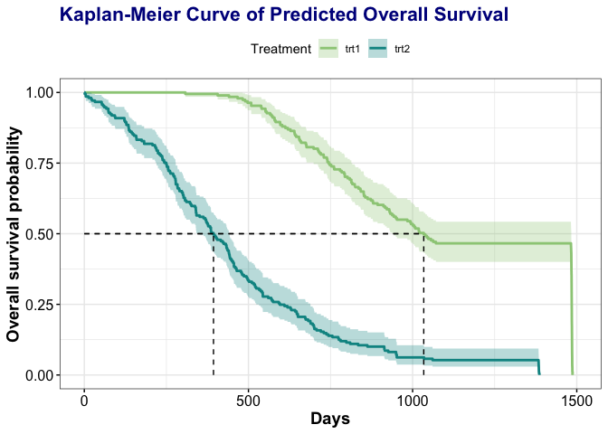

# osbma

<!-- badges: start -->

[](https://www.gnu.org/licenses/old-licenses/gpl-2.0.en.html)
[](https://www.repostatus.org/)
[](https://github.com/sidiwang/osbma/actions/workflows/R-CMD-check.yaml)
<!-- badges: end -->

The aim of the **osbma** R package is to predict overall survival in
solid tumor oncology studies using joint models combined through
Bayesian model averaging.

In solid tumor oncology studies, overall survival (OS) is the definitive
endpoint for accessing patient benefit. Reliable OS predictions are very
valuable for both drug development and patients’ end-of-life medical
care. Existing methods often ignore the underlying process of tumor
burden measurements and incur “information loss”. Motivated by an
advanced renal cell carcinoma (RCC) clinical trial, in this paper, we
propose a multivariate joint modeling approach to assess the underlying
dynamics of the progression-free survival (PFS) components to forecast
the death times of trial participants. Through Bayesian model averaging,
our proposed method improves the accuracy of the OS forecast by
combining joint models developed based on each granular component of
PFS. A case study of the RCC trial is conducted, and our method provides
the most accurate predictions across all tested scenarios. The
reliability of our proposed method is also verified through extensive
simulation studies, which include the scenario where OS is completely
independent of PFS. Overall, the proposed methodology provides a
promising candidate for reliable OS prediction in solid tumor oncology
studies.

## Installation

Install the development version from GitHub:

``` r
# Install devtools first if you haven't done so
library(devtools)
# install osbma
devtools::install_github("sidiwang/osbma")
library(osbma)
```

## **osbma** functions covered in this package

- The main function that generates posterior samples based on user input
  trial dataset - `osbma`
- Overall survival prediction based on posterior samples generated
  through MCMC - `predict.osbma`
- Plots generated based on predicted overall survival -
  `plot.predict.data`

## Example

`osbma`: We call the `osbma` function using data from an oncology trial
with 400 total individuals.

``` r
data <- osbma::data
result <- osbma::osbma(data = data, covariate = "trt", method = "rjags")
```

    ## Loading required namespace: rjags

    ## Compiling rjags model...
    ## Calling the simulation using the rjags method...
    ## Adapting the model for 8000 iterations...
    ## Burning in the model for 1000 iterations...
    ## Running the model for 10000 iterations...
    ## Simulation complete
    ## Note: Summary statistics were not produced as there are >50 monitored
    ## variables
    ## [To override this behaviour see ?add.summary and ?runjags.options]
    ## FALSEFinished running the simulation
    ## Calculating summary statistics...
    ## Calculating the Gelman-Rubin statistic for 1629 variables....
    ## Compiling rjags model...
    ## Calling the simulation using the rjags method...
    ## Adapting the model for 8000 iterations...
    ## Burning in the model for 1000 iterations...
    ## Running the model for 10000 iterations...
    ## Simulation complete
    ## Note: Summary statistics were not produced as there are >50 monitored
    ## variables
    ## [To override this behaviour see ?add.summary and ?runjags.options]
    ## FALSEFinished running the simulation

``` r
options(max.print = 40)
summary(result)
```

    ## 
    ## Iterations = 9001:18991
    ## Thinning interval = 10 
    ## Number of chains = 2 
    ## Sample size per chain = 1000 
    ## 
    ## 1. Empirical mean and standard deviation for each variable,
    ##    plus standard error of the mean:
    ## 
    ##                         Mean        SD  Naive SE Time-series SE
    ## beta_0[1]          4.436e+01 1.029e+00 2.301e-02      1.067e-01
    ## beta_0[2]         -3.182e-01 7.797e-02 1.744e-03      7.116e-03
    ## beta_1[1]          4.661e+00 1.134e-01 2.536e-03      1.073e-02
    ## beta_1[2]         -1.171e+00 6.402e-02 1.431e-03      5.896e-03
    ## lambda             5.613e-03 6.633e-04 1.483e-05      3.391e-05
    ## alpha_os.1         2.688e+00 2.522e-01 5.640e-03      1.539e-02
    ## eta_2              2.275e-01 1.680e-02 3.757e-04      0.000e+00
    ## alpha_2            1.070e-01 7.044e-04 1.575e-05      1.664e-08
    ## beta_2[1]         -2.102e-02 2.001e-02 4.473e-04      0.000e+00
    ## beta_2[2]         -7.082e-02 6.951e-02 1.554e-03      0.000e+00
    ##  [ reached getOption("max.print") -- omitted 2023 rows ]
    ## 
    ## 2. Quantiles for each variable:
    ## 
    ##                         2.5%         25%         50%         75%       97.5%
    ## beta_0[1]          4.228e+01   4.370e+01   4.434e+01   4.503e+01   4.642e+01
    ## beta_0[2]         -4.816e-01  -3.684e-01  -3.163e-01  -2.636e-01  -1.738e-01
    ## beta_1[1]          4.457e+00   4.580e+00   4.657e+00   4.739e+00   4.885e+00
    ## beta_1[2]         -1.296e+00  -1.216e+00  -1.169e+00  -1.126e+00  -1.050e+00
    ## lambda             4.309e-03   5.191e-03   5.609e-03   6.036e-03   6.995e-03
    ## alpha_os.1         2.248e+00   2.511e+00   2.671e+00   2.840e+00   3.253e+00
    ## eta_2              2.107e-01   2.107e-01   2.275e-01   2.443e-01   2.443e-01
    ## alpha_2            1.063e-01   1.063e-01   1.070e-01   1.077e-01   1.077e-01
    ##  [ reached getOption("max.print") -- omitted 2025 rows ]

`predict.osbma`: Here, we call the prediction function to predict the
overall survival of all patients:

``` r
prediction <- predict(result)
```

`plot.predict.osbma`: The plot function provides 3 types of plots: 
- the Kaplan-Meier curve of overall survival

``` r
plot(prediction, trt.col.name = "trt", type = "KM")
```

<!-- --> 

- the
patients’ survival timeline of the trial

``` r
# plot(prediction, trt.col.name = "trt", type = "date")
```

- the estimated time of the nth death in the trial (here we use the
  120th death as an example)

``` r
# plot(prediction, trt.col.name = "trt", type = 120)
```

As `.md` file doesn’t show interactive plots, please check webpage 
[https://sidiwang.net/osbmapage/](https://sidiwang.net/osbmapage/) 
for the last two plots.
